# Hello World for Unreal Engine 4 - Page 1
_____ 

## Index
_____ 

* Part 1 - Setting up with Git/Github
1. [**Starting New Git Repository**](Hello-World-Starter-1.html#starting-new-git-repository)
2. [Starting Unreal Engine 4](Hello-World-Starter-2.html#starting-unreal-engine-4)
3. [Our First Addition to Git](Hello-World-Starter-3.html#our-first-addition-to-git)

* Part 2 - Static Meshes, Ligths & Materials
3. [Basic Plane](Hello-World-Starter-4.html#basic-plane)  
4. [Our First Light](Hello-World-Starter-5.html#our-first-light)  
5. [Our First Material](Hello-World-Starter-6.html#our-first-material)
6. [Skybox and Reflections](Hello-World-Starter-7.html#skybox-and-reflections)
6. [Buliding Blocks & Instanced Material](Hello-World-Starter-8.html#building-block-instanced-material)

_____ 

## Setting up with Git/Github

For this project you will need to be install [Unreal Engine 4.20.x](https://www.unrealengine.com/en-US/download) , have a [GitHub](https://github.com/) account (which is free of charge) as well as [GitHub Desktop](https://desktop.github.com).  

_____ 

### Starting New Git Repository

_____ 



{:start="{{ num }}"}
{{ num }}. The first thing we want to do is to clone a github repository and share it.  For students this can be done by accepting the classroom invitation (step 2 & 3 below)( on Moodle and for those online you can copy the following repository: [UE4HelloWorld](https://github.com/maubanel/UE4HelloWorld) then move to step 4.

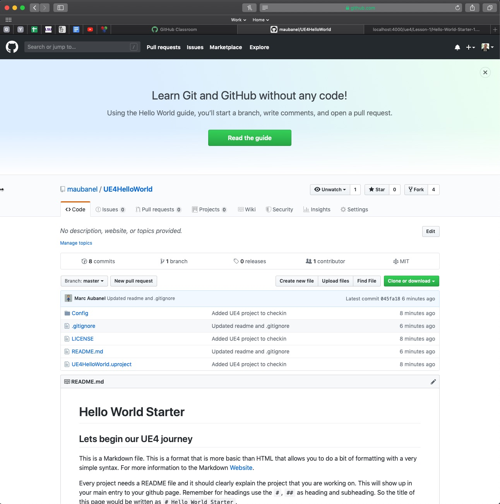  

_____ 



{:start="{{ num }}"}
{{ num }}. Enter the URL you are invited to on Moodle and you will be invited to the github project.  It will ask you to accept the project file.  You may have to sign up for a github account if you do not already have one.  It is free and you doin't need a paid option. Press the **Accept this assignment** button and follow the directions.

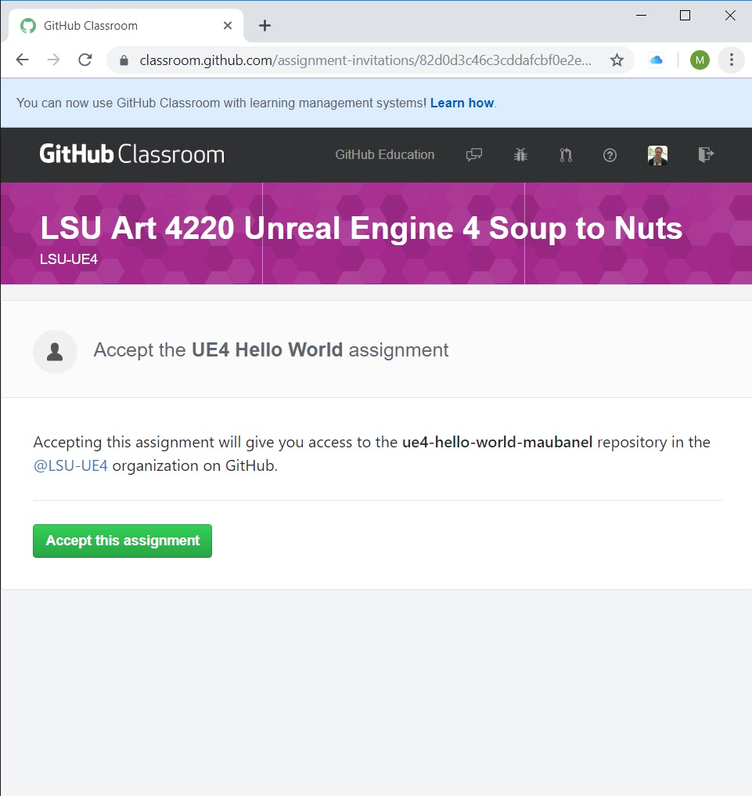  

_____ 



{:start="{{ num }}"}
{{ num }}. Once it is complete you should get a message and it has created a github repository in your project folder with some starter code that I provided:

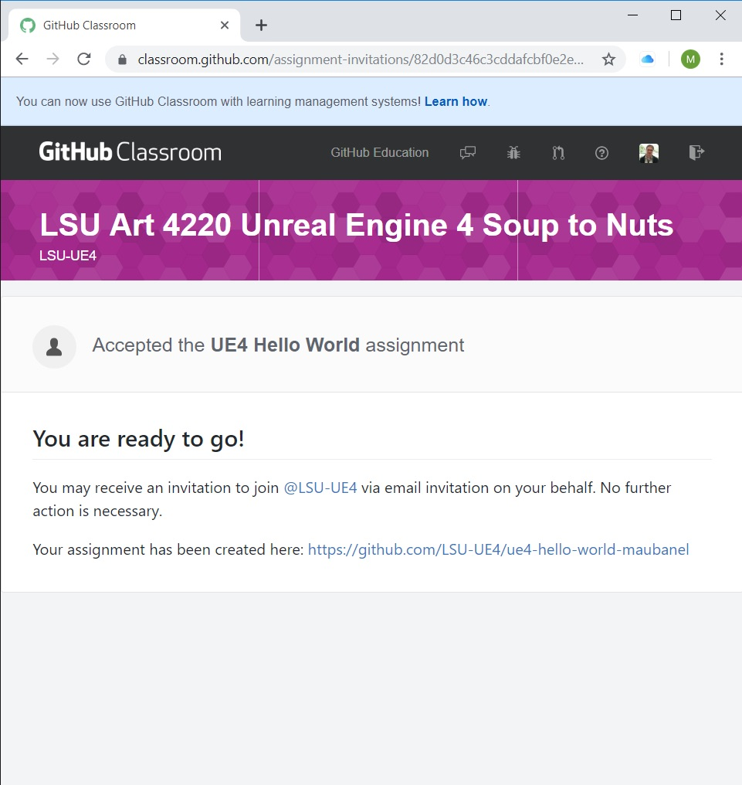  

_____ 



{:start="{{ num }}"}
{{ num }}. Now whether you are in the classroom project or not you can install **[github desktop](https://desktop.github.com)**.  This will allow you to work with github without using command line.  Open **github desktop** and press the **Clone a repository from the Internet** button:

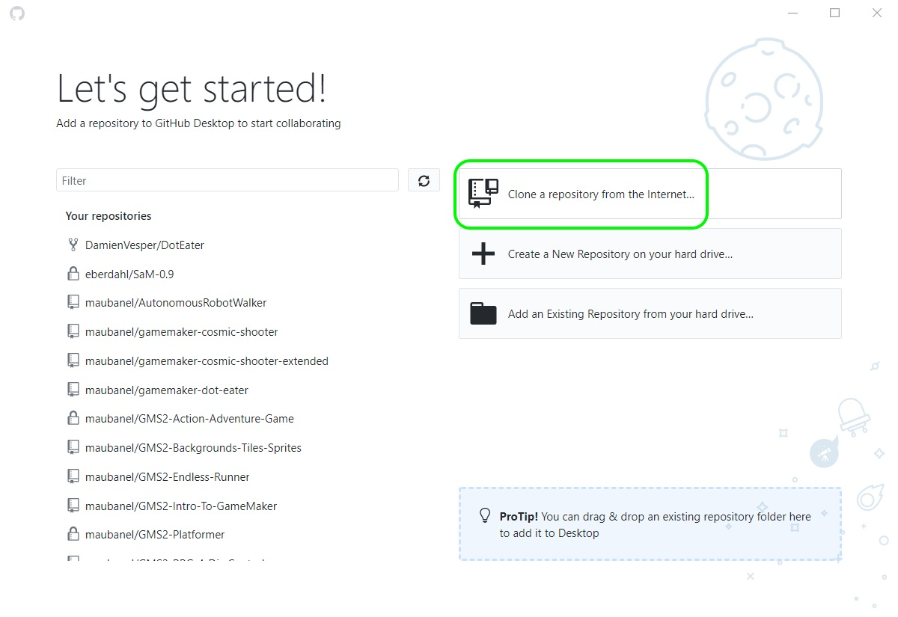  

_____ 



{:start="{{ num }}"}
{{ num }}. Why use source control like Git?  It allows for many benefits. You can work offline when there is no internet connection and benefit from most of the features that it offers.  When pushing to the server (which you don't have to do) gives you an automatic backup of all of your work.  You can work on another computer that is not your own.  It allows for unlimited undos and you can back out of mistakes or corrupted files.  It also allows for branching so you can work non-linearly and make major changes without affecting the main project.  We will get to all of this but first we need to make sure that the git repository that is on the **GitHub** server is _cloned_ to your local computer. Now clone the classroom link I gave you (or if you are not a student the link to the repository in step 1).  Place it in the default folder if there is room of `Documents/github/`:  

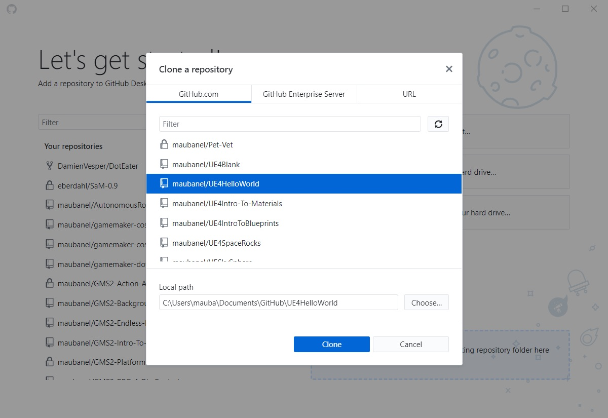  

_____



{:start="{{ num }}"}
{{ num }}. So now whether you are a student or not you should have a repository or a branch of the exact same files and can continue.

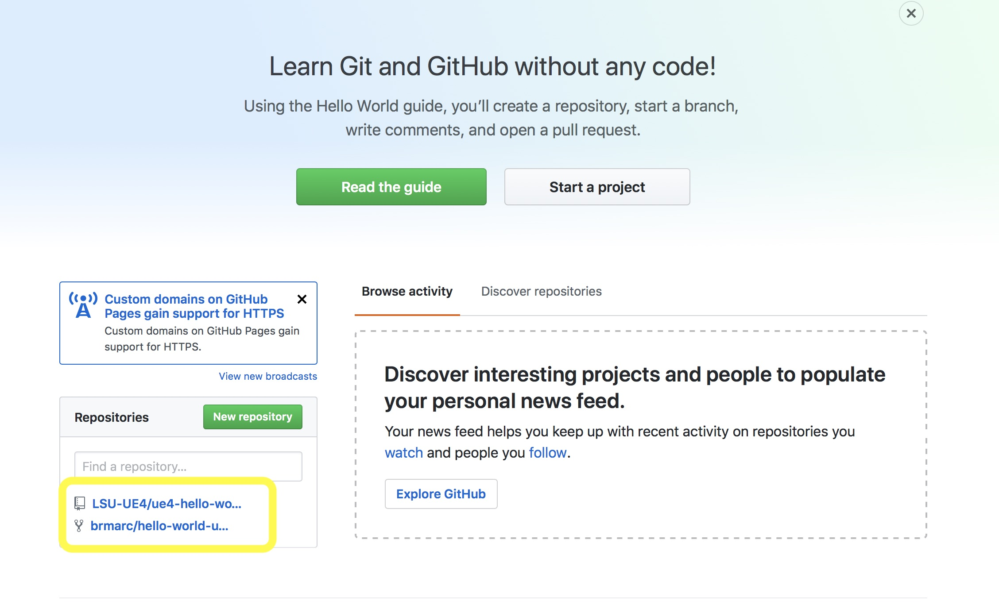  

_____ 



{:start="{{ num }}"}
{{ num }}. Now lets take a look at the repository on your github account in your webbrowser.  Go to your main page and click on the hello-world repository and you should see three files, a `LICENSE`, `README.md` and `.gitignore` file. which were all created and added by myself.  We have a few UE4 files with a blank project file `UE4HelloWorld.uproject` and a `Config` folder:

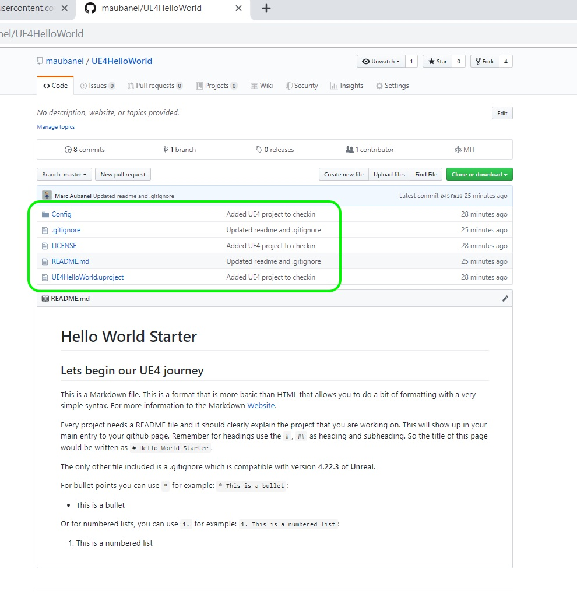  

_____ 



{:start="{{ num }}"}
{{ num }}. Click on the `.gitignore` file and you will see some text that might look  like gibberish to you.  Don't worry I will explain it a bit later on.  For now it just tells git which files we are not going to be tracking.  You can create a git repository directly from Unreal with an appropriate .gitignore or you can get the latest version on [github](https://github.com/github/gitignore/blob/master/UnrealEngine.gitignore).  You can either download it or copy the contents into a new .gitignore file. The MOST IMPORTANT element is that we need the `.gitignore` file to be in the SAME directory as the `.uproject` file. All paths are relative to this in the `.gitignore` file.

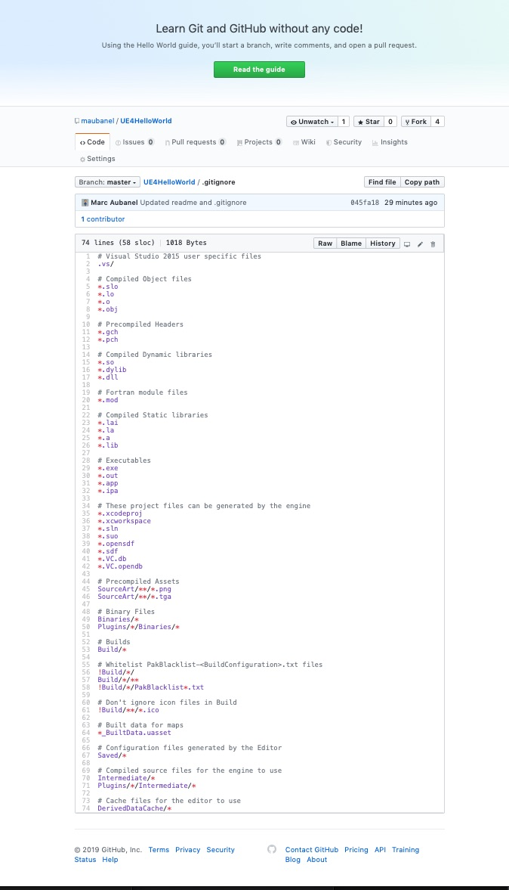  

_____ 



{:start="{{ num }}"}
{{ num }}. Click on the  `LICENSE` file and you will see the license I am attributing to the content.  Now this is just for the content I create.  Every asset we use that is part of the Unreal Engine is part of Epic's UE4 Licensing arrangement:

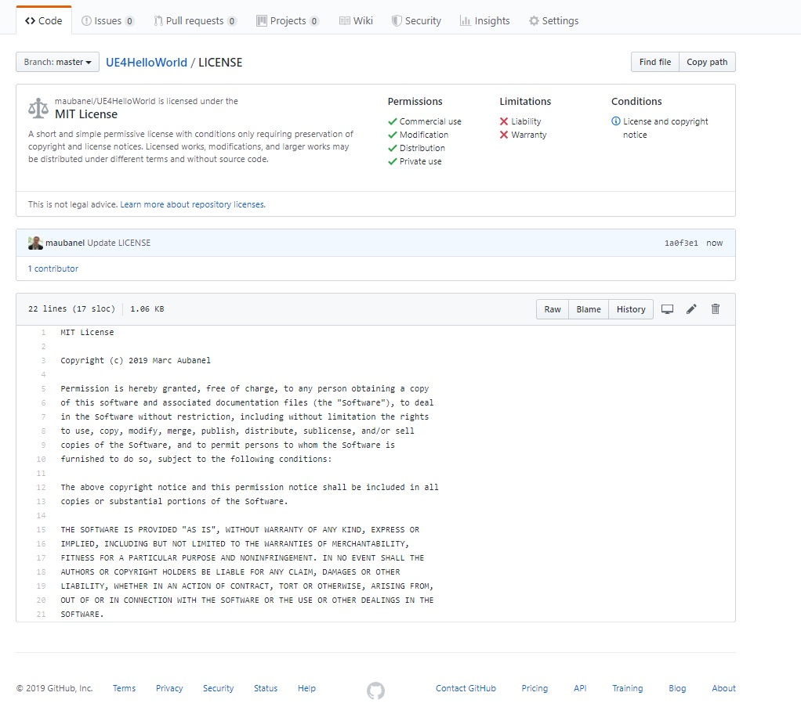  

_____ 



{:start="{{ num }}"}
{{ num }}. Now the `README.md` is interesting.  Click on it and you will see that it is the same file that is included automatically in your main project directory.  It is the file that all github users who might look, share and contribute with you is using as the front page to the project. The `README.md` file uses [Markdown](https://daringfireball.net/projects/markdown/syntax).  This is what the `.md` extension stands for.  This is a simple markup format that allows you to do some basic markup without having to learn and type html.  So it looks formatted on Github:

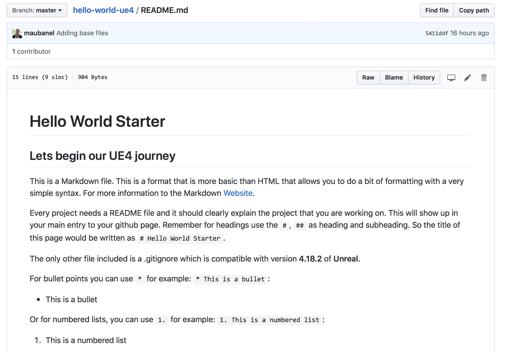  

_____ 



{:start="{{ num }}"}
{{ num }}. But the raw file that you can edit in an editor like Notepad on the PC or Text Edit on the mac.  Do not edit this in a word processor like Word as it will leave invisible formatting that will add characters to your readme file that you thought were not there. Press the raw tab to see it:

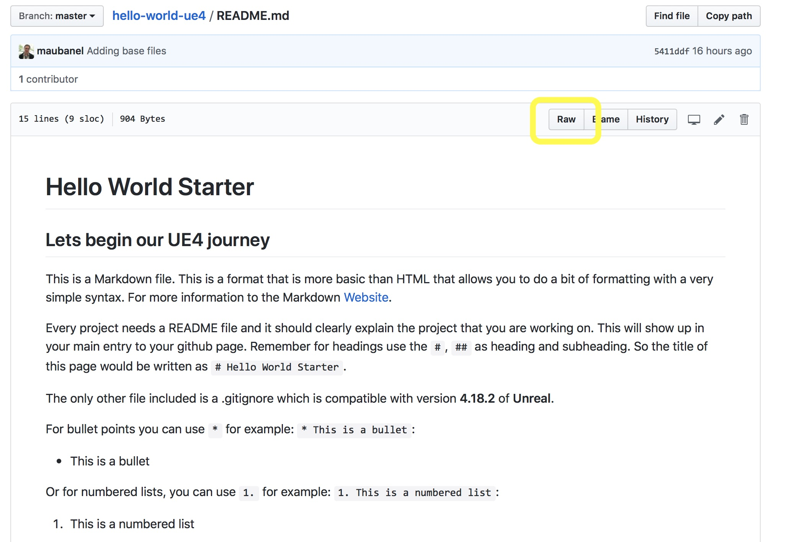  

_____ 



{:start="{{ num }}"}
{{ num }}. You will see it is the same text but it is surrounded by special symbols such as using the back tick \` to display code:  `if (foo == 3) print ("3");`. We put in front the `#` sign to display the title, `##` for the subtitle, `*` to bullet indent the text for an unordered list and `1.` for an ordered list.  We can **bold** text with \*\* before and after the world/sentence you want bolded.

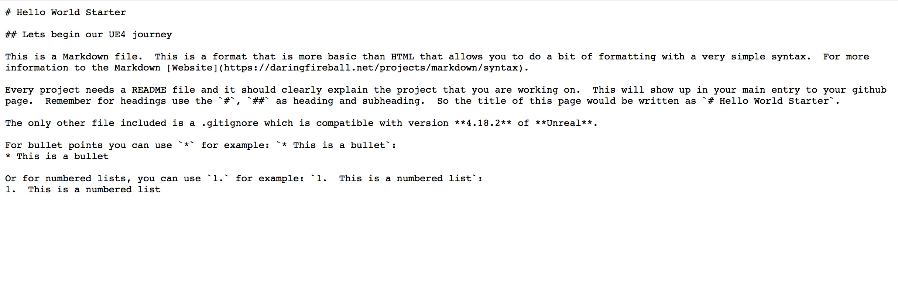  

_____ 



{:start="{{ num }}"}
{{ num }}. Now you should see an exact duplicate of the files you saw on GitHub (in the cloud) locally on your machine.  Everytime you push and pull from the online repository it will update you with its latest and you will update the server with your latest.  Next up is starting Unreal, concatonating the two projects and doing your first commit and push.

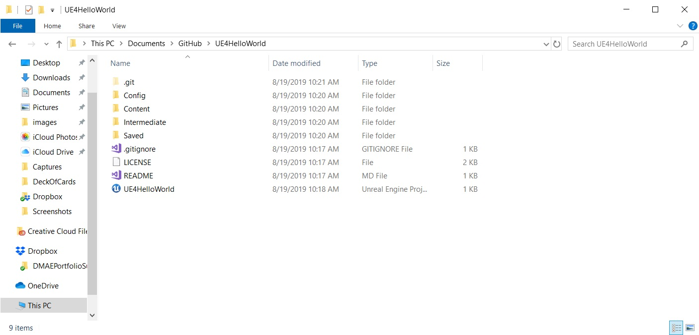  

_____ 

  

[Home](../index.html)&nbsp;&nbsp;&nbsp; [Continue ->](Hello-World-Starter-2.html)
   
   
   

