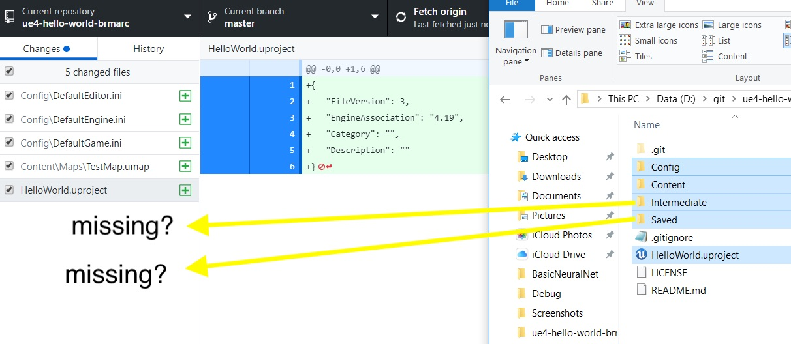

# Hello World for Unreal Engine 4 - Page 3
_____ 

## Index
_____ 

* Part 1 - Setting up with Git/Github
1. [Starting New Git Repository](Hello-World-Starter-1.html#starting-new-git-repository)
2. [Starting Unreal Engine 4](Hello-World-Starter-2.html#starting-unreal-engine-4)
3. [**Our First Addition to Git**](Hello-World-Starter-3.html#our-first-addition-to-git)

* Part 2 - Static Meshes, Ligths & Materials
3. [Basic Plane](Hello-World-Starter-4.html#basic-plane)  
4. [Our First Light](Hello-World-Starter-5.html#our-first-light)  
5. [Our First Material](Hello-World-Starter-6.html#our-first-material)
6. [Skybox and Reflections](Hello-World-Starter-7.html#skybox-and-reflections)
6. [Buliding Blocks & Instanced Material](Hello-World-Starter-8.html#building-block-instanced-material)

_____ 

### Our First Addition to Git
_____ 



{:start="{{ num }}"}
{{ num }}. Now what we want to do is make sure that we update our changes to the git database.  Each time we `commit` a change it creates a marker that then has that entire snapshot in time of the entire project.  This snapshot is all stored in the `.git` folder in the root of your project.  It allows us to go back to this point for any reason (for example we accidentally delete a file later one).  Lets open up **GitHub Desktop** and look at what it shows.  The green plus symbol next to each file indicates that these files are all new and have not been in the project before.  Take a look and see what yours shows:

  

_____ 



{:start="{{ num }}"}
{{ num }}. Now open the folder and compare it to what you see in the repository. You will 
see that the Intermediate and Saved folders are missing.  Why is this?  

  

_____ 



{:start="{{ num }}"}
{{ num }}. There are two possbilities. Git tracks files and not folders.  It will not add an empty folder and it will not delete a folder that used to contain files that doesn't anymore.  Also, these folders are called in the `.gitignore` file.  You will see that this file includes `Saved/*` and `Intermediate/*`.  This basically means to ignore anything in these folders and subfolders.  Why do we not want to track these? 

  

_____ 



{:start="{{ num }}"}
{{ num }}. The Unreal documentation explains what these folders do:

> Intermediate - Contains temporary files generated during building the engine or game. In game directories, Shaders are stored in the Intermediate directory. - [Unreal Docs](https://docs.unrealengine.com/en-us/Engine/Basics/DirectoryStructure)

> Saved - Contains autosaves, configuration (.ini) files, and log files. Additionally, the Engine > Saved directory contains crash logs, hardware information, and Swarm options and data. - [Unreal Docs](https://docs.unrealengine.com/en-us/Engine/Basics/DirectoryStructure)

The intermediate folder allows developers to be developing on Mac and PC's with different versions of operating systems where these compiled files will be different.  So it allows the parts of the game that are unique to our machine be only located on our machine and the common files that we all share in the git server.  Don't worry if you accidentally delete these files Unreal will automatically regenerate them when you run (it might take longer to boot up though).

_____ 


{:start="{{ num }}"}
{{ num }}. Now if you click on each of these added files you can see the content of them.  In my case I have a new level that is in the `Content\Maps\TestMap.umap`.  It also indicates that this file is a binary (not a text file).  OK, now we need to commit this to our local database (puts a copy of the files and changes for this snapshot in time into our .git folder).  Remember to never edit or change the content of your .git folder without going through command line or GitHub Desktop.  Now you can press the **Commit to master** button with the default message that accurately states what we are checking in.  Feel free to edit this now and in the future to be as specific as possible.

  

_____ 



{:start="{{ num }}"}
{{ num }}. Depending on how big the changes is, it will take some time.  It is good practice to let this finish before going back to Unreal.  

  

_____ 



{:start="{{ num }}"}
{{ num }}. Now lets go to GitHub online and look for our changes.  Go to your GitHub account and click on the project or fork and look for the new files.  Where are they?  Commit only syncs what is in your working folder with that current snapshot on your local database on your local computer.  If you want to have it sync to the server as well you need to do an additional step.

  

_____ 



{:start="{{ num }}"}
{{ num }}. On the top menu can you see the **Push to origin** button with a `+1`.  This means you have one commit (not files) that is ready to upload to the server.  Press this button:

  

_____ 



{:start="{{ num }}"}
{{ num }}. Depending on the size of the commit(s) and the speed of your internet connection this can take a while.  It will give you progress messages within the button.

  

_____ 



{:start="{{ num }}"}
{{ num }}. When it finishes it shows what it did.  In this case it pushed 10 new files to the server.

  

_____ 



{:start="{{ num }}"}
{{ num }}. Check the server again and you can see that you now have your project in three places, your working directory, your .git folder and on the GitHub server.  Now it is good practice to commit often, each time you finish any logical chunk of work.  If you are using the word `and` a lot in your commit messages, maybe you should think about commiting more often.  You are also able to commit changes seperately instead of all at once like we did there.  How often should you push to the server?  I push as often as possible.  The way I see it is my hard drive could die at any time.  Do I want to redo all the work I just did if it does.  So if I am working for long stints like a full day I will push every time I take a break (coffee, meeting, lunch etc...).  I definitely ALWAYS push as the last thing I do when I shut down a project.  You never know when your computer might be stolen, lost, dropped etc...  Better safe than sorry. Now back to Unreal.

  

_____ 

  

[<- Previous](Hello-World-Starter-2.html)&nbsp;&nbsp;&nbsp;[Home](../index.html)&nbsp;&nbsp;&nbsp; [Continue ->](Hello-World-Starter-4.html)
   
   
   

