# Hello World for Unreal Engine 4 - Page 4
_____ 

## Index
_____ 

* Part 1 - Setting up with Git/Github
1. [Starting New Git Repository](Hello-World-Starter-1.html#starting-new-git-repository)
2. [Starting Unreal Engine 4](Hello-World-Starter-2.html#starting-unreal-engine-4)
3. [Our First Addition to Git](Hello-World-Starter-3.html#our-first-addition-to-git)

* Part 2 - Static Meshes, Ligths & Materials
3. [**Basic Plane**](Hello-World-Starter-4.html#basic-plane)  
4. [Our First Light](Hello-World-Starter-5.html#our-first-light)  
5. [Our First Material](Hello-World-Starter-6.html#our-first-material)
6. [Skybox and Reflections](Hello-World-Starter-7.html#skybox-and-reflections)
6. [Buliding Blocks & Instanced Material](Hello-World-Starter-8.html#building-block-instanced-material)

_____ 

## Static Meshes, Ligths & Materials
Now we are going to get to the meat of this assignment and build a level that has "Hello World" on a plane.
_____ 

### Basic Plane
_____ 



{:start="{{ num }}"}
{{ num }}. Double click on the uproject name of the current project.  In my case it was called `HelloWorld.uproject`.  It boots up in the game, but we do not load into the new blank level, but instead back to the default level:

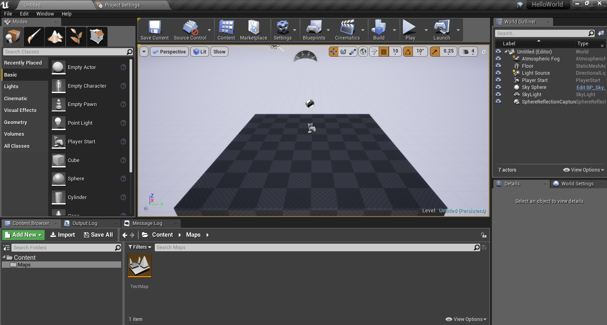  

_____ 



{:start="{{ num }}"}
{{ num }}. This is because UE4 loads the levels that are set in the project settings.  This always defaults initially to Unreal's default level.  To change this press the **Settings \| Project Settings** button on the top menu:

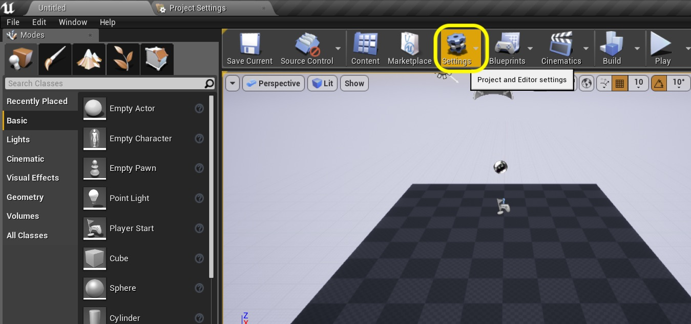  

_____ 



{:start="{{ num }}"}
{{ num }}. In my version it defaulted to the **Project \| Description** settings. I updated the **Description**, **Project Name**, **Project Version**, **Company Name**, **Homepage**, **Support Contact**, **Project Displayed Title** and **Project Debug Title info**. Update yours accordingly.

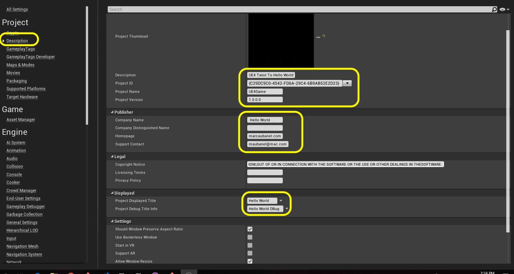  

_____ 



{:start="{{ num }}"}
{{ num }}. Now lets fix the problem with booting up to our newly created map. Press **Maps and Modes** in the left side menu:

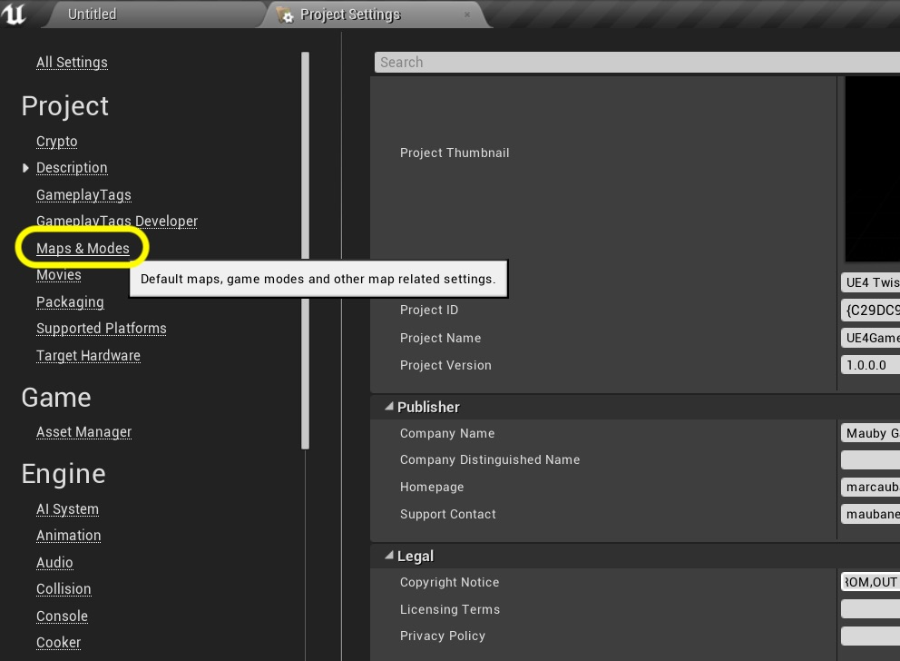  

_____ 



{:start="{{ num }}"}
{{ num }}. Now there are two options for game maps.  **Editor Startup Map** and **Game Default Map**.  The game start up map is where the game starts if you build the game then run it.  If you run the map from the editor like we did above, then this is the Editor Startup Map.  This allows you to work on a different level than where the game starts atl  Change both to `TestMap` the level we previously created.

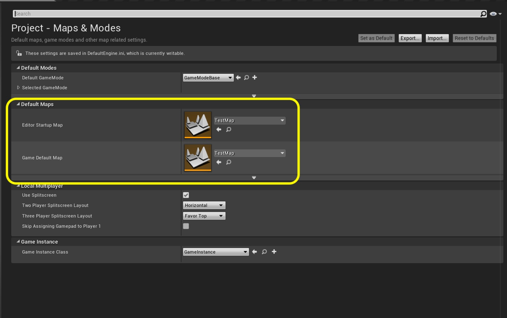  

_____ 



{:start="{{ num }}"}
{{ num }}. Now lets quit UE4 to see if it works.  But before we reboot the game again, lets open **GitHub Desktop** and we see two files have changed.  Now I did two seperate things, so lets commit each one seperately so I can undo or go back to them individually.  Lets start with the first item which is `DefaultEngine.ini`.  Unselect the radio button for `DefaultGame.ini` and highlight the top one.  Look at what has changed.  This has added our two default maps.  So now we can enter a message that matches what change we made here and add a comment.  Press the **Commit To master** button:

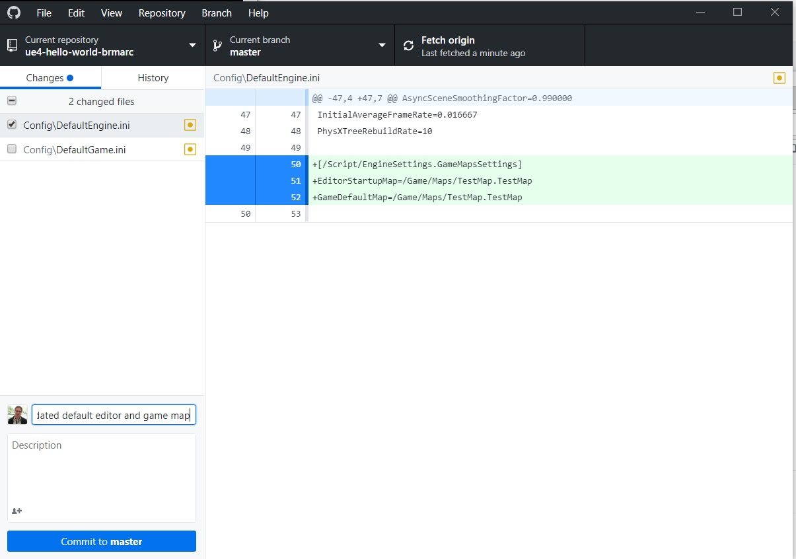  

_____ 



{:start="{{ num }}"}
{{ num }}. Now repeat the same thing for the `DefaultGame.ini` and notice that it is the changes we made in the **Project < Description** changes.

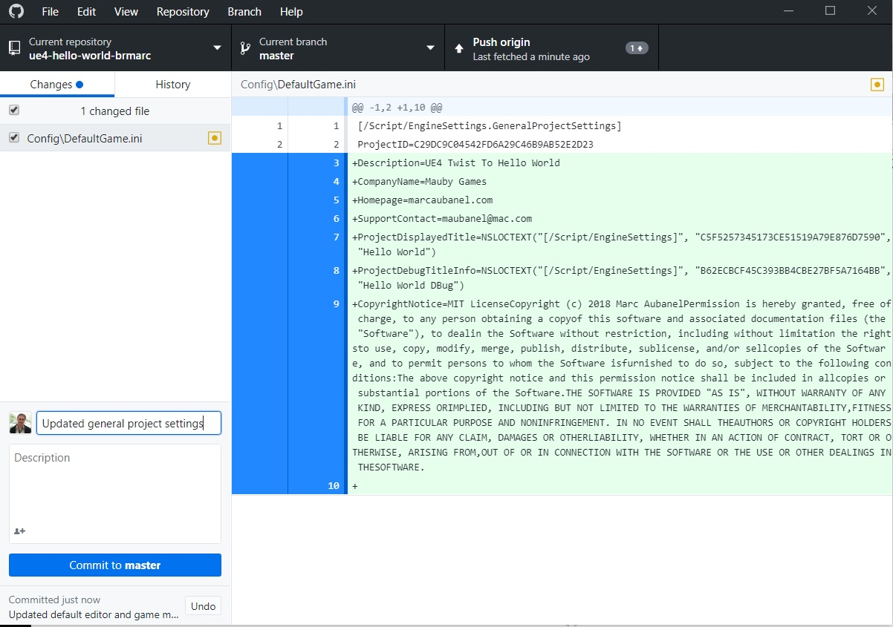  

_____ 



{:start="{{ num }}"}
{{ num }}. If you are continuing you don't need to push the changes to the server as they are fairly small.  Double click the uproject file again and start up the game.

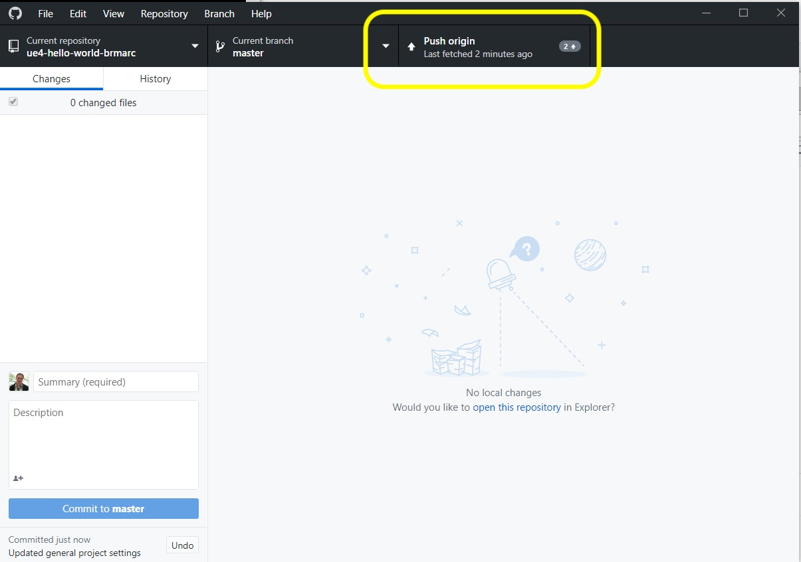  

_____ 



{:start="{{ num }}"}
{{ num }}. Now you can see that it should boot up to your **Test Map** as it shows up on the tab on the top menu.  Now press the **Play** button to start the room with nothing in it:

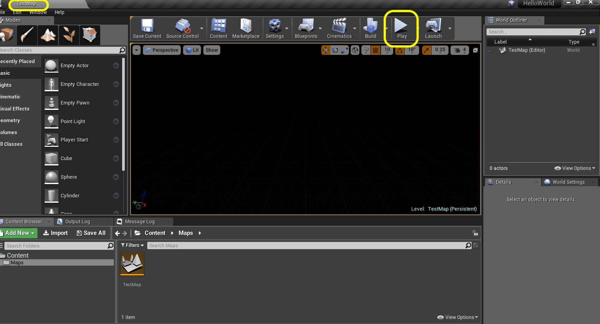  

_____ 



{:start="{{ num }}"}
{{ num }}. Now look in the **World Outliner** on the right hand side and it shows up everything that is in our level.  So Unreal does a lot when you run a game when we don't add anything.  Lets look quickly at what it adds.

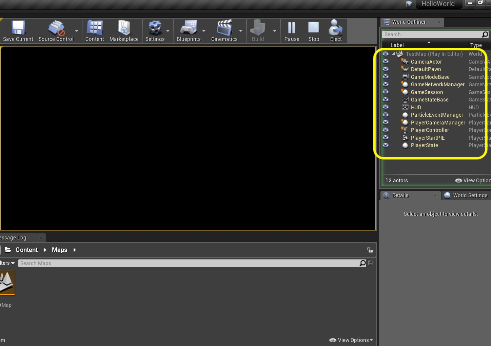  

_____ 



{:start="{{ num }}"}
{{ num }}. Unreal expects a Pawn in each level.  When there are no pawns UE4 will spawn the default pawn.

> The Pawn class is the base class of all Actors that can be controlled by players or AI. A Pawn is the physical representation of a player or AI entity within the world. This not only means that the Pawn determines what the player or AI entity looks like visually, but also how it interacts with the world in terms of collisions and other physical interactions. This can be confusing in certain circumstances as some types of games may not have a visible player mesh or avatar within the game. Regardless, the Pawn still represents the physical location, rotation, etc. of a player or entity within the game. A Character is a special type of Pawn that has the ability to walk around. - [Unreal Docs](https://docs.unrealengine.com/en-us/Gameplay/Framework/Pawn)

The pawn allows us to move around the world, even though we can't because it is too dark.  It spawns a [Camera Actor](https://docs.unrealengine.com/en-us/Engine/Actors/CameraActors) that is linked to the Pawn so it moves with it.  

The game also spawns a **GameModeBase**.  

> The GameModeBase defines the game being played. It governs the game rules, scoring, what actors are allowed to exist in this game type, and who may enter the game. - [Unreal Docs](https://api.unrealengine.com/INT/API/Runtime/Engine/GameFramework/AGameModeBase/index.html)

The game spawns a **Network Manager**.

> Handles game-specific networking management (cheat detection, bandwidth management, etc.). - [Unreal Docs](https://api.unrealengine.com/INT/API/Runtime/Engine/GameFramework/AGameNetworkManager/index.html)

The game spawns a **GameSession**:
> Game Session handles login approval, arbitration, online game interface.  - [Unreal Docs](http://api.unrealengine.com/INT/API/Runtime/Engine/GameFramework/AGameModeBase/GameSession/index.html)

The game spawns a **GameStateBase**:

> GameStateBase is a class that manages the game's global state, and is spawned by GameModeBase. It exists on both the client and the server and is fully replicated.  - [Unreal Docs](https://api.unrealengine.com/INT/API/Runtime/Engine/GameFramework/AGameStateBase/index.html)

The game spawns a **HUD** which handles all the heads up displays and text overlays for the game.  A **ParticleEventsManager** handles the particles in the game.  

The **PlayerCameraManager**:

> A PlayerCameraManager is responsible for managing the camera for a particular player. It defines the final view properties used by other systems (e.g. the renderer), meaning you can think of it as your virtual eyeball in the world. It can compute the final camera properties directly, or it can arbitrate/blend between other objects or actors that influence the camera (e.g. blending from one CameraActor to another).  - [Unreal Docs](http://api.unrealengine.com/INT/API/Runtime/Engine/Camera/APlayerCameraManager/)

The game spawns a **PlayerController**:

> PlayerControllers are used by human players to control Pawns. - [Unreal Docs](http://api.unrealengine.com/INT/API/Runtime/Engine/GameFramework/APlayerController/)

The game spawns a **PlayerStartPIE**.  This is the location where ther player is spawned.

The game spawns a **PlayerState**:

> A PlayerState is created for every player on a server (or in a standalone game). PlayerStates are replicated to all clients, and contain network game relevant information about the player, such as playername, score, etc.  - [Unreal Docs](http://api.unrealengine.com/INT/API/Runtime/Engine/GameFramework/APlayerState/)

_____ 



{:start="{{ num }}"}
{{ num }}. Now lets add a ground plane to our map/level.  We will use a [static mesh](https://docs.unrealengine.com/en-us/Engine/Content/Types/StaticMeshes) for this. Make sure in your left hand **Modes** _panel_ that **Place** (box and light) is selected.  In the menu under **Basic** find the **cube** static mesh geometry.

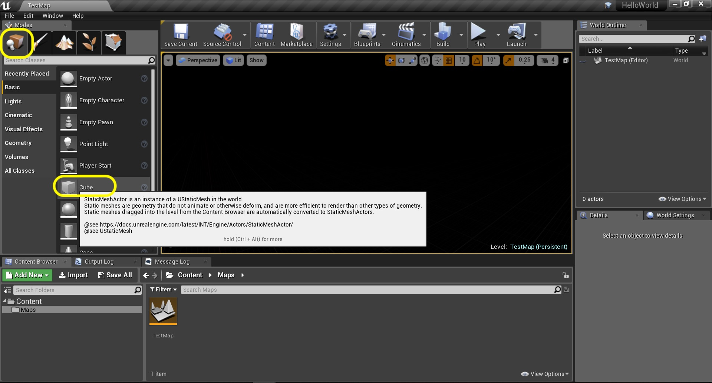  

_____ 



{:start="{{ num }}"}
{{ num }}. Now drag the cube by left clicking on it and putting it into the map and let go.  You will see that we have a black unlit box in a black level.

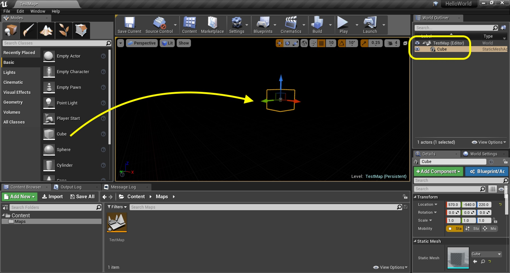  

_____ 



{:start="{{ num }}"}
{{ num }}. Since we have no light three is a way for us to see what is in the map.  We can click on the **Lit** button at the top left of the game screen and change it to **Unlit**. Press the small triangle next to play and select **Play \| Simulate**.

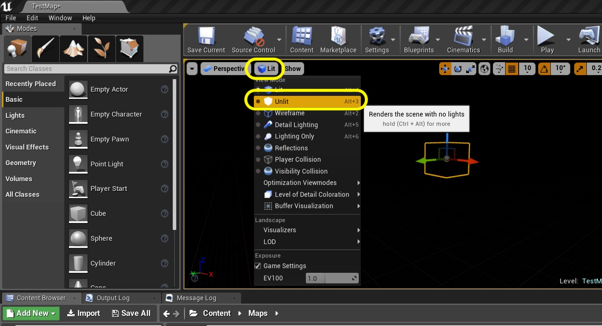  

_____ 



{:start="{{ num }}"}
{{ num }}. Now you can see the mesh, but there are no shadows so it looks like a solid white shape. 

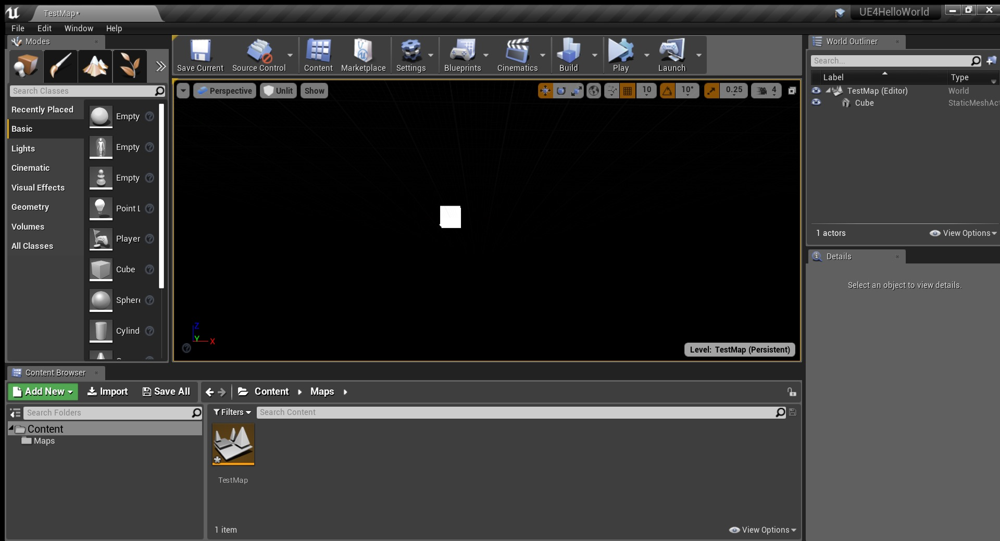  

_____ 

  

[<- Previous](Hello-World-Starter-3.html)&nbsp;&nbsp;&nbsp;[Home](../index.html)&nbsp;&nbsp;&nbsp; [Continue ->](Hello-World-Starter-5.html)
   
   
   

