# Hello World for Unreal Engine 4 - Page 5
_____ 

## Index
_____ 

* Part 1 - Setting up with Git/Github
1. [Starting New Git Repository](Hello-World-Starter-1.html#starting-new-git-repository)
2. [Starting Unreal Engine 4](Hello-World-Starter-2.html#starting-unreal-engine-4)
3. [Our First Addition to Git](Hello-World-Starter-3.html#our-first-addition-to-git)

* Part 2 - Static Meshes, Ligths & Materials
3. [Basic Plane](Hello-World-Starter-4.html#basic-plane)  
4. [**Our First Light**](Hello-World-Starter-5.html#our-first-light)  
5. [Our First Material](Hello-World-Starter-6.html#our-first-material)
6. [Skybox and Reflections](Hello-World-Starter-7.html#skybox-and-reflections)
6. [Buliding Blocks & Instanced Material](Hello-World-Starter-8.html#building-block-instanced-material)

_____ 

### Our First Light
_____ 



{:start="{{ num }}"}
{{ num }}. Lets now add a light and render the scene normally.  Press the arrow next to the **Play** button and select the `Selected Viewport` option to play in.

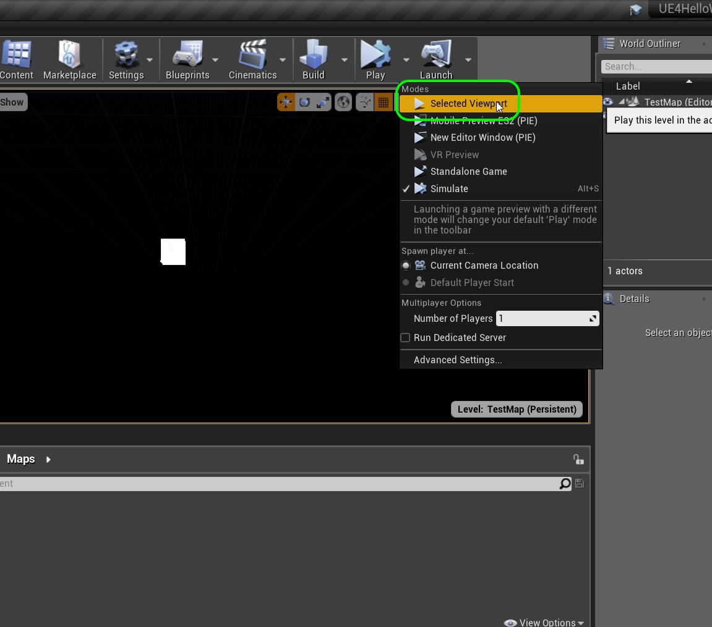  

_____ 



{:start="{{ num }}"}
{{ num }}. Got back to the **Modes** _panel_ and make sure the **Place** (box and light) is selected.  Go to **Lights** and look for the **Directional Light**.

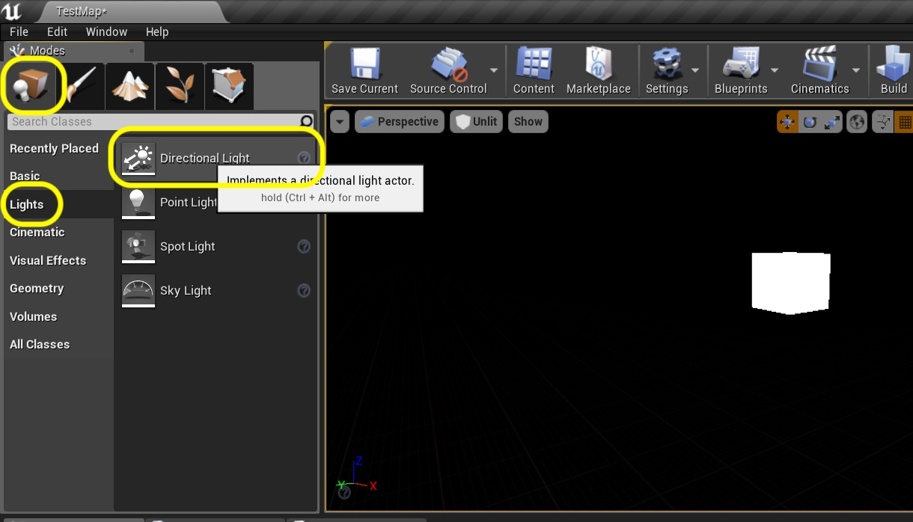  

_____ 



{:start="{{ num }}"}
{{ num }}. Directional Light:

> The Directional Light simulates light that is being emitted from a source that is infinitely far away. This means that all shadows cast by this light will be parallel, making this the ideal choice for simulating sunlight.  - [Unreal Docs](https://docs.unrealengine.com/en-us/Engine/Rendering/LightingAndShadows/LightTypes/Directional)

_____ 



{:start="{{ num }}"}
{{ num }}. Drag the directional light like you did the cube and drop it in the map. Since the light reaches infinity it doesn't matter where you place it.

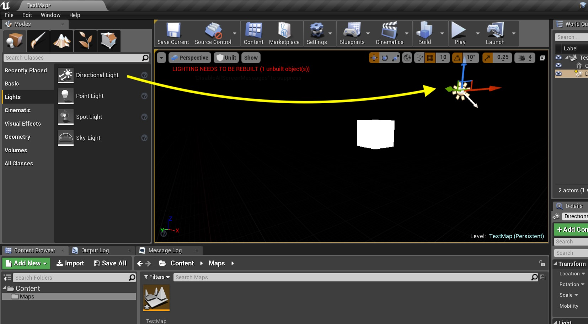  

_____ 



{:start="{{ num }}"}
{{ num }}. Now switch back to **lit** mode so we can see the light in action:

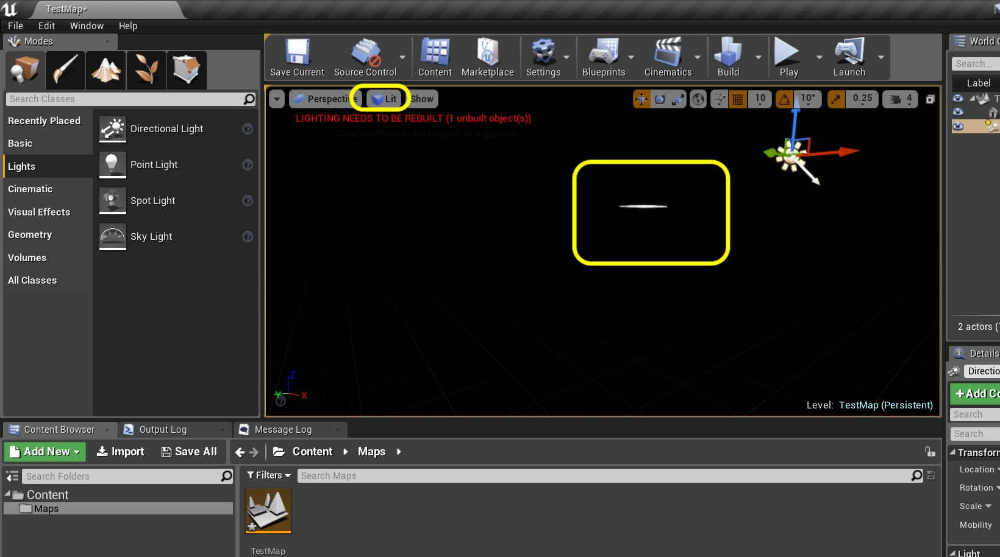  

_____ 



{:start="{{ num }}"}
{{ num }}. Select the Directional Light in the **World Outliner** _panel_ on the right and then select the **Rotator** _button_ on the top in map tool bar.  Rotate it until you have it lit the way you like.

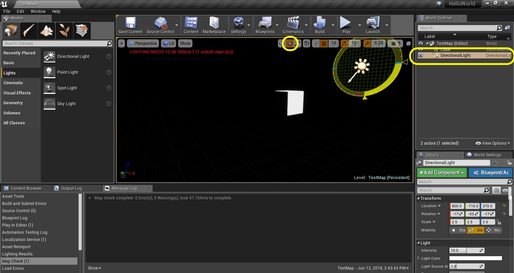  

_____ 



{:start="{{ num }}"}
{{ num }}. We are getting a warning in the game engine that the lighting is not _built_.  So what we need to do is press the **Build** button and since this scene is simple do not need to select from the drop down menu. We will do the default full build all levels. Run the game and you should now see a lit cube.

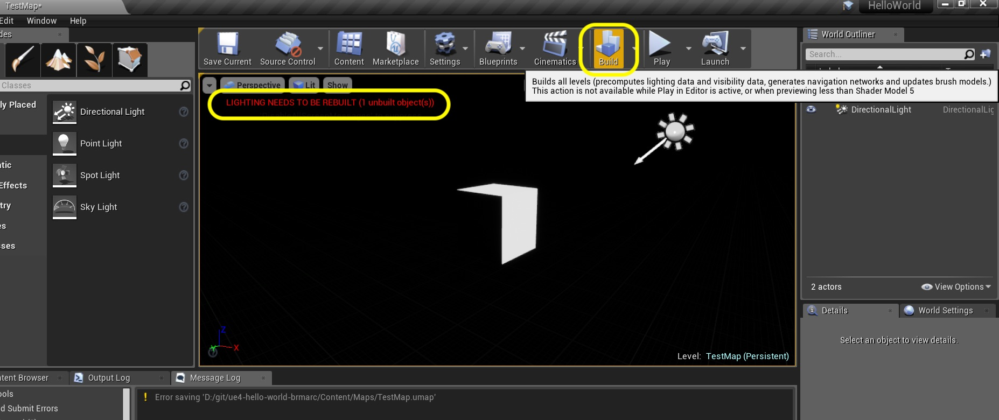  

_____ 



{:start="{{ num }}"}
{{ num }}. Building can take a while and for some computers that are not very powerful, this might crash.

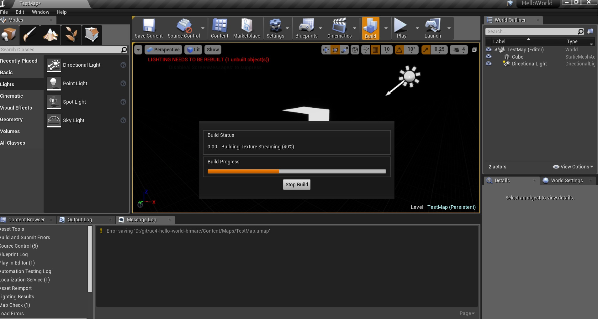  

_____ 



{:start="{{ num }}"}
{{ num }}. In your **World Outliner** on the right hand side double click on the name `Cube` (not on the icon but on the actual letters) and you should get a cursor that allows you to change the name.  If this doesn't work you can right click on the Cube and select **Edit < Rename**:

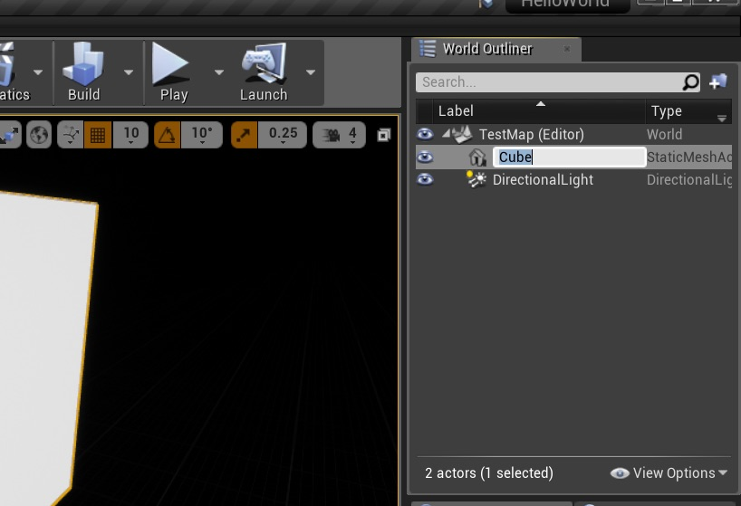  

_____ 



{:start="{{ num }}"}
{{ num }}. Rename it to `GroundPlane`:

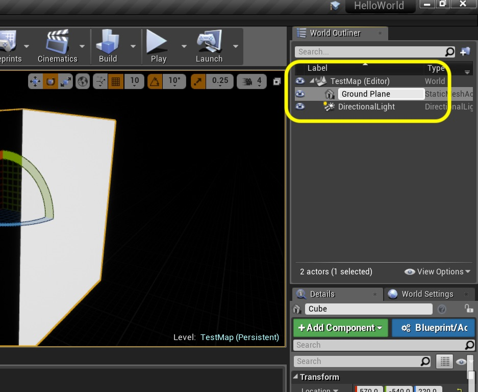  

_____ 



{:start="{{ num }}"}
{{ num }}. Unreal uses a 3-D left-handed [cartesian coordinate system](https://en.wikipedia.org/wiki/Cartesian_coordinate_system).  `x` is left and right with positive `x` to the right.  `z` is up and down with positive `z` up.  Finally, `y` is in and out of the screen with positive `y` being towards the viewer.

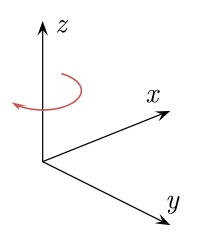  

_____ 



{:start="{{ num }}"}
{{ num }}. Now make sure that your `Ground Plane` is selected in the **World Outliner** and scroll in the **Details** panel and find the **Transform > Scale**.  You are going to change the `x` to `20`, the `y` to `20` and the `z` to `0.1`.  This gives us a flat square plane with a bit of height.

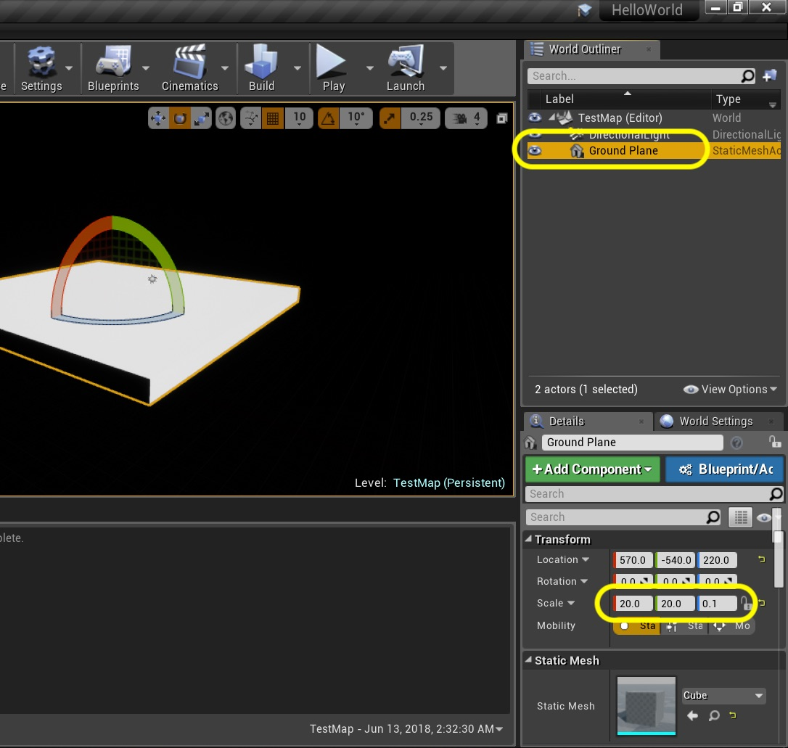  

_____ 



{:start="{{ num }}"}
{{ num }}. Now we want to center this plane. It is typical that the center of our level at the top of the ground plane is at `(0,0,0)`.  We can quickly do that by pressing the yellow arrow in the **Detials** panel right next to **Transform > Location**.  This should reset your values on this game object to `(0, 0, 0)`.  If the plane is no longer visible you can double click on the icon or have it selected and press the **F** _key_ to recenter the object in view.

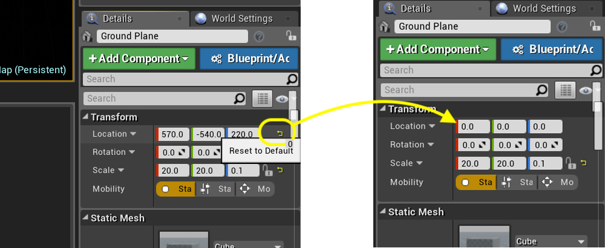  

_____ 



{:start="{{ num }}"}
{{ num }}. Now your game should look something like:

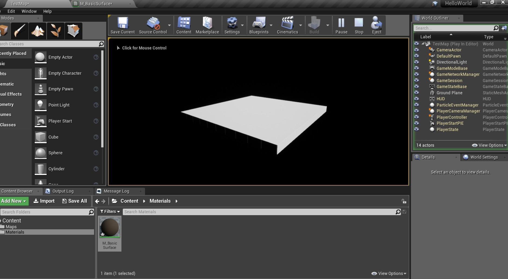  

_____ 


{:start="{{ num }}"}
{{ num }}. If you are used to Maya you can inverse the Y Axis by setting **Editor Preferences \| Level Editor \| Invert Mouse Look Y Axis** to `true`.

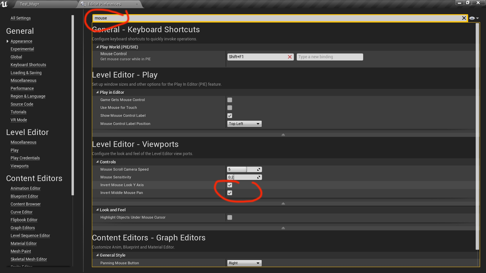  

_____ 


{:start="{{ num }}"}
{{ num }}. If your computer is running slowly or not running Unreal very well, you can also set the resolution. Press the **Settings** button and adjust the options in **Engine Scalability Settings** to High, Medium or Low.  You can show your Frames Per Second by holding _Cntrl + Shift + H_.

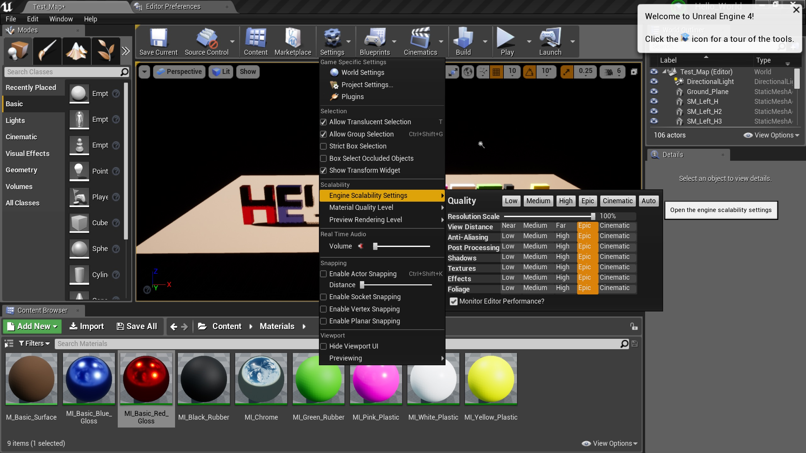  

_____ 

  

[<- Previous](Hello-World-Starter-4.html)&nbsp;&nbsp;&nbsp;[Home](../index.html)&nbsp;&nbsp;&nbsp; [Continue ->](Hello-World-Starter-6.html)
   
   
   

