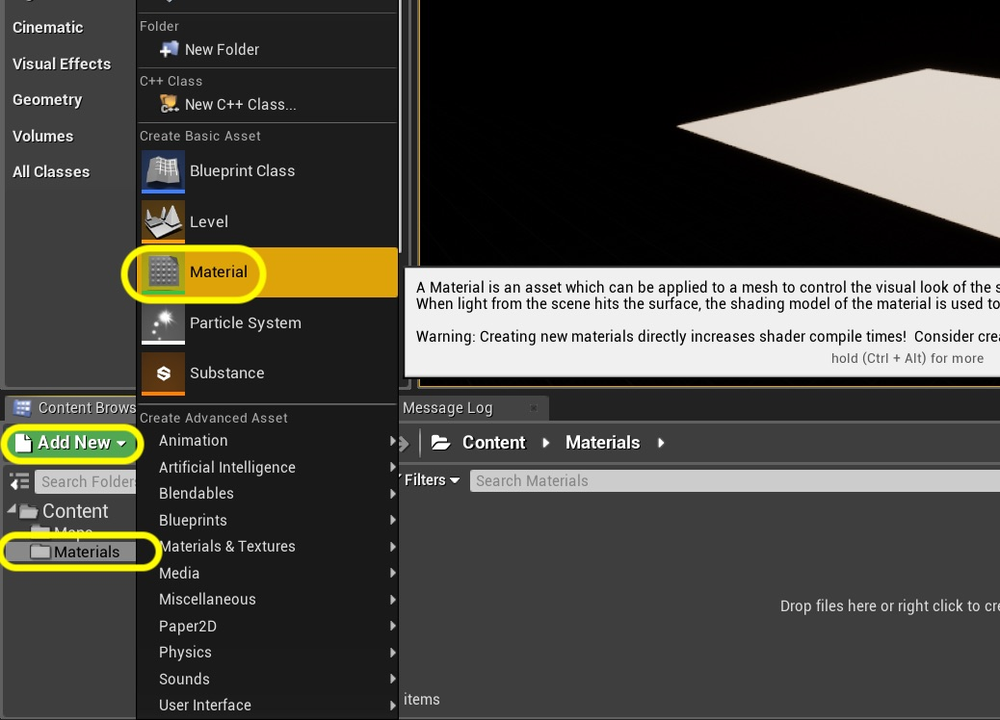

# Hello World for Unreal Engine 4 - Page 6
_____ 

## Index
_____ 

* Part 1 - Setting up with Git/Github
1. [Starting New Git Repository](Hello-World-Starter-1.html#starting-new-git-repository)
2. [Starting Unreal Engine 4](Hello-World-Starter-2.html#starting-unreal-engine-4)
3. [Our First Addition to Git](Hello-World-Starter-3.html#our-first-addition-to-git)

* Part 2 - Static Meshes, Ligths & Materials
3. [Basic Plane](Hello-World-Starter-4.html#basic-plane)  
4. [Our First Light](Hello-World-Starter-5.html#our-first-light)  
5. [**Our First Material**](Hello-World-Starter-6.html#our-first-material)
6. [Skybox and Reflections](Hello-World-Starter-7.html#skybox-and-reflections)
6. [Buliding Blocks & Instanced Material](Hello-World-Starter-8.html#building-block-instanced-material)

_____ 

### Our First Material

We are going to add a [material](https://en.wikipedia.org/wiki/Materials_system).

> In Computer graphics, Materials are an enhancement of texture mapping that allows for objects in 3D modelling packages and video games to simulate different types of materials in real life. They are typically used to enhance the realism of polygon meshes and other forms 3D model data. Examples of major materials found in a video game might be: wood, concrete (or stone), metal, glass, dirt, water, and cloth - [Wikipedia](https://en.wikipedia.org/wiki/Materials_system)

_____ 



{:start="{{ num }}"}
{{ num }}. First lets start by adding a folder to hold our new materials.  

  

_____ 



{:start="{{ num }}"}
{{ num }}. Lets call it the `Materials`:

  

_____ 



{:start="{{ num }}"}
{{ num }}. In the **Content Browser** make sure you select the **Materials** folder, then press the **Add New** button.  From the menu select **Material**.

  

_____ 



{:start="{{ num }}"}
{{ num }}. Call it `m_BasicSurface`.

  

_____ 



{:start="{{ num }}"}
{{ num }}. Double click on the newly created material icon and it will open up the **Material** editing screen.  It opens it up in a floating tab.  I like to have my tabs docked at the top.  So I drag the tab next to the **Test Map** tab so they are together.

  

_____ 



{:start="{{ num }}"}
{{ num }}. Now the tabs should be together.  Make sure you click the Materials tab.  Now we want to add a **node** that holds the color.  To do this we need to right click with the mouse in the open area to the left of the **M_Basic_Surface** menu as shown here:

  

_____ 



{:start="{{ num }}"}
{{ num }}. We get a list of all possible items that we can add to the material.  We are going to start typing `Vector Parameter`.  It will reduce the number of possibilities as you type.  As soon as you see `Vector Parameter` left click on it.

  

_____ 



{:start="{{ num }}"}
{{ num }}. We will use this data structure to hold the color information.  Lets call it `Color`.  You will notice there are 5 pins next to it but only four parameters.  The top pin holds all four below data information (which is 4 floating point numbers, or floats for short).  The red, green and blue pins are the color RGB and the bottom most gray pin is the Alpha.

  

_____ 



{:start="{{ num }}"}
{{ num }}. This data structure does nothing unless it is connected the appropriate pin on the material.  We need to drag the top pin and drop it onto the **Base Color** receiving pin in the **M_BasicSurface**.  Don't drop the pin yet, just drag it over:

  

_____ 



{:start="{{ num }}"}
{{ num }}. Before you let go look at the receiving pin. If you see a green check mark that means that the data type you are placing in the pin is compatible.  Now let go and it should connect.

  

_____ 



{:start="{{ num }}"}
{{ num }}. Launch the color editor by clicking on the **Details** panel on the left had side the **Default Value** in **Material Expression Vector Paramewter**.  This brings up the color picker.  

  

_____ 



{:start="{{ num }}"}
{{ num }}. Now select a color for your ground using the color picker. I selected a shade of brown:

  

_____ 



{:start="{{ num }}"}
{{ num }}. Now close the color picker and right click on an empty area again to bring up the menu.  This time we want to select a `ScalarParameter`:

  

_____ 



{:start="{{ num }}"}
{{ num }}. Call this node `Metallic` and we will use it for this parameter.  A `0` is least metallic and a `1` is most metallic in its surface quality. I am picking .1 for my ground surface in terms of metallic.

  

_____ 



{:start="{{ num }}"}
{{ num }}. Hook up the Metallic out pin in the **ScalarParameter** to the Metallic input.  Then right click on an empty area and again create another scalar parameter.  This time we will call it `Roughness` and set the value to .9 which means mostly rough (`0` is no roughness, `1` is maximum roughness).  I am setting a default value of `.9` for roughness. You have finished what we need for now so press the **Save** _button_ and **Apply** _button_.

  

_____ 



{:start="{{ num }}"}
{{ num }}. Go back to the `TestMap` _tab_ and select the `Ground Plane` _object_ in the **World Outliner**. Then in the **Details** panel scroll down to **Materials** and left click the picker:

  

_____ 



{:start="{{ num }}"}
{{ num }}. This brings up a menu which should show the only Material you have created called `M_BasicSurface`.

  

_____ 



{:start="{{ num }}"}
{{ num }}. Now play the game (and rebuild the lighting if it requests it) and see your new material in the level.  Mine looks like:

  

_____ 



{:start="{{ num }}"}
{{ num }}. Since the game automatically puts the default Pawn if you click in the game you can control the camera where it is looking with the mouse, and control the movement with the arrow or AWSD keys.

  

_____ 

  

[<- Previous](Hello-World-Starter-5.html)&nbsp;&nbsp;&nbsp;[Home](../index.html)&nbsp;&nbsp;&nbsp; [Continue ->](Hello-World-Starter-7.html)
   
   
   

