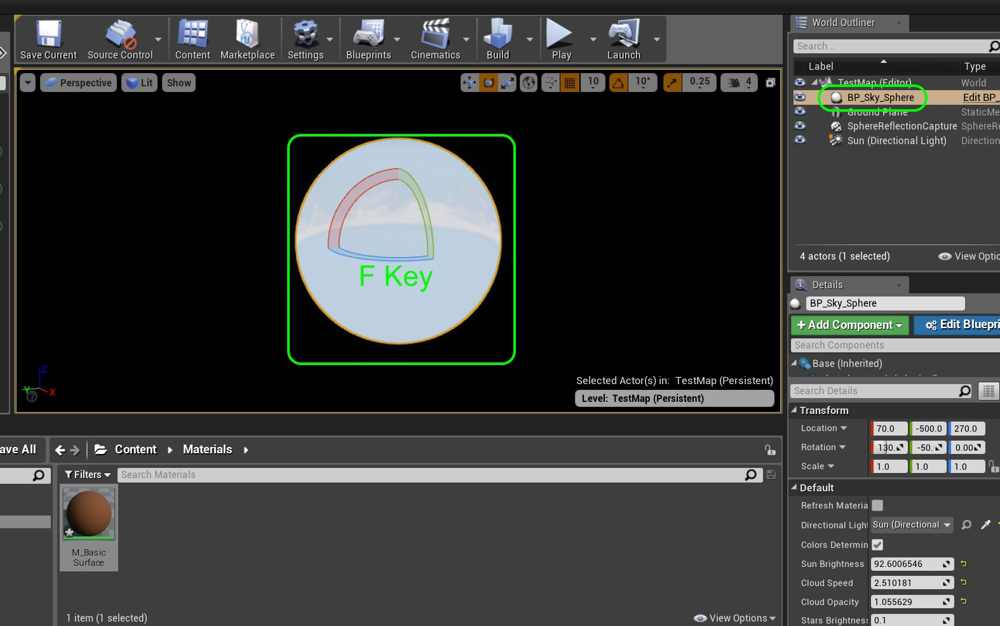

# Hello World for Unreal Engine 4 - Page 7
_____ 

## Index
_____ 

* Part 1 - Setting up with Git/Github
1. [Starting New Git Repository](Hello-World-Starter-1.html#starting-new-git-repository)
2. [Starting Unreal Engine 4](Hello-World-Starter-2.html#starting-unreal-engine-4)
3. [Our First Addition to Git](Hello-World-Starter-3.html#our-first-addition-to-git)

* Part 2 - Static Meshes, Ligths & Materials
3. [Basic Plane](Hello-World-Starter-4.html#basic-plane)  
4. [Our First Light](Hello-World-Starter-5.html#our-first-light)  
5. [Our First Material](Hello-World-Starter-6.html#our-first-material)
6. [**Skybox and Reflections**](Hello-World-Starter-7.html#skybox-and-reflections)
6. [Buliding Blocks & Instanced Material](Hello-World-Starter-8.html#building-block-instanced-material)

_____ 

### Skybox and Reflections
The game doesn't look very good as the world that our ground plane is in is dark.  Lets change it by adding a skybox to the game.
_____ 



{:start="{{ num }}"}
{{ num }}. The game does not look very good without a sky and some more advanced lighting features.  Lets add the Unreal default Skybox.  To do this we need to click on the **Content Browswer** at the bottom right with the eyeball and **View Options** drop down arrow. You then make sure that **Show Engine Content** is selected.

  

_____ 



{:start="{{ num }}"}
{{ num }}. Now naviate to **Engine Content \| Engine Sky \| BP_Sky_Sphere** to add a Skybox with some blueprint logic to your level.

  

_____ 



{:start="{{ num }}"}
{{ num }}. Rename the directional light in the **World Outliner** to `Sun (Directional Light)`.  We will then connect this to the skybox so it can animate and move the sun's position in the scene.

  

_____ 



{:start="{{ num }}"}
{{ num }}. Select the **BP_Sky_Sphere** blueprint in the **World Outliner** and change the directional light to `SUbn (Directional Light)`.  This way the blueprint knows that this light is the directional light acting as the sun.

  

_____ 



{:start="{{ num }}"}
{{ num }}. Now reopen **M_BasicSurface** and chnage the **Default Value** for **Roughness** to `0` and **Metallic** to `1` making it a metalic reflection:

  

_____ 



{:start="{{ num }}"}
{{ num }}. Press the **Build** button and rebuild everything including the scene lighting.  Run the game.  You should see that it is reflective but largely dark, the reflection map looks wrong.

  

_____ 



{:start="{{ num }}"}
{{ num }}. This is due to the fact that you have to tell the engine what to reflect.  If the game reflected all world objects in all world surfaces, this would have a dramatic impact to performance.  So we have to tell the engine what we want to reflect onto the surface.  Go to the **Modes** panel and select a **Sphere Reflection Capture** node. You can place multiple nodes in the environment with no impact to performance as it calculates the reflections before run-time. Drag one into the scene and put it in the middle of the level (0, 0, 0 Location).

  

_____ 



{:start="{{ num }}"}
{{ num }}. Press the **Build** button to generate the new reflection maps then run the game.  Now you can see that the reflection looks a lot better.

  

_____ 



{:start="{{ num }}"}
{{ num }}. Select **BP_Sky_Sphere** in the **World Outliner**.  Put the cursor in the game screen and press the **F** key on the keyboard to focus on that Blueprint.  Notice that it zooms way out to reveal the sky as a giant sphere.  Notice that the normals are facing inwards.

  

_____ 



{:start="{{ num }}"}
{{ num }}. Play with the various settings in the Skybox and look that they have added the ability to change the density of clouds, fog, and will update the time of day and lighting based on the angle of the direction light that you are using for the sun.

  

_____ 



{:start="{{ num }}"}
{{ num }}. Now lets remove engine content from **View Options** so we unclutter our searching for assets to ones we have created ourselves.  Next up we will create a new material for our lego blocks that we will be using for our hello world objects.

  

_____ 



{:start="{{ num }}"}
{{ num }}. Lets also return the ground material to a less reflective setting.  Open the **M_BasicSurface** material and adjust **Metallic** to `.1` and roughness to `.9`.

  

_____ 



{:start="{{ num }}"}
{{ num }}. Now rebuild the reflection by pressing **Build** and run the game and it should now be a matt ground. Next up lets build some blocks and spell out Hello World.

  

_____ 

  

[<- Previous](Hello-World-Starter-6.html)&nbsp;&nbsp;&nbsp;[Home](../index.html)&nbsp;&nbsp;&nbsp; [Continue ->](Hello-World-Starter-8.html)
   
   
   

