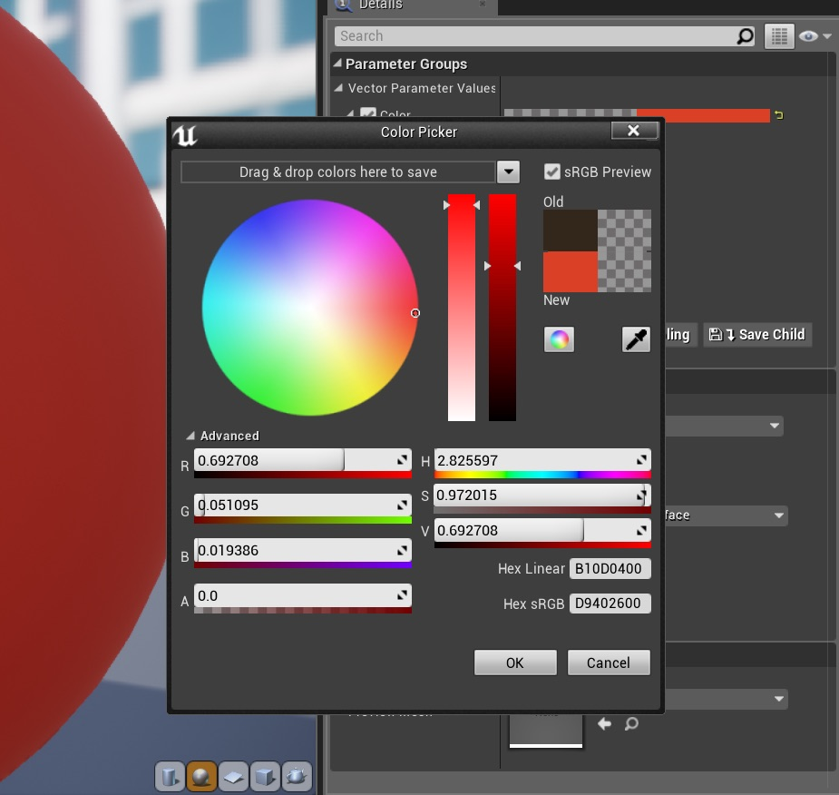
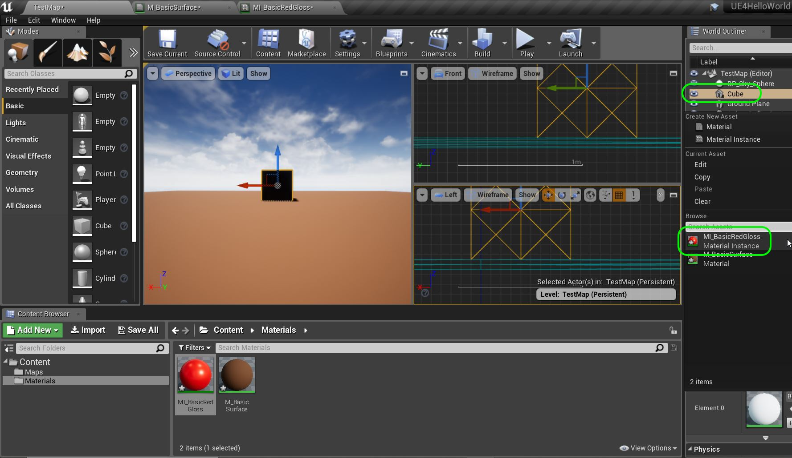
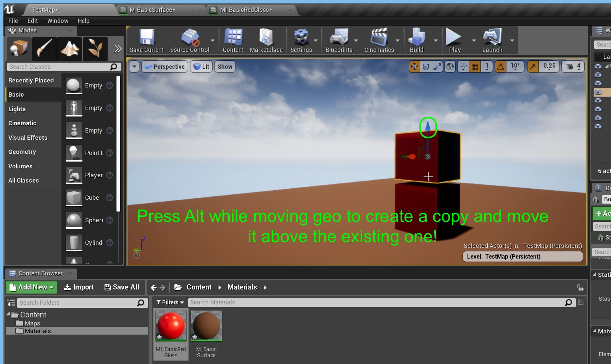

# Hello World for Unreal Engine 4 - Page 8
_____ 

## Index
_____ 

* Part 1 - Setting up with Git/Github
1. [Starting New Git Repository](Hello-World-Starter-1.html#starting-new-git-repository)
2. [Starting Unreal Engine 4](Hello-World-Starter-2.html#starting-unreal-engine-4)
3. [Our First Addition to Git](Hello-World-Starter-3.html#our-first-addition-to-git)

* Part 2 - Static Meshes, Ligths & Materials
3. [Basic Plane](Hello-World-Starter-4.html#basic-plane)  
4. [Our First Light](Hello-World-Starter-5.html#our-first-light)  
5. [Our First Material](Hello-World-Starter-6.html#our-first-material)
6. [Skybox and Reflections](Hello-World-Starter-7.html#skybox-and-reflections)
6. [**Buliding Blocks & Instanced Material**](Hello-World-Starter-8.html#building-block-instanced-material)

_____ 

### Buliding Blocks & Instanced Material

We are going to add blocks to form the letters of `Hello World`.  We will make each block multi-color and make it look as snazzy as we can. First lets set up an instance of this material.   This is much more efficient than setting up custom materials for each. 

> In Unreal Engine 4, Material instancing is used to change the appearance of a Material without incurring an expensive recompilation of the Material. Whereas a typical Material cannot be edited or changed without recompiling (something that must happen prior to gameplay), an instanced Material can be made to change without such recompilation. Certain types of instanced Materials can even change during gameplay in response to in-game events (such as a tree whose Material blackens and chars while it burns). This allows tremendous visual flexibility in your artistic elements. - [Unreal Docs](https://docs.unrealengine.com/en-us/Engine/Rendering/Materials/MaterialInstances)

_____ 



{:start="{{ num }}"}
{{ num }}. Go back to our **Materials** folder and right click the existing material and select **Create Material Instance** 

  

_____ 



{:start="{{ num }}"}
{{ num }}. To know which is a **Material** and what is an instance we will use the prefix `MI` to differentiate.  Call the instance `MI_BasicRedGloss`:

  

_____ 



{:start="{{ num }}"}
{{ num }}. Double click the instance and notice we can't add to the Material.  All we can do is edit the parameters.  Try double clicking on the color, or change the metallic quality.  Hmmm, nothing seems to work.  It defaults with the editing radio buttons unselected.

  

_____ 



{:start="{{ num }}"}
{{ num }}. Click all radio buttons to activate as we will edit all parameters.

  

_____ 



{:start="{{ num }}"}
{{ num }}. Double click the color to get the color picker.  Pick a nice shade of red:

  

_____ 



{:start="{{ num }}"}
{{ num }}. Adjust the metallic and roughness values to your liking. Now you should have a shiny red instance. Don't get too excited as it won't look shiny in our game as we have no environment or skybox to reflect into the surface.  It is not you doing anything wrong we will do skyboxes next class. 

  

_____ 



{:start="{{ num }}"}
{{ num }}. Now lets add a cube to the scene to start spelling the letter **H**.  Make sure you are in the **Modes** panel with **Place** button selected and the **Basic** shapes.  Drag the **Cube** and drop it in the scene.  Call it `BottomLeftH` in the **World Outliner**:

  

_____ 



{:start="{{ num }}"}
{{ num }}. It is very hard to place 3-D objects on a 2-D screen in perspective mode. Thankfully, Unreal allows us to select different views.  At the top of the viewport select the arrow and look for **Layouts**.  Select the three panel option.

  

_____ 



{:start="{{ num }}"}
{{ num }}. Have the two small views be a **Front** and **L
eft** view.  Select the buttons and make the requesite changes to look like:

  

_____ 



{:start="{{ num }}"}
{{ num }}. With the cursor in the **Left** or **Front** view, zoom out until you see the cubes.

  

_____ 



{:start="{{ num }}"}
{{ num }}. Grab the `x` and `z` control handles in the **Front Screen** and the `y` control handles and place it in the front left middle of the floor where the letter H will be: 

  

_____ 



{:start="{{ num }}"}
{{ num }}. When trying to place it precisely when you are close, then zoom in.  Change the units of incremental change if you are snapping to the wrong place: 

  

_____ 



{:start="{{ num }}"}
{{ num }}. Select the cube in the **World Outliner** tab and and select under the **Details** panel the **Material** for the object.  Click on the selection option and choose the red instance you just made: 

  

_____ 



{:start="{{ num }}"}
{{ num }}. Now switch back to a single viewport and look at your master piece:

  

_____ 



{:start="{{ num }}"}
{{ num }}. Right click in an empty spot in the **World Outliner** and select **Create Folder**.  Lets put each letters cube in a seperate folder. Call the folder `LetterH`.  Drag the letter cube into the folder.  It should now be in the folder like so:

  

_____ 



{:start="{{ num }}"}
{{ num }}. Select the first cube in the **World Outliner** and we will duplicate the cube to build the next section of the **H** letter.  By pulling the move arrows on the objects while pressing the _Alt_ key you will make a copy of the cube and move the copy.  Drag the `z` controller and make a second cube:

  

_____ 



{:start="{{ num }}"}
{{ num }}. Go back to three viewports to position it with fine control and accuracy.

  

_____ 


{:start="{{ num }}"}
{{ num }}. Now the shadows on the cubes are very harsh. Go back to **Modes** and select **Lights**.  Add a **Skylight** to the scene.  This will simulate what light does when it bounces off surfaces giving some detail to the shadow areas.

  

_____ 



{:start="{{ num }}"}
{{ num }}. You can adjust the **Intensity Scale** to see the effect it has on details on the lighting.  Notice that if you set it to 9 then no detail shows up anywhere and the cube is black. I left mine at the default setting of `1`.

  

_____ 



{:start="{{ num }}"}
{{ num }}. Finish the letter **H**.  Make sure you name the cubes to something that you can edit in the future.

  

_____ 



{:start="{{ num }}"}
{{ num }}. When we are happy with the **H** we can select all the cubes that make it up and right click and **Group** them.

  

_____ 



{:start="{{ num }}"}
{{ num }}. Now when you select the group you can select them all as one and move them as if they are one model.

  

_____ 



{:start="{{ num }}"}
{{ num }}. Create more instance materials and more cubes to spell out the words **Hello World**.  You might have to adjust the size of the ground plane to contain all the letters.  Your final project should look something like this.  Make sure you name your files appropriately and put all your cubes in folders that are clearly labelled.

  

_____ 



{:start="{{ num }}"}
{{ num }}. Instead of having the camera on the player pawn that spawns, lets have a predefined camera.  Go to **Modes** and type `Camera` and drag a **Camera** into the scene.  Now we want to make a blueprint to add logic to it.  Click on the **Blueprint Add** button and call it `BP_Camera_Actor`. Add a **Blueprints** folder and we will make sure to move this blueprint to this folder.

  

_____ 



{:start="{{ num }}"}
{{ num }}. Double click the new blueprint and press the **+ Add Component** button and search for `Billboard`.  Add this component to the scene.  Press **+ Add Component** again and add a `Rotating Movement` component.  

  

_____ 



{:start="{{ num }}"}
{{ num }}. Make sure the billboard component is at **Location** `0, 0, 0`..  Move the **Camera Component** to be further away.  Press the **Simulate** button and see the camera rotate around the object. 

  

_____ 



{:start="{{ num }}"}
{{ num }}. Now the game will not use this camera unless you tell it to.  When you save a map/level the game automatically creates a level blueprint.  You can load it by pressing the **Blueprints** button and select **Open Level Blueprint**:

  

_____ 



{:start="{{ num }}"}
{{ num }}. Right click on the graph and search for a **GetPlayerController** node.

  

_____ 



{:start="{{ num }}"}
{{ num }}. Select it and your graph should look like:

  

_____ 



{:start="{{ num }}"}
{{ num }}. Pull off of the **Return Value** pin and add a **Set View Target with Blend** node:

  

_____ 



{:start="{{ num }}"}
{{ num }}. Make sure that you are selecting the Camera blueprint actor in the game window:

  

_____ 



{:start="{{ num }}"}
{{ num }}. Go back to the **Blueprint** and right click on the graph.  Select **Create a Reference to BP_Camera**:

  

_____ 


{:start="{{ num }}"}
{{ num }}. Connect the **Return Value** from the **Get Player Controller** node to the **New View Target** in the **Set View Target with Blend** node.  Also connect the **Event Begin Play** node execution pin to the **Set View Target with Blend** execution pin.  This will run when the game starts for the first time (hitting hte **Play** button).

  

_____ 



{:start="{{ num }}"}
{{ num }}. Run the game and look at the animation.  In my case it is too fast and too close.  Lets fix that!

  

_____ 


{:start="{{ num }}"}
{{ num }}. Go back and open the camera blueprint and move the camera on the **X** axis event further away from the center:

  

_____ 


{:start="{{ num }}"}
{{ num }}. Click on the **Rotating Movement** component and change the **Rotation Rate** on **Z** to `30` from the default `180`.

  

_____ 

{:start="{{ num }}"}
{{ num }}. Run the game and it should animate around your text!

  

_____ 



{:start="{{ num }}"}
{{ num }}. Naming convention for **Hello World**:

*  Maps folder under contents with appropriately descriptive map name
*  Materials folder with Materials named with prefix `M_` and Material instances named with prefix `MI_`.
*  Blueprints folder contains Blueprints with prefix `BP_`.
*  Clean World Outliner with each letter in their own folder and aptly named cubes

_____ 

  

[<- Previous](Hello-World-Starter-7.html)&nbsp;&nbsp;&nbsp;[Home](../index.html)
   
   
   

