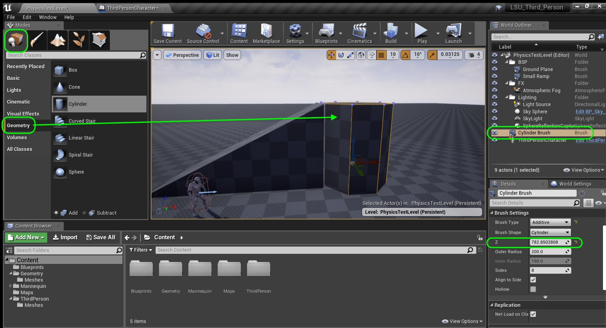

  

## Introduction to Level Design - Page 2

* Part 1 - Setting up 
1. [Getting Started](Intro-To-Level-Design-1.html#getting-started)
2. [Tuning Default Settings](Intro-To-Level-Design-1.html#tuning-default-settings)
3. [Clean Up Content Folder](Intro-To-Level-Design-1.html#clean-up-content-folder)
4. [**Lock Down Physics**](Intro-To-Level-Design-2.html#lock-down-physics)

* Part 2 - Creating The Grey Block
1. [**Short Ramp**](Intro-To-Level-Design-2.html#short-ramp)
2. [**Center Platform**](Intro-To-Level-Design-2.html#center-platform)
3. [Second Ramp](Intro-To-Level-Design-3.html#second-ramp)
4. [Third Ramp](Intro-To-Level-Design-3.html#third-ramp)
5. [Fourth 45 Degree Ramp](Intro-To-Level-Design-3.html#fourth-45-degree-ramp)
6. [Easy Jump Height](Intro-To-Level-Design-4.html#easy-jump-height)
7. [Intermediate &amp; Hard Jump Height](Intro-To-Level-Design-4.html#intermediate--hard-jump-height)
8. [Short Standing Jump Distance](Intro-To-Level-Design-4.html#short-standing-jump-distance)
9. [Short Running Jump Distance](Intro-To-Level-Design-5.html#short-running-jump-distance)
10. [Long Running Jump Distance](Intro-To-Level-Design-5.html#long-running-jump-distance)
11. [Moving Platform](Intro-To-Level-Design-5.html#moving-platform)
12. [Moving Platform Part II](Intro-To-Level-Design-6.html#moving-platform-part-ii)

* Part 3 - Adding Materials to Map 
1. [Adding Master Material](Intro-To-Level-Design-7.html#adding-master-material)

### Lock Down Physics
We need to get the character all set up so we can begin the level design process.  We will first lock the physics.  Then we will grey block a level. Then we will populate it with models and effects.  Then we will light, tweak and tune the look of the level.

Before we can lay out a level for gameplay we have to lock our main character physics.  This will change the distance a player can jump which affects our level placement.  We will start by getting settings that we like.  This is all down to personal taste so please feel free to pick settings that you like as opposed to the ones I selected. 

We will be using editable geometry within Unreal Engine 4.  Even though this is not what we would ship our game with (as we want static meshes), this is a great way of locking down gameplay before using modelling software to take the painstaking time to create beautiful assets.  This allows the level designer the ability to make multiple changes and get the gameplay portion right.  After that the artists can come in and replace this geometry with proper models.

_____ 



{:start="{{ num }}"}
{{ num }}. First lets start by deleting the static mesh floor that comes with the default level:

  

_____ 



{:start="{{ num }}"}
{{ num }}. Go to the Modes panel and select Geometry.  This allows you to add editable BSP shapes to the level.  We will use this for the floor.  Drag the box to the level.

  

_____ 



{:start="{{ num }}"}
{{ num }}. Place the floor in the center of the world by setting its **Location** to `0.0` on all axes. Note that it is 200 cm squared or roughly 6 foot squared. Lets set it to 100 feet by 100 feet and make it 3 feet thick.  So that would be `30478.0` in the **Brush Shape** **X** and **Y** and `91` in the **Z**. 

  

_____ 


{:start="{{ num }}"}
{{ num }}. Now this isn't a first person shooter, so we don't need player start.  We can actually have our character in the world.  Drag and drop the character blueprint into the scene and delete the **Player Start**.

  

_____ 



{:start="{{ num }}"}
{{ num }}. Run the game and see what happens.  Woops we get two players.

  

_____ 


{:start="{{ num }}"}
{{ num }}. Go highlight your player character in the **World Outliner**.  Look at the **Details** panel and look for the **Pawn** tab.  You will notice that **Auto Posess Player** is set to **Disabled**.  Change this to `Player 0` and the game should now auto posess the game controller.

  

_____ 



{:start="{{ num }}"}
{{ num }}. Now run the game and you should see the character in the level then the game starts with you in posession.

  

_____ 


{:start="{{ num }}"}
{{ num }}. Lets organize our folders a bit.  Lets name the box we used for the ground as `Ground Plane` in the **World Outliner**.

  

_____ 


{:start="{{ num }}"}
{{ num }}. Lets organize our folders a bit.  Create a new folder called `BSP` and drag the **Ground Plane** into this folder.:

  

_____ 


{:start="{{ num }}"}
{{ num }}. Create a `FX` and `Lighting` folder. Put the **Atmospheric Fog** in the `FX` folder and the **Light Source**, **Sky Sphere**, **SkyLight** and **Sphere Reflection Capture** in the `Lighting` folder. 

  

_____ 

## Creating The Grey Block
In most interactive projects we want to block out a level.  This is similar to creating a written outline for a book/screenplay or a sketch for a painting.  Interactive environments are exploratory and we want to block out the gross movement.  Before you do this, we need to understand the way a character moves.  Rarely do they move in the same way that we do in real life.  In a small screen simulation we often exaggerate physics.  So lets create a physics playground and explore this in a test level.

_____ 

###  Short Ramp
Lets create a short ramp that the player an run up and down.  We will be using a brush instead of geometry because we can edit the shape of the brush in the engine and block out a level that looks like any structure or environment we want.

_____ 



{:start="{{ num }}"}
{{ num }}. Now lets add a ramp to run up and down and see how it feels.  We will make adjustments to the physics to get what we would like.  Start by dragging another **Box** onto the level.

  

_____ 



{:start="{{ num }}"}
{{ num }}. Adjust the size to `1000` by `400` by `500` in the brush size. And make sure the future ramp is touching (or penetrating) the ground.

  

_____ 


{:start="{{ num }}"}
{{ num }}. Now select the edit tool in the box.  Select the top left corner and pull it down.  Pull the top right corner and pull it down to get a ramp. Select **Apply**.

  

_____ 


{:start="{{ num }}"}
{{ num }}. Now look at the polygon flow on the BSP.  The surface is all messed up.  This is NOT what we want to see.

  

_____ 



{:start="{{ num }}"}
{{ num }}. Press **Control Z** to undo your changes to go back to the box shape with no surface destortion. Now select the edit tool in the box.  This time press the Control key and left click the back **two** top points on the rectangle.  Pull them upwards to make a nice slope.  Do the same thing for the front two but pull them down to the ground:

  

_____ 



{:start="{{ num }}"}
{{ num }}. Now run up and down the ramps.  Hmmm, doesn't feel right to me. I don't feel an acceleration down the ramp or deceleration running up the ramp.  We will not address this at this time and will look at it when we look more into **Blueprints**.

  

_____ 


{:start="{{ num }}"}
{{ num }}. Call this cube `Small Ramp` and move it to the `BSP` folder.

  

_____ 

### Center Platform
Lets add a platform in the center that will end up connecting four ramps at different angles.  Later on we will come back and adjust the physics and angle running up and down.

_____ 



{:start="{{ num }}"}
{{ num }}. Now lets add a cylinder at the end of the trump to join ramps of different angles.  Drag a **Geometry \| Cylinder** BSP to the level. Make sure there are 8 sides and adjust the height so that it is on the ground and is the same height as the first ramp like so:

  

_____ 



{:start="{{ num }}"}
{{ num }}. Change the view to **Top** so you can see the edge of the ramp and the edge of the cylinder.  Adjust **Outer Radius** so that they match as closely as you can get! Change the snapping to `1` or of that doesn't work press the grtid to turn snapping off entirely.

  

_____ 


{:start="{{ num }}"}
{{ num }}. Go back to **Perspective** view and lets move the Location widget closer to the top joint.  Center mouse click on the center of the widget and move it to the joint like so:

  

_____ 


{:start="{{ num }}"}
{{ num }}. Go to **Left** perspective. Adjust the height to match the Z and X (or Y) of the ramp.  Zoom in close as even the smallest lip will catch the players feet.  It needs to be perfect. Again try turning snapping off and adjust it fully zoomed in.

  

_____ 



{:start="{{ num }}"}
{{ num }}. Run the game and run up and down the ramp and make sure the player doesn't get caught up on the lip. Run over the ramp and up to the center console.

  

_____ 


{:start="{{ num }}"}
{{ num }}. Call this cube `Center Ramp` and drag it to the **BSP** folder.

  

_____ 


{:start="{{ num }}"}
{{ num }}. Precisely placing objects takes time and effort. Once placed we don't want to accidentally move objects.  There is a way we can lock them down.  Select **Center Ramp** and right click on it.  Select **Transform** and click on the box next to **Lock Actor Movement**.

  

_____ 


{:start="{{ num }}"}
{{ num }}. Repeat this for **Small Ramp** and **Ground Plane**.

  

_____ 


{:start="{{ num }}"}
{{ num }}. Run the game and try and move these objects.  They are conveninently locked in place.

  

  

[<- Previous](Intro-To-Level-Design-1.html)&nbsp;&nbsp;&nbsp;[Home](../index.html)&nbsp;&nbsp;&nbsp; [Continue ->](Intro-To-Level-Design-3.html)
   
   
   

