  

## Introduction to Level Design - Page 4

* Part 1 - Setting up 
1. [Getting Started](Intro-To-Level-Design-1.html#getting-started)
2. [Tuning Default Settings](Intro-To-Level-Design-1.html#tuning-default-settings)
3. [Clean Up Content Folder](Intro-To-Level-Design-1.html#clean-up-content-folder)
4. [Lock Down Physics](Intro-To-Level-Design-2.html#lock-down-physics)

* Part 2 - Creating The Grey Block
1. [Short Ramp](Intro-To-Level-Design-2.html#short-ramp)
2. [Center Platform](Intro-To-Level-Design-2.html#center-platform)
3. [Second Ramp](Intro-To-Level-Design-3.html#second-ramp)
4. [Third Ramp](Intro-To-Level-Design-3.html#third-ramp)
5. [Fourth 45 Degree Ramp](Intro-To-Level-Design-3.html#fourth-45-degree-ramp)
6. [**Easy Jump Height**](Intro-To-Level-Design-4.html#easy-jump-height)
7. [**Intermediate &amp; Hard Jump Height**](Intro-To-Level-Design-4.html#intermediate--hard-jump-height)
8. [**Short Standing Jump Distance**](Intro-To-Level-Design-4.html#short-standing-jump-distance)
9. [Short Running Jump Distance](Intro-To-Level-Design-5.html#short-running-jump-distance)
10. [Long Running Jump Distance](Intro-To-Level-Design-5.html#long-running-jump-distance)
11. [Moving Platform](Intro-To-Level-Design-5.html#moving-platform)
12. [Moving Platform Part II](Intro-To-Level-Design-6.html#moving-platform-part-ii)

* Part 3 - Adding Materials to Map 
1. [Adding Master Material](Intro-To-Level-Design-7.html#adding-master-material)

### Easy Jump Height
Now we are going to figure out how hight the player can jump for getting onto platforms.  This is our core mechanic so it is important to be happy with this and understand it better.  Lets start by making a hole in a column to vertically jump through.  This will give us information about the size of the portal to fit the player **and** the camera.  We will do this for easy single jump, hard single jump, easy double jump and hard double jump.  Lets get started.

_____ 



{:start="{{ num }}"}
{{ num }}. Add a BSP **Box** to the level next to the ramps.  Move the player in front of it.

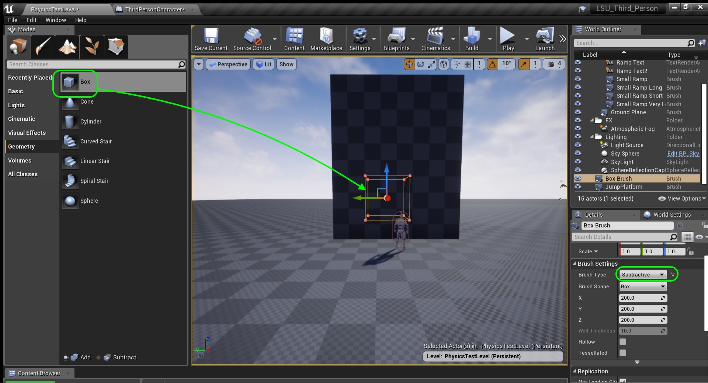  

_____ 



{:start="{{ num }}"}
{{ num }}. Lets make it a big jump column with plenty of room to jump through.  Edit the **Brush Settings** to `400.0`, `800.0` and `1000.0`.

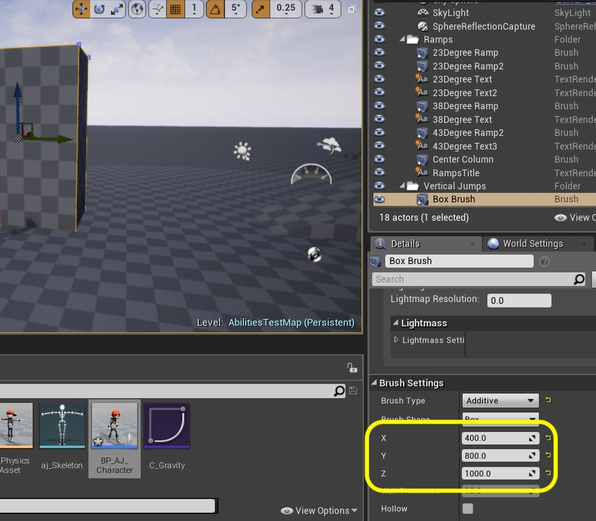  

_____ 



{:start="{{ num }}"}
{{ num }}. Now we need to cut a hole in it to jump through.  We can do this with the same bsp but change it to remove the volume instead of adding it.  Drag another **Box** into the scene and change the **Brush Type** to `Subtractive`.  This will subtract any brush volume in the level:

  

_____ 


{:start="{{ num }}"}
{{ num }}. So if you move it into the column it will cut a hole where it normally would be:

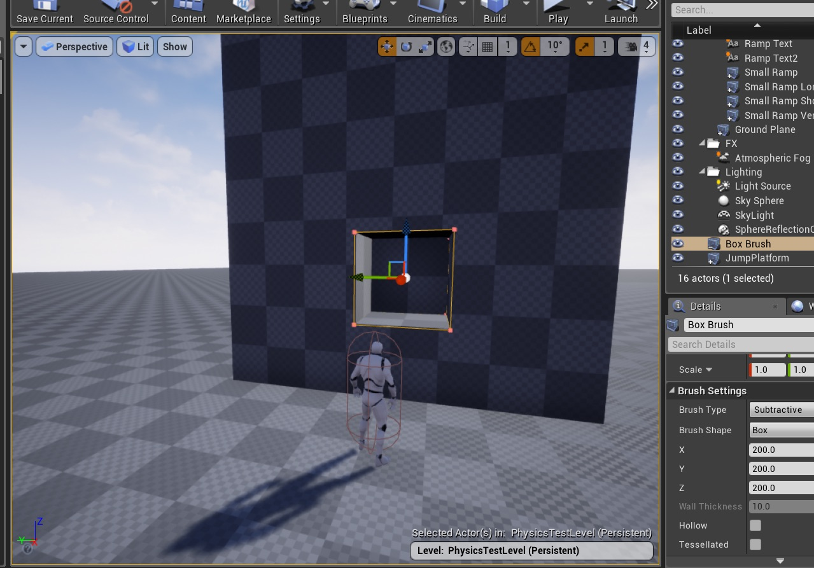  

_____ 



{:start="{{ num }}"}
{{ num }}. Extend the shape beyond the depth of the column.  Adjut it so it cuts a hole all the way through creating a tunnel and adjust the width and height.  Make sure you leave room for the camera to pass through.

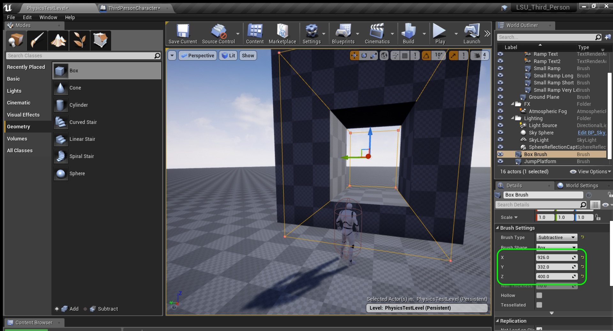  

_____ 


{:start="{{ num }}"}
{{ num }}. Adjust the height so that you feel you should EASILY make it with a single jump.  Go with what looks righ to you.  Obviously a person could never jump this high in real life but is consistent with platform mechanics in most games.  Mine looks like this when you run it.  Try to jump and have the camera interfer with the ceiling:

  

_____ 



{:start="{{ num }}"}
{{ num }}. Name the subtraction volume `HoleInJumpPlatform`.  Change the size of the column and the subtraction volume to give more room if you have a similar problem.

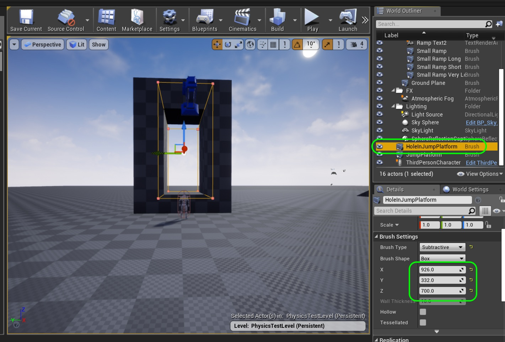  

_____ 


{:start="{{ num }}"}
{{ num }}. Name the positive volume `JumpPlatform`.  Change the size of the height of the column to make it look more symmetrical with the negative space.   

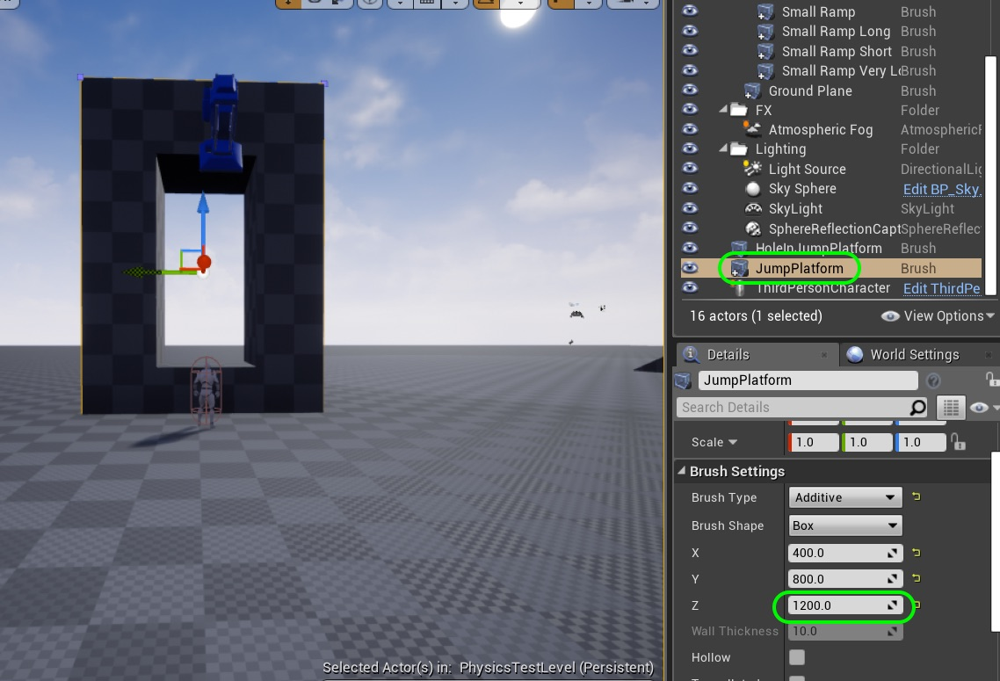  

_____ 


{:start="{{ num }}"}
{{ num }}. Now try and jump into this cavity.  You want to be able to make this jump easily.  Now play the game and make any necessary adustments. Make sure there are no more camera issues.

  

_____ 


{:start="{{ num }}"}
{{ num }}. The reason we do this is we want to know how many Unreal units a player can jump in height for an easy jump.  This wasy when we are building a real level we will know roughly the height that is appropriate. Go to the **Front View** and middle mouse wheel click and drag between the platform and the ground.  It is a jump height of about 150 Unreal Units.  This is default to centimeters so it is 150 cm or 59.055 inches or just shy of 5 feet. 

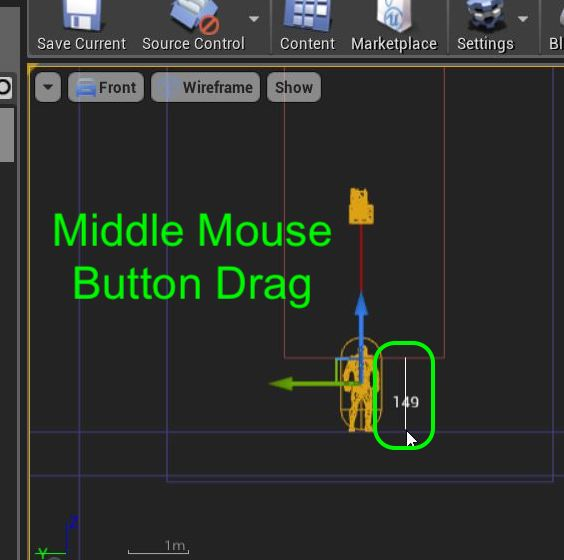  

_____ 


{:start="{{ num }}"}
{{ num }}. Lets move these brushes into a sub-folder called `Easy Jump` in the BSP folder:

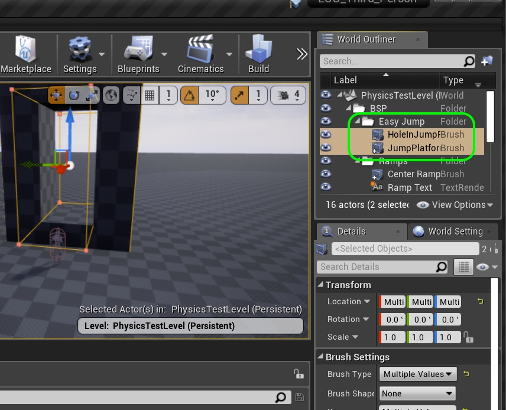  

_____ 


{:start="{{ num }}"}
{{ num }}. OK, lets mark this tunnel.  Drag another **Text Render** to the scene then call it `Easy Jump` and make it large.  Position it on top of the tunnel entrance.  Also, take the time to organize your **World Outliner** folders.

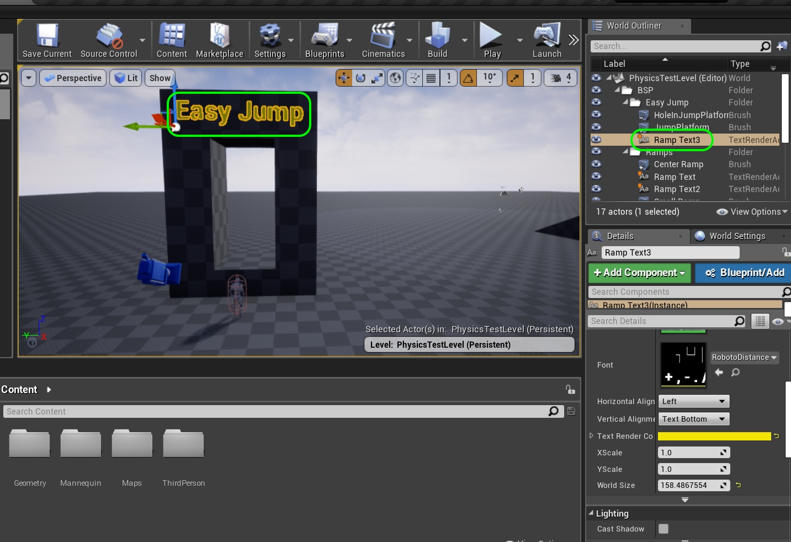  

_____ 

### Intermediate & Hard Jump Height
Lets add two progressively harder jump where you might need some momentum to make the jump height.

_____ 



{:start="{{ num }}"}
{{ num }}. Duplicate these three items (column, title, tunnel) and drag it next to the **Easy Jump** section.  Adjust the height of the jump and the column if necessary.  Change the name to `Intermediate Jump`.  If you need to add a line break you can use the HTML line break command ` ` in between the words.  You can also change the text to be centered. 

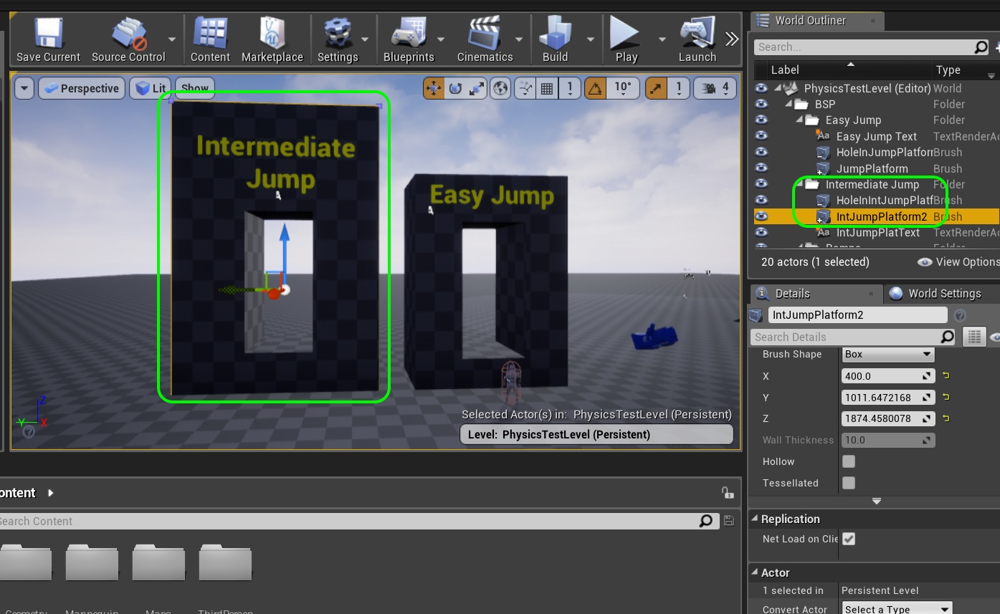  

_____ 



{:start="{{ num }}"}
{{ num }}. Go back and forth and adjust it so that you can still make the jump but it is a bit harder.  Try it multiple times before you settle on a distance.

  

_____ 


{:start="{{ num }}"}
{{ num }}. Now look at the height again. Go to the **Front View** and middle mouse wheel click and drag between the platform and the ground.  It is a jump height of about 200 cm or 59.055 inches or around 6 1/2 feet. 

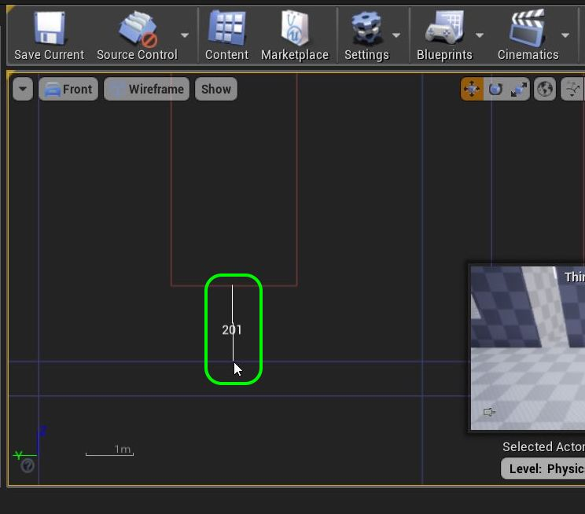  

_____ 



{:start="{{ num }}"}
{{ num }}. Duplicate again for a hard jump.  Add a new `Hard Jump` folder and adjust the text and the height of the jump volume like so:

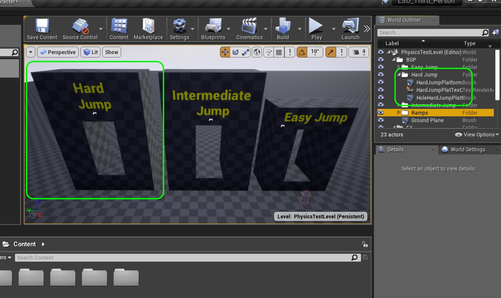  

_____ 


{:start="{{ num }}"}
{{ num }}. I tuned it so that I could not make the hard jump by jumping right next to the platform.  You have to take a running jump to just make it over the lip of the jump.

  

_____ 



{:start="{{ num }}"}
{{ num }}. This hard jump height is 245 centimeters which is an 8 foot high jump!

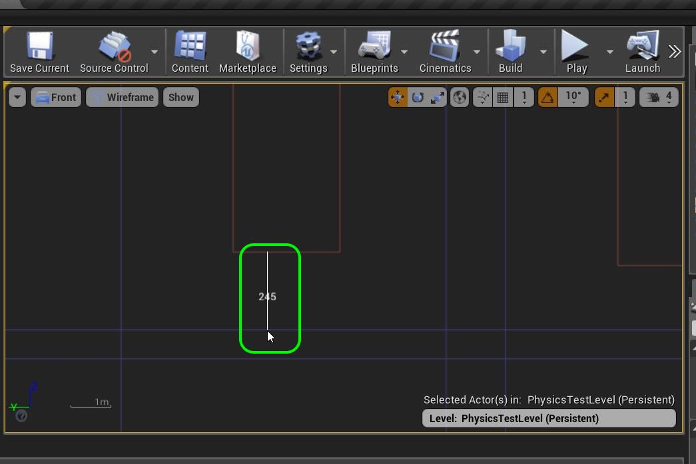  

_____ 



{:start="{{ num }}"}
{{ num }}. Now I enter the jump height in centimeters on the jump platforms so I don't have to measure it each time.  This is perfect for our physics test level.

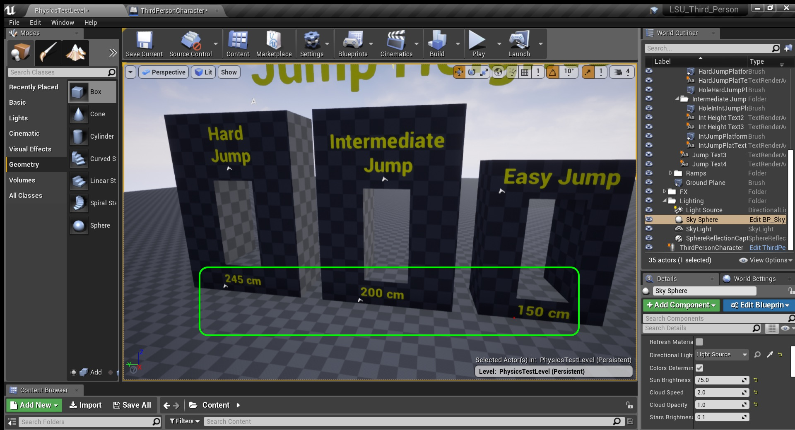  

_____ 


{:start="{{ num }}"}
{{ num }}. Add a **Jump Heights** title to go on top of the three jump platforms.

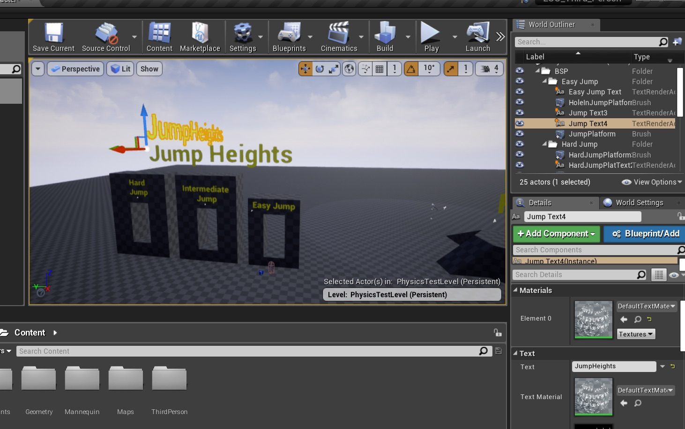  

_____ 



{:start="{{ num }}"}
{{ num }}. We can also lock all the brush and text transforms so we don't accidentally move them on all our jump height actors:

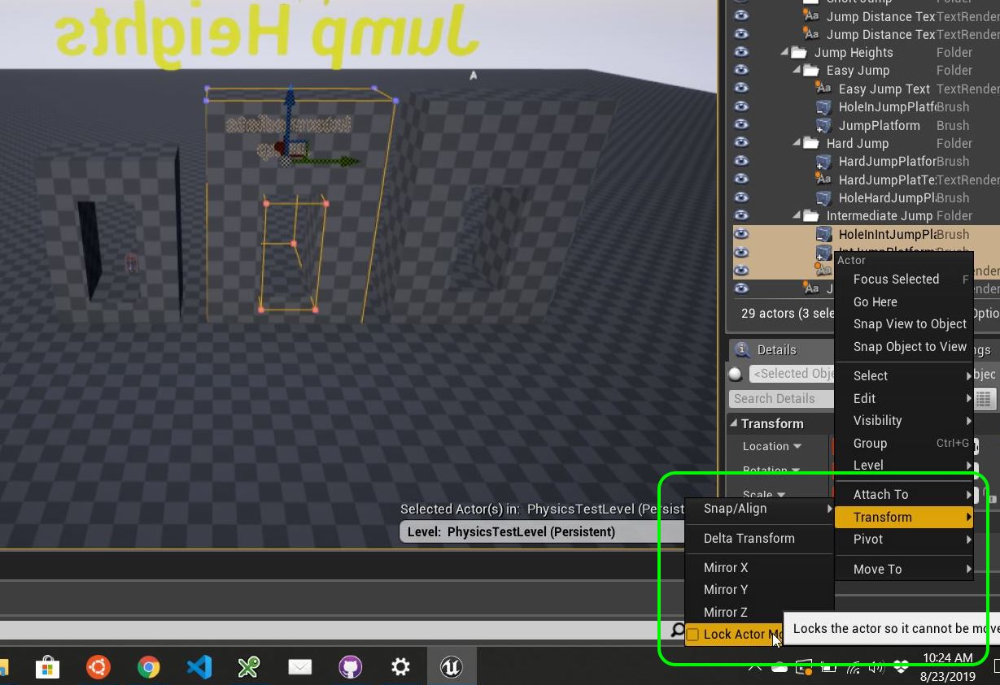  

---

### Short Standing Jump Distance
We also want to know how far a player can jump to overcome breaks in buildings or platforms.  How far can a player jump before they land on the ground again? Lets start with how far you can go when jumping from a stand (as opposed to while running).

_____ 


{:start="{{ num }}"}
{{ num }}. Lets move to the other sides of the ramp and create three jump distance actors to tune how far a player can jump.  Create a new title on top of that area.

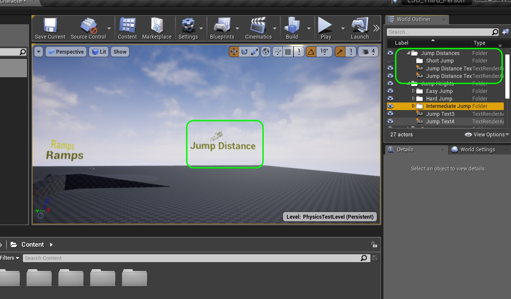  

_____ 



{:start="{{ num }}"}
{{ num }}. Lets add a staircase to run onto a flat ramp to jump over:

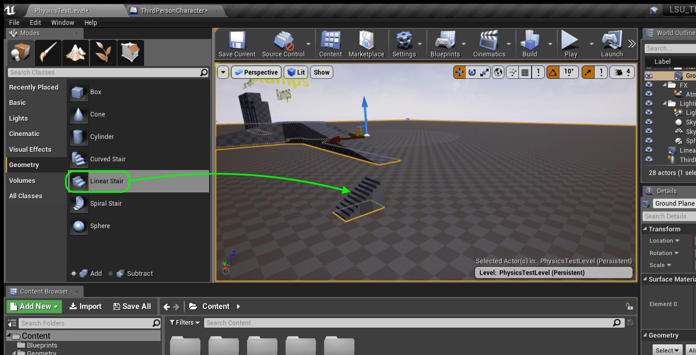  

_____ 


{:start="{{ num }}"}
{{ num }}. Add another **Box** brush as a runway.  Make it the height of the stairs and long enough to accelerate to full speed on.  Position it to match the stairs perfectly in width and height with no lips for the player to get hung up on.

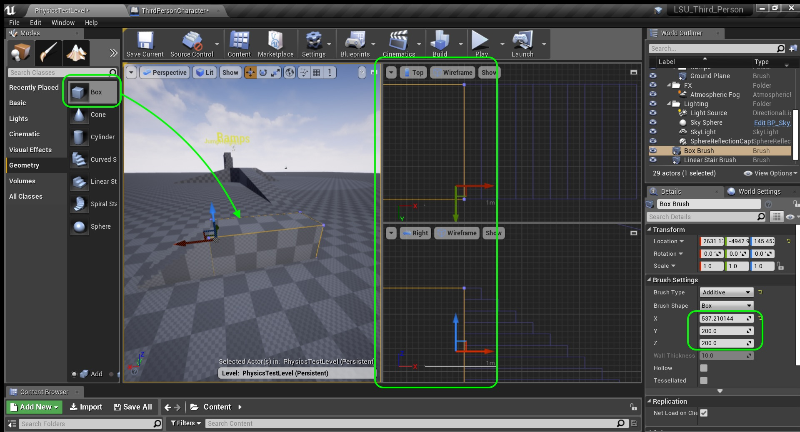  

_____ 



{:start="{{ num }}"}
{{ num }}. Run the game to test your work.  Make sure the ramp is long enough to run on and that there are no geometry issues or physics issues with the objects and the player.

  

_____ 


{:start="{{ num }}"}
{{ num }}. Select the stair and the ramp and alt click on the translation arrow to make a copy.  Rotate them by 180 degrees and position them to jump onto.

  

_____ 



{:start="{{ num }}"}
{{ num }}. Adjust the distance so you can make a standing jump between platforms like so:

  

_____ 


{:start="{{ num }}"}
{{ num }}. Add text on top of this standing jump:

  

_____ 



{:start="{{ num }}"}
{{ num }}. Go into **Left** view and middle mouse wheel click and drag to measure the distance of the jump. In this case it is 6.27 meters (20 feet).

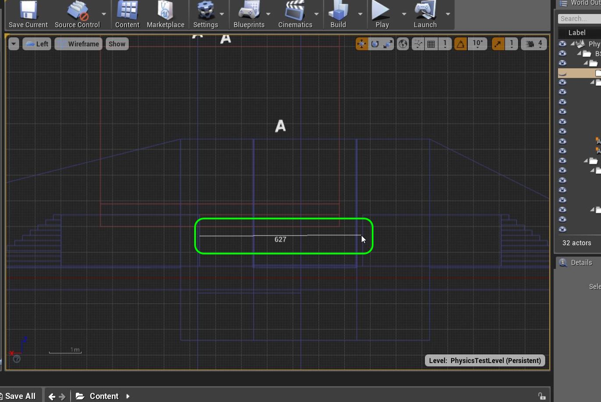  

_____ 


{:start="{{ num }}"}
{{ num }}.  Mark the jump distance with text along the floor.

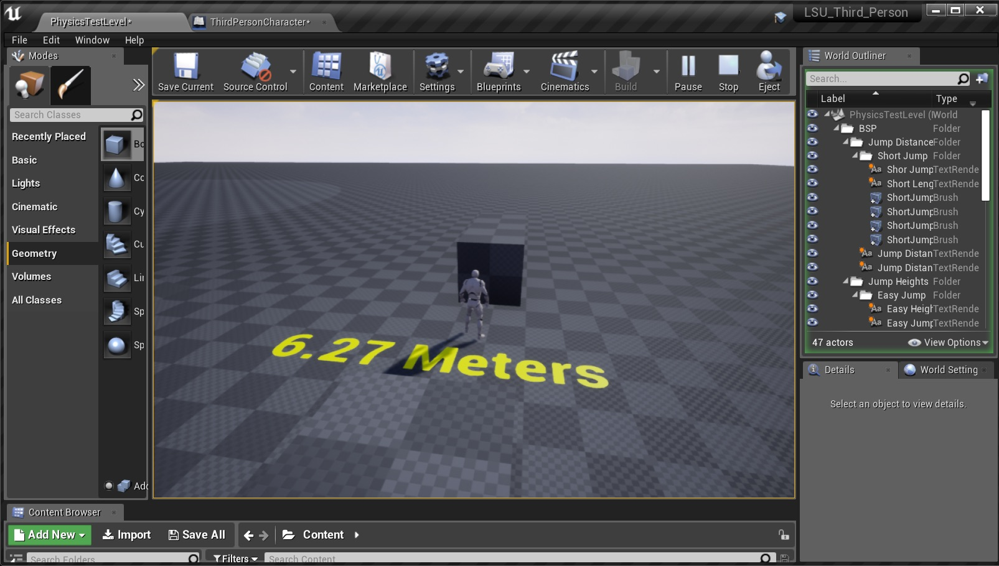  

  

[<- Previous](Intro-To-Level-Design-3.html)&nbsp;&nbsp;&nbsp;[Home](../index.html)&nbsp;&nbsp;&nbsp; [Continue ->](Intro-To-Level-Design-5.html)
   
   
   

