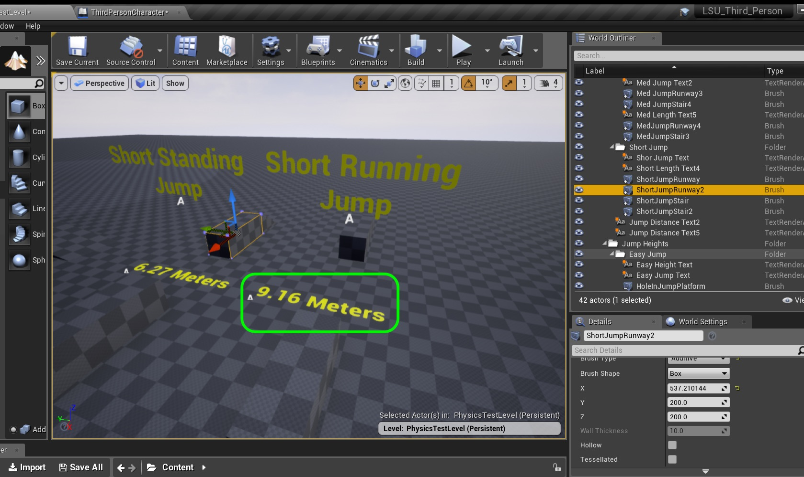

  

## Introduction to Level Design - Page 5

* Part 1 - Setting up 
1. [Getting Started](Intro-To-Level-Design-1.html#getting-started)
2. [Tuning Default Settings](Intro-To-Level-Design-1.html#tuning-default-settings)
3. [Clean Up Content Folder](Intro-To-Level-Design-1.html#clean-up-content-folder)
4. [Lock Down Physics](Intro-To-Level-Design-2.html#lock-down-physics)

* Part 2 - Creating The Grey Block
1. [Short Ramp](Intro-To-Level-Design-2.html#short-ramp)
2. [Center Platform](Intro-To-Level-Design-2.html#center-platform)
3. [Second Ramp](Intro-To-Level-Design-3.html#second-ramp)
4. [Third Ramp](Intro-To-Level-Design-3.html#third-ramp)
5. [Fourth 45 Degree Ramp](Intro-To-Level-Design-3.html#fourth-45-degree-ramp)
6. [Easy Jump Height](Intro-To-Level-Design-4.html#easy-jump-height)
7. [Intermediate &amp; Hard Jump Height](Intro-To-Level-Design-4.html#intermediate--hard-jump-height)
8. [Short Standing Jump Distance](Intro-To-Level-Design-4.html#short-standing-jump-distance)
9. [**Short Running Jump Distance**](Intro-To-Level-Design-5.html#short-running-jump-distance)
10. [**Long Running Jump Distance**](Intro-To-Level-Design-5.html#long-running-jump-distance)
11. [**Moving Platform**](Intro-To-Level-Design-5.html#moving-platform)
12. [Moving Platform Part II](Intro-To-Level-Design-6.html#moving-platform-part-ii)

* Part 3 - Adding Materials to Map 
1. [Adding Master Material](Intro-To-Level-Design-7.html#adding-master-material)

_____ 

### Short Running Jump Distance
Now lets create an easy jump while running.

_____ 



{:start="{{ num }}"}
{{ num }}. Select all elements while pressing the **control** button.  Then press **Alt** and move a copy off to the side like so:

  

_____ 



{:start="{{ num }}"}
{{ num }}. Rename the actors to reflect the intermediate jump length for a running jump.  I also accidentally copied the top text which I deleted as we don't need two overlapping actors.

  

_____ 



{:start="{{ num }}"}
{{ num }}. Change the text to `Short Running  Jump`.

  

_____ 



{:start="{{ num }}"}
{{ num }}. Change the text to `Short Running  Jump`.

  

_____ 



{:start="{{ num }}"}
{{ num }}. Tune the distance of the short running jump so that you can easily make it.

  

_____ 



{:start="{{ num }}"}
{{ num }}. Now it is hard to measure the distance as both jump ramps are confusing in the wireframe view.  Select the short jump actors and press the eyball next to the actors to turn the rendering off temporarilly.

  

_____ 


{:start="{{ num }}"}
{{ num }}. Go into the **Left** or **Right** view and meare the distance between the ramps.  In my case it is 9.16 meters (30 feet)

  

_____ 



{:start="{{ num }}"}
{{ num }}. Turn the rendering of the first set of jumps.  Edit the length on the floor to the proper length.

  

_____ 

### Long Running Jump Distance
Now we want a jump that you can only make when running at full speed and jumping at the last second.  This should be a jump that is challenging to make.

_____ 


{:start="{{ num }}"}
{{ num }}. Do this one last time for a long jump. Repeat the above and adjust the jump distance to where you have to jump at the ledge to make the jump like so:

  

_____ 



{:start="{{ num }}"}
{{ num }}. Measure the length of the jump and update the floor distance text.

  

_____ 

### Moving Platform
Lets create a simple blueprint that allows us to have a moving platform that we can use an a variety of scenarios.

_____ 


{:start="{{ num }}"}
{{ num }}. Copy the jump distance title by select both actors then **Alt** dragging a copy to the right.  Call this new title `Moving Platform`.  Add a folder in the **BSP** folder called `Moving Platform`.

  

_____ 



{:start="{{ num }}"}
{{ num }}. Add a BSP Geometry box into the scene.  Make the brush `300, 300, 50` to make a square platform. Place it at the height of the easy jump.

  

_____ 


{:start="{{ num }}"}
{{ num }}. We want to use this as a blueprint.  There is no promote to blueprint button.  This is because a blueprints can only manipulate a static mesh and not a brush BSP.  But do not despair, we can change this to a BSP to a static mesh.    Please note that you will no longer be able to edit the geometry when you do this.  Open up all the settings for the **Brush Settings** section and open the bottom section by pressing the traingle at the bottom.  This will bring up a **Create Static Mesh** button.  Press the button.

  

_____ 


{:start="{{ num }}"}
{{ num }}. Select the **Geometry \| Meshes** folder and call the mesh `SM_MovingPlatform`.

  

_____ 


{:start="{{ num }}"}
{{ num }}. Now double click the mesh you just created.  It does not have a collision volume when you do this.  So we need to add one.  Press the **Collision** menu item and lets press **Add Box Simplified Collision** option to add a simple box around our simple box mesh.

  

_____ 


{:start="{{ num }}"}
{{ num }}. Now we want to see what we have done to make sure we are OK with it.  Press the **Collision** button on the top meny and select the **Simple Collision** menu item to view the collision volume.  You should see a green surround that matches our mesh perfectly.  I am happy with this we can now move on and create a blueprint.

  

_____ 


{:start="{{ num }}"}
{{ num }}. Go back to the **World Outliner** and notice that it is no longer a BSP but a Static Mesh.  Also we see the button **Blueprint/Add Script** button back.  Highlight the platform and press the **Blueprint/Add Script** button.  Name the blueprint `BP_Moving_Platform`.

  

_____ 



{:start="{{ num }}"}
{{ num }}. We need to locations for the platform to move **From** and to move **To**.  We will just be translating the object and are not rotating or scaling it.  So we need an **X**, **Y**, **Z** float to store the location.  There is a data structure called a **Vector** available to us in Unreal.  We need to create a Variable to store it.  Press the **+** button next to **Variable** and create a new Variable called `Starting Position` of type **Vector** and make it **Private** and **Instance Editable**.  Put it in **Category** `Platform` and give it a **Tooltip** of `Starting location of platform`.  We set **Private** to `true` as we want to default Variables to private to this object.  We would need to make it public if we wanted another actor to access the data. In this case we don't need to do this.  If you don't know, make the variable private.  The **Instance Editable** allows us to adjust this value in the game window to tune while playing the game.  This allows us to edit it in the game editor without going back to the blueprint.

  

_____ 



{:start="{{ num }}"}
{{ num }}. Duplicate the **Starting Position** variable and call it `End Position` and change the tooltip to `End location of platform`.

  

_____ 


{:start="{{ num }}"}
{{ num }}. Add a third variable that will affect how long the platform waits before it leaves and returns to its two locations.  Call it `Delay` and make it type **Float**.  Set **Private** to `true`, **Instance Editable** to `true`, **Category** to `Platform` and **Tooltip** to `Dealy between targets in seconds`.

  

_____ 



{:start="{{ num }}"}
{{ num }}. Now we need a variable to set the speed the platform moves at in seconds.  Duplicate the **Delay** variable and change the name to `Speed` and adjust the tooltip to `Speed to target in seconds`. 

  

_____ 


{:start="{{ num }}"}
{{ num }}. The platform will do a single round trip unless it is set to looping.  Add a nother Variable called `Platform Is Looping?` and make it **Type** `Boolean`.  Set **Instance Editable** to `true`, **Private** to `true`, **Category** to `Platform` and **Tooltip** to `True sets platform animating for entire level`.

  

_____ 



{:start="{{ num }}"}
{{ num }}. Now since the consruction script runs anytime you make a change in the object in the level we can use this to do things like set the starting and end position of the platform.  We will use a boolean to set a variable then reset the boolean to its previous state.  Duplicate the previous **Boolean** and call it `Set Start Position` and change the **Tooltip** to `Pressing this sets the start position in world space`.

  

_____ 


{:start="{{ num }}"}
{{ num }}. Dupicate thsi Variable and call it `Set End Position` and change the **Tooltip** to `Pressing this sets end position in world space`.

  

_____ 



{:start="{{ num }}"}
{{ num }}. Go to the **Construction Script** tab and lets put logic to set the start and end position.  Add a **Branch** node by right clicking on the graph in an empty section and type in **Branch** in the search window.  Press **Select** and you should see a **Branch**.  The branch node takes a boolean (true or false) as an input and will run different execution pins if the value it **True** or **False**.

  

_____ 


{:start="{{ num }}"}
{{ num }}. When you set the **Set Start Position** boolean to true it will record its current world position then set the boolean back to false.  Drag a **Set Start Position** variable to the graph and select **Get Set Start Position** (we are reading or "getting it" not setting it at this point).  Add connect the output of the **Set Start Position** pin to the **Branch Condition**  input pin in the **Branch** node.

  

_____ 



{:start="{{ num }}"}
{{ num }}. Connect the execution pins between the **Construction Script** and **Branch** input.  Drag a **Set Starting Position** node and now select a **Setter** and connect it to the **True** execution pin from the **Branch** node.  Add a **Get Actor Location** node and connect the pin to the **Set Starting Position** node.

  

_____ 



{:start="{{ num }}"}
{{ num }}. To complete this portion we want to set the **Set Start Position** node back to false.  Drag a **Set Start Position** node we want to set it to false so select **Set Set Start Position** in the pop-up menu.

  

_____ 


{:start="{{ num }}"}
{{ num }}. Connect the execution pins so it proceeds to perform the action.

  

_____ 


{:start="{{ num }}"}
{{ num }}. Add a **Get Set End Position** node to read this boolean.  If it is true then we will set the end position **Vector** variable.

  

_____ 


{:start="{{ num }}"}
{{ num }}. Add another **Branch** node then connect the execution pin from the **False** execution pin from the previous **Branch** node.  So if the player doesn't press the **Set Start Position** then we need to check to see if they are pressing the **Set End Position**.  Then connect the output of **Set End Position** node to the **Condition** input pin in the **Branch** node.

  

_____ 


{:start="{{ num }}"}
{{ num }}. Drag and add a **Set End Position** to set the second destination location. 

  

_____ 


{:start="{{ num }}"}
{{ num }}. Connect the execution pins from the **Set Ending Position** node to the **Set Set End Position** node.

  

_____ 



{:start="{{ num }}"}
{{ num }}. Clean up the nodes.  WIth the mouse drag with left button pressed and highlight all the nodes and press the **C** button and add a comment `Set Start and End Location of Platform`.

  

_____ 



{:start="{{ num }}"}
{{ num }}. Now lets test our work to see what this does.  Go to the game window. Adjust the starting position for the platform and press the **Set Start Position** box in the **Details** panel.  Notice that the **Starting Position** vector updates with the current location.  Then move the platform and set the **Set End Position** and notice that it updates the **Ending Position** variable.  It should look like this:

  

_____ 

[<- Previous](Intro-To-Level-Design-4.html)&nbsp;&nbsp;&nbsp;[Home](../index.html)&nbsp;&nbsp;&nbsp; [Continue ->](Intro-To-Level-Design-6.html)
   
   
   

