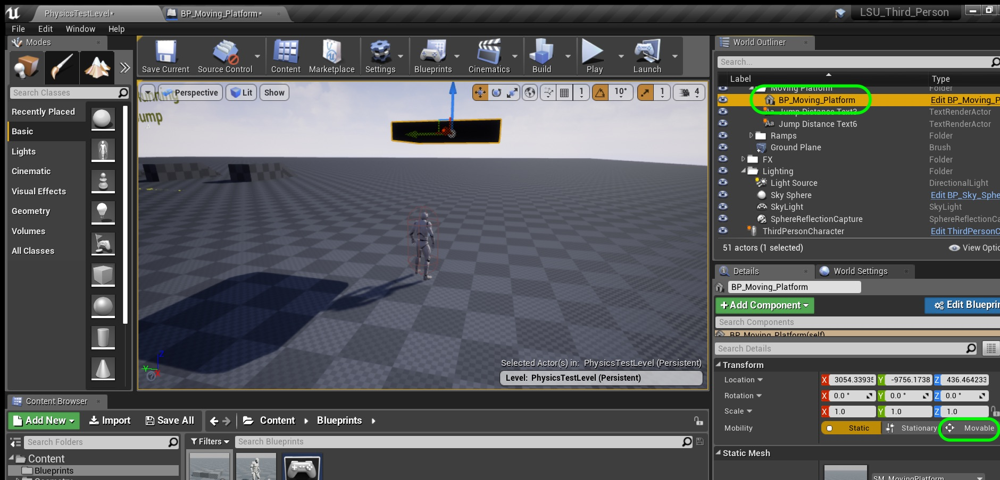

  

## Introduction to Level Design - Page 6

* Part 1 - Setting up 
1. [Getting Started](Intro-To-Level-Design-1.html#getting-started)
2. [Tuning Default Settings](Intro-To-Level-Design-1.html#tuning-default-settings)
3. [Clean Up Content Folder](Intro-To-Level-Design-1.html#clean-up-content-folder)
4. [Lock Down Physics](Intro-To-Level-Design-2.html#lock-down-physics)

* Part 2 - Creating The Grey Block
1. [Short Ramp](Intro-To-Level-Design-2.html#short-ramp)
2. [Center Platform](Intro-To-Level-Design-2.html#center-platform)
3. [Second Ramp](Intro-To-Level-Design-3.html#second-ramp)
4. [Third Ramp](Intro-To-Level-Design-3.html#third-ramp)
5. [Fourth 45 Degree Ramp](Intro-To-Level-Design-3.html#fourth-45-degree-ramp)
6. [Easy Jump Height](Intro-To-Level-Design-4.html#easy-jump-height)
7. [Intermediate &amp; Hard Jump Height](Intro-To-Level-Design-4.html#intermediate--hard-jump-height)
8. [Short Standing Jump Distance](Intro-To-Level-Design-4.html#short-standing-jump-distance)
9. [Short Running Jump Distance](Intro-To-Level-Design-5.html#short-running-jump-distance)
10. [Long Running Jump Distance](Intro-To-Level-Design-5.html#long-running-jump-distance)
11. [Moving Platform](Intro-To-Level-Design-5.html#moving-platform)
12. [**Moving Platform Part II**](Intro-To-Level-Design-6.html#moving-platform-part-ii)

* Part 3 - Adding Materials to Map 
1. [Adding Master Material](Intro-To-Level-Design-7.html#adding-master-material)

_____ 

### Moving Platform Part II
Lets finish up the platform and get it moving.

_____ 



{:start="{{ num }}"}
{{ num }}. Click on the **Event Graph** tab where we will put the logic to move the platform.  Right click on the empty graph and lets add a **Add Custom Event** node.

  

_____ 


{:start="{{ num }}"}
{{ num }}. Name this event: `GoToLocationAndBack`.

  

_____ 



{:start="{{ num }}"}
{{ num }}. Go to **Begin Play** and pull off of the execution pin and call the above function by adding a node to call the custom event we just created **GoToLocationAndBack**.  Add a comment `Move Platform` to this one node. This means that when the game runs we will call the move platform event. This will run this function when you press the **Play** button.  It will run the **Event Begin Play** execution node once.

  

_____ 


{:start="{{ num }}"}
{{ num }}. Pull off of the **GetToLocationAndBack** node's execution pin and add a **Move Component To** node:

  

_____ 



{:start="{{ num }}"}
{{ num }}. Drag a reference of the **Static Mesh Component** from the **Component** section onto the graph.  Attach its output to the **Component** input pin on the **Move Component To** node.  

  

_____ 



{:start="{{ num }}"}
{{ num }}. Add a **Get End Position** node and put it into the **Target Relative Location** pin.  

  

_____ 



{:start="{{ num }}"}
{{ num }}. Connect the output of the **Ending Position** pin to the **Target Relative Location** in the **Move Component To** node:

  

_____ 



{:start="{{ num }}"}
{{ num }}. Add a **Get Speed** node and connect it to the **Over Time** pin in the **Move Component To** node:

  

_____ 



{:start="{{ num }}"}
{{ num }}. Right click on the empty graph and add a **Get Actor Rotation** node.

  

_____ 


{:start="{{ num }}"}
{{ num }}.  Connect the output of the **Get Actor Rotation** it to the **Target Relative Rotation** node. 

  

_____ 


{:start="{{ num }}"}
{{ num }}.  Now lets see if it works.  First we need to put the platform back to its start position when you press **Play**. Right click on the graph and find a **Set Actor Location** node. Drag a **Get Starting Position** node to read the starting postion of the blueprint.

  

_____ 


{:start="{{ num }}"}
{{ num }}.  No highjack the execution pins and connect it before you call the **Move Platform** custom event.

  

_____ 


{:start="{{ num }}"}
{{ num }}.  Now the platform is not getting lit.  When we converted it to a mesh it set the object to not moving.  This means that the ligthing is baked and doesn't update in game as it moves (as it is not meant to move).  Select the **BP_Moving_Platform** in the **World Outliner** and change the **Mobility** to `Movable`. Run the game and look to see if the platform goes from the start to the end position (make sure you have both the start and end position set to different locations).  It just goes right to the end and doesn't animate.  Why?

  

_____ 


{:start="{{ num }}"}
{{ num }}.  The default time in speed is `0`.  This means that it takes 0 seconds to move to its destination.  Highlight the **Speed** variable and change the **Default Value** to `5.0`.

  

_____ 


{:start="{{ num }}"}
{{ num }}.  Run the game and the platform now moves from the beginning spot to the end in **5 seconds**.

  

_____ 



{:start="{{ num }}"}
{{ num }}. Lets add the ability to move the actor from its beginning to end position so you can see the two positions of the platform.  Add a new **Variable** of type **Boolean** called `bGoToStartPosition` and make it **Instance Editable** and **Private**.  Add a tooltip that says `Moves static mesh to starting position`.

  

_____ 


{:start="{{ num }}"}
{{ num }}. Right click on **bGoToStartPosition** and select **Duplicate**. Name it `bGoToEndPosition` and change the **Tooltip** to `Moves static mesh to ending position`.

  

_____ 


{:start="{{ num }}"}
{{ num }}. Click the **Construction Script** tab. Right click on the graph and add a **Branch** node at the bottom:

  

_____ 



{:start="{{ num }}"}
{{ num }}. Connect the output execution pin from the previous **Branch** node to go into the new Branch node execution pin like so:

  

_____ 



{:start="{{ num }}"}
{{ num }}. Connect the output execution pin from the previous **Branch** node to go into the new Branch node execution pin like so:

  

_____ 



{:start="{{ num }}"}
{{ num }}. Add a **Get Go to Start Position** node and connect it to the **Condition** pin in the **Branch** node. Right click on the graph and select a **Set Actor Location** pin:

  

_____ 


{:start="{{ num }}"}
{{ num }}. Connect the execution pins from **Branch True** to **Set Actor Location** node.  Drag a **Get Starting Position** node and connect it to the **New Location** pin in the **Set Actor Location** node.  Add a **Set Go To Start Position** node and connect the execution pin from the **Set Actor Location** node.

  

_____ 



{:start="{{ num }}"}
{{ num }}. Right click on the graph and select a **Set Actor Location** pin:

  

_____ 


{:start="{{ num }}"}
{{ num }}. Now we need to do this for going to the end position.  Highlight all the nodes from setting the starting position and then press **Control C** to copy it and underneath **Control V** to paste a copy. Connect the **False** execution pin from the previous **Branch** node to the input of the copied **Branch** node.  Delete **Starting Position** and replace it with a **Get Ending Position** node. Delete the copied **Set Go To Starting Position** variable and replace it with a **Set Go To Ending Position** variable.

  

_____ 


{:start="{{ num }}"}
{{ num }}. Highlight all the nodes for moving the blueprint and press the **C** key to add a comment box. Add `Set Location of Platform`.

  

_____ 


{:start="{{ num }}"}
{{ num }}. Go back to the game screen and press on both the **Go to Start Position** and **Go to End Position** and see the platform move like so:

  

_____ 


{:start="{{ num }}"}
{{ num }}. Add a **Delay** node and connect the output pin from **Get Delay** node and attach the executoin pin to the **Completed** node of **Move Component To** node.

  

_____ 


{:start="{{ num }}"}
{{ num }}. Now our **Delay** variable has a default of `0.0` seconds.  Select the **Delay** variable and change it to a default value of `1.0` seconds.

  

_____ 


{:start="{{ num }}"}
{{ num }}. Pull off of the **Completed** execution pin on the  **Delay** node and select a **Move Component To** node.  We will send after the delay back to the starting position.

  

_____ 


{:start="{{ num }}"}
{{ num }}. We can start by copying and pasting the previous inputs into the last **Move Component To** node.  Highlight them by left dragging a box around them and press **Control C**.

  

_____ 


{:start="{{ num }}"}
{{ num }}. Paste it next to the empty **Set Component Location** node by pressing **Control V**.

  

_____ 


{:start="{{ num }}"}
{{ num }}. Delete the **Ending Position** node.

  

_____ 



{:start="{{ num }}"}
{{ num }}. Connect **Static Mesh Component** pin to **Component** pin.  Set **Speed** pin to **Over Time** pin.  Connect **Get Actor Rotation** pin to **Target Reference Rotation**.

  

_____ 



{:start="{{ num }}"}
{{ num }}. Drag and dro a **Get Starting Position** node.

  

_____ 



{:start="{{ num }}"}
{{ num }}. Connect the **Starting Position** node output pin to the input pin **Target Relative Location**.

  

_____ 


{:start="{{ num }}"}
{{ num }}. Your graph should now look like this:

  

_____ 



{:start="{{ num }}"}
{{ num }}. Run the game and the platform should go from start to end and back.  Now it only does it once and we need to add the ability for it to loop endlessly if set that way.

  

_____ 


{:start="{{ num }}"}
{{ num }}. First lets add another **Get Delay** reference to the variable. Pull off of the second **Move Component To** node and select a **Delay** node. Add a **Get Delay** variable and attach it's pin to the **Delay** node:

  

_____ 


{:start="{{ num }}"}
{{ num }}. Pull off of the **Delay** node and select a **Branch** node.

  

_____ 



{:start="{{ num }}"}
{{ num }}. Add a **Get PlatformIsLooping** node and connect it to the **Condition** pin on the new **Branch** node.

  

_____ 



{:start="{{ num }}"}
{{ num }}. Pull off of the **True** execution pin of the **Branch** ndoe and call the event you are in to start over again by adding a **Go To Location And Back** node:

  

_____ 


{:start="{{ num }}"}
{{ num }}. Clean up the nodes and organize them properly.  Add a comment around these nodes that state **Move Platform Back and Forth**. Play the game and test it out.  It works, but there is a small tweak I want to make.

  

_____ 



{:start="{{ num }}"}
{{ num }}. Now in game set a start and end location and test it out.  Press **Save All** and update Github by **committing** and **pushing** all the changes made. That's it, now go ahead an build a white box level!

  

_____ 

[<- Previous](Intro-To-Level-Design-5.html)&nbsp;&nbsp;&nbsp;[Home](../index.html)&nbsp;&nbsp;&nbsp; [Continue ->](Intro-To-Level-Design-7.html)
   
   
   

