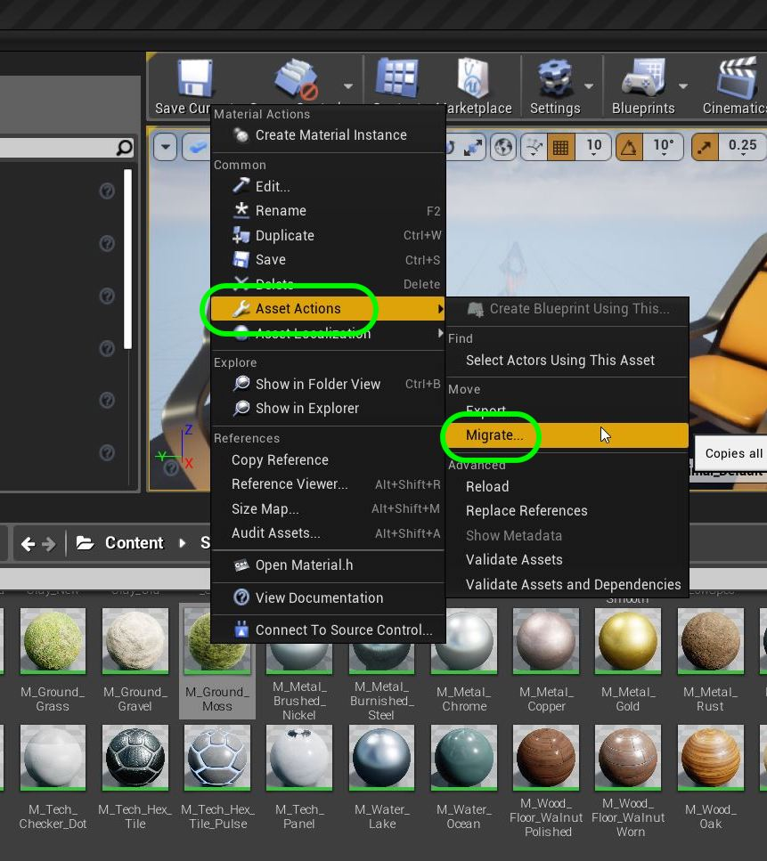

  

## Introduction to Level Design - Page 7

* Part 1 - Setting up 
1. [Getting Started](Intro-To-Level-Design-1.html#getting-started)
2. [Tuning Default Settings](Intro-To-Level-Design-1.html#tuning-default-settings)
3. [Clean Up Content Folder](Intro-To-Level-Design-1.html#clean-up-content-folder)
4. [Lock Down Physics](Intro-To-Level-Design-2.html#lock-down-physics)

* Part 2 - Creating The Grey Block
1. [Short Ramp](Intro-To-Level-Design-2.html#short-ramp)
2. [Center Platform](Intro-To-Level-Design-2.html#center-platform)
3. [Second Ramp](Intro-To-Level-Design-3.html#second-ramp)
4. [Third Ramp](Intro-To-Level-Design-3.html#third-ramp)
5. [Fourth 45 Degree Ramp](Intro-To-Level-Design-3.html#fourth-45-degree-ramp)
6. [Easy Jump Height](Intro-To-Level-Design-4.html#easy-jump-height)
7. [Intermediate &amp; Hard Jump Height](Intro-To-Level-Design-4.html#intermediate--hard-jump-height)
8. [Short Standing Jump Distance](Intro-To-Level-Design-4.html#short-standing-jump-distance)
9. [Short Running Jump Distance](Intro-To-Level-Design-5.html#short-running-jump-distance)
10. [Long Running Jump Distance](Intro-To-Level-Design-5.html#long-running-jump-distance)
11. [Moving Platform](Intro-To-Level-Design-5.html#moving-platform)
12. [Moving Platform Part II](Intro-To-Level-Design-6.html#moving-platform-part-ii)

* Part 3 - Adding Materials to Map 
1. [**Adding Master Material**](Intro-To-Level-Design-7.html#adding-master-material)

_____ 

## Adding  Materials to Map
Now we should try and just clean it up visually so we aren't using the same UE4 default material on all the surfaces to make it look a bit different.

_____ 

### Adding Master Material
Lets add a Material that we can use as a master material for all objects.  It will be a simple one just like we created for the previous assignment.

_____ 



{:start="{{ num }}"}
{{ num }}. Create a new folder called `Materials`.

  

_____ 


{:start="{{ num }}"}
{{ num }}. Right click on folder to create new material. Call this new Material `M_Temp`.

  

_____ 


{:start="{{ num }}"}
{{ num }}. Open the **Material** and add a **Vector Parameter** node by right clicking on the empty graph. Call this node `Color`.

  

_____ 


{:start="{{ num }}"}
{{ num }}. Right click on the empty graph and add a **Scalar Parameter** called `Metallic`.

  

_____ 


{:start="{{ num }}"}
{{ num }}. Add a second **Scalar Parameter** and call it `Roughness`.  Connect the **Color** pin to **Base Color**, **Metallic** to **Metallic** and **Roughness** to **Roughness**.

  

_____ 


{:start="{{ num }}"}
{{ num }}. Feel free to set a default color of your choicwe then press the **Apply** and **Save** button.

  

_____ 


{:start="{{ num }}"}
{{ num }}. In the game screen right click on the **M_Temp** in the ** Content Browswer** then select **Create Material Instance**. Call the instance `MI_Ramp`.

  

_____ 


{:start="{{ num }}"}
{{ num }}. Double click **MI_Ramp** and click in the **Parameter Groups** the **Color**, **Metallic** and **roughness** parameters.  Set the color and adjust **Metallic** to `0.4` and adjust **Roughness** to `0.5`.

  

_____ 


{:start="{{ num }}"}
{{ num }}. Drag this **MI_Ramp** across each of the surfaces on the ramp that the player's feet touches. Notice that for the BSP's it only puts the material on a single plane and not on the entire object. 

  

_____ 


{:start="{{ num }}"}
{{ num }}. Repeat this process for all jump ramps and stairs for the runnable surfaces.  

  

_____ 


{:start="{{ num }}"}
{{ num }}. Right click on **M_Temp** and select **Create Material Instance**.  Call this new material `MI_Sides`.

  

_____ 


{:start="{{ num }}"}
{{ num }}. Double click this new Material.  I selected a dark green color and made the surface matte and fairly non-reflective.  I will use this for the surfaces I can't walk on.

  

_____ 


{:start="{{ num }}"}
{{ num }}. Drag and drop the **MI_Sides** materials on all the faces that the player doesn't walk on with the jump platforms.

  

_____ 


{:start="{{ num }}"}
{{ num }}. Create another **Material Instance** for the moving platform.  I picked a red color.  Now you do not get per face materials as it is based on the UV's on the static mesh (we will get into this later on in another walk through).

  

_____ 


{:start="{{ num }}"}
{{ num }}. Createle another material instance for the center of the level ramps.  Add that material to all walkable surfaces.  Adds the same side material to the non walkable surfaces.

  

_____ 


{:start="{{ num }}"}
{{ num }}. We created 2 materials for the jump height columns.  One for the walkable, one for the rest of the inside surface then we used the side texture for the outside edges like so:

  

_____ 


{:start="{{ num }}"}
{{ num }}. Press **Save All** and quit Unreal.  In **Github** commit your changes with a comment and push it to the server. Then we will launch the **Epic Launcher** and create a new game.  Select **New Project \| Blueprint \| Blank** and make sure you have selected **With Starter Content**.  Save it on your **Desktop** and call the project **Delete Me** (we will delete it once we have exported an asset).

  

_____ 


{:start="{{ num }}"}
{{ num }}. In this new project go to the **Starter Content \| Materials** folder.  Look for the material called **M_Ground_Moss**:

  

_____ 


{:start="{{ num }}"}
{{ num }}. Right click on the **M_Ground_Moss** material and select **Asset Action \| Migrate**. 

  

_____ 


{:start="{{ num }}"}
{{ num }}.  This migration will migrate this material and ALL other required resources that this material uses. This includes some textures that the material uses.  Press the **OK** button with all these assets.

  

_____ 


{:start="{{ num }}"}
{{ num }}. We then select the **Content** directory in the project we are working on that should be **UE4-LSU-Third-Person**.  You always put it in the root content directory of the project you want to migrate to.

  

_____ 


{:start="{{ num }}"}
{{ num }}. When you migrate it keeps the folder structure.  We do not need a **StarterContent** folder.  So, move **T_Ground_Moss** to the **Materials** folder in root.  Also move the **Textures** folder to be at root as well so it is **Content \| Textures** and move it out of the **Starter Content** folder.  Now delete the **Starter Content** folder.

  

_____ 


{:start="{{ num }}"}
{{ num }}. Drag the moss material on the ground to give it a mossy texture.

  

_____ 


{:start="{{ num }}"}
{{ num }}. Now run the game and you should have no more temporary surfaces left in the game.

  

_____ 


{:start="{{ num }}"}
{{ num }}. That's it for our test level. Now go and build a cool gray block of your own!

_____ 

[<- Previous](Intro-To-Level-Design-6.html)&nbsp;&nbsp;&nbsp;[Home](../index.html)
   
   
   

