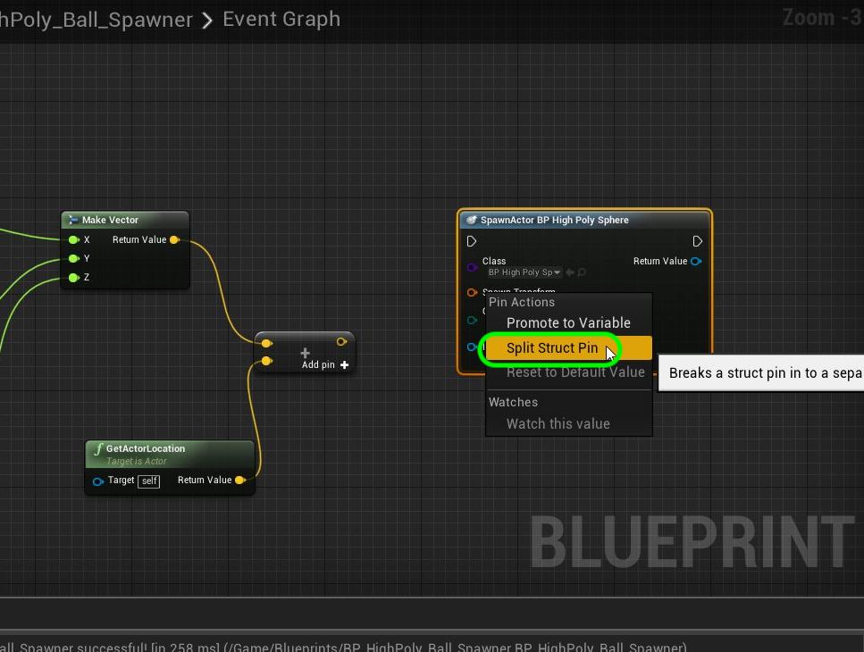

  
## Intro To Models - Page 2

Lets now look at the pipeline of getting models from software to Unreal Engine.

_____ 

## Index
_____ 

1.  [Anatomy of a Model](Intro-To-Models-1.html#anatomy-to-models)
2. [**What Makes a Good Real Time Model?**](Intro-To-Models-2.html#what-makes-a-good-real-time-model)
3. [What Makes a Good Real Time Model Part II?](Intro-To-Models-3.html#what-makes-a-good-real-time-model-part-ii)
4. [Scale](Intro-To-Models-4.html#scale)
5. [Levels, Props & Skeletons](Intro-To-Models-4.html#levels-props--skeletons)
6. [Materials](Intro-To-Models-4.html#materials)
7. [UV Mapping](Intro-To-Models-5.html#uv-mapping)
8. [Bad UVs](Intro-To-Models-6.html#bad-uvs)
9. [LOD](Intro-To-Models-6.html#lod)
10. [Pivot Point](Intro-To-Models-7.html#pivot-point)
11. [Collisions](Intro-To-Models-7.html#collisions)

_____ 

### What Makes a Good Real Time Model?
So now we know the names of some of the components of a model that we will take to Unreal 4.  Lets look at what makes up a good model for Unreal (or any real time engine for that matter).

_____ 



{:start="{{ num }}"}
{{ num }}. A good model for a game needs to reasonable in terms of the number of vertices, edges and faces.  The more we have with the more textures and materials the slower the game will run.  Lets demonstrate this.  First create a new blueprint and add it to the **Blueprints** folder.  Make it of class **Actor**.  Call it `BP_HighPolySphere`

  

_____ 



{:start="{{ num }}"}
{{ num }}. Now we want to spawn a whole bunch of the very high poly sphere in the scene.  To make it work harder lets make each sphere a different color.  To do this we need to dynamically adjust the color in the blueprint.  To do this we need to change the color into a dynamic parameter.  Lets right click on **Materials \| M_Rough** and select **Duplicate**.  Call this new Material `M_Rough_Dynamic`.

  

_____ 



{:start="{{ num }}"}
{{ num }}. Double click on **M_Rough_Dynamic** and right click on the color vector and select **Convert to Parameter**:

  

_____ 



{:start="{{ num }}"}
{{ num }}. Name this material **Parameter Name** `ColorParam`.

  

_____ 



{:start="{{ num }}"}
{{ num }}. Now go back to **BP_HighPolySphere** and press the **Add Component** button and select a **Static Mesh**.  Assign the **SM_Very_High_Poly_Sphere** to the **Static Mesh** and the newly created **M_Rough_Dynamic** material to the mesh. Static Meshes default to having physics turned off which is fine for ground planes and walls.  But for this ball we want to turn **Physics \| Simulate Physics** to on.

  

_____ 



{:start="{{ num }}"}
{{ num }}. Now we want the collisions to be more elastic (bouncy) so scroll down in the **Details** tab and find **Phy Mat Override** and select **PM_Ball**.

  

_____ 



{:start="{{ num }}"}
{{ num }}. Now we want the color to be set in the editor se we will use the **Construction Script** tab.  Right click on the empty graph and add a **Create Dynamic Material Instance** from the **Static Mesh** and connect the execution pins.

  

_____ 



{:start="{{ num }}"}
{{ num }}. Now click on **Source Material** and select the **M_Rough_Dynamic** material.

  

_____ 



{:start="{{ num }}"}
{{ num }}. Now pull off the **Return Value** pin and add a **Set Vector Parameter Value**.  Please note that the color parameter in the material was called Vector Parameter.

  

_____ 



{:start="{{ num }}"}
{{ num }}. Now we want to adjust each color channel separately so we can randomly pick a color.  Right click on the **Set Vector Parameter Value**  node on its input **Value** pin and select **Split Structure Pin** option:

  

_____ 



{:start="{{ num }}"}
{{ num }}. Lets set the **Red Channel** to `1.0`.  Now each color channel is normalized between `0` and `1`.  So 0 would be no color of that channel and 1 would be 100% of that channel.  This should generate a red sphere.

  

_____ 



{:start="{{ num }}"}
{{ num }}. Now we could have multiple **Vector Parameter** values, so we have to click on **Parameter Name** and enter `ColorParam`.  It HAS to be the exact same way you spelled the name in the material you just created. Press the **Compile**

  

_____ 



{:start="{{ num }}"}
{{ num }}. Double click on **Maps \| BallPit** level.  Now drag an instance of **BP_HighPolySphere** blueprint into the level.  It should be red, proving that we can alter the color of the material dynamically in the blueprint.

  

_____ 



{:start="{{ num }}"}
{{ num }}. Now we want to have a random color for each sphere.  This means we need three random floats between **0** and **1**.  Right click on the **Construction Script** of the bluepring and add a **Random Float** node.

  

_____ 



{:start="{{ num }}"}
{{ num }}. Hover over the **Random Float** node and double check that the range of the returned value is a float between 0 and 1.

  

_____ 



{:start="{{ num }}"}
{{ num }}. Add two more **Random Float** nodes for the three color channels.

  

_____ 



{:start="{{ num }}"}
{{ num }}. Attach the output of the three **Random Float** nodes and attach them to the **Value R**, **Value G** and **Value B** pins:

  

_____ 



{:start="{{ num }}"}
{{ num }}. Now go to the game and drag a few copies of **BP_HighPolySphere** into the level.  They should all be different colors like so:

  

_____ 



{:start="{{ num }}"}
{{ num }}. Now we want to have a blueprint that spawns many copies of this blueprint so we can check the framerate.  Create  a new **Actor Blueprint** and place it in the **Blueprints** folder.  Call it `BP_HighPoly_Ball_Spawner`.

  

_____ 



{:start="{{ num }}"}
{{ num }}. Press the **Add Component** button and select a **Box Collision** component. We will use this to calcluate where to create the spheres from.  This shape will be the spawn volume that we use.

  

_____ 



{:start="{{ num }}"}
{{ num }}. Change the component name to `SpawnVolume` then in the **Details** panel change the **Shape \| Box Extent** values to `2500` in **X** and **Y** and `400` in **Z**.

  

_____ 



{:start="{{ num }}"}
{{ num }}. Add **BP_HighPoly_Ball_Spawner** to the level.  Place it in the center and well above the floor so the balls can fall. You should see the volume with a yellow line that indicates where the spheres will be spawned from.

  

_____ 



{:start="{{ num }}"}
{{ num }}. Go back to **BP_HighPoly_Ball_Spawn** and drag a reference of the **SpawnVolume** component to the **Event Graph**.

  

_____ 



{:start="{{ num }}"}
{{ num }}. Pull off the **Spawn Volume** pin and select a **Shape \|Get Box Extent** node. Right click on the output **Box Extent** pin and select **Split Struct Pin**.

  

_____ 



{:start="{{ num }}"}
{{ num }}. So what is an extent?  It is like a radius of a sphere.  It is from the pivot point of the spawn volume which is in the center of the box volume.  There is then an orthoganal line drawn along the **X Y Z** axis until it hits the edge of the box.

  

_____ 



{:start="{{ num }}"}
{{ num }}. Now that we split the stucture, we got three floats representing the length of the three box extents.

  

_____ 



{:start="{{ num }}"}
{{ num }}. Grab the output pin **Box Extent X** then add a **Random Float in Range** node.  Reconnect it to the **Max** pin.  

  

_____ 



{:start="{{ num }}"}
{{ num }}. Now that is the maximum number along the X axis.  What about the starting value.  Since the pivot point is in the center we can multiply this value by **-1** to find the left had side along the X axis as shown below:

  

_____ 



{:start="{{ num }}"}
{{ num }}. Now add a **Float * Float** pin and multiply the output of **Box Extent X** by `-1.0` and connect it to the **Min** pin on the **Random Float in Range** node.

  

_____ 



{:start="{{ num }}"}
{{ num }}. Repeat this for the **Y** and **Z** extent.

  

_____ 



{:start="{{ num }}"}
{{ num }}. Now that we have the **XYX** random location for our spawn lets recombine it into a **Vector** struct.  Add a **Make Vector** node and connect the **XYZ** pins:

  

_____ 



{:start="{{ num }}"}
{{ num }}. Now we have a problem.  This extent is in local space relative to the **BP_HighPoly_Ball_Spawn** actor.  This means it see's its position as `0.0, 0.0, 0.0`.  But in the room in my game the actor static mesh is at: `185.0, -922.0, 1431.0`.  This is the **World Space** that the actor is in.

  

_____ 



{:start="{{ num }}"}
{{ num }}. To go from local space to world space we just need to add the two together.  This is the result of adding two vector's together.

  

_____ 



{:start="{{ num }}"}
{{ num }}. To get the world position of the actor we need to a **Get Actor Location** node.  In my case this will be `185.0, -922.0, 1431.0`.

  

_____ 



{:start="{{ num }}"}
{{ num }}. Add a **Vector + Vector** node and connect the output of the **Make Vector** and **Get Actor Location** node.  This shifts the location from Local to World space.

  

_____ 



{:start="{{ num }}"}
{{ num }}. Now right click on the graph and add a **Spawn Actor From Class** node.  

  

_____ 



{:start="{{ num }}"}
{{ num }}. Now right click on the **Spawn Transform** pins and select **Split Struct Pin**.  We will not be touching the rotation of scale just the location which is why we need to separate the struct.

  

_____ 



{:start="{{ num }}"}
{{ num }}. Now it doesn't know what to spawn.  Select the **Class** drop down and select the **BP_HighPolySphere** blueprint.  Now connect the output of the **Vector + Vector** pin and attach it to **Spawn Transform Location**.

  

_____ 



{:start="{{ num }}"}
{{ num }}. Lets spawn one ball.  Connect the **Event BeginPlay** node execution pin to the **Spawn Actor BP High Poly Sphere** node:

  

_____ 



{:start="{{ num }}"}
{{ num }}. Now go to the game and hit run.  Look around and you should see one sphere spawn in the world. On the next page we will do this a thousand times and drop more balls.  But first we will be adding comments to our blueprints.

  

_____ 

  

[<- Previous](Intro-To-Models-1.html)&nbsp;&nbsp;&nbsp;[Home](../index.html)&nbsp;&nbsp;&nbsp; [Continue ->](Intro-To-Models-3.html)
   
   
   

