  
## Intro To Models - Page 3

Lets now look at the pipeline of getting models from software to Unreal Engine.

_____ 

## Index
_____ 

1.  [Anatomy of a Model](Intro-To-Models-1.html#anatomy-to-models)
2. [What Makes a Good Real Time Model?](Intro-To-Models-2.html#what-makes-a-good-real-time-model)
3. [**What Makes a Good Real Time Model Part II?**](Intro-To-Models-3.html#what-makes-a-good-real-time-model-part-ii)
4. [Scale](Intro-To-Models-4.html#scale)
5. [Levels, Props & Skeletons](Intro-To-Models-4.html#levels-props--skeletons)
6. [Materials](Intro-To-Models-4.html#materials)
7. [UV Mapping](Intro-To-Models-5.html#uv-mapping)
8. [Bad UVs](Intro-To-Models-6.html#bad-uvs)
9. [LOD](Intro-To-Models-6.html#lod)
10. [Pivot Point](Intro-To-Models-7.html#pivot-point)
11. [Collisions](Intro-To-Models-7.html#collisions)

_____ 

### What Makes a Good Real Time Model Part II?

_____ 



{:start="{{ num }}"}
{{ num }}. Surround all the nodes except for **BeginPlay** and press the **C** key to add a comment.  Add a description of what we are doing with something like `Spawn Sphere Inside a Random Location in Spawn Volume`.

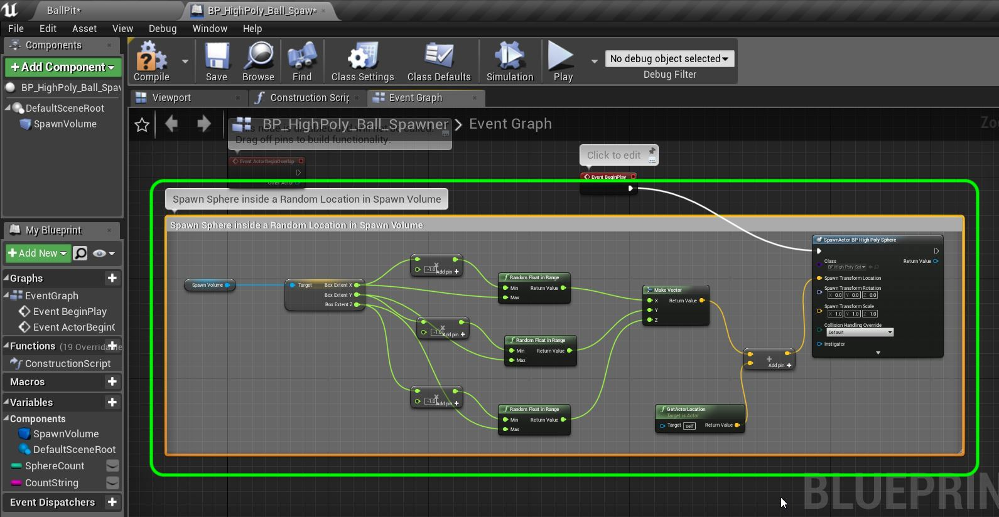  

_____ 



{:start="{{ num }}"}
{{ num }}. You can also add a comment on top of each node.  Lets right click on the **Get Extent** node and add a **Node Comment** `Local Space`.

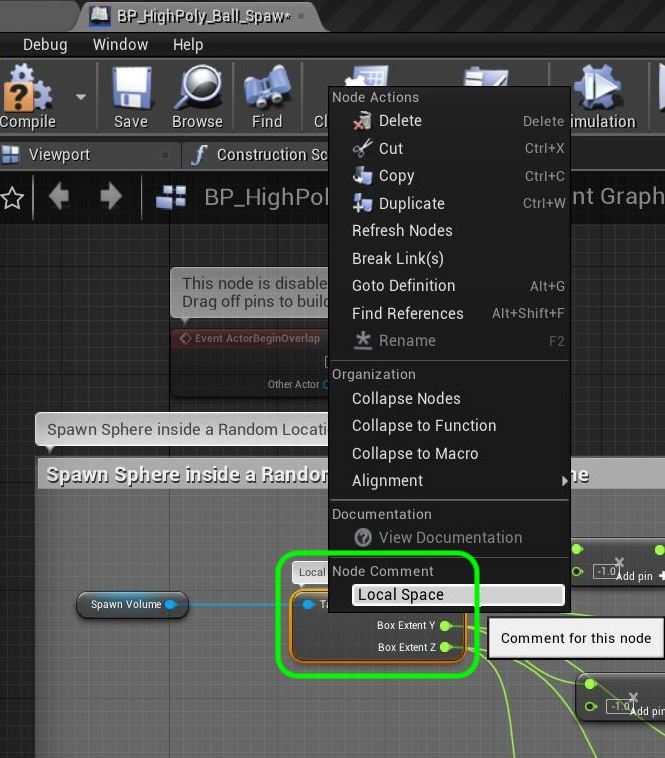  

_____ 



{:start="{{ num }}"}
{{ num }}. This will end up looking like so:

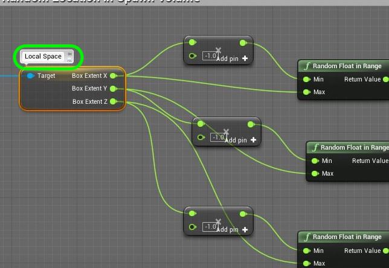  

_____ 



{:start="{{ num }}"}
{{ num }}. Now add a comment on the **Float + Float** pin and add `Convert to World Space` as a node comment.

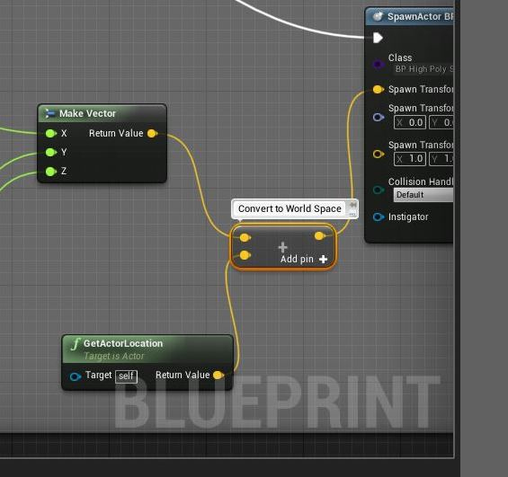  

_____ 



{:start="{{ num }}"}
{{ num }}. Now we want to add 1000 balls to the room.  Lets add a **For Loop** node by right clicking on the graph and selecting one.

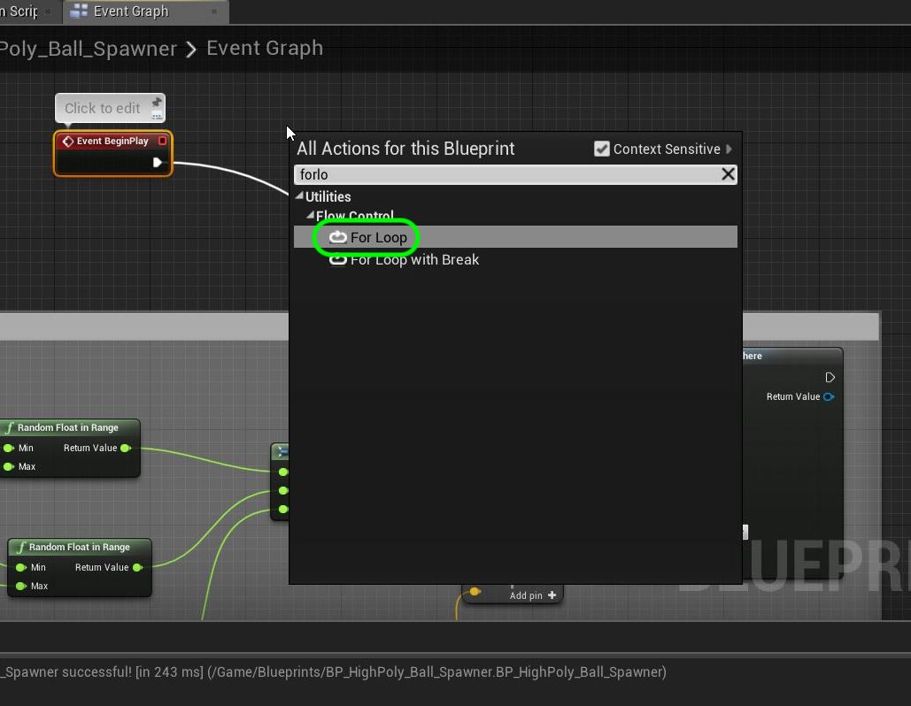  

_____ 



{:start="{{ num }}"}
{{ num }}. Now the **For Loop** will repeat itself a number of times.  This is based on what your first number and last number is.  It is typical to start counting at 0.  Set the **First Index** to `0`. This means that we will be ending by setting the **Last Index** at `1000`.  This means we will create **1001** spheres.  Disconnect the execution pin on **Begin Play** thne attach it to the input of the **For Loop** node.  Now take the output of the **Loop Body** execution pin and connect it to the **Spawn Actor** node.  This will run 1001 times when you press play.

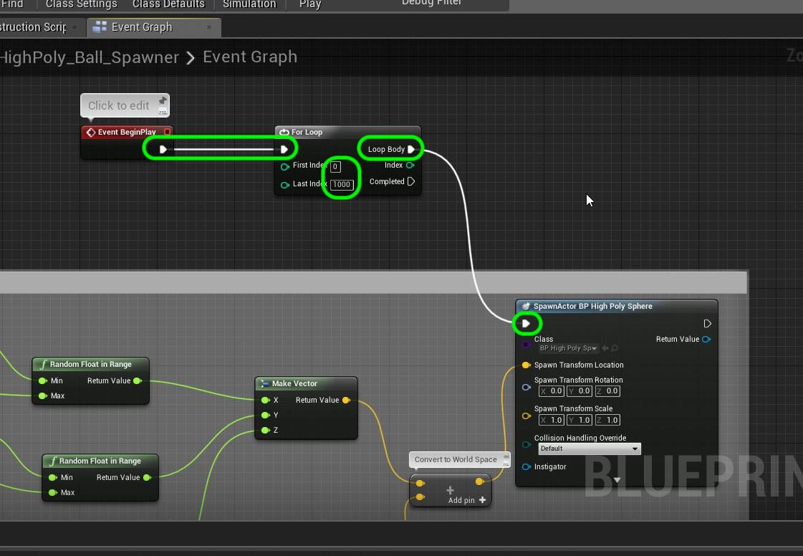  

_____ 



{:start="{{ num }}"}
{{ num }}. Add a comment to the for loop.  In my case I mistakenly put 1000 versus 1001 times.

  

_____ 



{:start="{{ num }}"}
{{ num }}. Now run the game and and look around.  You will notice that the framerate struggles.  Maybe it might even crash if your computer can't handle it.  If it does try reducing the number of loops to `500` or even `100`. But how slow is the game running?

  

_____ 



{:start="{{ num }}"}
{{ num }}. Now click on the **Arrow** on the top left of the game window and select the **Show FPS** check box.

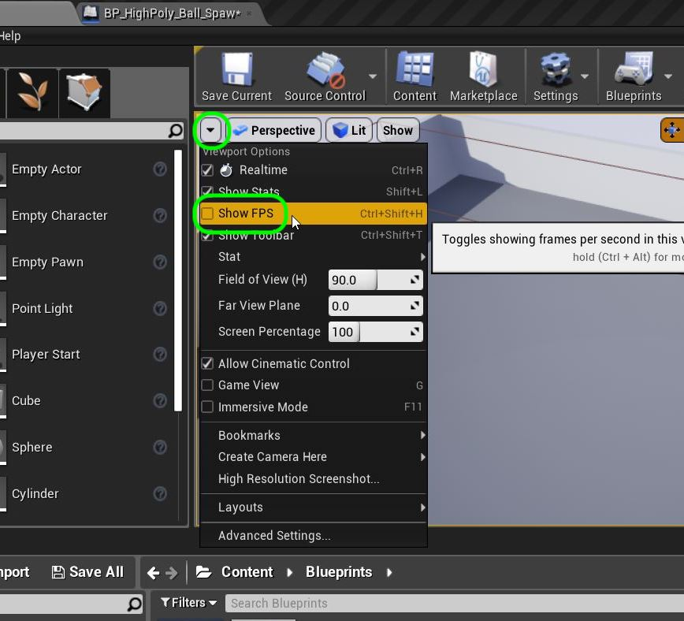  

_____ 



{:start="{{ num }}"}
{{ num }}. Run the game again and look at the framerate.  In my case it is around 9 to 20 fps. Please note that this would be a lot slower if the materials and models were all different.  There are advantages to instancing the same object and material multiple times. 

  

_____ 



{:start="{{ num }}"}
{{ num }}. Lets look at what happens when we do the same thing but with the low poly model and the normal map.  Right click on **M_Rough_Dynamic** and press **Duplicate**.  Call the new material `M_Rough_Norm_Dynamic`.

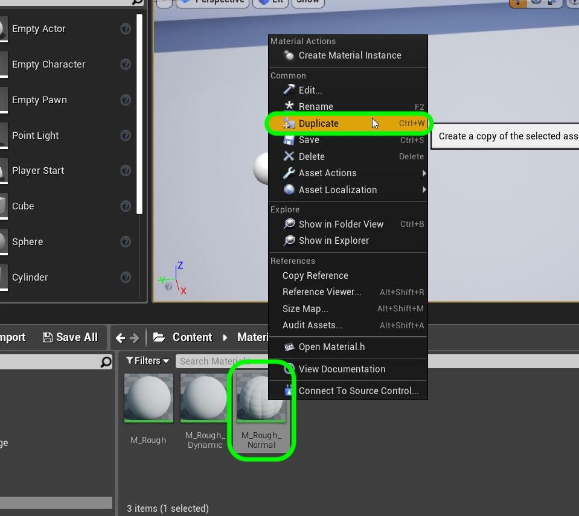  

_____ 



{:start="{{ num }}"}
{{ num }}. Open **M_Rough_Norm_Dynamic** and right click on the color Vector and select **Convert to Parameter**.

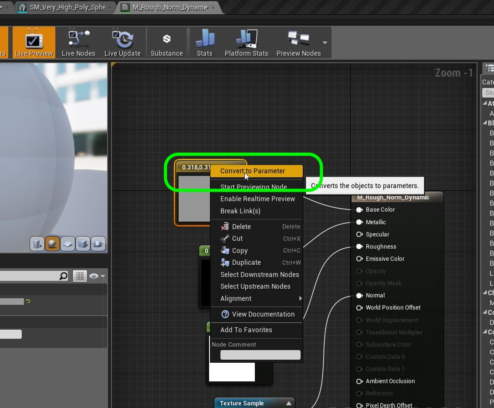  

_____ 



{:start="{{ num }}"}
{{ num }}. Name this new parameter `ColorParam`.  Make sure it is the same you used previously so the blueprint will continue to work.

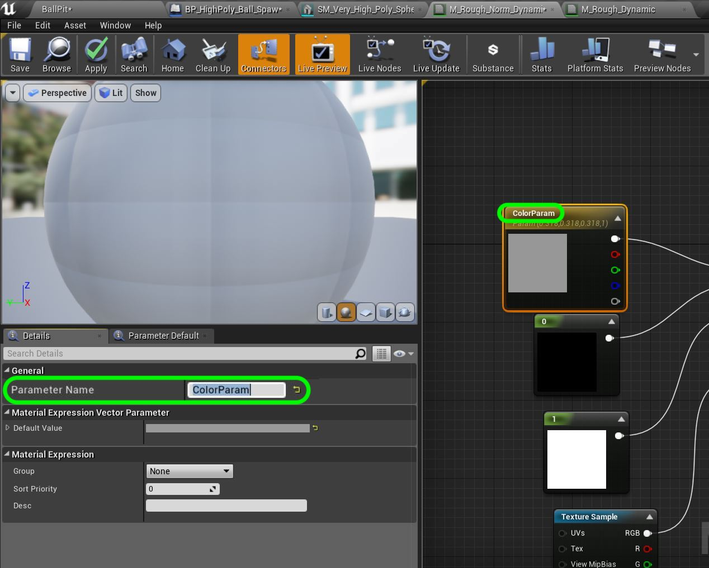 

_____ 



{:start="{{ num }}"}
{{ num }}. We will reuse the blueprint for the high poly sphere.  Right click on **BP_HighPolySphere** and select **Duplicate**.

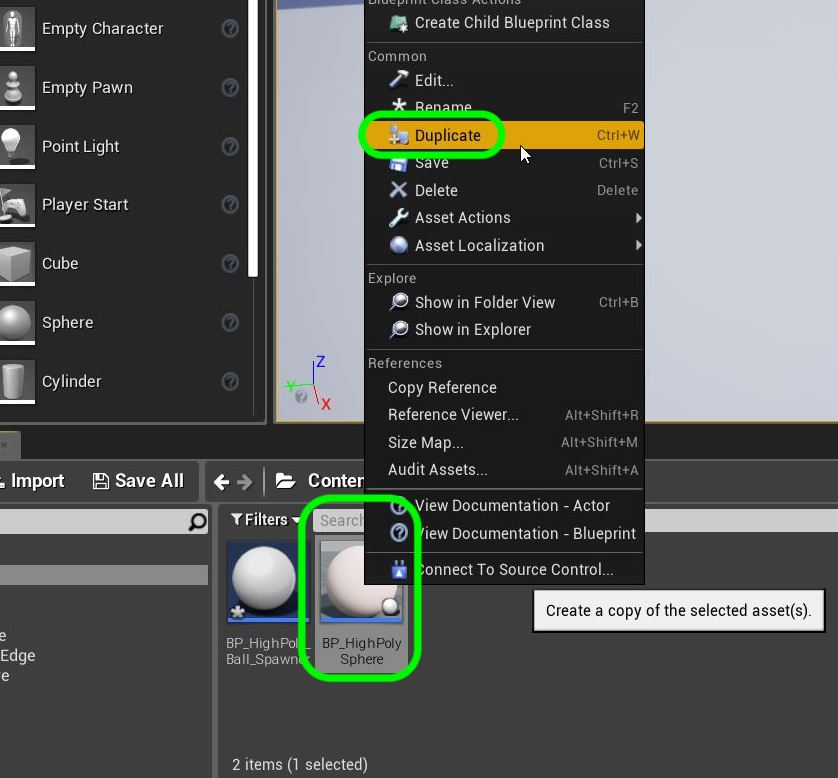  

_____ 



{:start="{{ num }}"}
{{ num }}. Call it `BP_LowPolyNorm_Sphere`.

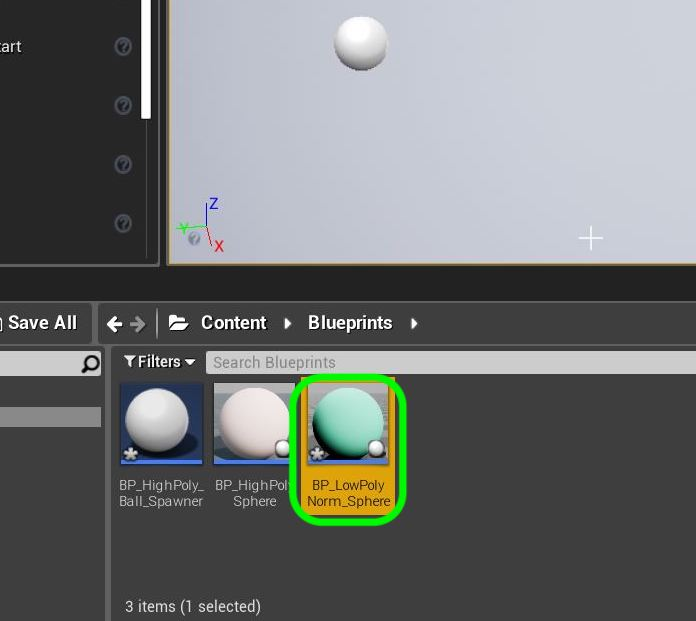  

_____ 



{:start="{{ num }}"}
{{ num }}. Double click the blueprint and set the **Static Mesh** to **SM_Low_Poly** and **Material** to **M_Rough_Norm_Dynamic**.

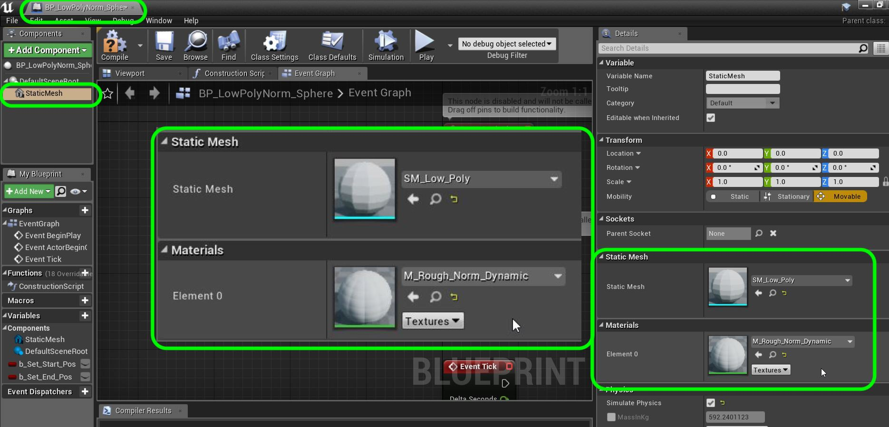  

_____ 



{:start="{{ num }}"}
{{ num }}. Go to the **Construction Script** tab and change the node **Create Dynamic Material Instance** on the **Source Material** and select **M_Rough_Norm_Dynamic**. Press the **Compile** button.

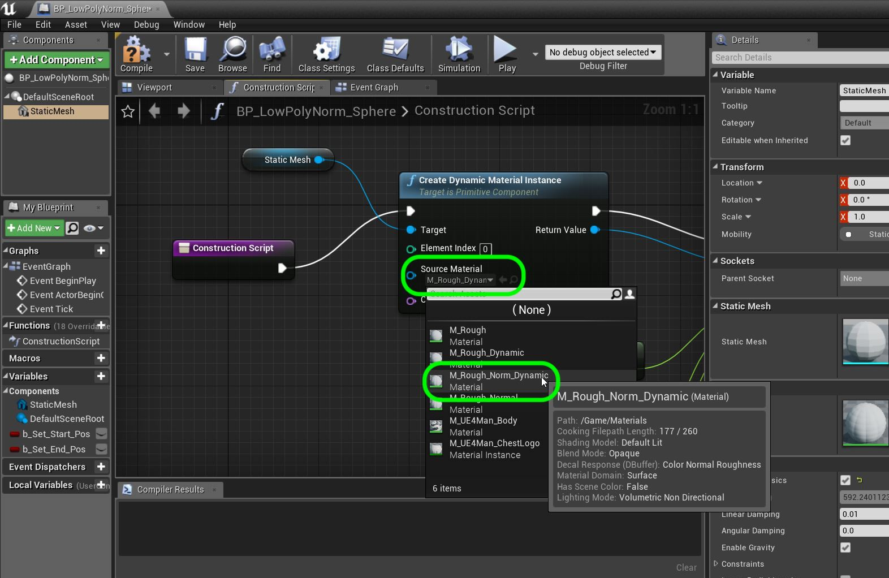  

_____ 



{:start="{{ num }}"}
{{ num }}. Now open **BP_HighPoly_Ball_Spawn** and chnage the **Spawn Actor** node to spawn **BP_LowPolyNorm_Sphere**.

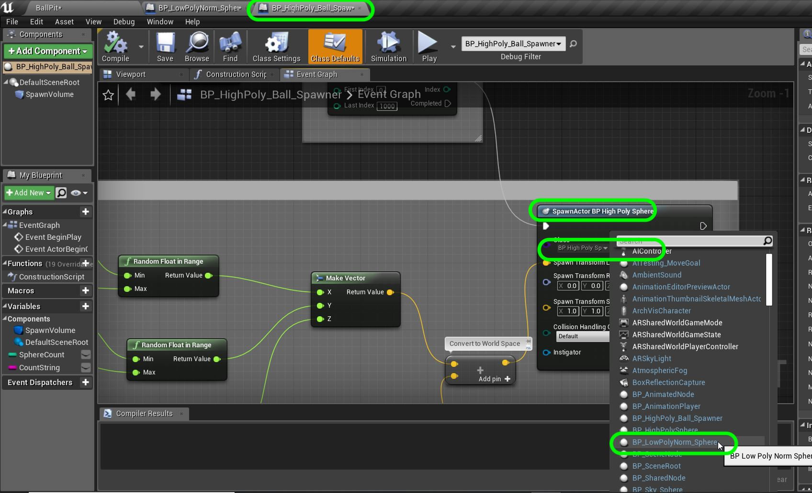  

_____ 



{:start="{{ num }}"}
{{ num }}. Now you can run the game an dyou should notice that with the same number of instances your framerate is much better with the actor with less vertices.

 

_____ 



{:start="{{ num }}"}
{{ num }}. Now we can see that the number of vertices matter.  So the first two things we look for in a great model for real time rendering is a lot of detail in the texture and normal maps but WITH a lower vertex count.  Lets say we are looking for boxing gloves, to be a key part of a scene.  This is a nice looking render from a model.

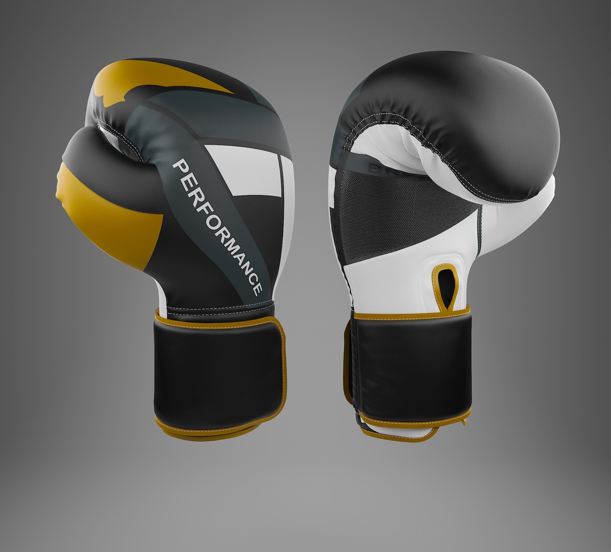  

_____ 



{:start="{{ num }}"}
{{ num }}. But if we look at the mesh we notice that it has a lot of polygons determining a rather simple shape.  It uses 207, 490 vertices.  This is a poor selection for a real time engine. 

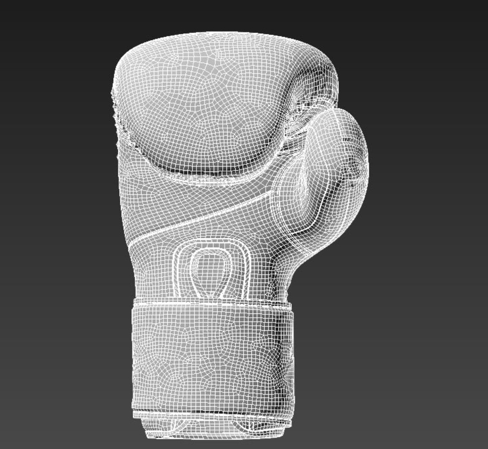  

_____ 



{:start="{{ num }}"}
{{ num }}. Now lets look at this render.  This looks even more detailed.

  

_____ 



{:start="{{ num }}"}
{{ num }}. Even though it looks better it is only using 10,084 Vertices.  The use of good texture and normal maps more than make up for any detail lost in the geometry.

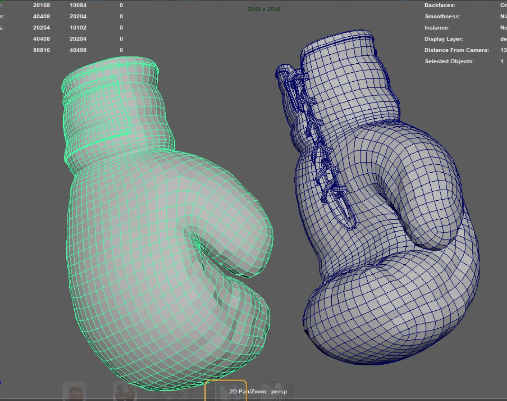  

_____ 



{:start="{{ num }}"}
{{ num }}. The third thing we are looking for is good poly flow.  If we look at the thumb of these two models we can tell that the one of the left will have some lighting issues as the polygons are not following the contours of the shape.  The other thing that will happen is that when we animate both meshes the one on the left will distort more.

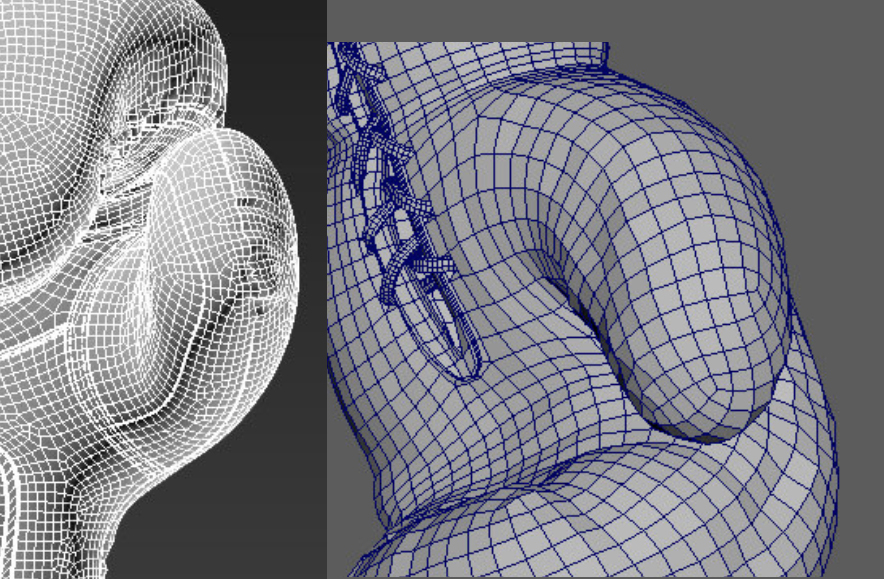  

_____ 



{:start="{{ num }}"}
{{ num }}. The fourth thing we are looking for is breaking down components to their smallest reusable size.  As you saw, even with a sphere that is ridiculously dense with geometry can render on my computer fast enough because it is re-used.  The more we can break components down into components and reuse instances of them the better.  So a group of models on the left cna produce detailed levels on the right:

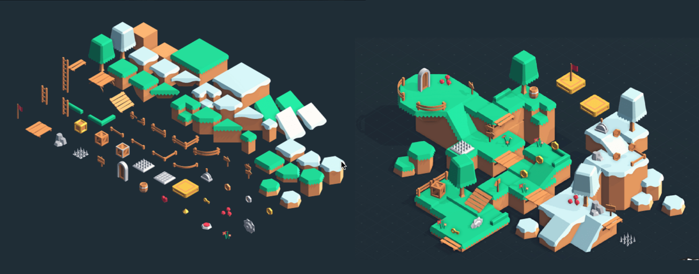  

_____ 



{:start="{{ num }}"}
{{ num }}. The fifth and last thing we want to look for is to limit the total size of a single model.  Since the entire model needs to be processed by the game engine if 99% of it is off screen, it is dead processing time.  We want to split models up like walls into smaller chunks so they are not spanning multiple camera views. Up next we need to look at scale.

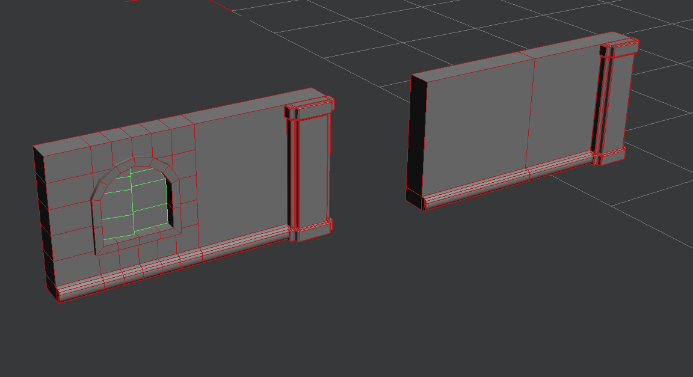  

_____ 

  

[<- Previous](Intro-To-Models-2.html)&nbsp;&nbsp;&nbsp;[Home](../index.html)&nbsp;&nbsp;&nbsp; [Continue ->](Intro-To-Models-4.html)
   
   
   

