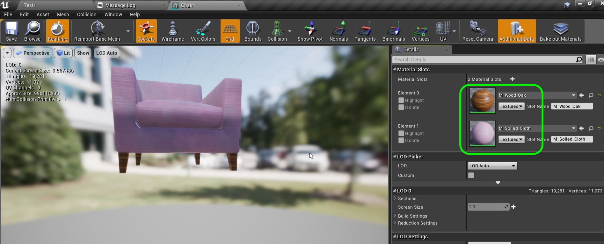

  
## Intro To Models - Page 4

_____ 

## Index
_____ 

1.  [Anatomy of a Model](Intro-To-Models-1.html#anatomy-to-models)
2. [What Makes a Good Real Time Model?](Intro-To-Models-2.html#what-makes-a-good-real-time-model)
3. [What Makes a Good Real Time Model Part II?](Intro-To-Models-3.html#what-makes-a-good-real-time-model-part-ii)
4. [**Scale**](Intro-To-Models-4.html#scale)
5. [**Levels, Props & Skeletons**](Intro-To-Models-4.html#levels-props--skeletons)
6. [**Materials**](Intro-To-Models-4.html#materials)
7. [UV Mapping](Intro-To-Models-5.html#uv-mapping)
8. [Bad UVs](Intro-To-Models-6.html#bad-uvs)
9. [LOD](Intro-To-Models-6.html#lod)
10. [Pivot Point](Intro-To-Models-7.html#pivot-point)
11. [Collisions](Intro-To-Models-7.html#collisions)

_____ 

### Scale
Now lets look at how we work on models or import models from other packages.  It is best to load it up first in modeling software and adjust scale to match Unreal's.

_____ 



{:start="{{ num }}"}
{{ num }}. First we want to make sure the scale in the modelling software's unit is set to 1 unit is 1 centimeter (cm).  In Maya this can be set in **Windows \| Settings/Preferences \| Preferences**. Make sure your modeling software can export to FBX.

  

_____ 



{:start="{{ num }}"}
{{ num }}. Select the **Settings** tab and make sure the **Working Units** is set to **centimeter**.  You can keep the units as **Y** up as this can be flipped on the export or import into UE4.  It may be best to stay in the native coordinate system to the software being used.

  

_____ 



{:start="{{ num }}"}
{{ num }}. Lets make the ground plane grid the same as UE4.  Each grid piece is `10` units.  So in Maya go to **Display** and **Grid** and press the settings square.

  

_____ 


{:start="{{ num }}"}
{{ num }}. In **Grid Options** adjust **Grid lines every:** to `10.0` units.

  

_____ 


{:start="{{ num }}"}
{{ num }}. In your modelling scene use a reference object to eyball scale.  Using a to scale human model in the scene you don't export can help.

  

_____ 


{:start="{{ num }}"}
{{ num }}. You download from moodle the exact Mannequin model from Unreal.  This way you can bring it into your scene to check scale.

  

_____ 


{:start="{{ num }}"}
{{ num }}. Now you can use this reference game model in UE4 and your modeling software.  I have already included it in UE4, check it with the mannequin in the **Mannequin \| Character \| Mesh \| SK_Mannequin**.  It should match the scene in your modeling software.   Now if you game is about insects or giant monsters you might want to use a different object to use to base your scale on.

  

_____ 

### Levels, Props & Skeletons
There are three types of models we will be looking at two of them in this lesson.  We will look at defomable meshes when we look at animation.

_____ 


{:start="{{ num }}"}
{{ num }}. We will have three types of models.  We often use environments for our levels including walls, outdoor natural elements and surfaces to move through.  

  

_____ 


{:start="{{ num }}"}
{{ num }}. We then have prop models that are static meshes (they mesh doesn't deform).  This is what populates the level and the user interacts with these objects.

  

_____ 



{:start="{{ num }}"}
{{ num }}. Then finally we have meshes that deform.  One common way to deform a mesh is with a skeleton.  This means that the game moves the skeleton and the mesh moves and deforms based on this position. We will not be looking at these kind of meshes yet.  We will when we get to animations.

  

_____ 



{:start="{{ num }}"}
{{ num }}. Now just because meshes can't deform doesn't mean they can't animate.  If you drag **Geometry \| Static Mesh \| Spotlight** bracket and light in the scene you have two objects.  You can place the spotlight into the brackets so the bolts line up.  Then you can rotate the light witin the bracket (this could also be animated in game).  This makes sense because you can imagine that the light is able to rotate orthogonally to the bracket. But if you rotate the bracket the light doesn't move with it.  We can do better.

  

_____ 



{:start="{{ num }}"}
{{ num }}. If you drag the **SM_Spotlight_Lamp** in the **World Outliner** to be parented to **SM_Spotlight_Bracket** then you can move the spotlight seperately but when you move the bracket the light moves with it.  This is because of the parent child relationship.

  

_____ 

### Materials
This defines the pixels, detail in the model and the way it reflects light.  We can combine all the materials on a model in one material/texture sheet or can separate elements.

_____ 


{:start="{{ num }}"}
{{ num }}. Now double click on **Geometry \| Static Mesh \| Spotlight \| SM_Spotlight_Bracket**.  Now assign the material **M_Brushed_Steel**.  Now this bracket has one solid surface that is supposed to be the same material.  In this case a steel.

  

_____ 


{:start="{{ num }}"}
{{ num }}. Now double click on **Geometry \| Static Mesh \| Spotlight \| SM_Spotlight_Lamp**.  Now assign the material **M_Spotlight_Lamp_Master**.  Now this single material has different textures, sets of reflectivity and zones where it is illuminating.  How is it doing that?

  

_____ 


{:start="{{ num }}"}
{{ num }}. All right lets look at the material to see how it is done.  Double click on **M_Spotlight_Lamp_Master**.  Now the preview model isn't showing us what is going on.  Lets fix that.

  

_____ 


{:start="{{ num }}"}
{{ num }}. Go back to the **Content Browser** and select the **Geometry \| Static Mesh \| Spotlight \| SM_Spotlight_Lamp**.

  

_____ 


{:start="{{ num }}"}
{{ num }}. Now press the load model button in the preview window to load the spotlight.

  

_____ 


{:start="{{ num }}"}
{{ num }}. Now double click on **Textures \| T_Spotlight_D**. The D stands for diffuse.  This is what would go into the color channel and is the pixel color on the model.  You can see the yellow stripe and some of the dark and light metal texture.

  

_____ 



{:start="{{ num }}"}
{{ num }}. Go back to the material and alt click on all pins except for base color.  This means only the diffuse texture map will affect the lamp. Now the material is consistent across the entire object and the colors are determined by the texture map being sent into the **Base Color** channel.

  

_____ 


{:start="{{ num }}"}
{{ num }}. Double click on **Textures \| T_Spotlight_I**. I stands for illumination.  If you look at the material this goes into the illumination channel. What is white will illuminate.  What is black will not.  They have given the lightbulp in the circle a bit of a mask so that you can make out a bit of the lightbulb.

  

_____ 


{:start="{{ num }}"}
{{ num }}. Now go back to the material and connect the **Multiply** node to the **Emissive Color** node on the material.  Notice that the lamp lights up only on the inside and the lightbulb can be seen as it is not all emitting and there is a bit of an outline of a possible lightbulb.

  

_____ 


{:start="{{ num }}"}
{{ num }}. Double click on **Textures \| T_Spotlight_M**. **M** stands for metallic.  This determines how much the material reflects like a mirror.  This gives it a metallic effect.  Notice the texture is white where the light was white this means it is fully metallic.  Where is fully black will have no reflectivity.  You can check back with the diffuse map and see what it corresponds to.

  

_____ 


{:start="{{ num }}"}
{{ num }}. Now lets connect the **Metallic** texture up in the material.  Now the change is subtle as metallic works in concert with roughness.  For a material to be very reflective it needs a high metallic and low roughness.  

  

_____ 


{:start="{{ num }}"}
{{ num }}. Double click on **Textures \| T_Spotlight_Rough**.  This will be for the roughness channel.  If it is dark the surface will not absorb as much light, if it is white it will be quite matte and absorb a lot of the light coming in.  So the darkest part is on the lightbulb so the metallic should be prominent.

  

_____ 


{:start="{{ num }}"}
{{ num }}. Connect the roughness texture to the correct pin.  Now you will notice that the rim and inside are shiny metal and the combination of metallic and roughness work well together.

  

_____ 


{:start="{{ num }}"}
{{ num }}. Double click on **Textures \| T_Spotlight_N**. **N** stands for normal.  You can see that it will add some detail to the lines, the lighbulb and add some detail that is not in the geometry.  Remember this is not adding geometry but adjusting how the normals are interpretted along the face on a per pixel basis. 

  

_____ 


{:start="{{ num }}"}
{{ num }}. In the material connect the normal map pins.  Notice that the details you saw in the map are added to the material and it looks like the mesh has more detail than it did before.  Normal maps are a powerful way of adding a lot of detail with low cost.

  

_____ 


{:start="{{ num }}"}
{{ num }}. Finally connect the [ambient occlusion](https://en.wikipedia.org/wiki/Ambient_occlusion) map.  The ambient occlusion (AO) calculates how that part of the model reacts to ambient light.  So if the part of the model is shaded or partially hidden than it wouldn't respond as much as an outside edge. Now we are back to the original material. 

  

_____ 


{:start="{{ num }}"}
{{ num }}. The other possibility with materials is for an object to not bake all the materials in one map, but to have multiple materials.  This could be that the game would like to alter one part of the model dynamically or share that material across multiple objects.  Go to **Geometry \| StaticMesh \| Chair \| Chair** and double click the file.  Notice that it has two slots for the material.  The first slot is for the legs and the second for the cloth. Drag it into the game scene to look at it.

  

_____ 


{:start="{{ num }}"}
{{ num }}. Open up the **Chair** static mesh and assign **M_Wood_Oak** to **Material** slot 0 and **M_Soiled_Cloth** to slot 1.

  

_____ 


{:start="{{ num }}"}
{{ num }}. Go to the game and see that both materials show up where they should in the editor! Next up we will look at UV mapping.

  

_____ 
  

[<- Previous](Intro-To-Models-3.html)&nbsp;&nbsp;&nbsp;[Home](../index.html)&nbsp;&nbsp;&nbsp; [Continue ->](Intro-To-Models-5.html)
   
   
   

