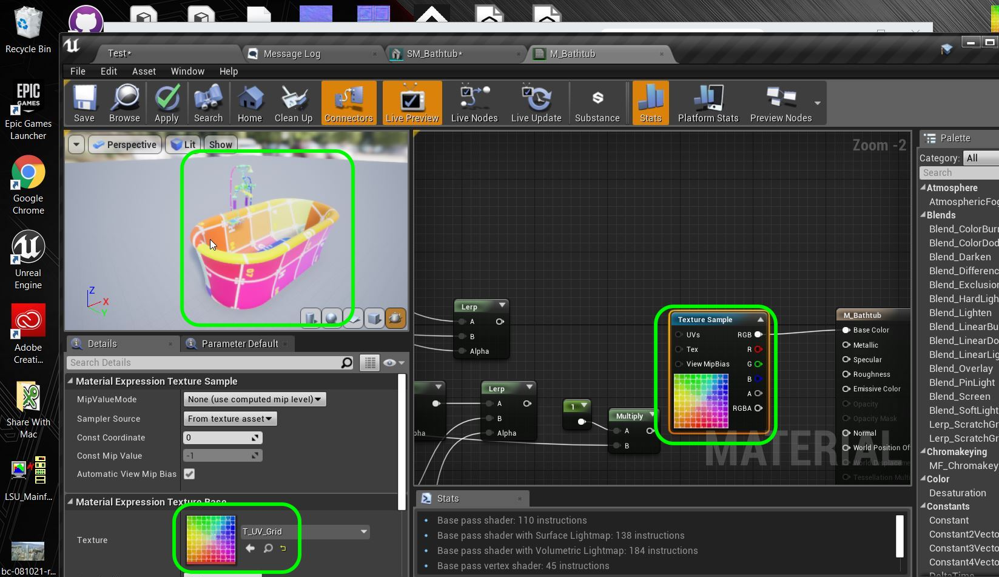

  
## Intro To Models - Page 5

_____ 

## Index
_____ 

1.  [Anatomy of a Model](Intro-To-Models-1.html#anatomy-to-models)
2. [What Makes a Good Real Time Model?](Intro-To-Models-2.html#what-makes-a-good-real-time-model)
3. [What Makes a Good Real Time Model Part II?](Intro-To-Models-3.html#what-makes-a-good-real-time-model-part-ii)
4. [Scale](Intro-To-Models-4.html#scale)
5. [Levels, Props & Skeletons](Intro-To-Models-4.html#levels-props--skeletons)
6. [Materials](Intro-To-Models-4.html#materials)
7. [**UV Mapping**](Intro-To-Models-5.html#uv-mapping)
8. [Bad UVs](Intro-To-Models-6.html#bad-uvs)
9. [LOD](Intro-To-Models-6.html#lod)
10. [Pivot Point](Intro-To-Models-7.html#pivot-point)
11. [Collisions](Intro-To-Models-7.html#collisions)

_____ 

### UV Mapping
Why is the shape so odd in the texture maps, how is this determined? Lets take a closer look at UV Mapping.

_____ 



{:start="{{ num }}"}
{{ num }}.  A [UV map](https://en.wikipedia.org/wiki/UV_mapping) is the process of projectig a two dimensional texture onto a 3-D body.  Imagine the model unwrapped into a 2-Dimensional space.  Each group of pixels is mapped to a face on the object.  Here is what a simple cube might look like.

  

_____ 



{:start="{{ num }}"}
{{ num }}. The **U** is the X axis in the scene and the **V** is the Y axis.  It is a normalized range between `0` and `1` as it can work with a texture of any size.  Please note that the aspect ratio is square.  So most texture maps that are used will be square (unless the UV map is stretched on an axis). 

  

_____ 



{:start="{{ num }}"}
{{ num }}. Open up **Maya** and press the **Import** button.  Go to where the **uproject** is located and there should be an **Import** folder.  Load the **SM_Bathtub.FBX** file:

  

_____ 



{:start="{{ num }}"}
{{ num }}. 1. Make sure you are in the **Modelling** toolset. 2. Press the UV Editor button.  3. Select the mesh selection tool.  4. Click on the model to see where the corresponding mesh appears on the model.  You can see that each mesh has a position in the UV Space all normalized between `0` and `1`.

  

_____ 


{:start="{{ num }}"}
{{ num }}. You can also preview how a texture will be mapped to see if there is distortion or stretching.  You can press the **Checkerboard** preview button in the **UV Editor**.  Please note this is for previewing only, this will not bake this texture in your model.

  

_____ 



{:start="{{ num }}"}
{{ num }}. Now you can look to see how this grid in your **UV Editor** is mapped to the object.  Notice that the checkerboard pattern is not distorted and projects nicely to the 3-D model.

  

_____ 



{:start="{{ num }}"}
{{ num }}. Now we can create a texture map for each area of the model.  How do we get a copy of this UV map to use as reference?  Press the **UV Snapshot** button in the **UV Editor** window.

  

_____ 



{:start="{{ num }}"}
{{ num }}. Now you need to select a texture resolution.  There are limits to the [size](https://docs.unrealengine.com/en-US/Engine/Content/Types/Textures/SupportAndSettings/index.html) that Unreal can take.  The smallest is `16 x 16` and the largest is `8192 x 8192`.  Please note that you want to use a square aspect ratio for the images to properly mip map.  They should be a power of two (16, 32, 64, 128, 256, 512, 1024, 2048, 4096 or 8192).  Now not all platforms will be able to take the large texture sizes (I am not sure an IOS or Android target could).  Also we want to pick a size that is commensurate with the size of the model in the world and how close to the texture the player will get.  We want to manage it so that a texture is not blown up too much (like a wall using a 16 x 16 texture map).  Let's pick a larger texture than needed for now and select `2048 x 2048`.

  

_____ 



{:start="{{ num }}"}
{{ num }}. Now click on **Image Format** then select a **png** type.  This is an uncompressed image type that can be opened in most image software. Press the **Apply and Close** button.

  

_____ 



{:start="{{ num }}"}
{{ num }}. Pick a directory and a name for the UV Map.

  

_____ 



{:start="{{ num }}"}
{{ num }}.Open the file and you will see that it prints the lines for the UV Map.  Now we can use those lines as a reference in a layer and paint the textures in the appropriate area to the appropriate scale for the model.

  

_____ 



{:start="{{ num }}"}
{{ num }}. Go to Unreal Engine 4 and add a **Geometry \| Static Mesh \| Bathtub \| SM_Bathtub** object and drag it into the scene. You can see the model without its textures applied.

  

_____ 



{:start="{{ num }}"}
{{ num }}. Double click the **Static Mesh** and look at it in the UE4 Mesh editor.

  

_____ 



{:start="{{ num }}"}
{{ num }}. Press the **UV** button and select **UV** channel `0`.  You can have up to 7 UV channels in a UE4.  Look at their [documentation](https://docs.unrealengine.com/en-US/Engine/Content/Types/StaticMeshes/HowTo/UVChannels/index.html) for more information.

  

_____ 



{:start="{{ num }}"}
{{ num }}. Now you should see the same **UV Map** in UE4 that you saw in Maya.

  

_____ 



{:start="{{ num }}"}
{{ num }}. Apply the **M_Bathtub** material to the static mesh.

  

_____ 



{:start="{{ num }}"}
{{ num }}. Look at what the static mesh looks like in game with material applied. 

  

_____ 



{:start="{{ num }}"}
{{ num }}. Select the **Static Mesh** in the editor and go to **M_Bathtub**.  Load the bathtub model so we can see the UV's on the appropriate model.  Notice the node chart looks complicated.

  

_____ 



{:start="{{ num }}"}
{{ num }}. Disconnect the pin that goes to the **Normal Map** in the material.  Wait for the preview window to refresh and notice that a lot of the shape around the bottom lip and interior is created by the normal map.  When you are done reconnect the pin.

  

_____ 



{:start="{{ num }}"}
{{ num }}. There is no pixel detail in the model.  It is just a white tub with silver fixtures.  So there is not a **Texture Sample** to affect pixel colors.  Look at this weird three colored texture that is used for **Roughness**, **Metallic** and **Base Color**. Look at **T_Bathtub_M** and notice that is only usly **RGB**.

  

_____ 



{:start="{{ num }}"}
{{ num }}. This is then used as a mask so that he can use the combined channel to affect all colors, and the RGB channels for different parts of the map.  This is how they make the shiny metal fixtures.

  

_____ 



{:start="{{ num }}"}
{{ num }}. Disconnect the **Roughness** and **Metallic** channels and the model now is only using the various shades of white that are above it in the material.

  

_____ 


{:start="{{ num }}"}
{{ num }}. Open up the **T_UV_Grid** and see that it has more informatiopn than the black and white grid in maya.  We will use this to see how the UV's project in UE4 instead of Maya this time.

  

_____ 



{:start="{{ num }}"}
{{ num }}. Disconnect all the pins from the material.  Now create a new **Texture Sample** node and connect it to the **Base Color** pin.  Go around the model and see how the grid is projected onto the model.  Undo all this work and return the material to its original form.  Press **Save All**. On the next page we will look at bad UVs.

  

_____ 

  

[<- Previous](Intro-To-Models-4.html)&nbsp;&nbsp;&nbsp;[Home](../index.html)&nbsp;&nbsp;&nbsp; [Continue ->](Intro-To-Models-6.html)
   
   
   

