  
## Intro To Models - Page 6

_____ 

## Index
_____ 

1.  [Anatomy of a Model](Intro-To-Models-1.html#anatomy-to-models)
2. [What Makes a Good Real Time Model?](Intro-To-Models-2.html#what-makes-a-good-real-time-model)
3. [What Makes a Good Real Time Model Part II?](Intro-To-Models-3.html#what-makes-a-good-real-time-model-part-ii)
4. [Scale](Intro-To-Models-4.html#scale)
5. [Levels, Props & Skeletons](Intro-To-Models-4.html#levels-props--skeletons)
6. [Materials](Intro-To-Models-4.html#materials)
7. [UV Mapping](Intro-To-Models-5.html#uv-mapping)
8. [**Bad UVs**](Intro-To-Models-6.html#bad-uvs)
9. [**LOD**](Intro-To-Models-6.html#lod)
10. [Pivot Point](Intro-To-Models-7.html#pivot-point)
11. [Collisions](Intro-To-Models-7.html#collisions)

_____ 

### Bad UVs
Lets look at what happens if a model has a bad set of UVs.  When downloading free models from the internet, this can be something you see a lot of that only shows up when creating a material as the geometry looks fine!

_____ 



{:start="{{ num }}"}
{{ num }}. Now lets look at an example of where there are bad uv maps for a model.  Drag **Geometry \| StaticMesh \| BadUVs \| SM_Chest_BAD** and drag it into the game scene.  Now notice that the scale is wrong.  But even worse the UV's are not correctly mapped.  Double click **SM_Chest_BAD** to load up the mesh viewer in UE4.

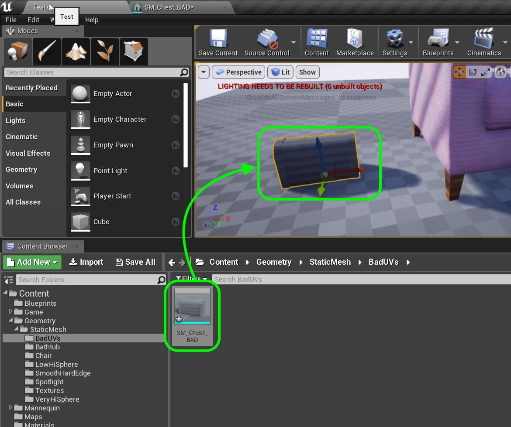  

_____ 



{:start="{{ num }}"}
{{ num }}. Notice that the checkerboard pattern we normally see on the model looks wrong.  Lets see what it looks like with the grid.

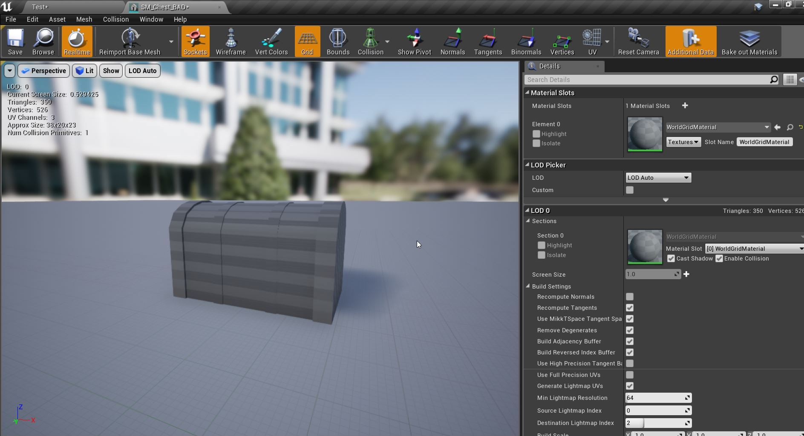  

_____ 



{:start="{{ num }}"}
{{ num }}. Lets create a new material. Go to the **Materials** folder and press **Add New**.  Select  **Material** to add another one to this folder.

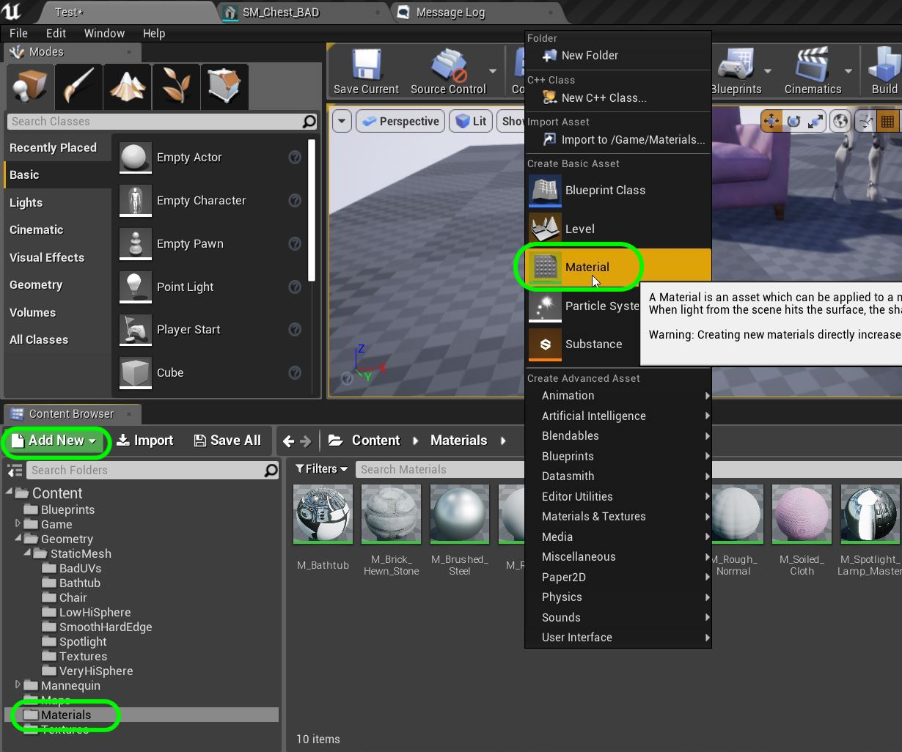  

_____ 



{:start="{{ num }}"}
{{ num }}. Call it `M_Check_UV`.

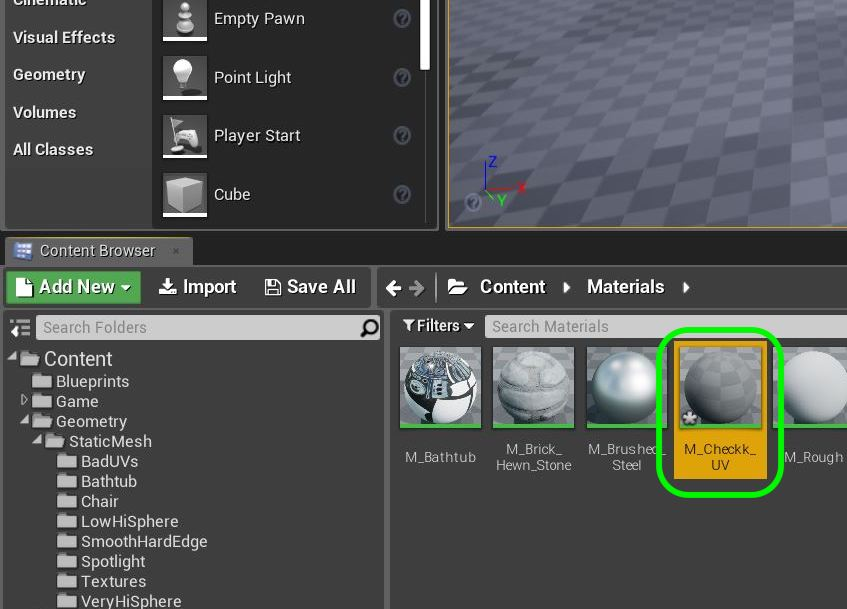  

_____ 



{:start="{{ num }}"}
{{ num }}. Double click **M_Check_UV**.  Right click on the open graph and select a **Texture Sample** node.

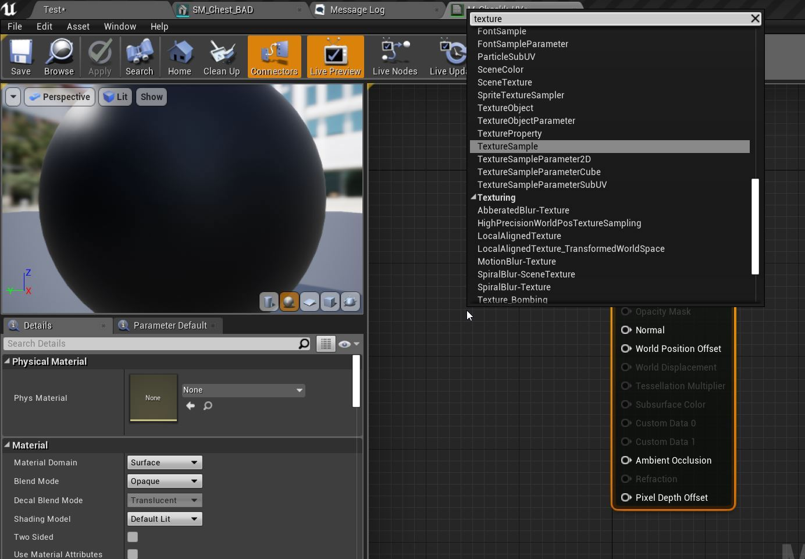  

_____ 



{:start="{{ num }}"}
{{ num }}. Select the **Texture Sample** grid and select the **Texture** option in the **Details** panel.  Press **none** and select **T_UV_Grid**.

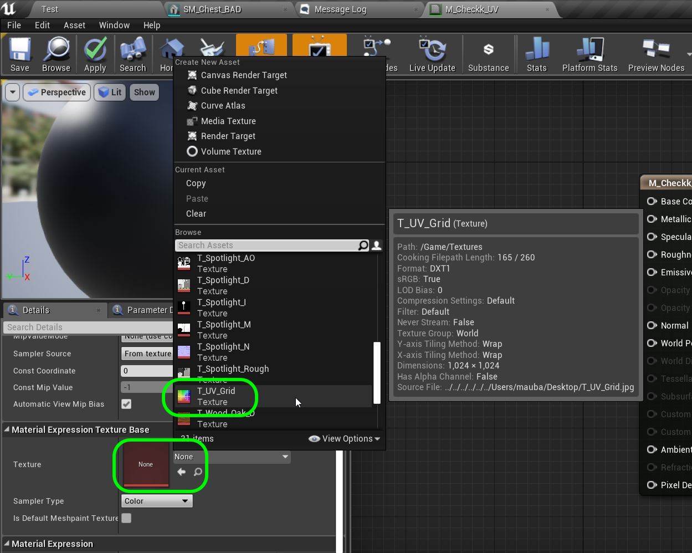  

_____ 



{:start="{{ num }}"}
{{ num }}. Drag the **RGB** pin to the **Base Color** pin in the Material node.  Press **Apply** then **Save**.

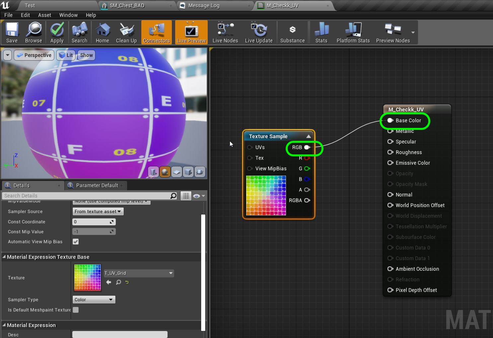  

_____ 



{:start="{{ num }}"}
{{ num }}. Go back to **SM_Chest_BAD** in the mesh view and assign the **M_Check_UV** material you just created to the model.

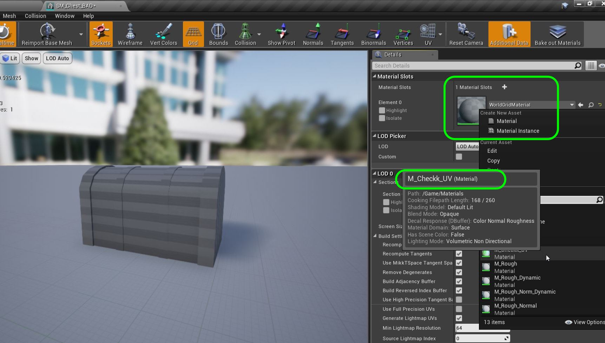  

_____ 



{:start="{{ num }}"}
{{ num }}. Now look around and you can see that the sides of the chest are correct but the front, back, bottom and strapping are all stretched and will be hard to use this model in a game properly.

  

_____ 

### LOD
Levels of detail (LOD) are standard practice to apply when creating models in 3-D games. When an object gets further in a scene less detail is required in both the texture maps and the geometry to accurately represent the model in the scene. This way since most models are far away from the camera we can reduce our total vertice count and the size of our large textures by having lower resolution versions.

_____ 



{:start="{{ num }}"}
{{ num }}. So a different model is loaded based on how far away from the camera the model is.

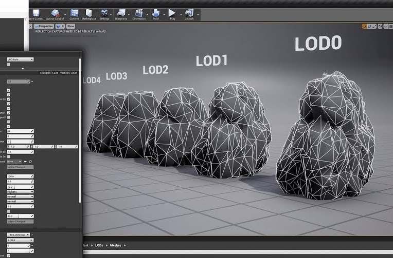  

_____ 



{:start="{{ num }}"}
{{ num }}. In Maya make sure both models are in the same world space and that the pivot is in the same place.  I have two spheres here on top of each other:

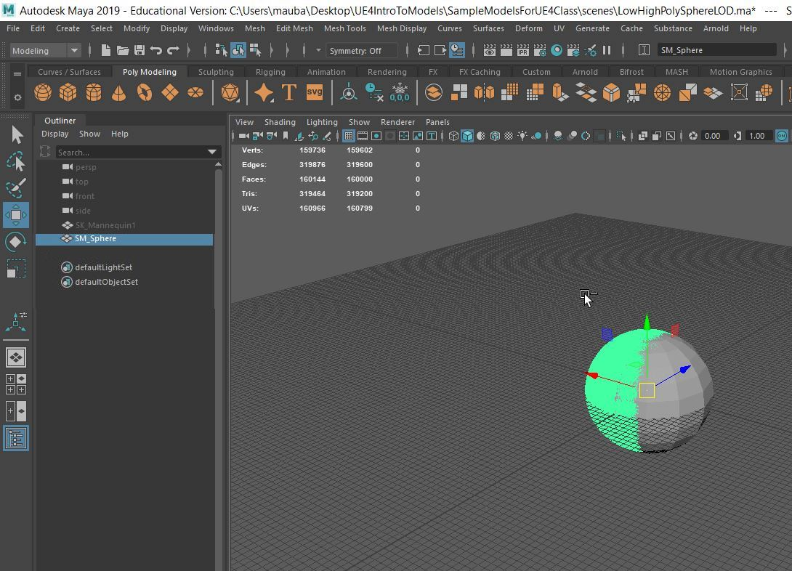  

_____ 



{:start="{{ num }}"}
{{ num }}. I select in **Object Mode** the highest poly model first then the next level in order from highest detail to smallest.  I press the **Edit \| LOD Level of Detail \| Create LOD Group**.

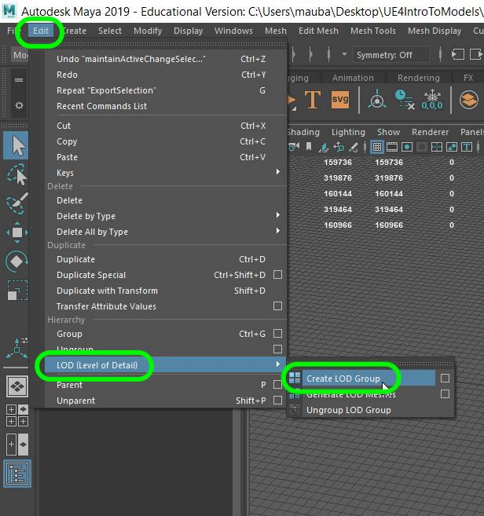  

_____ 



{:start="{{ num }}"}
{{ num }}. I can see the change of model LOD's when zooming in and out of Maya.

  

_____ 



{:start="{{ num }}"}
{{ num }}. I am using the **File \| Game Exporter** option in Maya.  I select all LOD's and use **Export Selection** in the **Game Exporter** window.  I set up geometry with **Smooting Groups**, **Blendshapes** and **Tangents & Binomals** selected.  For LOD's to work I also have to select **Animation**.  I can turn the **Skinning** setting off as we are not using skinning n this static mesh pair.  I select a folder and a name to export.

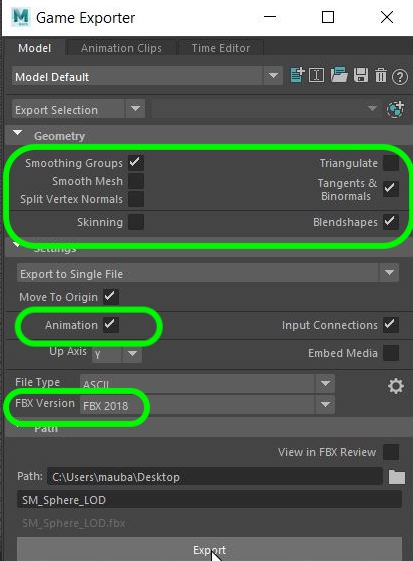  

_____ 



{:start="{{ num }}"}
{{ num }}. I have exported this file for you already.  In UE4 go to the folder **Geometry \| StaticMesh \| LowHiSphere** and drag the file that is in your project where your **.uproject** file is located in **Import \| SM_Sphere_LOD**.  Drag this file from the operating system folder into the content browser. A message should appear saying the object is being imported.

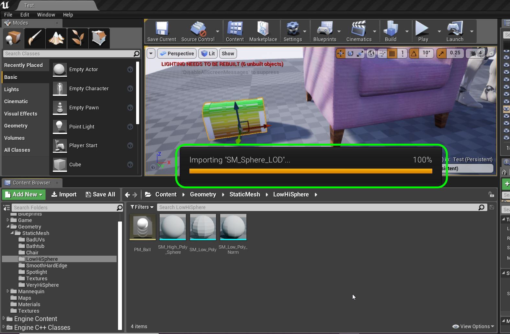  

_____ 



{:start="{{ num }}"}
{{ num }}. Now an **FBX Import Options** menu appears.  You can change settings as you see fit.  This is a simple static mesh with no other features to it except for 2 LOD's. You need to press the arrow in **Mesh** to get extended options.  You HAVE to set **Import Mesh LODs** to true for it to work.

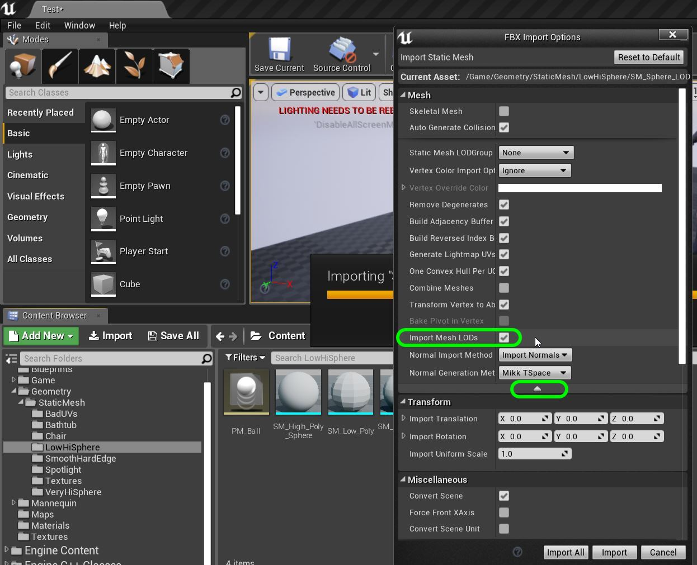  

_____ 



{:start="{{ num }}"}
{{ num }}. You should now see a static mesh called **SM_Sphere_LOD** that has only one image of a sphere in it (so it is not two objects).

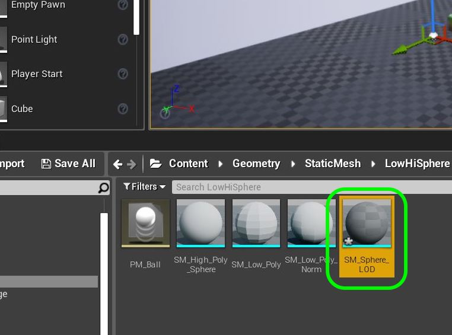  

_____ 



{:start="{{ num }}"}
{{ num }}. Double click the static mesh to go into the **Mesh Viewer**.  Change the **Material** to **M_Check_UV**.

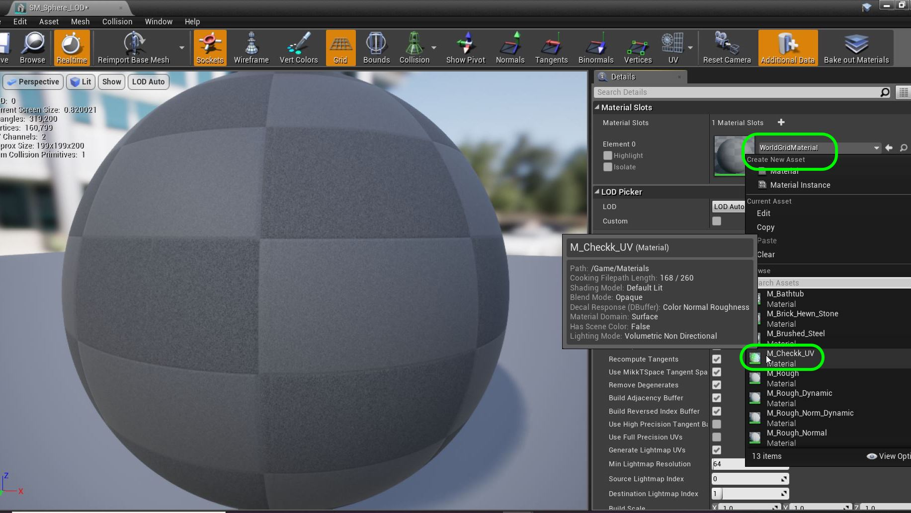  

 
_____ 



{:start="{{ num }}"}
{{ num }}. Now when you zoom in and out you will notice that the LOD changes.  It changes way too soon and we should wait until it is further out.

  

_____ 



{:start="{{ num }}"}
{{ num }}. Now when you zoom out look at the Head Up Display in the preview window.  Look for **Current Screen Size**.  So I think we should switch models around `.1`.

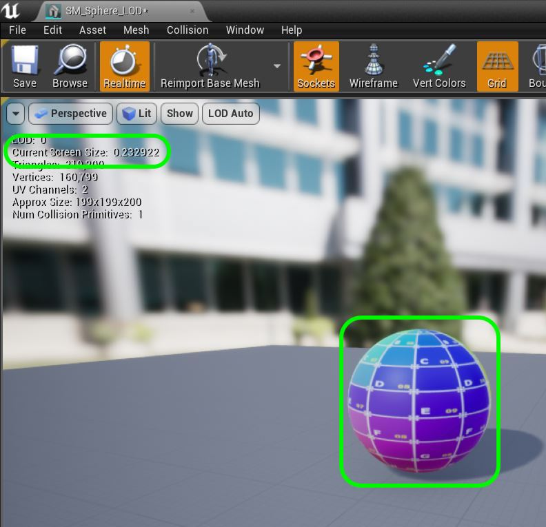  

_____ 



{:start="{{ num }}"}
{{ num }}. Go to **LOD Settings \| Auto Compute LOD Distances**.  If it is selected turn it **off**.  Click once then wait.  This can take a while before it changes.  Be patient. 

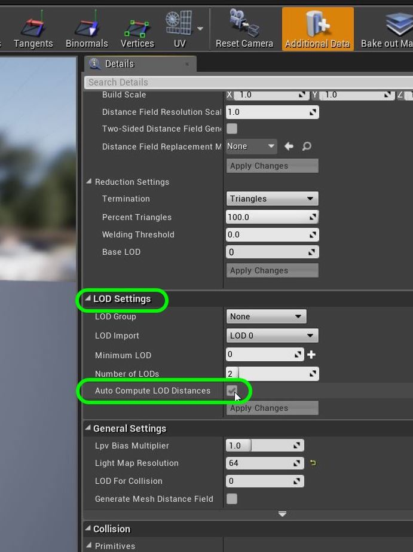  

_____ 



{:start="{{ num }}"}
{{ num }}. Now I set the **Screen Size** setting in **LOD 0** in the **Details** panel to `0.1`. 

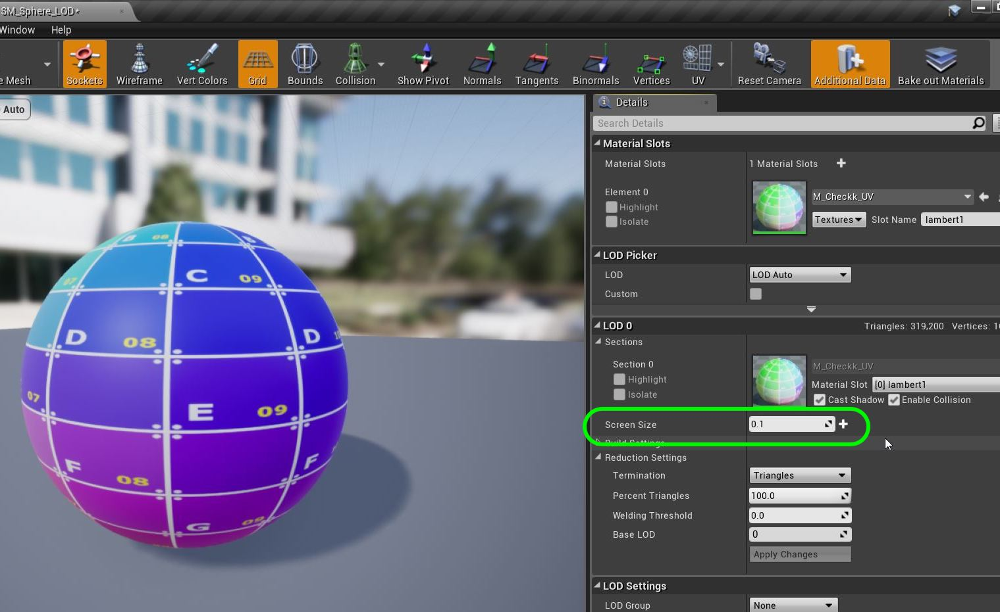  

_____ 



{:start="{{ num }}"}
{{ num }}. Now zoom in and out again see that the model switches when it is at `0.1` screen size:

  

_____ 



{:start="{{ num }}"}
{{ num }}. Drop it into the game screen. Put it back on the top of the surface.

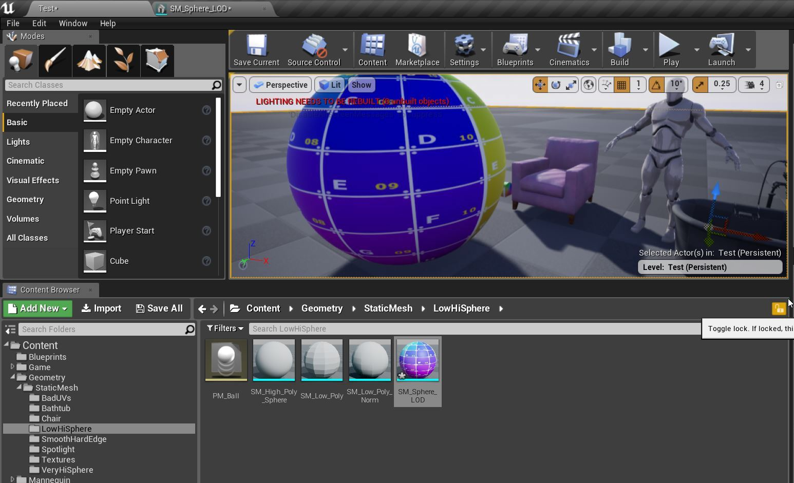  

_____ 



{:start="{{ num }}"}
{{ num }}. Play the game and zoom in and out.  Now you can see that it is changing LOD's. Notice the subtle change in the distance.  The goal is to make this change unoticable as possible to the humamn eye. This is done as just an example. Next up we will look at the Pivot Point.

  

_____ 

  

[<- Previous](Intro-To-Models-5.html)&nbsp;&nbsp;&nbsp;[Home](../index.html)&nbsp;&nbsp;&nbsp; [Continue ->](Intro-To-Models-7.html)
   
   
   

