  
## Intro To Models - Page 7

_____ 

## Index
_____ 

1.  [Anatomy of a Model](Intro-To-Models-1.html#anatomy-to-models)
2. [What Makes a Good Real Time Model?](Intro-To-Models-2.html#what-makes-a-good-real-time-model)
3. [What Makes a Good Real Time Model Part II?](Intro-To-Models-3.html#what-makes-a-good-real-time-model-part-ii)
4. [Scale](Intro-To-Models-4.html#scale)
5. [Levels, Props & Skeletons](Intro-To-Models-4.html#levels-props--skeletons)
6. [Materials](Intro-To-Models-4.html#materials)
7. [UV Mapping](Intro-To-Models-5.html#uv-mapping)
8. [Bad UVs](Intro-To-Models-6.html#bad-uvs)
9. [LOD](Intro-To-Models-6.html#lod)
10. [**Pivot Point**](Intro-To-Models-7.html#pivot-point)
11. [**Collisions**](Intro-To-Models-7.html#collisions)

_____ 

### Pivot Point
The pivot point of the model is where the movement widget is placed in UE4.  It is where you move the model to and from.  This is also the point of where the model is rotated from.  Unfortunately this cannot be adjusted in Unreal and has to be set in the modeling software.

_____ 



{:start="{{ num }}"}
{{ num }}. For an object that is not meant to be animated or moved, it will have it's pivot point in the center and at the surface it attaches to.  So a light chandellier will have a pivot at the ceiling (top of the model).  With our bathtub, it will be the bottom of the tub where it meets the floor.  Take a look at the pivot in the game.

  

_____ 



{:start="{{ num }}"}
{{ num }}. Now the mannequin is the same. He might pivot around the Z axis but probably won't rotate around the X or Y axis.  So the pivot point again is in the center and at the point where the feet meet the ground.

  

_____ 



{:start="{{ num }}"}
{{ num }}. Now if we look at the chair, I didn't place the pivot in a good place for the game.  I left it in the center in Maya and it is now stuck in the middle of the furniture.  Ideally we would export this model, change the pivot and go back.  Lets do this.

  

_____ 



{:start="{{ num }}"}
{{ num }}. Right click on the **Chair** FBX in the editor and then select **Asset Actions \| Export**:

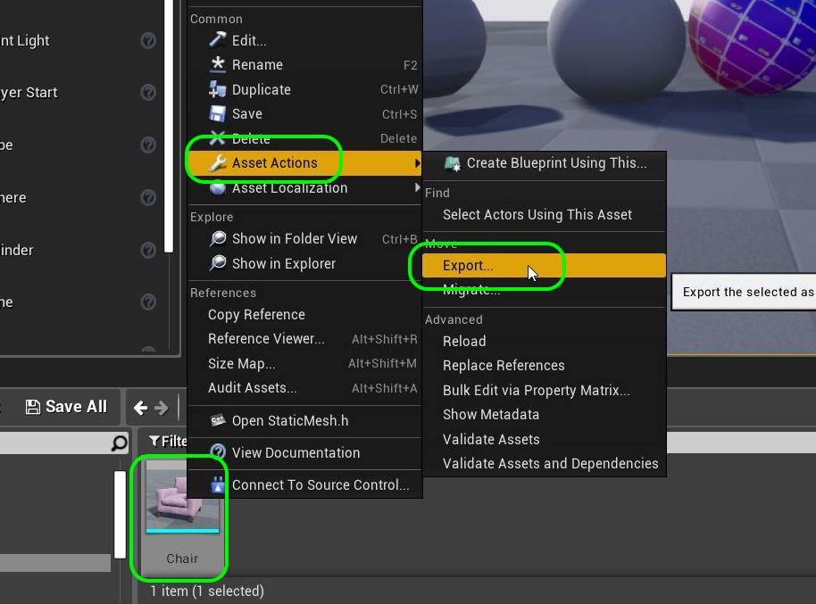  

_____ 



{:start="{{ num }}"}
{{ num }}. Put it on the **Desktop** and call it **SM_Chair**.  We really should be using the prefix **SM** to indicate a static mesh.

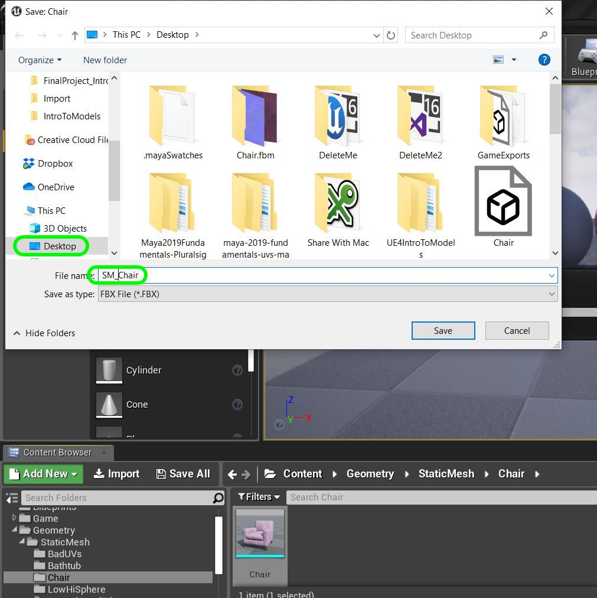  

_____ 



{:start="{{ num }}"}
{{ num }}. Select **FBX 2018** as Maya 2019 will support it.  Undcheck all other options.  Press the **Export** button.

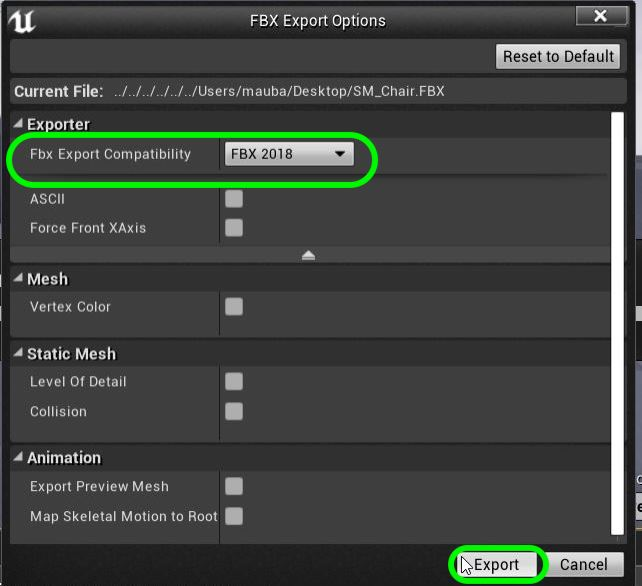  

_____ 



{:start="{{ num }}"}
{{ num }}. Open **Maya 2019**.  Create a new scene and press **File \| Import**.

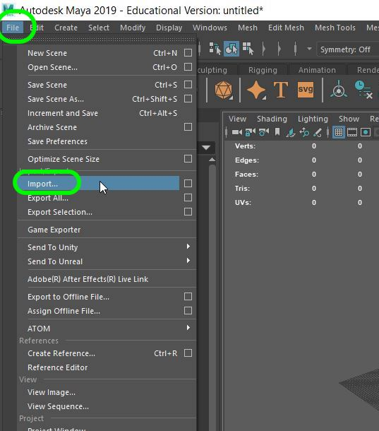  

_____ 



{:start="{{ num }}"}
{{ num }}. Import the FBX you just exported named **SM_Chair** and placed in the desktop.

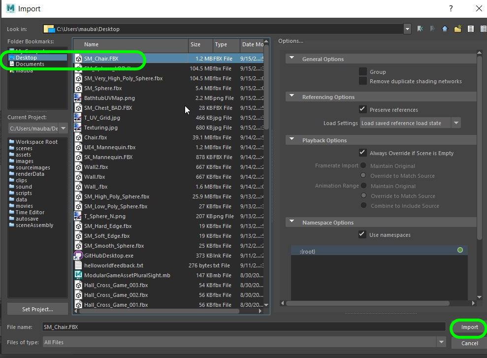  

_____ 



{:start="{{ num }}"}
{{ num }}. In Maya press the **D** key to move the pivot in movement mode.  Then press **X** to snap to grid.  Snap it to the center of the grid.  Zoom in to confirm.  Then place the bottom of the feet on the level of the floor and newly located pivot.

  

_____ 



{:start="{{ num }}"}
{{ num }}. When it is correct, select the model and press **File \| Game Exporter**.

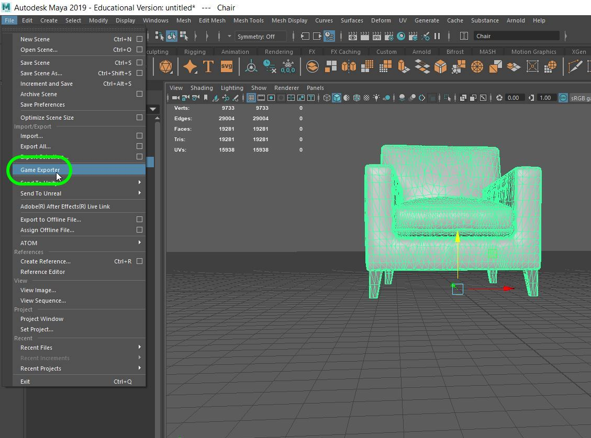  

_____ 



{:start="{{ num }}"}
{{ num }}. Select the appropriate options.  Remember you don't need animations ticked off as there are no LOD's or animations on this model. 

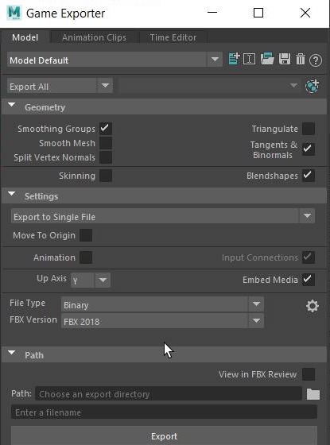  

_____ 



{:start="{{ num }}"}
{{ num }}. Now select the folder and the name of the file.  I overwrote the file we loaded in the scene originally in **Desktop \| SM_Chair.fbx**.  Press the **Export** button.

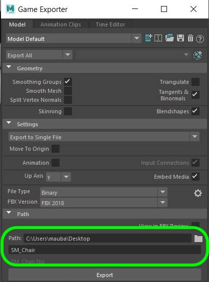  

_____ 



{:start="{{ num }}"}
{{ num }}. Drag and drop this new chair fbx into the same directory that the original Chair static mesh is in.

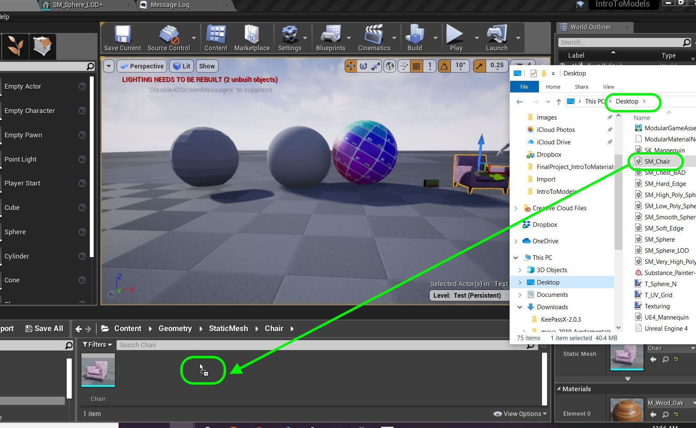  

_____ 



{:start="{{ num }}"}
{{ num }}. Now make sure you are not importing LOD's as there are none associated with this model.

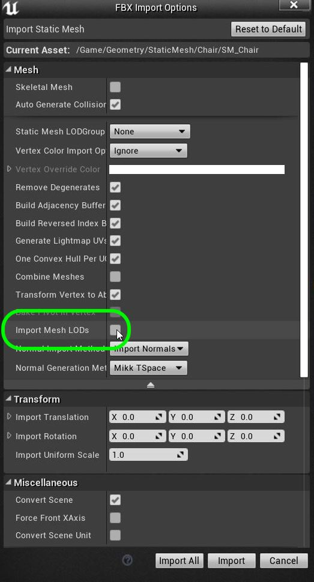  

_____ 



{:start="{{ num }}"}
{{ num }}. Now double click this new mesh and reassign the materials we need:

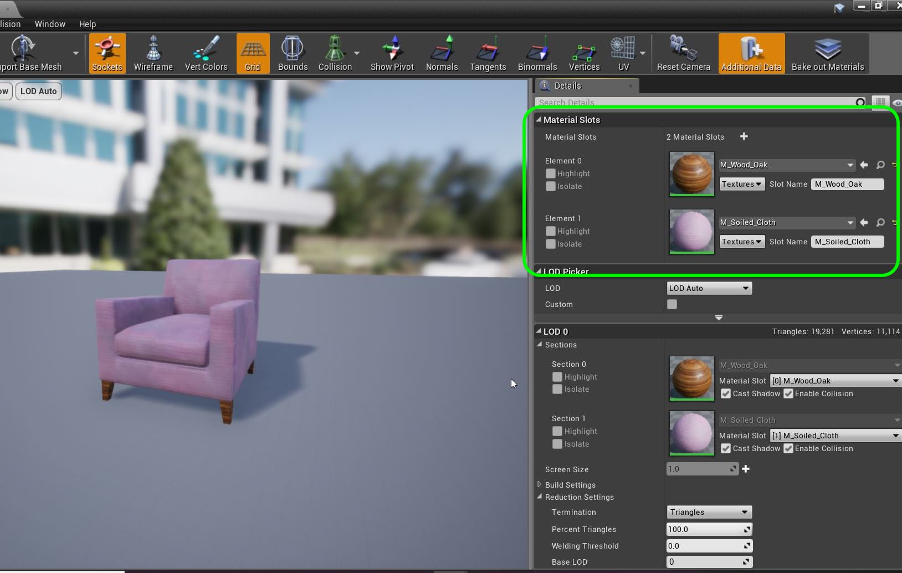  

_____ 



{:start="{{ num }}"}
{{ num }}. Drag the model in the game and notice the pivot point has changed but the rest of the model is intact.

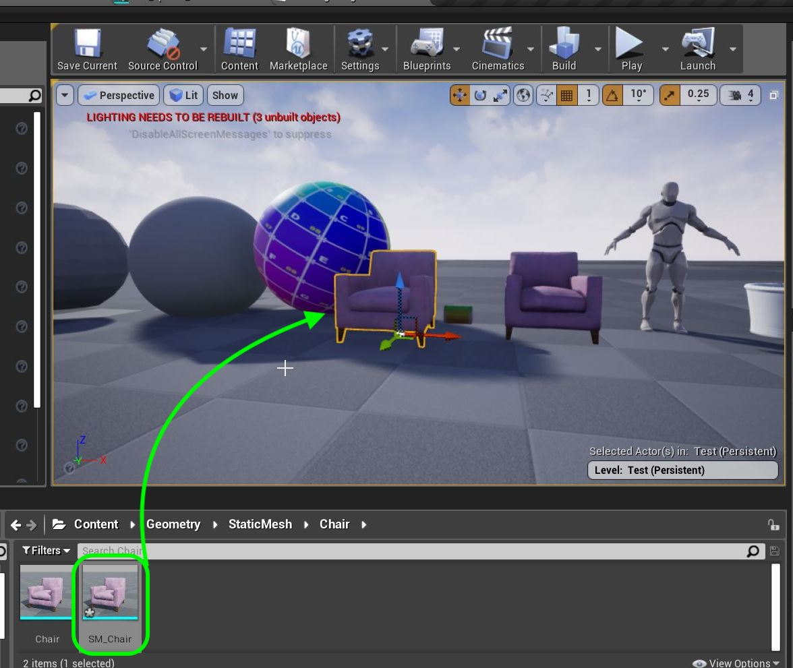  

_____ 


{:start="{{ num }}"}
{{ num }}. Now if we look at the sphere lod with the uv material, its pivot is set like it should be attached to a ceiling (like a ceiling lamp shade).  The other spheres are rotated.  This mainly affects where it rotates if the object has physics applied to it or animated in the game.  Then we would want it to be in the center of gravity of the object.

  

_____ 
### Collisions
Now there is another mesh that is imported with models that is invisible to the naked eye.  This is the collision mesh.  This shows where the player collides with the underlying geometry.  Why do we need a separate mesh?  Lets take a look.

_____ 


{:start="{{ num }}"}
{{ num }}. First a collision check will check two bounding spheres around the objects.  We can visualize it as so:

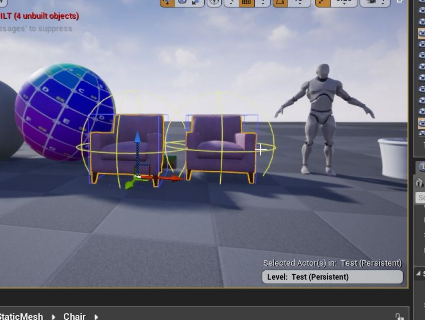  

_____ 



{:start="{{ num }}"}
{{ num }}. Why is a sphere the fastest way to check whether two objects are colliding?  It is mathematically simple.  If the distance between the center of both spheres is greater than both radius' then it is not colliding.  If it is then it is colliding.  These are.

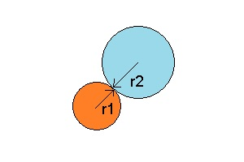  

_____ 



{:start="{{ num }}"}
{{ num }}. Now comes the expensive part.  If the shape is complicated like this chair we would have to check each face to see if it penetrates another face in the model we are colliding with.  This is more expenive with more faces and complexity.  We would not want to use the same geometry as the model as it take a lot of time to compute.

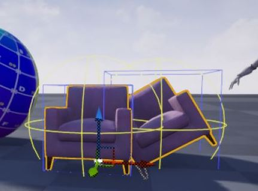  

_____ 



{:start="{{ num }}"}
{{ num }}. Double click the **SM_Chair** object to see it in the editor.  Click the **Collision** button and select **Simple Collision**.  You will see a green polygon that shows the simple collision that is on the object.  This is the default collision for static meshes in unreal.

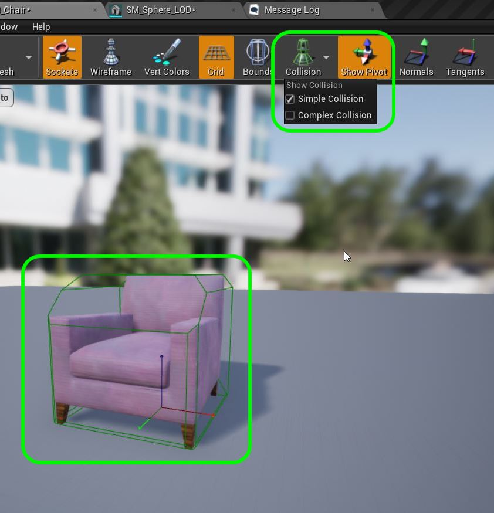  

_____ 



{:start="{{ num }}"}
{{ num }}. You can also look at the complex collision.  This shows the original polygonal mesh. This is way to detailed to use as a collision mesh in our case.  

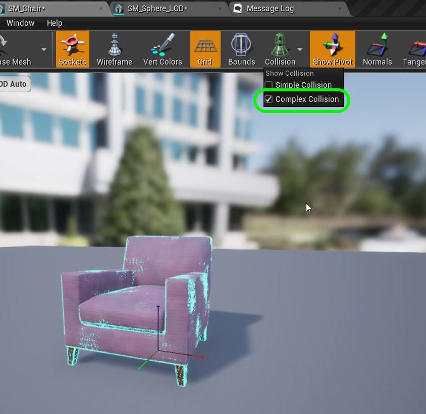  

_____ 



{:start="{{ num }}"}
{{ num }}. The engine defaults to using the simple collision to resolve physics collisions in the game.  To change it you would change **Collision Complexity** from **Project Default** to **Use Complex as Simple**.  Except for quick testing you should really not do this.  I will show you a way to create better collisions shortly.  More information can be found on [Unreal's Website](https://docs.unrealengine.com/en-US/Engine/Physics/SimpleVsComplex/index.html).

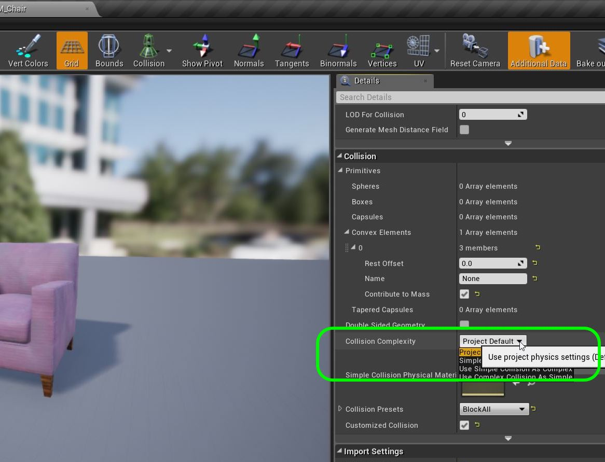  

_____ 



{:start="{{ num }}"}
{{ num }}. With simple collision selected we can remove the collision volume.  Go to **Collision** and select **Remove Collision**.  This means the player will walk through the object.

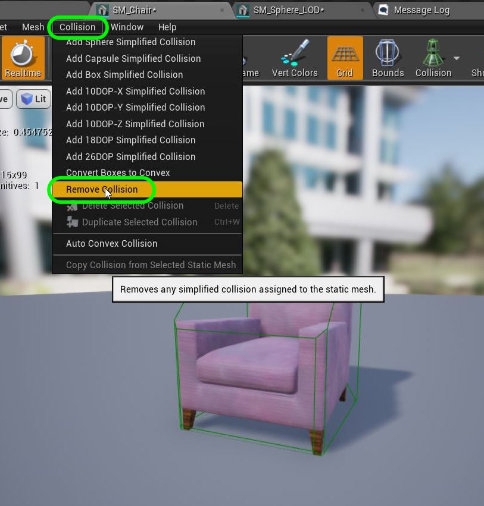  

_____ 



{:start="{{ num }}"}
{{ num }}. We can add a Box Collision shape by selecting **Collision \| Add Box Simplified Collision**.

  

_____ 



{:start="{{ num }}"}
{{ num }}. This creates a simple single box collision.  

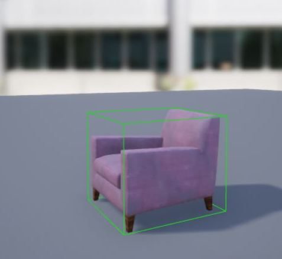  

_____ 



{:start="{{ num }}"}
{{ num }}. Now delete the collision again and select **ADD 100P-X Simplified Collision**.  You will get back to where we were before.  Now this still doesn't look good to me.  The player can't jump into the seat of the chair.  We can create a custom collision in our modeling software.  Lets try this in Maya.

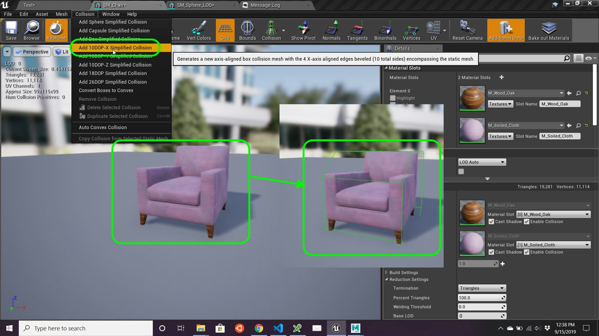  

_____ 



{:start="{{ num }}"}
{{ num }}. I created a simpler collision volume using 98 vertices.  The chair uses more than 9,700 so it is way faster to process collisions. The blue line is the separate collision object and the green is the chair.

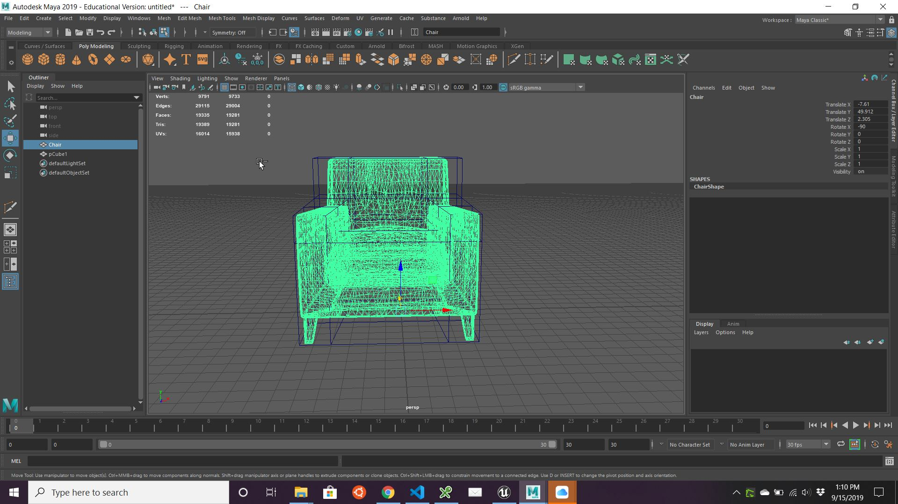  

_____ 



{:start="{{ num }}"}
{{ num }}. You can see that I have created two separate models here and one for collisions.

  

_____ 



{:start="{{ num }}"}
{{ num }}. You name the collision model with the prefix `UCX_`.  So if our model is called **Chair** our collision model is called **UCX_Chair**.

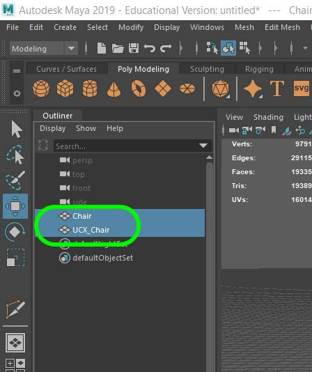  

_____ 



{:start="{{ num }}"}
{{ num }}. We select both the chair and the collision model and export for a game like we did before.  We don't need to have animation selected as again there are no LOD's for this model.

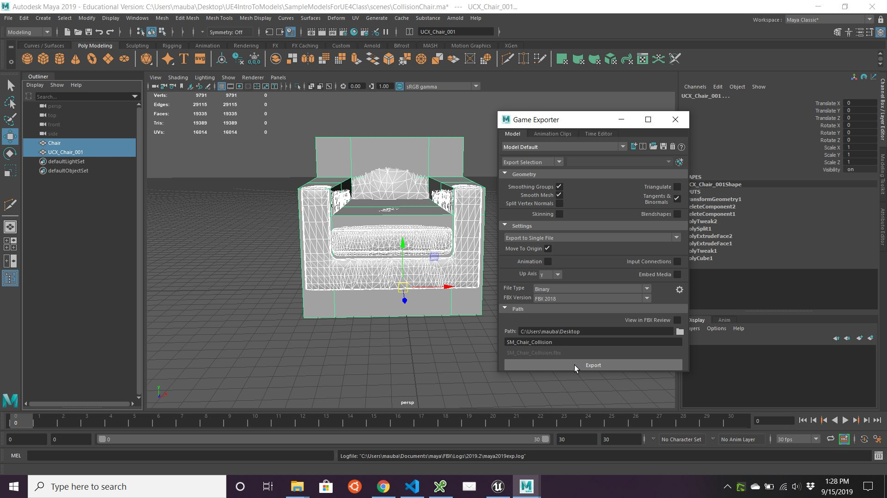  

_____ 



{:start="{{ num }}"}
{{ num }}. Now I have included this collision in a model for you.  Drag **Import \| SM_Chair_Collision** into the **Chair** folder in Unreal.  Make sure **Auto Generate Collision** and **One Convex Hull Per UV** to `false`.  Othewise we will get the same default collision as before. 

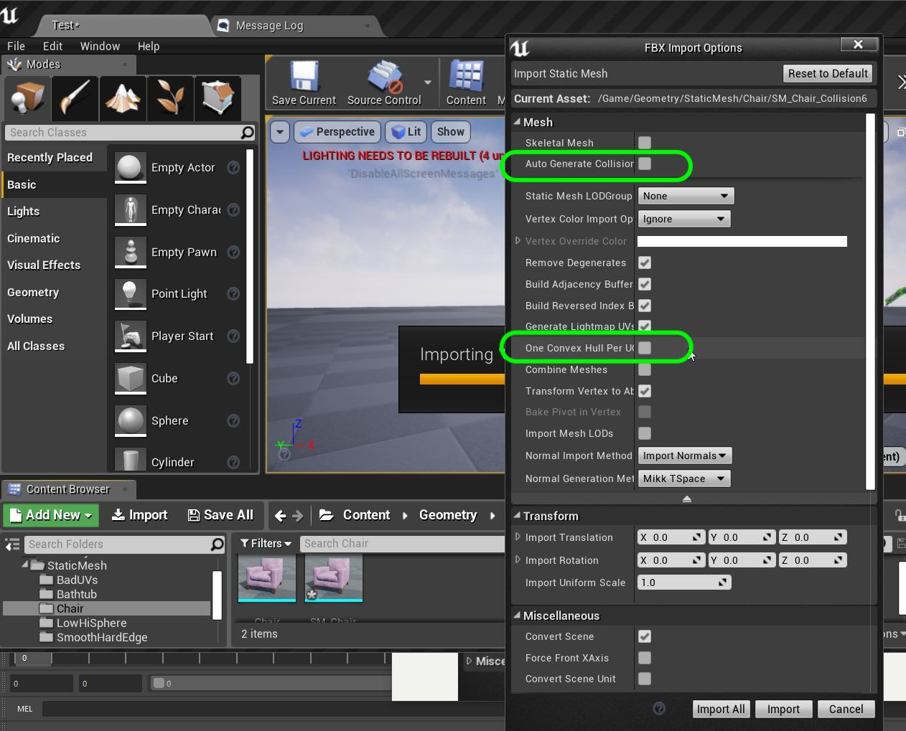  

_____ 



{:start="{{ num }}"}
{{ num }}. Double click this new mesh and attach the materials to it.  Press the **Collision** button and select the **Simple Collision** mesh. You will notice that the mesh is the one I created in Maya.

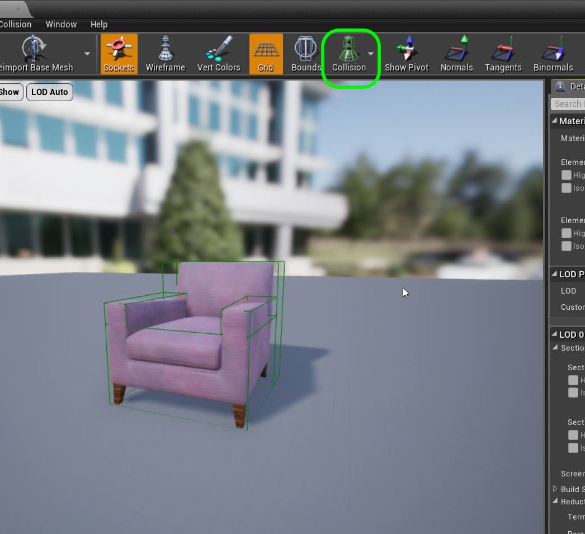  

_____ 



{:start="{{ num }}"}
{{ num }}. To demonstrate this in action you can right click on both the **SM_Chair** and **SM_Chair_Colliion** and select **Asset Actions \| Migrate**.  You can select the Level Design Project where you have a third person character to jump  on the chair.

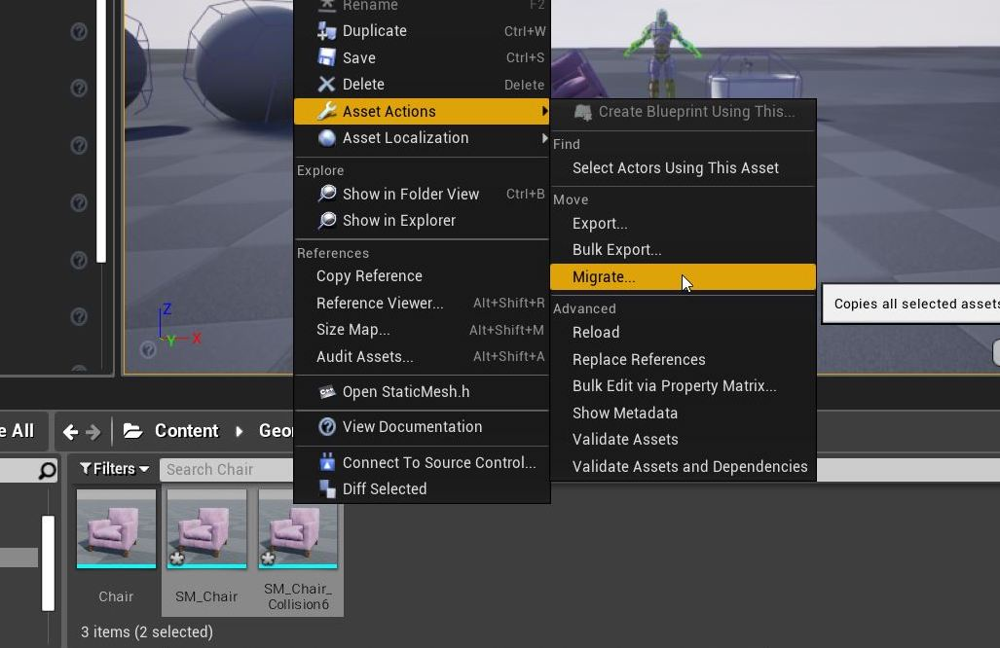  

_____ 


{:start="{{ num }}"}
{{ num }}. Now load up the level design project and place the chair in the room.  I scaled them up to 3X original size to better demonstrate the collisions.  I couldn't jump high enough so I scaled them back to 2X.  You can see that the custom collision provides a better result (though it could be improved with iteration). 

  

_____ 


{:start="{{ num }}"}
{{ num }}. That's it for models in Unreal Engine 4!

_____ 

  

[<- Previous](Intro-To-Models-6.html)&nbsp;&nbsp;&nbsp;[Home](../index.html)
   
   
   

