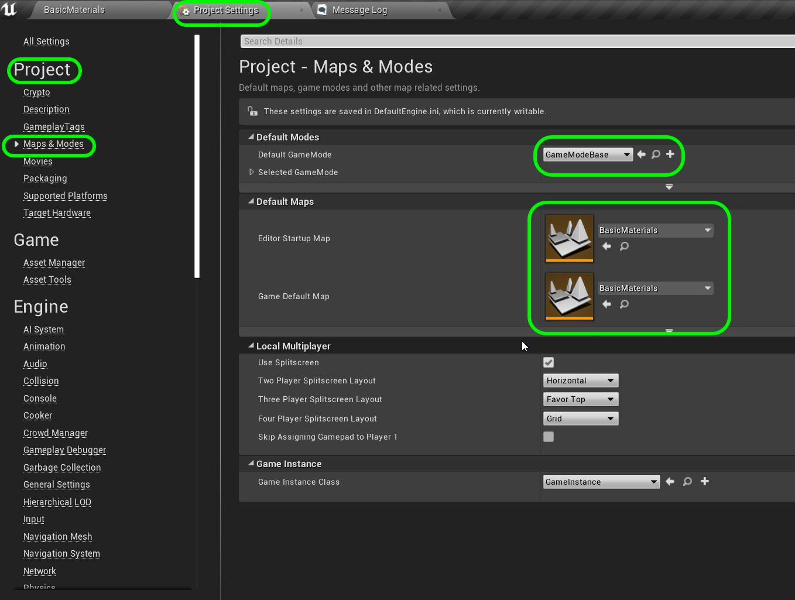

# UE4 Intro To Materials - Page 1
_____ 

## Index
_____ 

* Part 1 - Getting Setup
1. [**Getting Set Up**](Intro-To-Materials-1#getting-set-up)
2. [Creating a Diffuse Map](Intro-To-Materials-2.html#creating-a-diffuse-map.html#starting-unreal-engine-4)

* Part 2 - Our First Material
1. [Diffuse Only Material](Intro-To-Materials-3.html#diffuse-only-material)
2. [Texture Coordinate](Intro-To-Materials-4.html#texture-coordinate)
3. [Normal Mapping](Intro-To-Materials-4.html#normal-mapping)
4. [Roughness and Metallic Constants](Intro-To-Materials-5.html#roughness-and-metallic-constants)

* Part 3 - Material Instances
1. [Material Instance Diffuse](Intro-To-Materials-5.html#material-instance-diffuse)
2. [Metallic and Roughness Parameters](Intro-To-Materials-6.html#metallic-and-roughness-parameters)
3. [Normal Map Parameter](Intro-To-Materials-6.html#normal-map-parameter)
4. [UV Parameters](Intro-To-Materials-6.html#uv-parameters)

* Part 4 - Masked and Transluscent Materials
1.  [Metallic Mask](Intro-To-Materials-7.html#metallic-mask)
2.  [Opacity Mask](Intro-To-Materials-7.html#opacity-mask)
4.  [Translucent Blend Mode](Intro-To-Materials-8.html#translucent-blend-mode)

* Part 5 - Illumination
1.  [Importing a Model](Intro-To-Materials-8.html#importing-a-model)
2.  [Bracket Material](Intro-To-Materials-8.html#bracket-material)
3.  [Lamp Material](Intro-To-Materials-9.html#lamp-material)

* Part 6 - More Material Concepts
1.  [Two Sided Material](Intro-To-Materials-10.html#two-sided-material)
2.  [Decals](Intro-To-Materials-10.html#decals)
3.  [Refraction and Fresnel](Intro-To-Materials-11.html#refraction-and-fresnel)
4. [World Aligned Materials](Intro-To-Materials-12.html#world-aligned-materials)
5.  [Animation](Intro-To-Materials-13.html#animation)

* Part 7 - A Practical Master Material
1.  [A Practical Master Material](Intro-To-Materials-14.html#a-practical-master-material)
2.  [A Practical Master Material Part II](Intro-To-Materials-15.html#a-practical-master-material-part-ii)
3.  [A Practical Master Material Part III](Intro-To-Materials-16.html#a-practical-master-material-part-iii)

_____ 

## What you will need?

For this project you will need to be install [Unreal Engine 4.22.x](https://www.unrealengine.com/en-US/download) , have a [GitHub](https://github.com/) account (which is free of charge) as well as [GitHub Desktop](https://desktop.github.com). You should also download [Crazy Bump](https://www.crazybump.com) or equivalent software (it is free) to create your various masks and normal maps.  Photoshop is always useful but you can always use GIMP, Pixlr or any other free alternative.

_____ 

## Introduction to Materials

Unreal uses a Physically Based Rendering (PBR) shading and lighting model to give artists maximum control over the look and feel of the scene.  PBR is a concept as opposed to a strict set of rules.  In short it allows for consistency of content in a variety of lighting scenarios giving maximum control.

PBR allows for some level of standardizations so that tools like Substance Painter and Designer can created maps that can be utilized on multiple engines.  Even though it is known for creating photorealistic scenes it can be used on more sylized productions, as [Monsters University](https://www.fxguide.com/featured/monsters-university-rendering-physically-based-monsters/) used it as well.

Lets dive into PBR's in Unreal.

_____ 

## Part 1 - Getting Setup

### Getting Set Up

_____ 



{:start="{{ num }}"}
{{ num }}. If you are a student of mine in class you will have received an email of this same repository and will view the invitation and accept it. Now you can download the starter file I have created.  

  

_____ 



{:start="{{ num }}"}
{{ num }}. If you are not part of the class you can login into github with your personal account and navigate to [https://github.com/maubanel/UE4Intro-To-Materials](https://github.com/maubanel/UE4Intro-To-Materials) and in the top left corner press the fork button:

  

_____ 



{:start="{{ num }}"}
{{ num }}. Double click the UE4 project **IntroToMaterials.uproject** to load it. 

  

_____ 



{:start="{{ num }}"}
{{ num }}. The project should load up in the Room/Level **Basic Materials**. It should look like:

  

_____ 



{:start="{{ num }}"}
{{ num }}. You will also most likely see a dark room that has not been lit.  You should probably hit the **Build** button and wait for the lighting to build for the level.

  

_____ 



{:start="{{ num }}"}
{{ num }}. Look at the **World Outliner** on the top right of the screen and you will see Room Construction folder with the walls and floor. We also have 6 room folders that we will use to create materials in all rooms in this level.  

  

_____ 



{:start="{{ num }}"}
{{ num }}. I have also added a first person **Character** for you to control and possess during the game.  Go to **Settings \| Project_Settings** to see the controls. 

  

_____ 



{:start="{{ num }}"}
{{ num }}. Now select **Input** and expand **Action Mappings** and **Axis Mappings**.  This shows you that we have implemented a mouse looking around, player movement and jumping.  If you press the triangles you can see the keys that are assigned.  

  

_____ 



{:start="{{ num }}"}
{{ num }}. Go to the bottom left and open the Source Panel and click on the Blueprints folder.  You will see two Blueprints.  One called **BP_Gamemode** and the other called **BP_PlayerCharacter**. The gamemode blueprint loads the **BP_PlayerCharacter** when the level is run so that you control a first person character.

  

_____ 



{:start="{{ num }}"}
{{ num }}. Lets go back back to **Settings \| Project_Settings** and select **Maps and Modes**.  You will see that the reason the game booted up in this map was because it was set here previously. Also we are not loading the **BP_Gamemode** as the default gamemode.  We can set this here in the project settings or in the **World Outliner**.  We will see later that it is set in the latter.

  

_____ 



{:start="{{ num }}"}
{{ num }}. Now go to Description and fill in the various modules with the information that you want that you think is important.

  

_____ 



{:start="{{ num }}"}
{{ num }}. Now go into **Settings \| World Settings** and expand **Game Mode**.  This is overrides the settings that are in project settings for this one level.  This is selecting our custom BP for Game Mode and Default Pawn.  The Default Pawn is the game object that we are controlling in game.  You will see all of these blueprints running and added to the scene when running the game.

  

_____ 



{:start="{{ num }}"}
{{ num }}. OK, that's enough for setup, now run the game and walk around using the **W A S D** or **Arrow** keys for movement, **Space Bar** for jumping and **Mouse** for looking around.  You should be able to walk around the various rooms and see that they are all titled.

  

_____ 



{:start="{{ num }}"}
{{ num }}. OK, lets look at building our first material in the first room. In the last exercise the color on the cubes was a solid color which we created in the Material itself.  A diffuse map is the most common form of texture map.  It is projecting the color on the surface of the model. So if you want a brick wall then you project a photograph of bricks.  To save memory and make it faster this pattern is reduced to its smallest size that still maintains integrity then gets repeated.  So we need a texture that can be placed next to each other without seams.  Lets start with a photograph of my office carpet that I took on my iPhone.  On th next page we will create our first game ready texture:

  

  

[Home](../index.html)&nbsp;&nbsp;&nbsp; [Continue ->](Intro-To-Materials-2.html)
   
   
   

