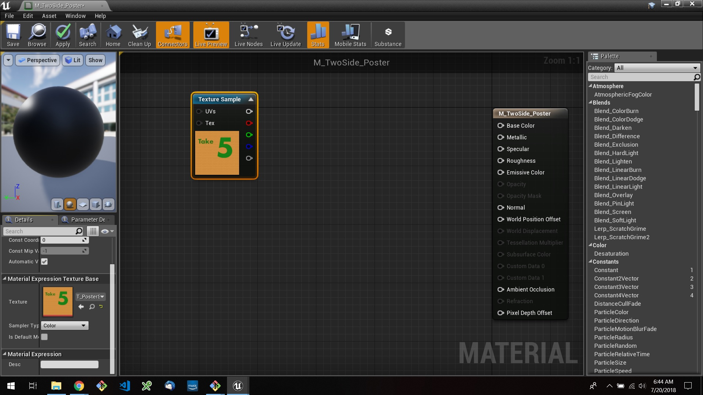

# UE4 Intro To Materials - Page 10
_____ 

## Index
_____ 

* Part 1 - Getting Setup
1. [Getting Set Up](Intro-To-Materials-1#getting-set-up)
2. [Creating a Diffuse Map](Intro-To-Materials-2.html#creating-a-diffuse-map.html#starting-unreal-engine-4)

* Part 2 - Our First Material
1. [Diffuse Only Material](Intro-To-Materials-3.html#diffuse-only-material)
2. [Texture Coordinate](Intro-To-Materials-4.html#texture-coordinate)
3. [Normal Mapping](Intro-To-Materials-4.html#normal-mapping)
4. [Roughness and Metallic Constants](Intro-To-Materials-5.html#roughness-and-metallic-constants)

* Part 3 - Material Instances
1. [Material Instance Diffuse](Intro-To-Materials-5.html#material-instance-diffuse)
2. [Metallic and Roughness Parameters](Intro-To-Materials-6.html#metallic-and-roughness-parameters)
3. [Normal Map Parameter](Intro-To-Materials-6.html#normal-map-parameter)
4. [UV Parameters](Intro-To-Materials-6.html#uv-parameters)

* Part 4 - Masked and Transluscent Materials
1.  [Metallic Mask](Intro-To-Materials-7.html#metallic-mask)
2.  [Opacity Mask](Intro-To-Materials-7.html#opacity-mask)
4.  [Translucent Blend Mode](Intro-To-Materials-8.html#translucent-blend-mode)

* Part 5 - Illumination
1.  [Importing a Model](Intro-To-Materials-8.html#importing-a-model)
2.  [Bracket Material](Intro-To-Materials-8.html#bracket-material)
3.  [Lamp Material](Intro-To-Materials-9.html#lamp-material)

* Part 6 - More Material Concepts
1.  [**Two Sided Material**](Intro-To-Materials-10.html#two-sided-material)
2.  [**Decals**](Intro-To-Materials-10.html#decals)
3.  [Refraction and Fresnel](Intro-To-Materials-11.html#refraction-and-fresnel)
4. [World Aligned Materials](Intro-To-Materials-12.html#world-aligned-materials)
5.  [Animation](Intro-To-Materials-13.html#animation)

* Part 7 - A Practical Master Material
1.  [A Practical Master Material](Intro-To-Materials-14.html#a-practical-master-material)
3.  [A Practical Master Material Part II](Intro-To-Materials-15.html#a-practical-master-material-part-ii)
3.  [A Practical Master Material Part III](Intro-To-Materials-16.html#a-practical-master-material-part-iii)

_____ 

## More Material Concepts

### Two Sided Material
_____ 



{:start="{{ num }}"}
{{ num }}.  Lets put a poster in the middle of **Room 5**.  Lets put a separate image on each side of a flat plane like having a poster floating in the middle of the room.  Now go to the **Textures** folder and import **PosterSide1.tga** and **PosterSide2.tga from the **Import** folder:

  

_____ 



{:start="{{ num }}"}
{{ num }}.  Add a `T_` before each file to comport to the UE4 naming convention.

  

_____ 



{:start="{{ num }}"}
{{ num }}. Now go back to the game and drop a new **Plane** in the room. Move it to a position that makes sense to you.  

  

_____ 



{:start="{{ num }}"}
{{ num }}. Rotate the poster in the room so it is perpendicular to the floor. Change the **Transform \| Scale** to `3.0` on the **X** and **Y**.  Now move the poster to the left hand side of the room.

  

_____ 
 



{:start="{{ num }}"}
{{ num }}. Create a new material to place on this plane.  Call it `M_TwoSide_Poster`.  Make sure it is in the **Materials** folder.

  

_____ 


{:start="{{ num }}"}
{{ num }}.  Add a constant Texture Sample node and assign the PosterSide1.tga to it. Attach the top output pin into the **Base Color** pin in the main Material Node.

  

_____ 



{:start="{{ num }}"}
{{ num }}. Now change the preview to a plane and rotate around it.  Notice that you are not able to see both sides. 

  

_____ 



{:start="{{ num }}"}
{{ num }}.  Now make sure you are highlighting the main node and look for **Two Sided** and set it to `True`. We should now have both sides rendering (even though only 1 side has normals). 

  

_____ 


{:start="{{ num }}"}
{{ num }}. Rotate the camera and notice we have one side of the poster on both sides of the plane.  Now we have the same texzture on both sides.  But what if we wanted a different graphic on both sides.  How will we handle it?

  

_____ 



{:start="{{ num }}"}
{{ num }}. We need a bit of calculus and look at two vectors, the camera and the plane normal in world space.  We take the dot product of both.  If it is negative the lines are looking away from each other if it is above 0 they were looking at each other.  We will use a rounded up version of this and use Lerp even though there is only going to be 0 and 1 out of the graph. Add another **Texture Sample** and a **Linear Interpolate** Node.  In the texture sample pick `T_PosterSide2`.

  

_____ 



{:start="{{ num }}"}
{{ num }}. What does the LERP node do?  Plug in the textures to the A and B input.  Right click on the **LERP** node and select **Start Previewing Node**.  You will see that the Const Alpha is `0.5` which blends 50% of both images.  `0` would be 100% A and `1` would be 100% B.  Lets prove it.

  

_____ 



{:start="{{ num }}"}
{{ num }}. Change the **Const Alpha** to `0` and see the image switches to the one in A.

  

_____ 



{:start="{{ num }}"}
{{ num }}. Switch it to `1` and see that now is displays the image in Node B.

  

_____ 



{:start="{{ num }}"}
{{ num }}. Add a **Camera Vector WS** and **Vertex Normal WS** node.  This will be the start of our vector arithmetic to determine the side of the plane.

  



{:start="{{ num }}"}
{{ num }}. Add a **Dot Product** node and connect the two vectors to the inputs.  This will multiply them together and return a single vector.

  

_____ 



{:start="{{ num }}"}
{{ num }}. Now the return will be negative (back side of plane) or above 0 on same side of plane.  But we don't want any values inbetween.  So we will round up by adding a **Ceil** (Ceiling) node that rounds a fractional number up to the next integer.

  

_____ 



{:start="{{ num }}"}
{{ num }}. Now we need to clamp the output as we don't want a -1 or 2 to get int there when the Alpha only  needs a 0 or 1 in this instance.  So we add a **Clamp** node which defaults to clamping between 0 and 1.  That mean any number number under 0 is 0 and above 1 is 1. Plug the output of this **Clamp** node into the **Alpha** of the **Lerp** node.  Right click the **Lerp Node** and select **Stop Previewing Node**.  Make sure the output of the **Lerp** node goes to the **Base Color** pin.

  

_____ 



{:start="{{ num }}"}
{{ num }}. Now rotate around the plane and we have two images.  Notice in this case that the one I wanted in front is backwards, so I swapped the input A and B to fix this:

  

_____ 



{:start="{{ num }}"}
{{ num }}. Group the nodes and add comments by pressing the **C** key. Press the **Apply** button and **Save**.

  

_____ 



{:start="{{ num }}"}
{{ num }}.  Now go into the game and assign the **M_TwoSide_Poster** to the plane.  Make sure it renders correctly:

  

_____ 

### Decals
_____ 


{:start="{{ num }}"}
{{ num }}. Lets move onto decals (ignore the title in the room it is not stencils).  This is a type of material that can be added to surfaces.  Think of signs painted into walls or blood splatters.  Lets set up two surfaces to test out decals.  

  

_____ 


{:start="{{ num }}"}
{{ num }}. Lets replace the wall that is in the room so.  Drag a **StaticMeshes \| Supplied \| Wall 400x400** into the room on top of the existing wall.

  

_____ 


{:start="{{ num }}"}
{{ num }}. Delete the existing wall then place right on top of floor and against the back wall.

  

_____ 


{:start="{{ num }}"}
{{ num }}. Click on the material and select **M_Material_Sphere**.

  

_____ 


{:start="{{ num }}"}
{{ num }}. Now it should look like:

  

_____ 



{:start="{{ num }}"}
{{ num }}. Drag **StaticMehses \| SM_Carpet_1** onto the floor next to the wall.

  

_____ 


{:start="{{ num }}"}
{{ num }}. Assign one of the non red previously created carpet materials for the texture.  Adjust the height so it is just above the ground texture and renders correctly:

  

_____ 


{:start="{{ num }}"}
{{ num }}. Go to the **Materials** folder and create a new material calling it `M_BloodSplatter`.

  

_____ 


{:start="{{ num }}"}
{{ num }}. Go into the Textures folder and import **BloodSplatter_DwithA.tga** and **BloodSplatter_N.tga**.

  

_____ 


{:start="{{ num }}"}
{{ num }}. Add a `T_` before each name to conform to the UE4 naming conventions.

  

_____ 


{:start="{{ num }}"}
{{ num }}. Open up the Material you just created. Change the **Material Domain** in the **Details** panel from **Surface** to **Deferred Decal**.  

  

_____ 


{:start="{{ num }}"}
{{ num }}. Change both the **Blend Mode** and the **Decal Blend** to **Translucent**.

  

_____ 


{:start="{{ num }}"}
{{ num }}. Add two new **Texture Sample** nodes to the material graph.  Assign the Diffuse material to one and the Normal map to the other. Connect them to the appropriate nodes. Look in the top left corner and see the problem. Our background shows through.  What do we do?

  

_____ 


{:start="{{ num }}"}
{{ num }}. There is an alpha channel in the texture so we connect this channel to opacity and voila, black gone.

  

_____ 


{:start="{{ num }}"}
{{ num }}. You do not need to do the following as I have already done this for you.  I just wanted to show how to add an Alpha to a file.  Now photoshop doesn't automatically create this 4th Alpha channel for you.  The checkerboard that we think of as an alpha is not a channel at all.  Try and save a photoshop file with transparency in a **TGA** format:

  

_____ 



{:start="{{ num }}"}
{{ num }}. Now press Command (Cntrl on PC) Left Click on the Thumnail to add to select the image.  You should see the marching ants around all opaque pixels.

  

_____ 



{:start="{{ num }}"}
{{ num }}. Now go into the **Channels** tab and press the **Save Channel As Selection** button: 

  

_____ 



{:start="{{ num }}"}
{{ num }}. This adds a channel called **Alpha1** and looks like a photoshop mask.

  

_____ 



{:start="{{ num }}"}
{{ num }}. Add a background layer at the bottom and make sure it is pure black (0,  0, 0 RGB). Now you can save the image as a **TGA** with an alpha:

  

_____ 



{:start="{{ num }}"}
{{ num }}. You can confirm that this channel imported correctly by double clicking the **T_BloodSplatter_DandA** and pressing the **View** drop down and turning all channels off except for Alpha.  You see that you get a channel where white is opaque and black is transparent.

  

_____ 



{:start="{{ num }}"}
{{ num }}. Go back to the game.  Make sure you press **Apply** on the decal material.  Now we do not apply it to a plane, we add the decal to an existing geometry even if it is not flat.  Drop the **M_BlooadSplatter_Decal** on the wall and rotate the material it so that the blue arrow on the Decal points towards the surface that you want the decal to be on. You can only see it properly when the decal is not selected:

  

_____ 



{:start="{{ num }}"}
{{ num }}. Now if it renders correctly in game then great!  In my case it didn't work.  After some playing around there are issues with the two normals:

  

_____ 



{:start="{{ num }}"}
{{ num }}. I fixed it by changing the decal blend mode from **Translucent** to **DBuffer Translucent Color Roughness**.  

  

_____ 



{:start="{{ num }}"}
{{ num }}. Add a **constant** node to the graph and set the default to `1` and connect it to **Roughness**. Press the **Apply** button.

  

_____ 



{:start="{{ num }}"}
{{ num }}. Go into the game and adjust it so that it sits on two surfaces.  The texture gets stretched and distorted a bit but UE4 does a great job at propegating across multiple surfaces:

  

_____ 



{:start="{{ num }}"}
{{ num }}. Drop another blood material onto the carpet.  Rotate, position and scale it appropiately:

  

_____ 



{:start="{{ num }}"}
{{ num }}. Play the game and enjoy your decals! There is some stretching allong the side of the UV on the post.

  

_____ 


{:start="{{ num }}"}
{{ num }}. Press **Save All** and update Github by **committing** and **pushing** all the changes made:

  

_____ 

  

[<- Previous](Intro-To-Materials-9.html)&nbsp;&nbsp;&nbsp;[Home](../index.html)&nbsp;&nbsp;&nbsp; [Continue ->](Intro-To-Materials-11.html)
   
   
   

