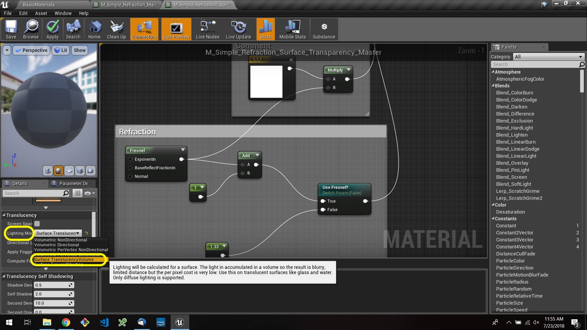

# UE4 Intro To Materials - Page 11
_____ 

## Index
_____ 

* Part 1 - Getting Setup
1. [Getting Set Up](Intro-To-Materials-1#getting-set-up)
2. [Creating a Diffuse Map](Intro-To-Materials-2.html#creating-a-diffuse-map.html#starting-unreal-engine-4)

* Part 2 - Our First Material
1. [Diffuse Only Material](Intro-To-Materials-3.html#diffuse-only-material)
2. [Texture Coordinate](Intro-To-Materials-4.html#texture-coordinate)
3. [Normal Mapping](Intro-To-Materials-4.html#normal-mapping)
4. [Roughness and Metallic Constants](Intro-To-Materials-5.html#roughness-and-metallic-constants)

* Part 3 - Material Instances
1. [Material Instance Diffuse](Intro-To-Materials-5.html#material-instance-diffuse)
2. [Metallic and Roughness Parameters](Intro-To-Materials-6.html#metallic-and-roughness-parameters)
3. [Normal Map Parameter](Intro-To-Materials-6.html#normal-map-parameter)
4. [UV Parameters](Intro-To-Materials-6.html#uv-parameters)

* Part 4 - Masked and Transluscent Materials
1.  [Metallic Mask](Intro-To-Materials-7.html#metallic-mask)
2.  [Opacity Mask](Intro-To-Materials-7.html#opacity-mask)
4.  [Translucent Blend Mode](Intro-To-Materials-8.html#translucent-blend-mode)

* Part 5 - Illumination
1.  [Importing a Model](Intro-To-Materials-8.html#importing-a-model)
2.  [Bracket Material](Intro-To-Materials-8.html#bracket-material)
3.  [Lamp Material](Intro-To-Materials-9.html#lamp-material)

* Part 6 - More Material Concepts
1.  [Two Sided Material](Intro-To-Materials-10.html#two-sided-material)
2.  [Decals](Intro-To-Materials-10.html#decals)
3.  [**Refraction and Fresnel**](Intro-To-Materials-11.html#refraction-and-fresnel)
4. [World Aligned Materials](Intro-To-Materials-12.html#world-aligned-materials)
5.  [Animation](Intro-To-Materials-13.html#animation)

* Part 7 - A Practical Master Material
1.  [A Practical Master Material](Intro-To-Materials-14.html#a-practical-master-material)
3.  [A Practical Master Material Part II](Intro-To-Materials-15.html#a-practical-master-material-part-ii)
3.  [A Practical Master Material Part III](Intro-To-Materials-16.html#a-practical-master-material-part-iii)

_____ 

## Refraction and Fresnel

_____ 



{:start="{{ num }}"}
{{ num }}.  We are moving on to the final room #6 for this level.  When rendering glass or translucent materials they have the property of bending light and acting like a lense.  This called refraction.  Unreal supports this for its transparent textures.

  

_____ 



{:start="{{ num }}"}
{{ num }}.  Now create a new material and call it `M_Refraction_Master`.

  

_____ 



{:start="{{ num }}"}
{{ num }}. Open the material and in the details panel change the **Blend Mode** to **Translucent**.  Notice that this opens up the **Refraction** pin:

  

_____ 



{:start="{{ num }}"}
{{ num }}. Add a **Constant 3 Vector** and make it light blue like glass.  Connect it to the base color node.  Attacht the output to the **Base Color** pin.

  

_____ 
 



{:start="{{ num }}"}
{{ num }}. Add a **Constant** and make it `.3` and attach it to **Opacity**:

  

_____ 


{:start="{{ num }}"}
{{ num }}.  Add comments to your nodes:

  

_____ 



{:start="{{ num }}"}
{{ num }}. Add a **Constant** node and make it `.1`.  Notice how this gets to be like a magnifying glass making objects appear larger:

  

_____ 



{:start="{{ num }}"}
{{ num }}. Change the refraction index to `5` and  make things smaller like a wide angle lens.

  

_____ 



{:start="{{ num }}"}
{{ num }}. Change to the refraction index of glass which is roughly `1.33`.  Add comments to your node.  Press the **Apply** button.

  

_____ 



{:start="{{ num }}"}
{{ num }}. Add a **Sphere** to your level and scale it up fairly large.  I set mine to `3.0` on **XYZ**.  We will need to fit 4 in the room.

  

_____ 



{:start="{{ num }}"}
{{ num }}. Add the material to the game object and voila, simple glass ball!

  

_____ 



{:start="{{ num }}"}
{{ num }}. Now that looks OK in game, but we can make it look better.  If this was a real glass sphere the refraction would be greater around the edges versus the center where the two glass planes are at their furthest distance. Now [Fresnel](https://www.scratchapixel.com/lessons/3d-basic-rendering/introduction-to-shading/reflection-refraction-fresnel) in computer graphics controls the amount of refraction versus reflection of a translucent surface based on the angle.  If you look at a lake, at certain angles it is completely reflective and others completely refractive.  Now we want to be able to toggle this on or off in our instance.  How do we have a path of a Material that we can turn on and off like a light switch?  Add a **Static Switch Parameter** node to the material and call it `Use Fresnel?`.  Connect the output of the Vector to the input **False**. This means if it is set to false it will behave without the Fresnel.  Ignore the error as we will fix it next.

  

_____ 



{:start="{{ num }}"}
{{ num }}. Take the output pin from the **Switch** and connect it to the **Refraction** pin in the main Material node.  Add a **Fresnel** node and surround all nodes with a comment.

  

_____ 



{:start="{{ num }}"}
{{ num }}. Now connect the output of the Fresnel node to the **Switch**. Press the **Apply** button.

  

_____ 



{:start="{{ num }}"}
{{ num }}. Go into the game and right click on the Material and create a **Material Instance** called `MI_Refraction_Glass`.  Open the Material Instance and make sure **Use Frensnel** is switched to `true` with a checkmark in the box. 

  

_____ 



{:start="{{ num }}"}
{{ num }}. Now go into the game and assign this material to another sphere.  Look at it, and oh it is all distorted.  Why?

  

_____ 



{:start="{{ num }}"}
{{ num }}. Go back to the original **M_Simple_Refraction_Transparency_Master** and right click on Fresnel and select **Start Realtime Preview**. Oh, now I I see the problem.  What is happening is that the white pixels are on the edge (a value of 1).  This in the fraction pin does nothing.  In the middle it is black which is near 0 which is MASSIVE magnification.  

  

_____ 



{:start="{{ num }}"}
{{ num }}. So what we want to do is go from 1 to 2.  We can add `1` to the entire fresnel to increase the range.  We do this by dropping in an **Add** node and **Constant** node set to `1` between Fresnel and the Switch like so:

  

_____ 


{:start="{{ num }}"}
{{ num }}. Now if we preview the **Add** node we will not see the outcome of what we are doing.  The game will only render white now and it will be impossilbe to see the difference between the 1.0 and 2.0 pixels.  But it is there!

  

_____ 


{:start="{{ num }}"}
{{ num }}. Now go into the game and look at the effect. Oooh, this is much better.  Notice that in the center there is very little to no refraction but it gets wider the closer to the edge.  It really adds volume to the shape and looks a lot more realistic.

 

_____ 



{:start="{{ num }}"}
{{ num }}. But we can make it look better.  Go back to the original **M_Refraction_Master**. Lets add a tiny bit of a glow on the edges to give the shape a bit more definition.  Add a **Constant3Vector** node and make it white (1, 1, 1).  Add a **Multiply** node and plug the output of the Vector3 into the A input.  Take the output of the **Fresnel** and add it to the B pin of the multiply node.  Send the output to the **Emissive Color** pin on the main material node. Press the **Apply** button.

  

_____ 


{:start="{{ num }}"}
{{ num }}. Now go into the game and look at the final result:

 

_____ 


{:start="{{ num }}"}
{{ num }}. Now there are more expensive ways to make the glass look better.  These should be used sparingly in games but for architectural visualizations might give the needed punch for a scene with a dramatic translucent object. Duplicate **M_Simple_Refraction_Master**. Name the Material `M_Refraction_SurfaceTrans`:

  

_____ 


{:start="{{ num }}"}
{{ num }}. Open up the Material you just created. Go into the details panel under **Translucency**.  Change the **Lighting Mode** to **Surface Translucency Volume**:

  

_____ 


{:start="{{ num }}"}
{{ num }}.  Set default **Fresnel** to true and press the **Apply Button**.  Go to the game and add a third sphere and assign this new material. Look that it is even more realistic for this translucent sphere in game:

  

_____ 



{:start="{{ num }}"}
{{ num }}. Press **Save All** and update Github by **committing** and **pushing** all the changes made:

  

_____ 
  

[<- Previous](Intro-To-Materials-10.html)&nbsp;&nbsp;&nbsp;[Home](../index.html)&nbsp;&nbsp;&nbsp; [Continue ->](Intro-To-Materials-12.html)
   
   
   

