# UE4 Intro To Materials - Page 12
_____ 

## Index
_____ 

* Part 1 - Getting Setup
1. [Getting Set Up](Intro-To-Materials-1#getting-set-up)
2. [Creating a Diffuse Map](Intro-To-Materials-2.html#creating-a-diffuse-map.html#starting-unreal-engine-4)

* Part 2 - Our First Material
1. [Diffuse Only Material](Intro-To-Materials-3.html#diffuse-only-material)
2. [Texture Coordinate](Intro-To-Materials-4.html#texture-coordinate)
3. [Normal Mapping](Intro-To-Materials-4.html#normal-mapping)
4. [Roughness and Metallic Constants](Intro-To-Materials-5.html#roughness-and-metallic-constants)

* Part 3 - Material Instances
1. [Material Instance Diffuse](Intro-To-Materials-5.html#material-instance-diffuse)
2. [Metallic and Roughness Parameters](Intro-To-Materials-6.html#metallic-and-roughness-parameters)
3. [Normal Map Parameter](Intro-To-Materials-6.html#normal-map-parameter)
4. [UV Parameters](Intro-To-Materials-6.html#uv-parameters)

* Part 4 - Masked and Transluscent Materials
1.  [Metallic Mask](Intro-To-Materials-7.html#metallic-mask)
2.  [Opacity Mask](Intro-To-Materials-7.html#opacity-mask)
4.  [Translucent Blend Mode](Intro-To-Materials-8.html#translucent-blend-mode)

* Part 5 - Illumination
1.  [Importing a Model](Intro-To-Materials-8.html#importing-a-model)
2.  [Bracket Material](Intro-To-Materials-8.html#bracket-material)
3.  [Lamp Material](Intro-To-Materials-9.html#lamp-material)

* Part 6 - More Material Concepts
1.  [Two Sided Material](Intro-To-Materials-10.html#two-sided-material)
2.  [Decals](Intro-To-Materials-10.html#decals)
3.  [Refraction and Fresnel](Intro-To-Materials-11.html#refraction-and-fresnel)
4. [**World Aligned Materials**](Intro-To-Materials-12.html#world-aligned-materials)
5.  [Animation](Intro-To-Materials-13.html#animation)

* Part 7 - A Practical Master Material
1.  [A Practical Master Material](Intro-To-Materials-14.html#a-practical-master-material)
2.  [A Practical Master Material Part II](Intro-To-Materials-15.html#a-practical-master-material-part-ii)
3.  [A Practical Master Material Part III](Intro-To-Materials-16.html#a-practical-master-material-part-iii)

_____ 



{:start="{{ num }}"}
{{ num }}.  Lets save the current level and double click to load **Maps \| BasicMaterials2**.

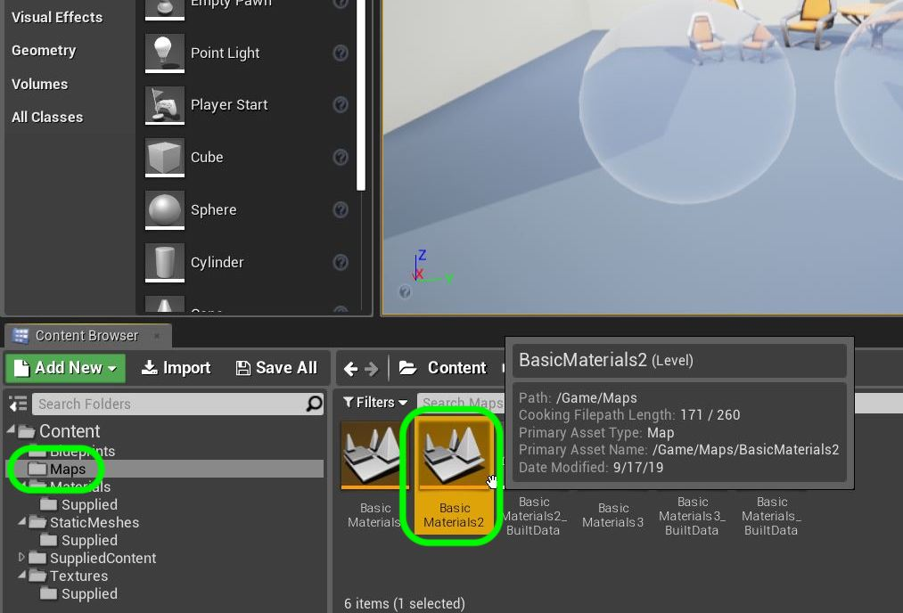  

_____ 
### World Aligned Materials
What happens if I want a long stretch of brick wall that follows different shaped and placed geometries.  It would take a lot of painstaking tweaking to align all the UV's.  There is a better way in unreal to use world coordinates to place the UVs.

_____ 



{:start="{{ num }}"}
{{ num }}.  Now move the camera to **Room 7** and press **Build** to set the lighting in the room.

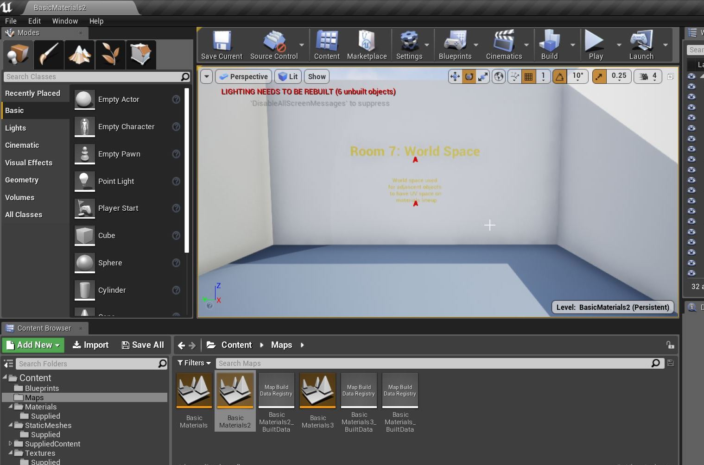  

_____ 



{:start="{{ num }}"}
{{ num }}.  Now add **StaticMeshes \| Supplied \| Wall 400x400** and place them next to each other but offset.  We want to have the bricks line up properly.  

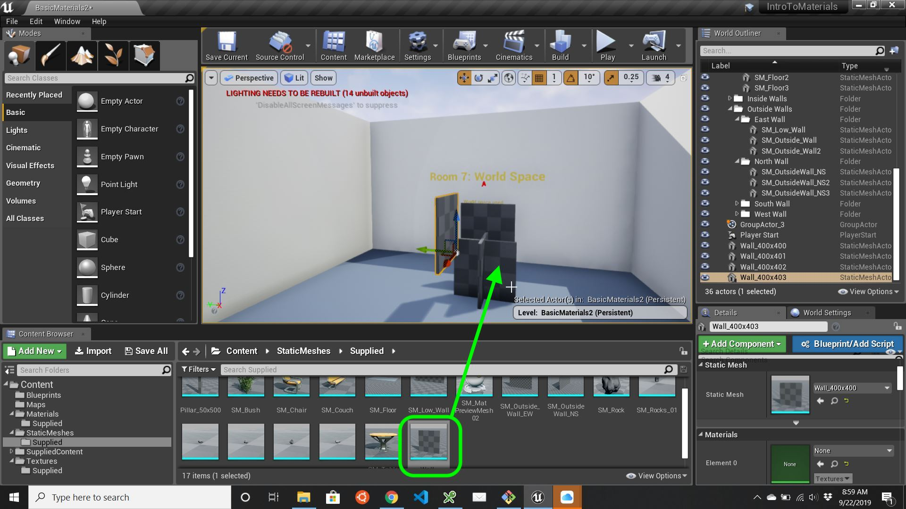  

_____ 


{:start="{{ num }}"}
{{ num }}.  Assign **M_Brick_Clay_Beveled** to the new wall pieces.  Move them and notice that we would have to zoom in to line up the bricks so the rows spread from one wall piece to another.  We can solve this by using World Space then all the objects will align with the texuture automatically.  Lets take a look.

  

_____ 


{:start="{{ num }}"}
{{ num }}.  Add a new **Material** called `M_RockWS`.

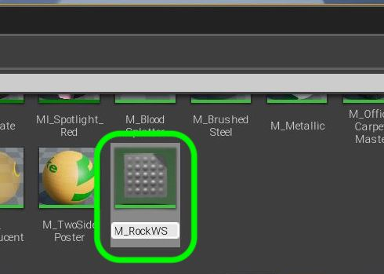  

_____ 


{:start="{{ num }}"}
{{ num }}.  Open the material and add a **Texture Sample** node adding the **T_Brick_Hewn_Stone_D** texture:

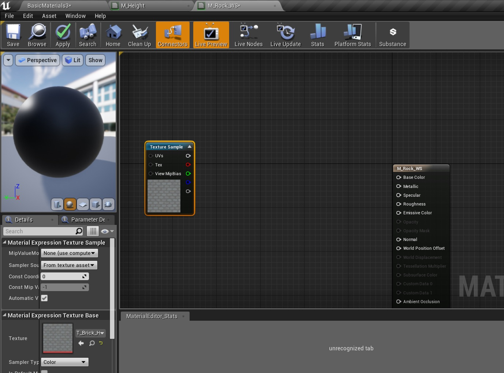  

_____ 



{:start="{{ num }}"}
{{ num }}. Add a **World Aligned Texture** node to the graph:

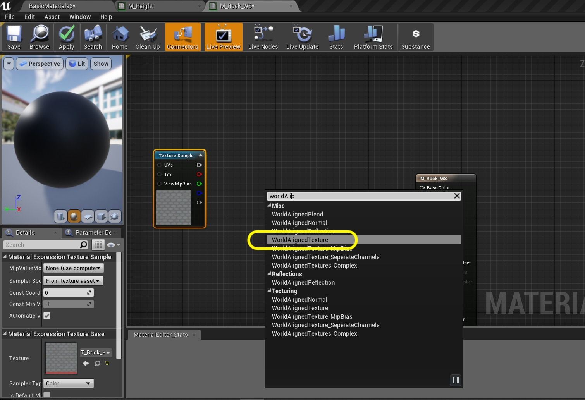  

_____ 



{:start="{{ num }}"}
{{ num }}. Try to connect the two nodes.  Woops we get an error:

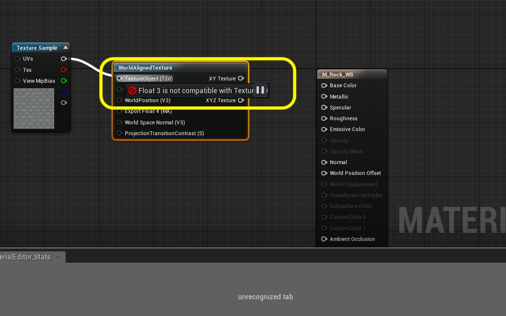  

_____ 
 



{:start="{{ num }}"}
{{ num }}. Highlight over the input of the **World Aligned Textured** node and see that it wants a **Texture Object**. Add a **Texture Object Parameter** node and delete the **Texture Sample** node and call it `WSRockDiffuse`. Assign the **T_Brick_Hewn_Stone_D** texture

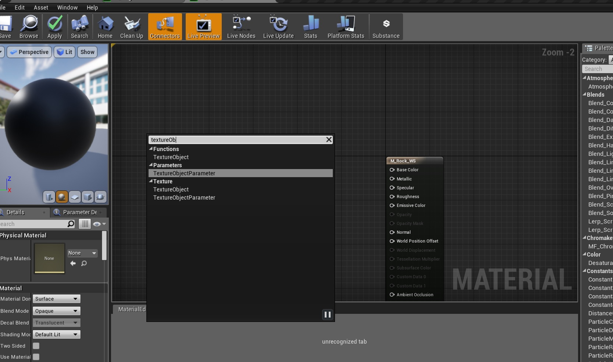  

_____ 


{:start="{{ num }}"}
{{ num }}. Now connect the output of the Texture Object and plug it into the input of the **World Aligned Texture** node:

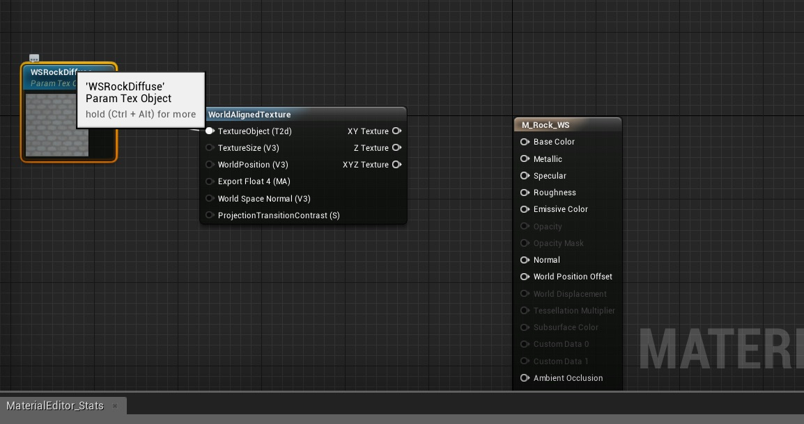  

_____ 



{:start="{{ num }}"}
{{ num }}. Connect the **XYZ Texture** output of the World Aligned Texture node to **Base Color** in the main material node.  Press the **Apply** button.

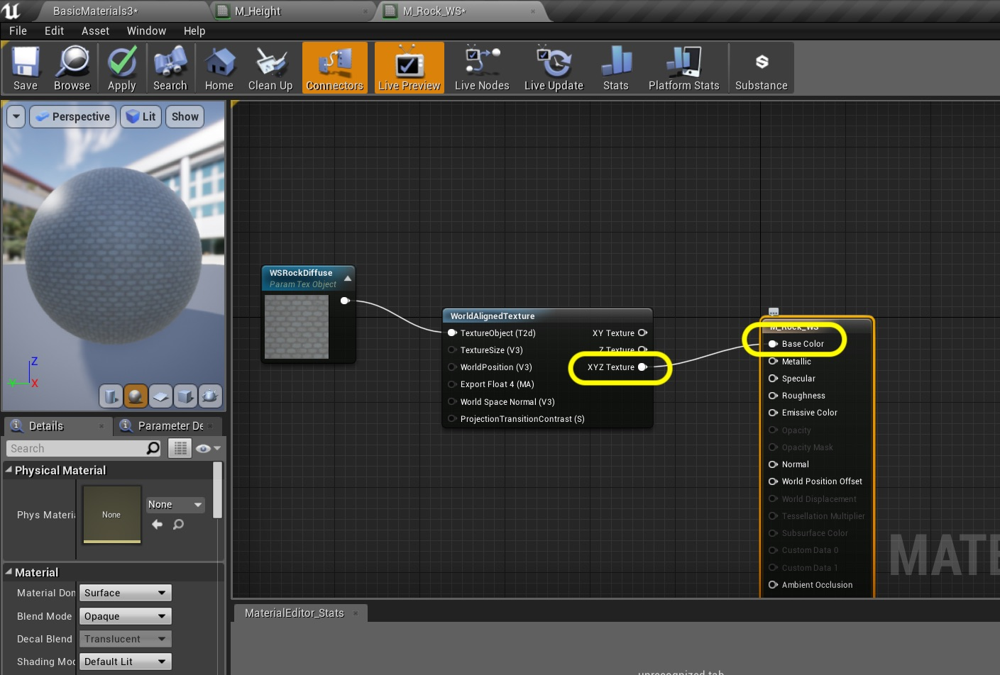  

_____ 



{:start="{{ num }}"}
{{ num }}. Select all the cube walls in **Room 13**.  Assign **M_RockWS** to them. You should see that even though the rock textures are very small that they align based on world position.  

  

_____ 


{:start="{{ num }}"}
{{ num }}. Move a wall around and see the UVs adjust. Notice that it is using World Space to map the UV's so they all line up based on where the material is located.  So for something like a brick wall, the bricks will always align.

  

_____ 



{:start="{{ num }}"}
{{ num }}. If we go back to the material and hover over the Texture Size node it states that it defaults it to world size of `64, 64, 64`.  UE4's size is 1 unit per milimeter so 6.4 cm or 2.5 inches is not large enough.

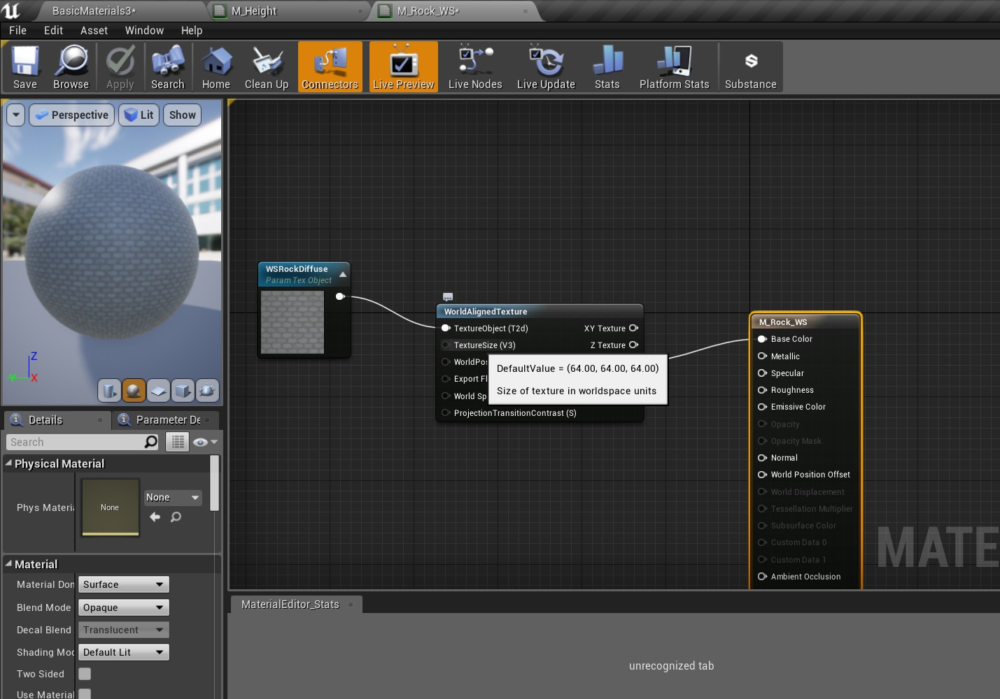  

_____ 



{:start="{{ num }}"}
{{ num }}. Add a **Constant Vector 3** node set to `128, 128, 128`.  This will effectively double the size.  Connect the output to **Texture Size** on World Aligned Texture node.  Press the **Apply** button.

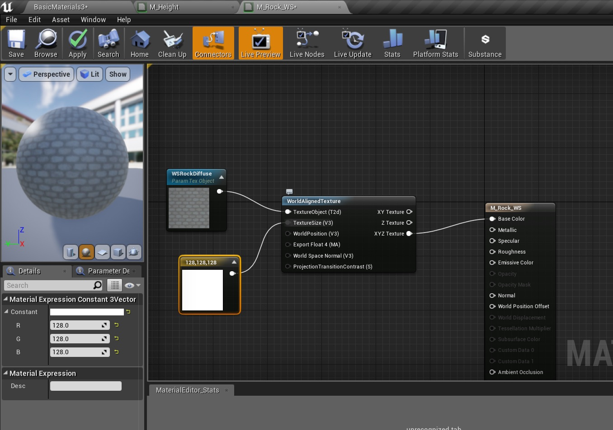  

_____ 



{:start="{{ num }}"}
{{ num }}. Apply the change and look at it in game:

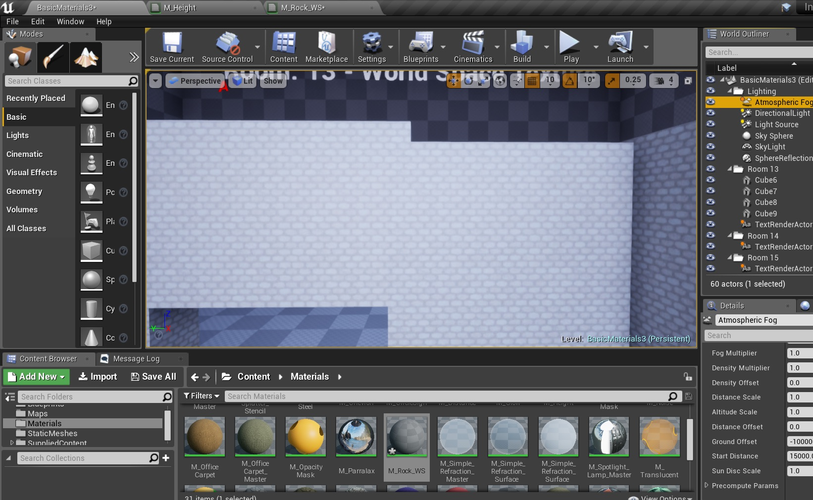  

_____ 



{:start="{{ num }}"}
{{ num }}. Add another **Texture Object Parameter**, name it `WSRockNormal` and assign the normal texture that goes with this diffuse:

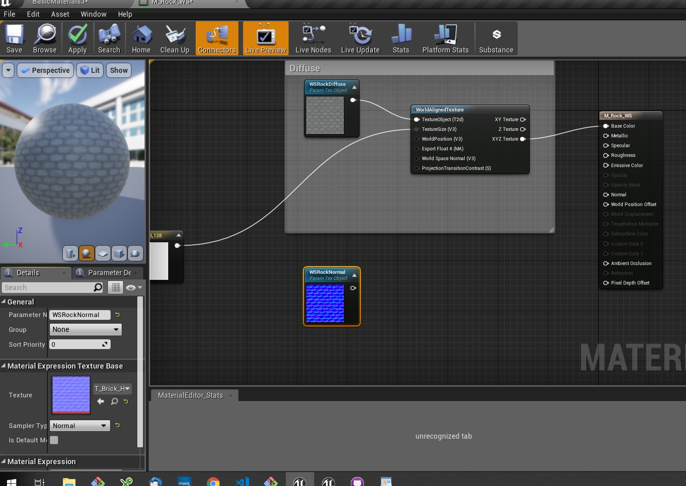  

_____ 



{:start="{{ num }}"}
{{ num }}. Add a **World Aligned Normal** node.  Connect the Vector 3 to the size to make the normal the same size as the diffuse.  Connect the output of the Texture Object Normal to the input. Send the **XYZ Texture** output to the **Normal** input on the main material node.

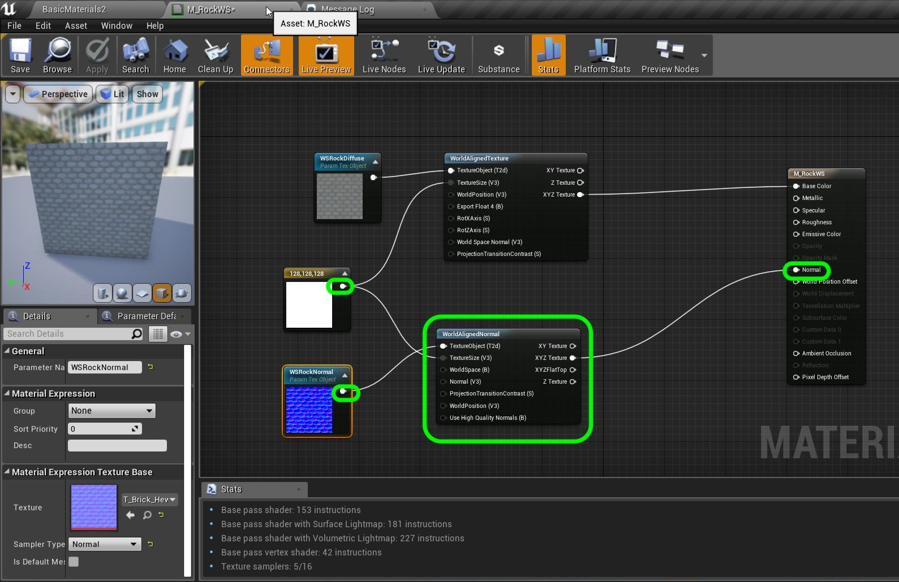  

_____ 



{:start="{{ num }}"}
{{ num }}. Multiply a color you want to tint the texture in the diffuse:

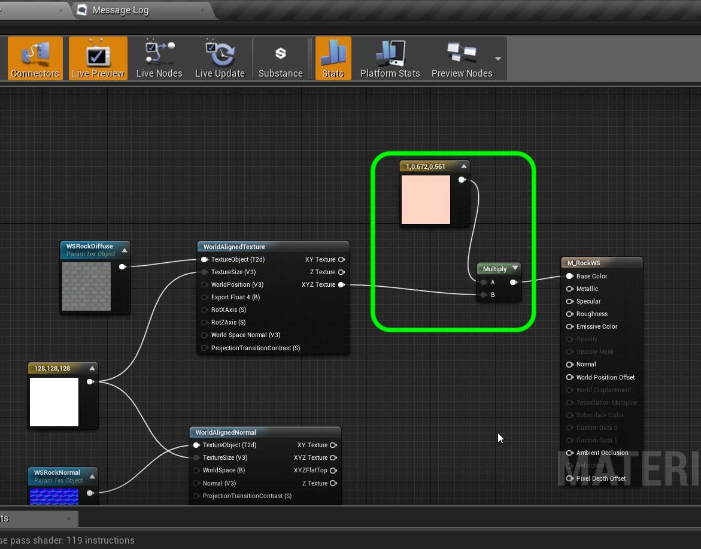  

_____ 


{:start="{{ num }}"}
{{ num }}. Add a Scalar and set it to `1`.  Attach it to the **Roughness** node and press the **Apply** button.

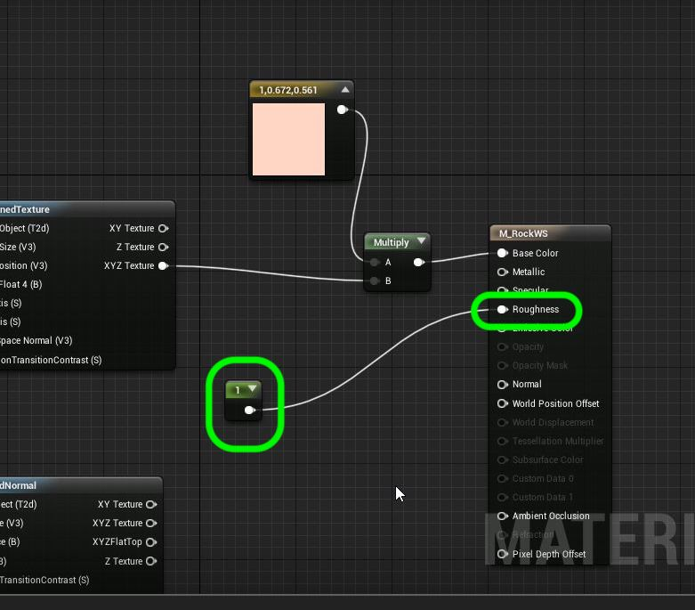  

_____ 


{:start="{{ num }}"}
{{ num }}. Go into the game and move things around and enjoy your seemless textures:

  

_____ 



{:start="{{ num }}"}
{{ num }}. That's it for Room 7. Press **Save All** and update Github by **committing** and **pushing** all the changes made.  Next up we will be animating the UV's of a texture.

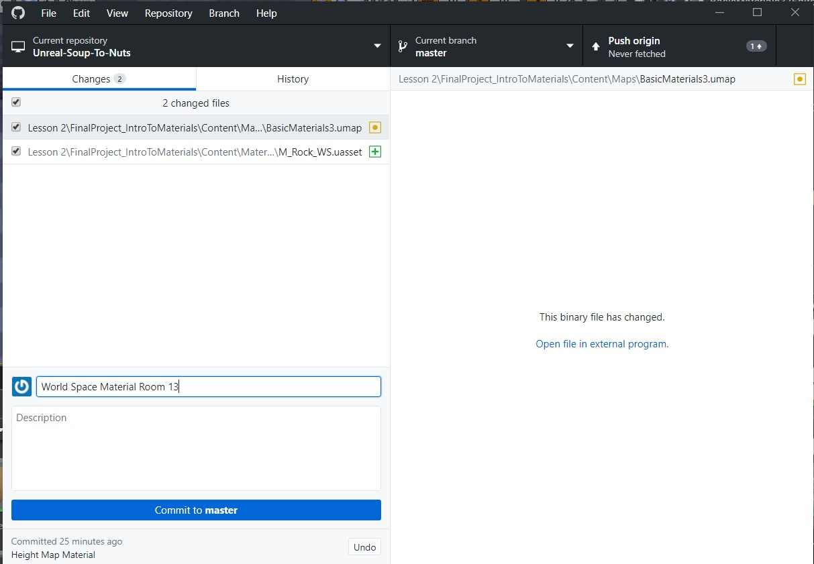  

_____ 

  

[<- Previous](Intro-To-Materials-11.html)&nbsp;&nbsp;&nbsp;[Home](../index.html)&nbsp;&nbsp;&nbsp; [Continue ->](Intro-To-Materials-13.html)
   
   
   

