# UE4 Intro To Materials - Page 14
_____ 

## Index
_____ 

* Part 1 - Getting Setup
1. [Getting Set Up](Intro-To-Materials-1#getting-set-up)
2. [Creating a Diffuse Map](Intro-To-Materials-2.html#creating-a-diffuse-map.html#starting-unreal-engine-4)

* Part 2 - Our First Material
1. [Diffuse Only Material](Intro-To-Materials-3.html#diffuse-only-material)
2. [Texture Coordinate](Intro-To-Materials-4.html#texture-coordinate)
3. [Normal Mapping](Intro-To-Materials-4.html#normal-mapping)
4. [Roughness and Metallic Constants](Intro-To-Materials-5.html#roughness-and-metallic-constants)

* Part 3 - Material Instances
1. [Material Instance Diffuse](Intro-To-Materials-5.html#material-instance-diffuse)
2. [Metallic and Roughness Parameters](Intro-To-Materials-6.html#metallic-and-roughness-parameters)
3. [Normal Map Parameter](Intro-To-Materials-6.html#normal-map-parameter)
4. [UV Parameters](Intro-To-Materials-6.html#uv-parameters)

* Part 4 - Masked and Transluscent Materials
1.  [Metallic Mask](Intro-To-Materials-7.html#metallic-mask)
2.  [Opacity Mask](Intro-To-Materials-7.html#opacity-mask)
4.  [Translucent Blend Mode](Intro-To-Materials-8.html#translucent-blend-mode)

* Part 5 - Illumination
1.  [Importing a Model](Intro-To-Materials-8.html#importing-a-model)
2.  [Bracket Material](Intro-To-Materials-8.html#bracket-material)
3.  [Lamp Material](Intro-To-Materials-9.html#lamp-material)

* Part 6 - More Material Concepts
1.  [Two Sided Material](Intro-To-Materials-10.html#two-sided-material)
2.  [Decals](Intro-To-Materials-10.html#decals)
3.  [Refraction and Fresnel](Intro-To-Materials-11.html#refraction-and-fresnel)
4. [World Aligned Materials](Intro-To-Materials-12.html#world-aligned-materials)
## Index
_____ 

* Part 1 - Getting Setup
1. [Getting Set Up](Intro-To-Materials-1#getting-set-up)
2. [Creating a Diffuse Map](Intro-To-Materials-2.html#creating-a-diffuse-map.html#starting-unreal-engine-4)

* Part 2 - Our First Material
1. [Diffuse Only Material](Intro-To-Materials-3.html#diffuse-only-material)
2. [Texture Coordinate](Intro-To-Materials-4.html#texture-coordinate)
3. [Normal Mapping](Intro-To-Materials-4.html#normal-mapping)
4. [Roughness and Metallic Constants](Intro-To-Materials-5.html#roughness-and-metallic-constants)

* Part 3 - Material Instances
1. [Material Instance Diffuse](Intro-To-Materials-5.html#material-instance-diffuse)
2. [Metallic and Roughness Parameters](Intro-To-Materials-6.html#metallic-and-roughness-parameters)
3. [Normal Map Parameter](Intro-To-Materials-6.html#normal-map-parameter)
4. [UV Parameters](Intro-To-Materials-6.html#uv-parameters)

* Part 4 - Masked and Transluscent Materials
1.  [Metallic Mask](Intro-To-Materials-7.html#metallic-mask)
2.  [Opacity Mask](Intro-To-Materials-7.html#opacity-mask)
4.  [Translucent Blend Mode](Intro-To-Materials-8.html#translucent-blend-mode)

* Part 5 - Illumination
1.  [Importing a Model](Intro-To-Materials-8.html#importing-a-model)
2.  [Bracket Material](Intro-To-Materials-8.html#bracket-material)
3.  [Lamp Material](Intro-To-Materials-9.html#lamp-material)

* Part 6 - More Material Concepts
1.  [Two Sided Material](Intro-To-Materials-10.html#two-sided-material)
2.  [Decals](Intro-To-Materials-10.html#decals)
3.  [Refraction and Fresnel](Intro-To-Materials-11.html#refraction-and-fresnel)
4. [World Aligned Materials](Intro-To-Materials-12.html#world-aligned-materials)
5.  [Animation](Intro-To-Materials-13.html#animation)

* Part 7 - A Practical Master Material
1.  [A Practical Master Material](Intro-To-Materials-14.html#a-practical-master-material)
2.  [A Practical Master Material Part II](Intro-To-Materials-15.html#a-practical-master-material-part-ii)
3.  [A Practical Master Material Part III](Intro-To-Materials-16.html#a-practical-master-material-part-iii)

_____ 
5.  [Animation](Intro-To-Materials-13.html#animation)

* Part 7 - A Practical Master Material
1.  [**A Practical Master Material**](Intro-To-Materials-14.html#a-practical-master-material)
2.  [A Practical Master Material Part II](Intro-To-Materials-15.html#a-practical-master-material-part-ii)
3.  [A Practical Master Material Part III](Intro-To-Materials-16.html#a-practical-master-material-part-iii)

_____ 

## Part 7 - A Practical Master Material

Now lets make a Material that is flexible to handle many different situations and can be used as a Material instance for most scenarios.  This is a Material that you can keep using for the rest of the course.  It can be expanded on to include even more nodes on your own.

_____ 

### A Practical Master Material

_____ 



{:start="{{ num }}"}
{{ num }}. Create a new **Material** and call it `M_Base_Master`.  Add a **Texture Sample Parameter 2D** node to it so we can customize the texture.  Call this node `Base Texture`.

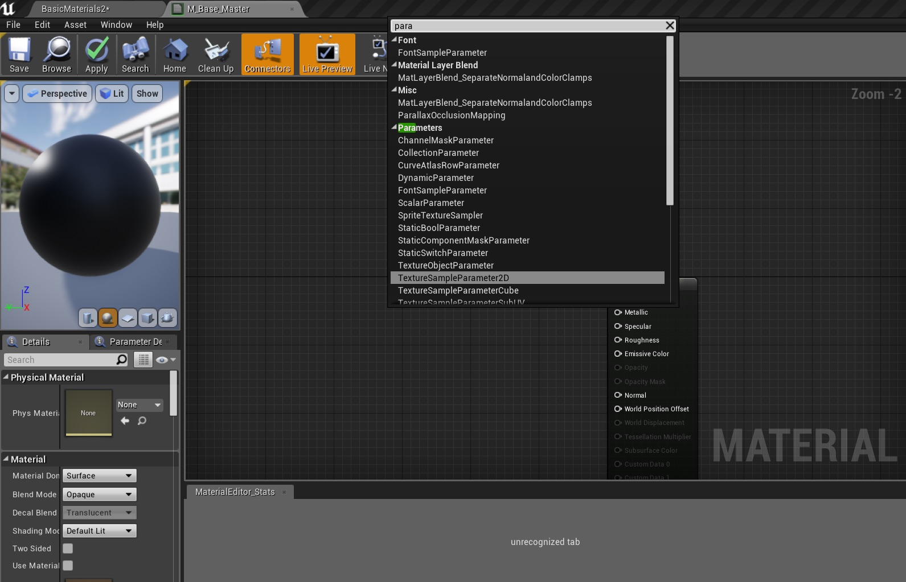  

_____ 



{:start="{{ num }}"}
{{ num }}. Assign `T_CobbleStone_Rough_D` to the texture and change its group from **None** to `Diffuse`

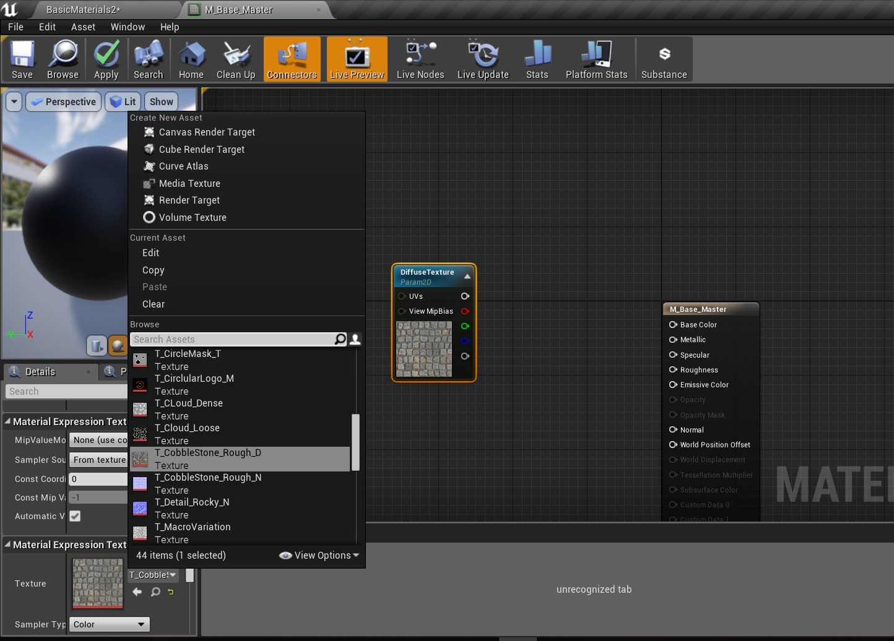  

_____ 



{:start="{{ num }}"}
{{ num }}. Add a **Vector Parameter** node and pick a base color, Name it **Base Color**. Set the **Group** to `Diffuse`. Feed the color and texture into a **Multiply** node.  Add a **Static Switch Parameter** node:

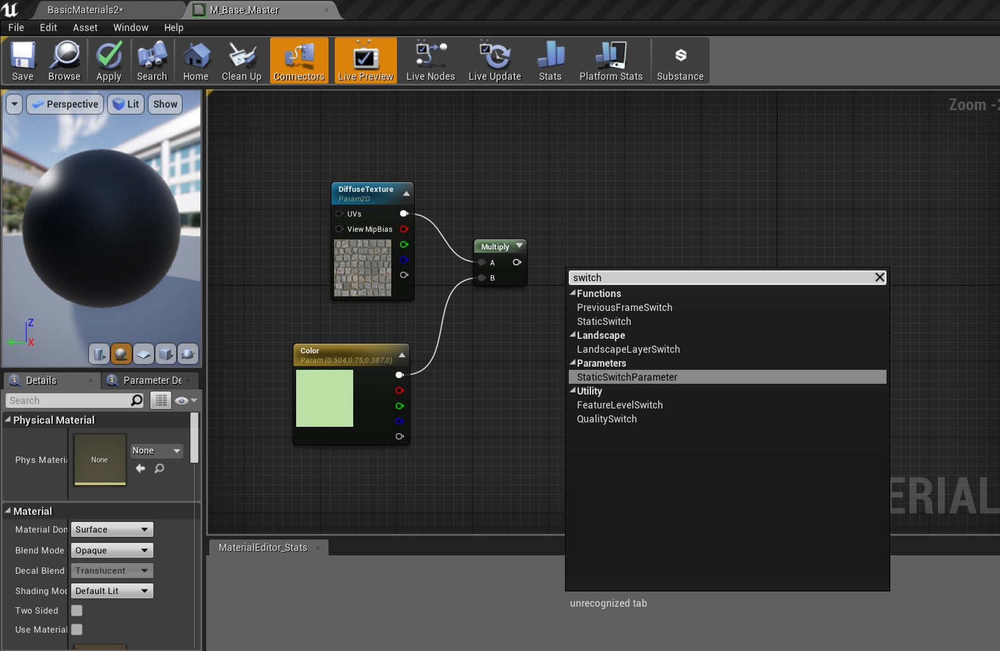  

_____ 



{:start="{{ num }}"}
{{ num }}. Name the **Switch** `Use Texture?`.  Change the group to `Diffuse`.  Feed the output of the color to the **False** input the the output of the **Multiply** into the **True** input.  Feed the switch output into the **Base Color** in the main node.

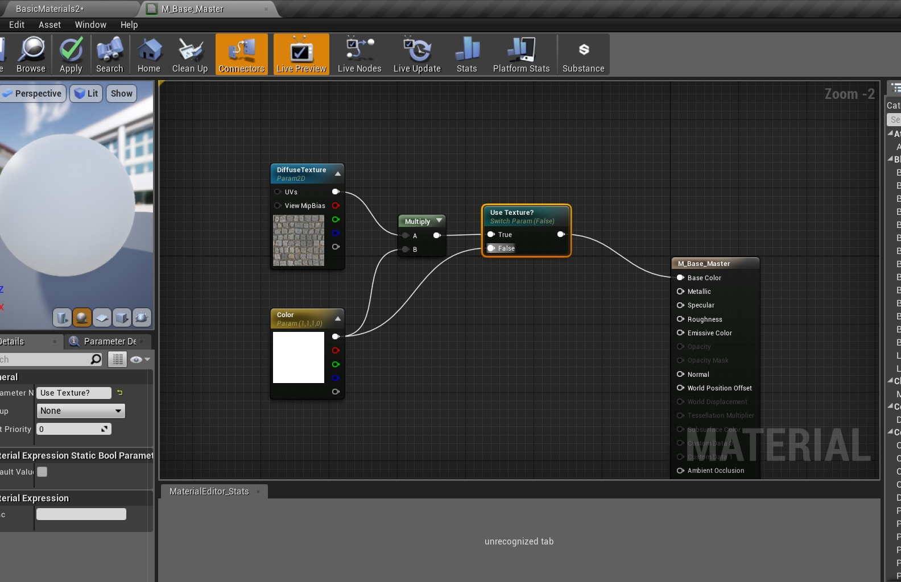  

_____ 


{:start="{{ num }}"}
{{ num }}. Keep the default for the switch at `true` but you can see what this node does when we switch between true and false.

  

_____ 



{:start="{{ num }}"}
{{ num }}. Add a comment to best explain the node.  This allows us to use either a solid color or a texture or a texture multiplied by a color.  Remember if you multiply by white it leaves the texture alone (any number times 1 stays the same). Lets change the default color to white (1, 1, 1) as well:

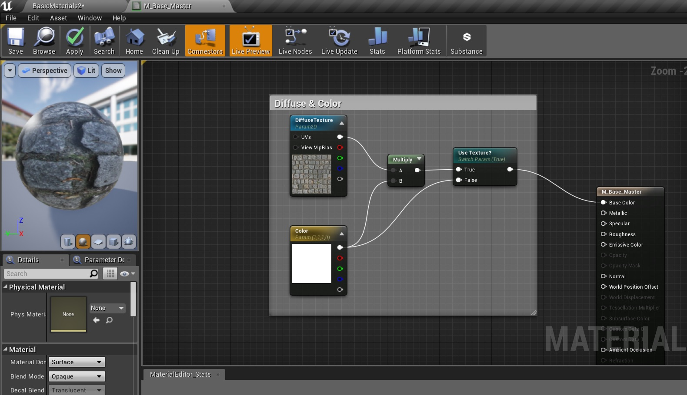  

_____ 



{:start="{{ num }}"}
{{ num }}. Lets give the user the ability to customize UV's and not just be stuck with the default 1,1 setting.  Add another **Static Switch Parameter** and call it `Adjust UV Coordinates?` and change the **Group** in the **Details** panel to `UV`.  Also, drop a **Texture Coordionate Node** and leave its default 1,1 setting:

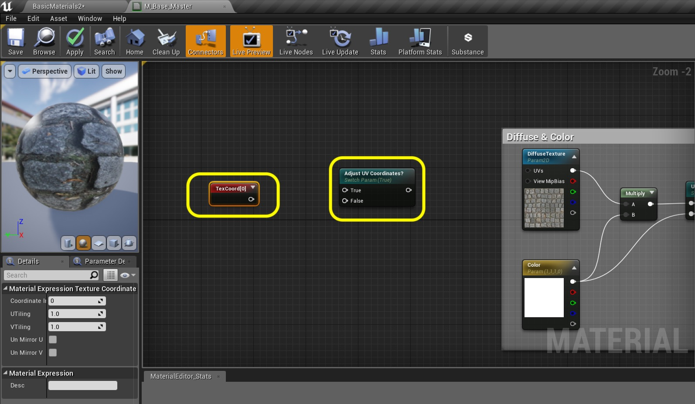  

_____ 



{:start="{{ num }}"}
{{ num }}. Add two **Scalar Parameter** nodes called `UScalar` and `VScalar`.  Set their group to `UV`.  Set their defaults both to `1`.  Combine them in an **Append** node:

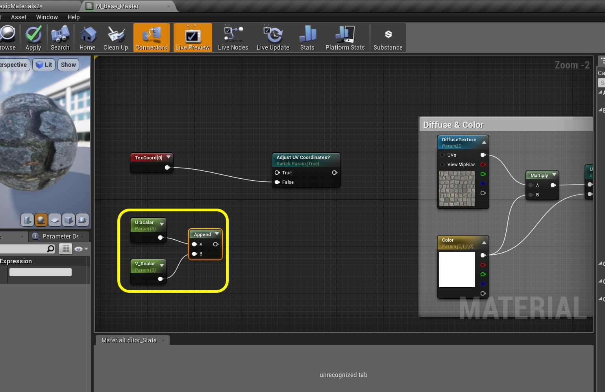  

_____ 



{:start="{{ num }}"}
{{ num }}. Hook the output of the **Texture Coordinate** node to the **False** pin of the switch.  Add a **Multiply** node sending the output of the **Append** into the B input and the output of the **Texture Coordinate** to the A output. Send the output of the **Multiply** node to the **True** input of the **Switch Parameter** node.  Send the output of the Switch to the **UVs** input on the texture node:

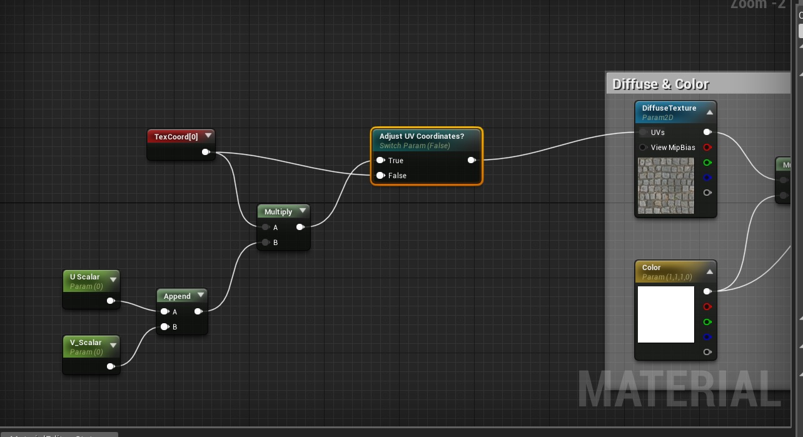  

_____ 



{:start="{{ num }}"}
{{ num }}. Add a comment to the UV section and clean up your graph which should look like:

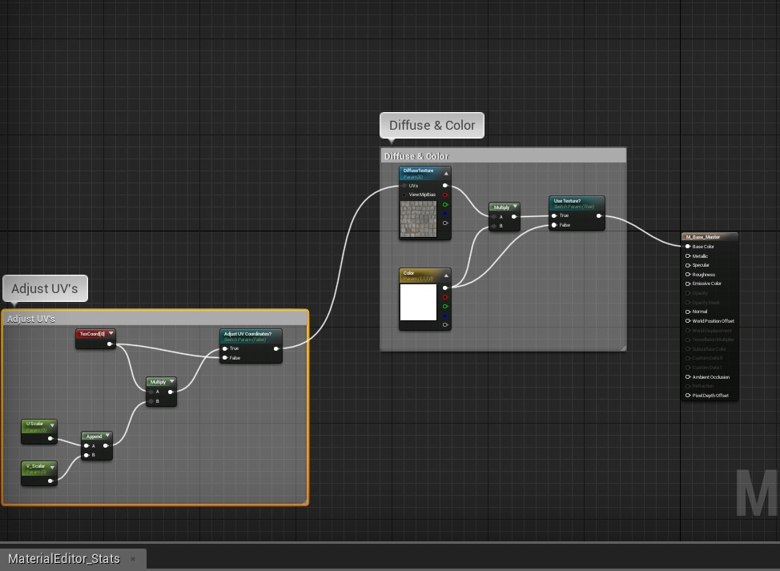  

_____ 


{:start="{{ num }}"}
{{ num }}. Lets create the nodes for the **Metallic** input.  Add a **Static Switch Parameter** and call it `Use Metallic Texture?` and add the group `Metallic`.  Add a **Scalar Parameter** node call it `Metallic Scalar` and add it to the group `Metallic`.  Send the output of this node to the **False** pin in the **Switch**.  Add a **Texture Sample Parameter 2D**, call it `Metallic Mask` and assign a base texture to it (I picked one of my clouds). Assign it to **Group** `Metallic`. Set the default mask to what you think the most likely setting will be (which could be false).  Connect the output of the **Switch** to the **Metallic** pin:

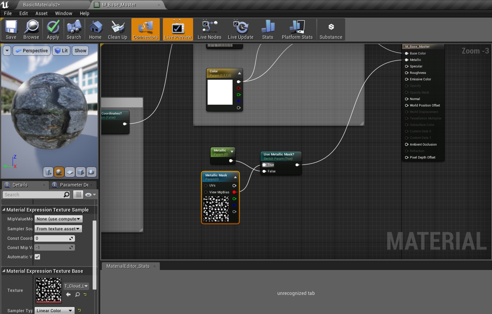  

_____ 


{:start="{{ num }}"}
{{ num }}. Add a comment then copy and paste the entire group and place it below as we will use this for roughness which will be similar:

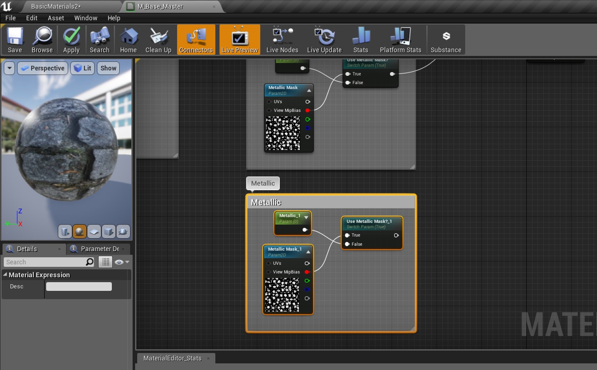  

_____ 



{:start="{{ num }}"}
{{ num }}. Change the names altering **Metallic** to `Roughness`.  Change all the groups to `Roughness`. Connect the output to the Roughness input.

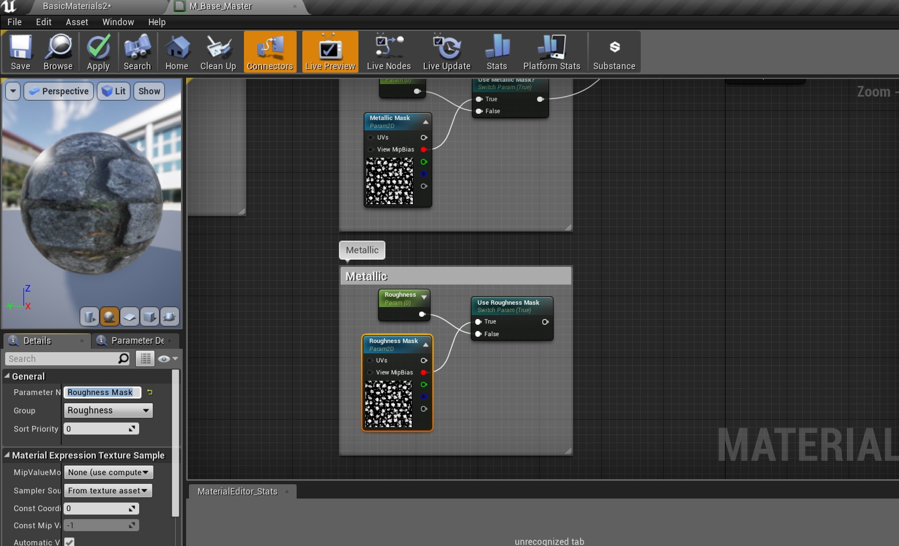  

_____ 


{:start="{{ num }}"}
{{ num }}. You node graph should look like:

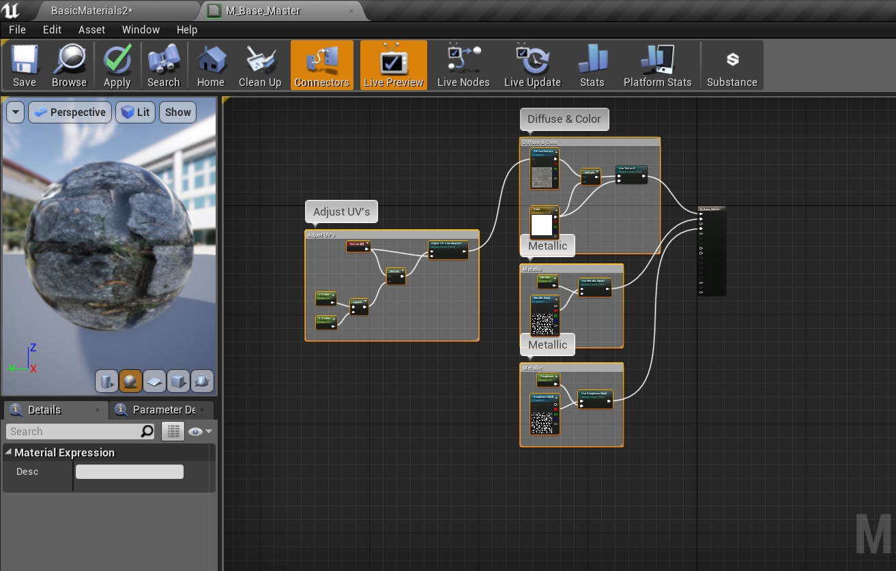  

_____ 


{:start="{{ num }}"}
{{ num }}. The **Emissive** will be a bit different.  Add another **Static Switch Parameter** node, call it `Use Emissive Mask?`.  Add a **Texture Sample Parameter 2D** node called `Emissive Mask`, assign the cloud texture and add a **Scalar Parameter** node set to `3` called `Emissive Scalar`.  Set all of their groups to `Emissive`.

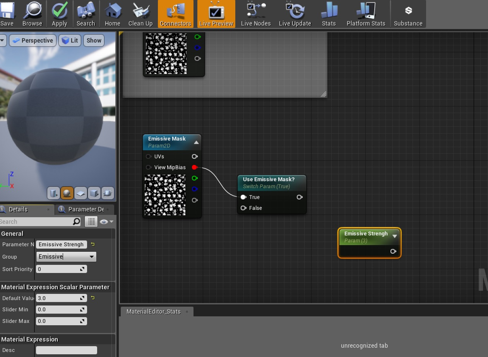  

_____ 


{:start="{{ num }}"}
{{ num }}. Add a **Vector Parameter** node called `Emissive Color` and set it group to `Emissive`.  Add a **Multiply** node.  Add a **Scalar Parameter** and call it `Emissive Strength` defaulting to `3`.  Set its group to `Emissive`:

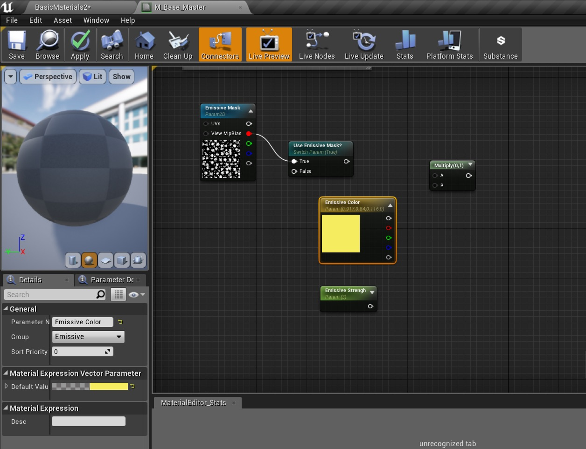  

_____ 


{:start="{{ num }}"}
{{ num }}.  Connect the output of the **Emissive Mask** to the **True** pin on the **Use Emissive Mask?** switch.  Connect a `0` **Constant** node into the **False** pin of the Emissive Switch.  Send the output of the switch to a new **Multiply** node.

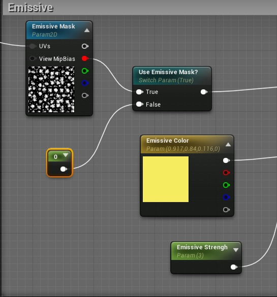  

_____ 


{:start="{{ num }}"}
{{ num }}. Multiply the output of the **Multiply** node to the ouput of the **Switch** node.  Send the output of this new Multiply to the **Emissive Color** pin:

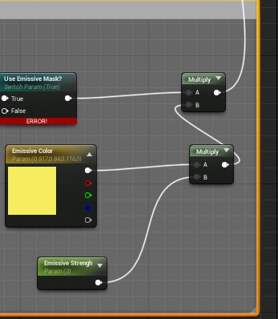  

_____ 


{:start="{{ num }}"}
{{ num }}. Add a comment and Your graph should look like:

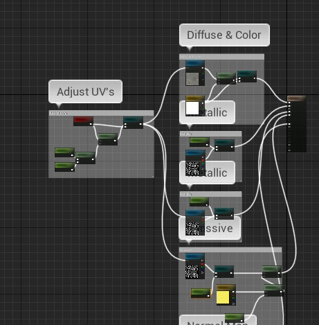  

_____ 



{:start="{{ num }}"}
{{ num }}. Now lets get to the trickiest part of our graph the **Material** normal.  Add a **Texture Sample Parameter 2D** and call it `Normal Texture` and assign it to the `Normal` **Group**.  In my case UE4 automatically picked the same filename using the `_N` suffix. Add a **Static Switch Parameter** and call it `Use Normal Map?` and assign it to the `Normal` group.  Now add a **Constant Vector 3** to the node tree and assign it `0,0,1` (or blue).  This is the orthoganal normal for a plane and will add no bumps or lighting changes.  Send this into the **False** input of the **Switch**.  Send the output of the **Normal Texture** to the **True** pin of the **Switch**.

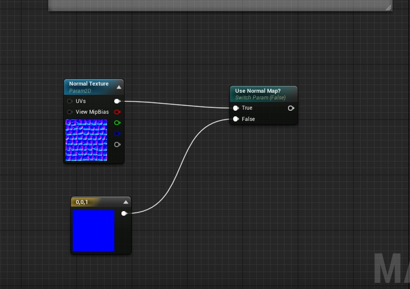  

_____ 



{:start="{{ num }}"}
{{ num }}. Add a comment and connect the output to the **Normal** pin and it should look like:

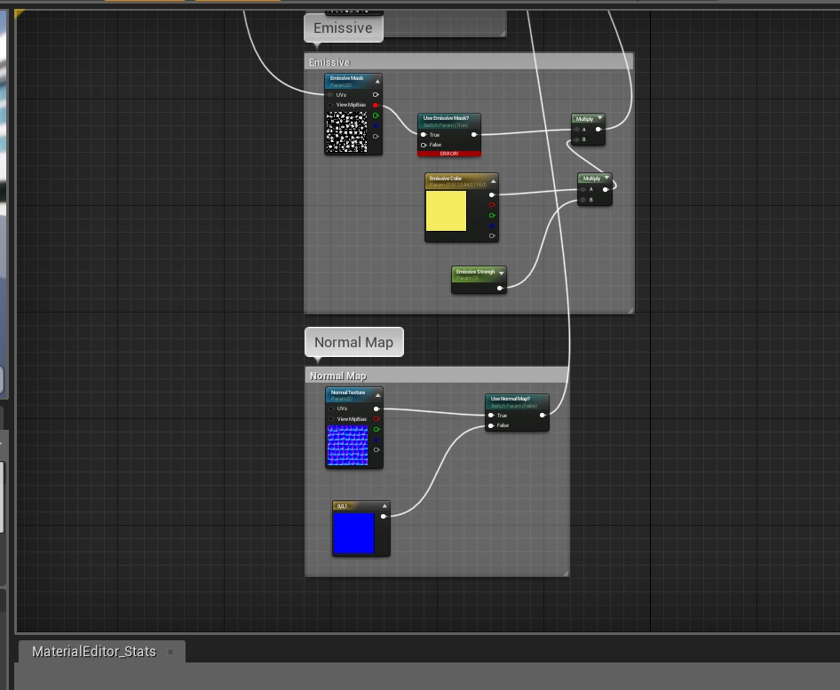  

_____ 



{:start="{{ num }}"}
{{ num }}. And the entire node graph should look like this.  Press the **Apply** button.  On the next page we will go into the game and give this a go!

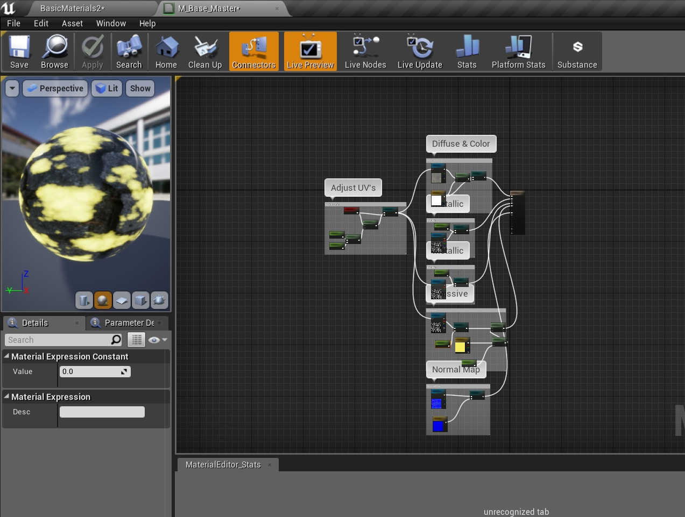  

_____ 
  

[<- Previous](Intro-To-Materials-13.html)&nbsp;&nbsp;&nbsp;[Home](../index.html)&nbsp;&nbsp;&nbsp; [Continue ->](Intro-To-Materials-15.html)
   
   
   

