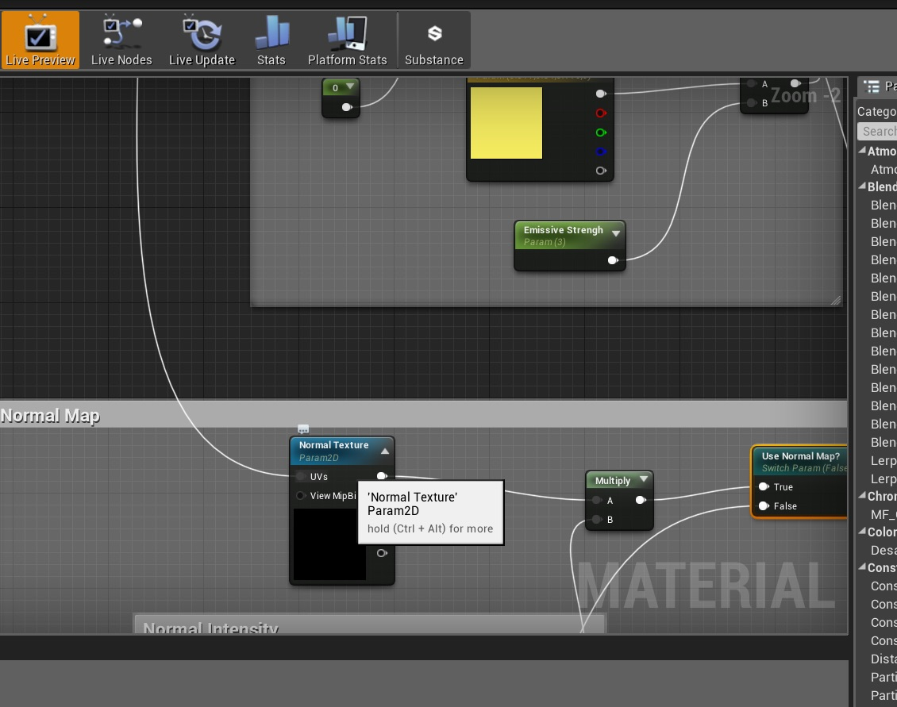

# UE4 Intro To Materials - Page 15
_____ 

## Index
_____ 

* Part 1 - Getting Setup
1. [Getting Set Up](Intro-To-Materials-1#getting-set-up)
2. [Creating a Diffuse Map](Intro-To-Materials-2.html#creating-a-diffuse-map.html#starting-unreal-engine-4)

* Part 2 - Our First Material
1. [Diffuse Only Material](Intro-To-Materials-3.html#diffuse-only-material)
2. [Texture Coordinate](Intro-To-Materials-4.html#texture-coordinate)
3. [Normal Mapping](Intro-To-Materials-4.html#normal-mapping)
4. [Roughness and Metallic Constants](Intro-To-Materials-5.html#roughness-and-metallic-constants)

* Part 3 - Material Instances
1. [Material Instance Diffuse](Intro-To-Materials-5.html#material-instance-diffuse)
2. [Metallic and Roughness Parameters](Intro-To-Materials-6.html#metallic-and-roughness-parameters)
3. [Normal Map Parameter](Intro-To-Materials-6.html#normal-map-parameter)
4. [UV Parameters](Intro-To-Materials-6.html#uv-parameters)

* Part 4 - Masked and Transluscent Materials
1.  [Metallic Mask](Intro-To-Materials-7.html#metallic-mask)
2.  [Opacity Mask](Intro-To-Materials-7.html#opacity-mask)
4.  [Translucent Blend Mode](Intro-To-Materials-8.html#translucent-blend-mode)

* Part 5 - Illumination
1.  [Importing a Model](Intro-To-Materials-8.html#importing-a-model)
2.  [Bracket Material](Intro-To-Materials-8.html#bracket-material)
3.  [Lamp Material](Intro-To-Materials-9.html#lamp-material)

* Part 6 - More Material Concepts
1.  [Two Sided Material](Intro-To-Materials-10.html#two-sided-material)
2.  [Decals](Intro-To-Materials-10.html#decals)
3.  [Refraction and Fresnel](Intro-To-Materials-11.html#refraction-and-fresnel)
4. [World Aligned Materials](Intro-To-Materials-12.html#world-aligned-materials)
5.  [Animation](Intro-To-Materials-13.html#animation)

* Part 7 - A Practical Master Material
1.  [A Practical Master Material](Intro-To-Materials-14.html#a-practical-master-material)
2.  [**A Practical Master Material Part II**](Intro-To-Materials-15.html#a-practical-master-material-part-ii)
3.  [A Practical Master Material Part III](Intro-To-Materials-16.html#a-practical-master-material-part-iii)

_____ 

### A Practical Master Material Part II

_____ 



{:start="{{ num }}"}
{{ num }}.  Scroll over to **Room 9** which is misnamed to **Room 8**.  Click on **World Outliner \| Room 9 \| Title3** in the game and change the room number to `9`.  Go to **Static Meshes \| SM_MatPreviewMesh02** and put a copy in the room. 

  

_____ 


{:start="{{ num }}"}
{{ num }}.  Right click on **M_Base_Master** and select **Create Material Instance** and call it `MI_Cobblestone`.

  

_____ 



{:start="{{ num }}"}
{{ num }}.  Add the material to the static mesh.  It might look hideous.  So lets double click our **MI_Cobblestone** and make some changes.  Make sure the **Emissive** mask off, Make **Metallic** `0` and turn off its mask.  Make **Roughness** `1` and turn off its mask.  Change the *UVs* to `2,2`.  Turn on the **Normal Map** and select the `T_CobbleStone_Rough_N** texture.  Press **Save** and check it out in game. 

  

_____ 



{:start="{{ num }}"}
{{ num }}. Go back to the game and drag the **MI_Cobblestone** to the static mesh in the level.

  

_____ 



{:start="{{ num }}"}
{{ num }}. Now we can make this even better.  Open **M_Base_Master**.  We can alter the size of the intensity of the normal.  Create 2 **Constant Vector 3** and make one `1,1,0` and the other `0,0,1`.  Take the output of the Yellow Vector 3 and plug into the A side of a **Multiply** node.  Add a **Scalar Parameter** called `Normal Intensity` set to `1` with a **Group** set to `Normal`.  This feeds into the B side of the **Multiply** node:  

  

_____ 
 



{:start="{{ num }}"}
{{ num }}. Put an **Add** node and feed the **B** side with the output of the above multiply and the **A** side with the output of the **Blue** constant:

  

_____ 


{:start="{{ num }}"}
{{ num }}.  Add a **Multiply** node.  Now take the **Output** of the **Add** node and connect it to the **B** side of the multiply node.  Add the output of the normal texture to the **A** side.  Then send the output of the multiply to the Switch true input.

  

_____ 



{:start="{{ num }}"}
{{ num }}. When you have complicated nodes you can have comments within comments.  I would select the nodes that affect intensity and give it its own comment:

  

_____ 



{:start="{{ num }}"}
{{ num }}. Press the **Apply** button.  Lets go into the **MI_Cobblestone** and set the **Normal Intensity** in the material instance to a large number like `30`.  Go to the game and look at the result. Hmm, it is more intense but it looks funny:

  

_____ 



{:start="{{ num }}"}
{{ num }}. Look at the graph and see if you can spot the problem. We have not connected the UV pins in anything except the diffuse texture.  Connect the output of the `UV` bank **Adjust UV Coordinates** Switch Parameter to the input UV of the main normal texture.  Press the **Apply** button.

  

_____ 



{:start="{{ num }}"}
{{ num }}. Do the same thing for the textures in **Metallic**, **Roughness** and **Emissive**. Make sure UVs get sent to all your textures:

  

_____ 



{:start="{{ num }}"}
{{ num }}. Compile your main material and set the intensity on the instance to `3`:

  

_____ 



{:start="{{ num }}"}
{{ num }}. The normal looks more intense and lines up properly with the diffuse texture:

  

_____ 



{:start="{{ num }}"}
{{ num }}. Try a normal intensity of `.5` and you should see a much less prominent normal.  Cool! Go back to an intensity of say `2`.

  

_____ 



{:start="{{ num }}"}
{{ num }}. Lets add another common technique.  Surfaces can be complex and have many underlying patterns.  We can create a **Detail Normal** map to add even more subtlety to the bump.  Add another **Static Switch Parameter** and call it `Use Detail Normal?` and group it to `Normal`.  Then add a **Blend Angle Corrected Normal**:

  

_____ 



{:start="{{ num }}"}
{{ num }}. We use the blend angle correction as you cannot add normals or multiply normals like colors. More sophisticated math is hapenning under the hood.  Suffice to say that this combines two normal outputs into one and acts like adding two normals together.  Take the output of the **Switch** for detailed normal and the output of the **Switch** for the normal map and put them into the two input pins of the **Blend Angle Corrected Normal**. Connect the output back to the **Normal** input in the main node.

  

_____ 


{:start="{{ num }}"}
{{ num }}. Take the same output of the **Constant Vector 3** that is **0,0,1** and add it to the **False** input of the **Switch** for the detailed normal.  This will add nothing if this is set to false.

  

_____ 


{:start="{{ num }}"}
{{ num }}. Add a **Multiply** node and connect the output to the **True** input to the detail normal **Switch**:

  

_____ 



{:start="{{ num }}"}
{{ num }}. Add a **Texture Sample Parameter 2D** node and call it `Detail Normal Texture`, put it in **Group** `Normal` and assign **T_Detail_Rocky_N** to it:

  

_____ 


{:start="{{ num }}"}
{{ num }}. This will not connect to the normals of the larger texture.  We can set up separate UV's for the detail so it repeats over different sizes.  Copy and paste the Texture coordinate group minus the switch and paste it by the detailed normal like so.  Make room by scaling up your comment box so it all fits:

  

_____ 


{:start="{{ num }}"}
{{ num }}. Rename the parameters to `Detail U Scalar` and `Detail V Scalar`.  Change both **Groups** to `Normal`.  Connect the output of the **Multiply** to the UV input of the detail texture:

  

_____ 


{:start="{{ num }}"}
{{ num }}. Now we want to control the intensity of this detailed normal.  Lets copy and paste the intensity from the normal like so:

  

_____ 


{:start="{{ num }}"}
{{ num }}. Rename the Scalar to `Detailed Normal Intensity` and change the **Group** to `Normal`.  Add an **Add** node and hook up the blue channel to the top and the output of the multiply node to the bottom.  Channel the output of the **Add** node from the Intensity group to the multiply node before the **Switch**:

  

_____ 


{:start="{{ num }}"}
{{ num }}. Rename the comment:

  

_____ 


{:start="{{ num }}"}
{{ num }}. Your normal graph should look like:

  

_____ 



{:start="{{ num }}"}
{{ num }}. Now press the **Apply** button on your master and return to your material instance. Make sure your Use Detail Normal is set to true.  Play around with the UV's and Intensity to get an effect you like.  You can see this previewed on the sphere in the instance editor:

  

_____ 



{:start="{{ num }}"}
{{ num }}. Now you have a really detailed rock in game:

  

_____ 



{:start="{{ num }}"}
{{ num }}. Lets see how flexible this master material can be.  Lets copy and paste the **Static Mesh** in the game so we have a second copy:

  

_____ 



{:start="{{ num }}"}
{{ num }}. Now create a new **Material Instance** from the base master material:

  

_____ 



{:start="{{ num }}"}
{{ num }}. Call it `MI_Brick_Hewn_Stone`.  Assign this new material instance it to this new static mesh.

  

_____ 



{:start="{{ num }}"}
{{ num }}. Double click the material instance and assign as the **Diffuse** texture **T_Brick_Hewn_Stone_D**:

  

_____ 



{:start="{{ num }}"}
{{ num }}. Turn on **Use Metallic Mask** and assign **T_Brick_Hewn_Stone_M**

  

_____ 



{:start="{{ num }}"}
{{ num }}. Make sure the **Roughness** is set to `.5`.

  

_____ 



{:start="{{ num }}"}
{{ num }}. Assign the **Normal** map for the texture **T_Brick_Hewn_Stone_N**:

  

_____ 



{:start="{{ num }}"}
{{ num }}. If you want set the **Detail Normal** to your liking:

  

_____ 



{:start="{{ num }}"}
{{ num }}. Now save the instance and go ingame to see your two stones using the same master.  On the next page we will create a third example!

  

_____ 
  

[<- Previous](Intro-To-Materials-14.html)&nbsp;&nbsp;&nbsp;[Home](../index.html)&nbsp;&nbsp;&nbsp; [Continue ->](Intro-To-Materials-16.html)
   
   
   

