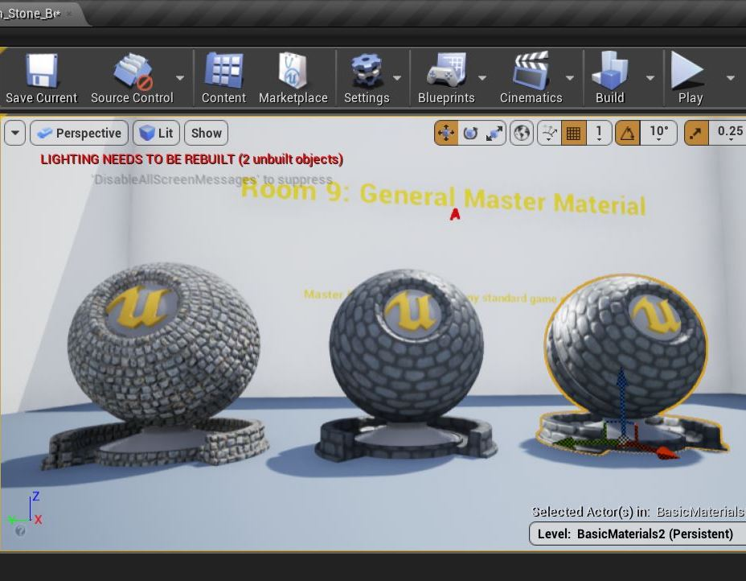
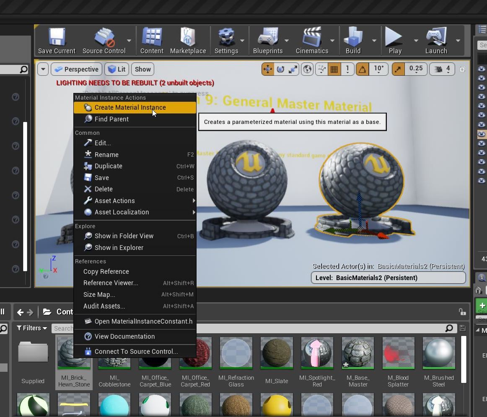
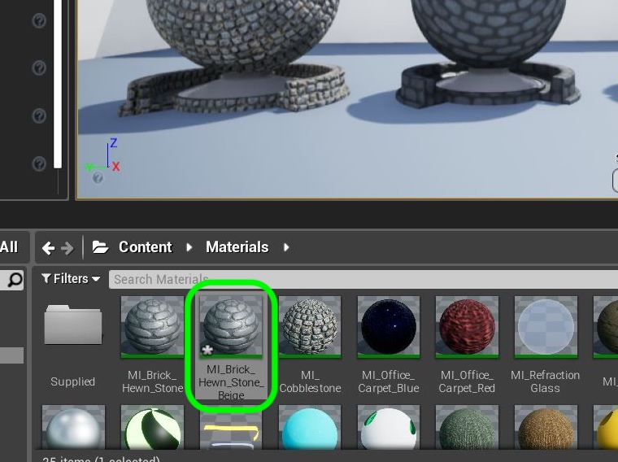
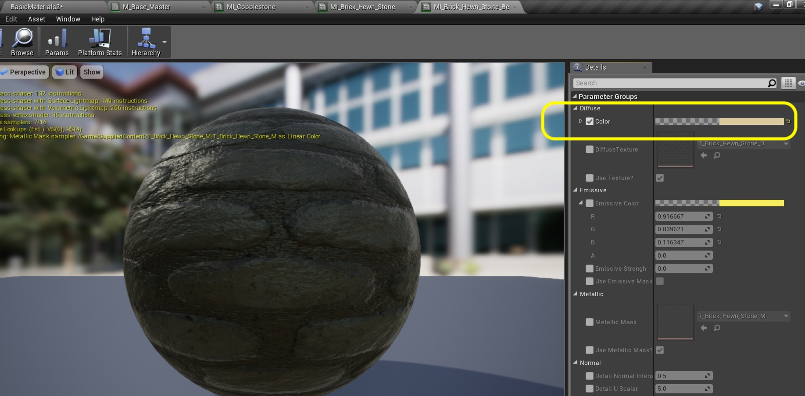
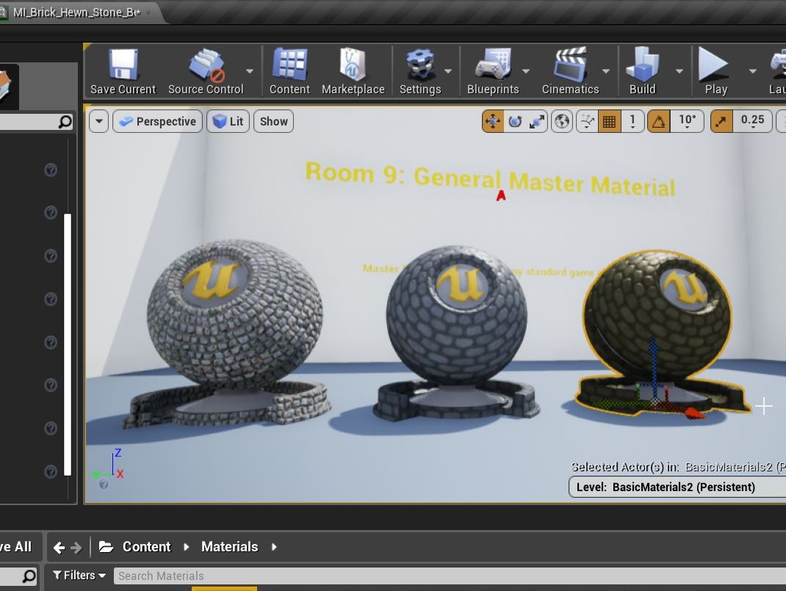
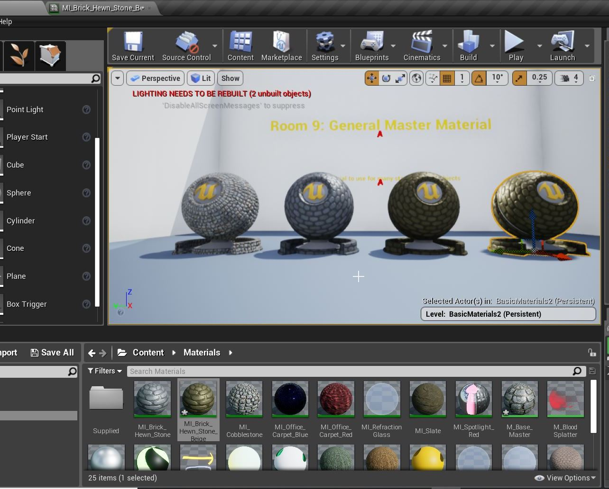
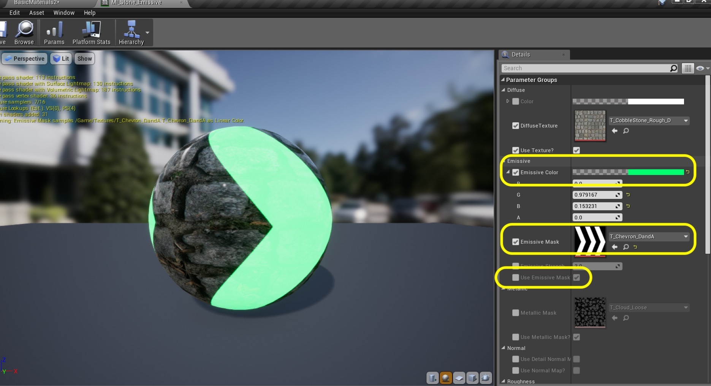
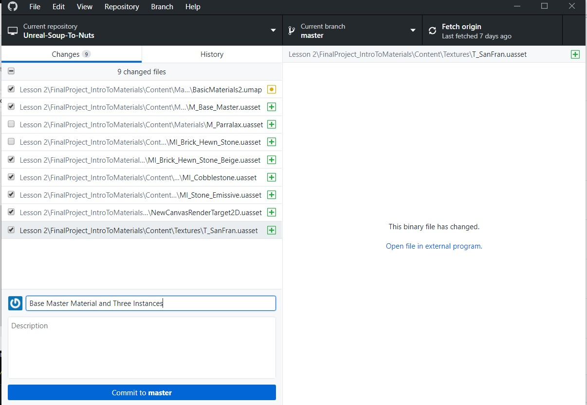

# UE4 Intro To Materials - Page 16
_____ 

## Index
_____ 

* Part 1 - Getting Setup
1. [Getting Set Up](Intro-To-Materials-1#getting-set-up)
2. [Creating a Diffuse Map](Intro-To-Materials-2.html#creating-a-diffuse-map.html#starting-unreal-engine-4)

* Part 2 - Our First Material
1. [Diffuse Only Material](Intro-To-Materials-3.html#diffuse-only-material)
2. [Texture Coordinate](Intro-To-Materials-4.html#texture-coordinate)
3. [Normal Mapping](Intro-To-Materials-4.html#normal-mapping)
4. [Roughness and Metallic Constants](Intro-To-Materials-5.html#roughness-and-metallic-constants)

* Part 3 - Material Instances
1. [Material Instance Diffuse](Intro-To-Materials-5.html#material-instance-diffuse)
2. [Metallic and Roughness Parameters](Intro-To-Materials-6.html#metallic-and-roughness-parameters)
3. [Normal Map Parameter](Intro-To-Materials-6.html#normal-map-parameter)
4. [UV Parameters](Intro-To-Materials-6.html#uv-parameters)

* Part 4 - Masked and Transluscent Materials
1.  [Metallic Mask](Intro-To-Materials-7.html#metallic-mask)
2.  [Opacity Mask](Intro-To-Materials-7.html#opacity-mask)
4.  [Translucent Blend Mode](Intro-To-Materials-8.html#translucent-blend-mode)

* Part 5 - Illumination
1.  [Importing a Model](Intro-To-Materials-8.html#importing-a-model)
2.  [Bracket Material](Intro-To-Materials-8.html#bracket-material)
3.  [Lamp Material](Intro-To-Materials-9.html#lamp-material)

* Part 6 - More Material Concepts
1.  [Two Sided Material](Intro-To-Materials-10.html#two-sided-material)
2.  [Decals](Intro-To-Materials-10.html#decals)
3.  [Refraction and Fresnel](Intro-To-Materials-11.html#refraction-and-fresnel)
4. [World Aligned Materials](Intro-To-Materials-12.html#world-aligned-materials)
5.  [Animation](Intro-To-Materials-13.html#animation)

* Part 7 - A Practical Master Material
1.  [A Practical Master Material](Intro-To-Materials-14.html#a-practical-master-material)
2.  [A Practical Master Material Part II](Intro-To-Materials-15.html#a-practical-master-material-part-ii)
3.  [**A Practical Master Material Part III**](Intro-To-Materials-16.html#a-practical-master-material-part-iii)

_____ 

### A Practical Master Material Part III

_____ 



{:start="{{ num }}"}
{{ num }}.  Copy and paste a third material mesh in game:

  

_____ 



{:start="{{ num }}"}
{{ num }}. Lets imagine that this last instance was perfect but we wanted to use another one with a different hue.  We can actually make an instance of an instance so that it preserves the previous settings.  Right click on **MI_Brick_Hewn_Stone** and select **Create Materail Instance**.  

  

_____ 



{:start="{{ num }}"}
{{ num }}.  Call it `MI_Brick_Hewn_Stone_Beige`. Assign this new instance to the new static mesh in the level.

  

_____ 



{:start="{{ num }}"}
{{ num }}. Go into the instance and change the Diffuse Color to something else:

  

_____ 



{:start="{{ num }}"}
{{ num }}. Now go to the game and assign this new instance to the static mesh.  Voila, another stone the same type but different hue:

  

_____ 
 



{:start="{{ num }}"}
{{ num }}. Create a 4th copy of the static mesh in game and make a new Material Instance from the Base Master called `MI_Stone_Emissive`. Assign it to the new mesh.

  

_____ 


{:start="{{ num }}"}
{{ num }}.  Keep all the settings the same except add an **Emissive Texture** and use the Chevron we previously imported:

  

_____ 



{:start="{{ num }}"}
{{ num }}. Now go into the game and look at the different results from the same master material:

  



{:start="{{ num }}"}
{{ num }}. That's finally it for Room 10. Press **Save All** and update Github by **committing** and **pushing** all the changes made.  Next up Animating rules for blends:

  

_____ 

  

[<- Previous](Intro-To-Materials-15.html)&nbsp;&nbsp;&nbsp;[Home](../index.html)
   
   

