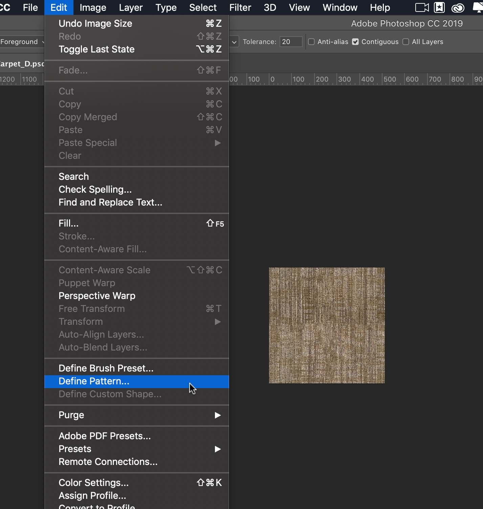

# UE4 Intro To Materials - Page 2
_____ 

## Index
_____ 

* Part 1 - Getting Setup
1. [Getting Set Up](Intro-To-Materials-1#getting-set-up)
2. [**Creating a Diffuse Map**](Intro-To-Materials-2.html#creating-a-diffuse-map.html#starting-unreal-engine-4)

* Part 2 - Our First Material
1. [Diffuse Only Material](Intro-To-Materials-3.html#diffuse-only-material)
2. [Texture Coordinate](Intro-To-Materials-4.html#texture-coordinate)
3. [Normal Mapping](Intro-To-Materials-4.html#normal-mapping)
4. [Roughness and Metallic Constants](Intro-To-Materials-5.html#roughness-and-metallic-constants)

* Part 3 - Material Instances
1. [Material Instance Diffuse](Intro-To-Materials-5.html#material-instance-diffuse)
2. [Metallic and Roughness Parameters](Intro-To-Materials-6.html#metallic-and-roughness-parameters)
3. [Normal Map Parameter](Intro-To-Materials-6.html#normal-map-parameter)
4. [UV Parameters](Intro-To-Materials-6.html#uv-parameters)

* Part 4 - Masked and Transluscent Materials
1.  [Metallic Mask](Intro-To-Materials-7.html#metallic-mask)
2.  [Opacity Mask](Intro-To-Materials-7.html#opacity-mask)
4.  [Translucent Blend Mode](Intro-To-Materials-8.html#translucent-blend-mode)

* Part 5 - Illumination
1.  [Importing a Model](Intro-To-Materials-8.html#importing-a-model)
2.  [Bracket Material](Intro-To-Materials-8.html#bracket-material)
3.  [Lamp Material](Intro-To-Materials-9.html#lamp-material)

* Part 6 - More Material Concepts
1.  [Two Sided Material](Intro-To-Materials-10.html#two-sided-material)
2.  [Decals](Intro-To-Materials-10.html#decals)
3.  [Refraction and Fresnel](Intro-To-Materials-11.html#refraction-and-fresnel)
4. [World Aligned Materials](Intro-To-Materials-12.html#world-aligned-materials)
5.  [Animation](Intro-To-Materials-13.html#animation)

* Part 7 - A Practical Master Material
1.  [A Practical Master Material](Intro-To-Materials-14.html#a-practical-master-material)
2.  [A Practical Master Material Part II](Intro-To-Materials-15.html#a-practical-master-material-part-ii)
3.  [A Practical Master Material Part III](Intro-To-Materials-16.html#a-practical-master-material-part-iii)

#### Creating a Diffuse Map - Page 2

_____ 



{:start="{{ num }}"}
{{ num }}. A diffuse map is normally square in aspect ratio.  To properly [mipmap](https://en.wikipedia.org/wiki/Mipmap) you need to keep the resolution in multiples of 2 (2, 4, 8, 16, 32, 64, 128, 256, 512, 1024, 2048, 4096, 8192).  We pick the resolution based on how close we will get to this texture and the complexity of the detail.  Some platforms like cell phones might not be able to take the largest texture size.  Open the file **OfficeCarpet.jpg** that is in the **Import** folder with **Photoshop**.  It is a jpg because I shot it with my phone.  One really should shoot in raw mode on an slr camera with fixed lenses.

  

_____ 



{:start="{{ num }}"}
{{ num }}. Since this is a carpet and the detail is quite small and will be on the floor, then I think we can get away with a 1K or 2K (1024 or 2048) texture.  The image is big enough and the top of the carpet has a shadow that we don't want.  First, select the crop tool.  Change the resolution of the crop to `2048` by `2048`.  It is hard to hit this number so you can make it a bit bigger.  Press the **Check Mark** to crop the image.

  

_____ 



{:start="{{ num }}"}
{{ num }}. Go to **Image \| Image Size** in the top menu to find out what the size is:

  

_____ 



{:start="{{ num }}"}
{{ num }}. If it is not `2048` by `2048`, change the size to make it a power of 2 number. Press OK:

  

_____ 
 



{:start="{{ num }}"}
{{ num }}.   Lets look to see if we can tighten the range based on the image so that we can maximize the range of colors that can be represented.  Go to **Image \| Adjustments \| Levels** :

  

_____ 



{:start="{{ num }}"}
{{ num }}. There is not much information on the left hand side of the curve. Make adjustaments to maximize the range and adjust the image to your liking:

  

_____ 



{:start="{{ num }}"}
{{ num }}. Go to **Filter \| Other \| Offset**.  This will move the image over to expose the seams.  If we clean up the seams then it will be a seamless texture in all directions.

  

_____ 



{:start="{{ num }}"}
{{ num }}. Now lets put the seam in the middle by select `1024` for both **Vertical** and **Horizontal**.  Make sure it is set to **Wrap Around**:

  

_____ 



{:start="{{ num }}"}
{{ num }}. Now the seam down the center is hard to see, so here is this done on an image with an obvious pattern:

  

_____ 



{:start="{{ num }}"}
{{ num }}. Here is a close up of the seam on the image I created:

  

_____ 



{:start="{{ num }}"}
{{ num }}. Now we need to remove the seam. There is a quick and efficient way of doing it.  This doesn't work with every image, but since this is so geometrical it is an effective technique.  Select the **Lasso** tool:

  

_____ 



{:start="{{ num }}"}
{{ num }}. Now you are going to trace around the seam, picking a logical part to hide the edit.  Follow a line, stain, or pattern.  I have removed the background to better demonstrate the selection I made:

  

_____ 



{:start="{{ num }}"}
{{ num }}. Lets replace what is selected and remove the seam.  Press **Edit \| Fill**.

  

_____ 



{:start="{{ num }}"}
{{ num }}. Select the **Contents:** `Content-Aware`.  This replaces what is selected with a machine learning algorithm to fill in with what is around it and try and have continuity. It does amazing work of removing seams in geometric patterns.

  

_____ 



{:start="{{ num }}"}
{{ num }}. Now the seam is gone as Photoshop has guessed the best way to fill the missing portion of the image (some really clevel AI going on there).

  

_____ 



{:start="{{ num }}"}
{{ num }}. Lets save what we have as a **.psd** file format.

  

_____ 



{:start="{{ num }}"}
{{ num }}. This was the easy part.  Now we want to see what this texture looks like tiled.  Even though we have removed the seam, there could be a distinctive pattern that gives away the repeat.  Right click on the **.psd** file and duplicate it:

  

_____ 


{:start="{{ num }}"}
{{ num }}. Now open this copy up and select **Image \| Image Size** and reduce the size to `512` by `512`.

  

_____ 


{:start="{{ num }}"}
{{ num }}. Create a pattern that we can use to repeat and look at the texture tiled.  Press **Edit \| Define Pattern**:

  

_____ 


{:start="{{ num }}"}
{{ num }}. Name the pattern.  I called mine `Carpet`.

  

_____ 


{:start="{{ num }}"}
{{ num }}. Create a new psd file and make the canvas `2048` by `2048`.

  

_____ 


{:start="{{ num }}"}
{{ num }}. Select **Edit \| Fill** in this new document.

  

_____ 


{:start="{{ num }}"}
{{ num }}. This tie we want the fill **Contents** to be `Pattern`. Select the pattern you just made and press **OK**:

  

_____ 


{:start="{{ num }}"}
{{ num }}. The staining on the carpet creates an obvious repeated pattern. 

  

_____ 


{:start="{{ num }}"}
{{ num }}.  I went back to the origina copy.  I copied the background rotated it and tried different ways of blending it with the layer below.  I then applied a **Filter \| Other \| High Pass Filter** to a combined version of those two layers.  I then reduced the repeat to one stubborn stain.  I repeated the above process to preview the texture wrapping in photoshop.

  

_____ 


{:start="{{ num }}"}
{{ num }}.  I used the clone tool to remove this distinctive spot and retiled it.  I think I will stop here as it is good enough for now.

  

_____ 



{:start="{{ num }}"}
{{ num }}. For Unreal we want a copy of this in the **TGA** format.  This is an uncompressed format that allows for multiple channels and bit depths.  Unreal does the compression on its own so we don't have to worry about file size and compression for going into Unity. Select  **File \| Save As**.

  

_____ 



{:start="{{ num }}"}
{{ num }}. We will name it using UE4 naming conventions.  We will preceed the name of the texture map with `T_` and end the name with an indication of what kind of texture map this is with `BC_` for Base Color.  So I called the file `T_OfficeCarpet_BC` (Photoshop will add the extension for you). On the next page we will take this texture and put it into Unreal.

  

_____ 


{:start="{{ num }}"}
{{ num }}. Select 24 bits as we will have 8 bits per RGB channel.  We do not have an Alpha in this so it should be fine!

  

_____ 

  

[<- Previous](Intro-To-Materials-1.html)&nbsp;&nbsp;&nbsp;[Home](../index.html)&nbsp;&nbsp;&nbsp; [Continue ->](Intro-To-Materials-3.html)
   
   
   

