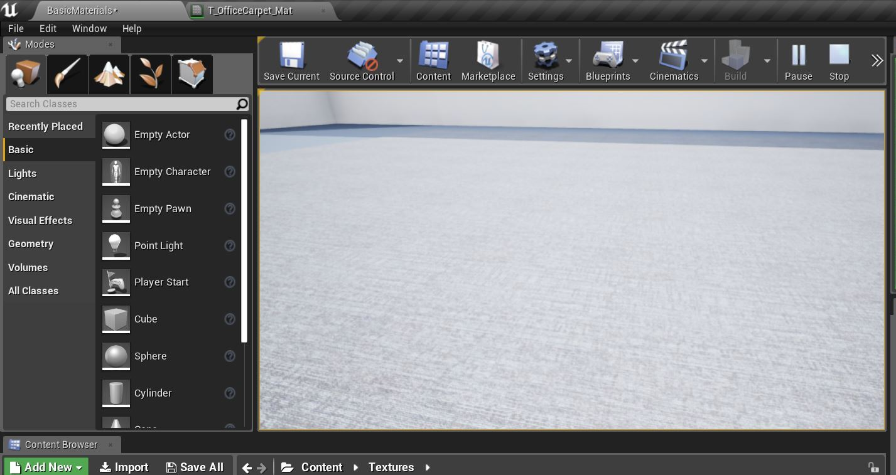

# UE4 Intro To Materials - Page 4
_____ 

## Index
_____ 

* Part 1 - Getting Setup
1. [Getting Set Up](Intro-To-Materials-1#getting-set-up)
2. [Creating a Diffuse Map](Intro-To-Materials-2.html#creating-a-diffuse-map.html#starting-unreal-engine-4)

* Part 2 - Our First Material
1. [Diffuse Only Material](Intro-To-Materials-3.html#diffuse-only-material)
2. [**Texture Coordinate**](Intro-To-Materials-4.html#texture-coordinate)
3. [**Normal Mapping**](Intro-To-Materials-4.html#normal-mapping)
4. [Roughness and Metallic Constants](Intro-To-Materials-5.html#roughness-and-metallic-constants)

* Part 3 - Material Instances
1. [Material Instance Diffuse](Intro-To-Materials-5.html#material-instance-diffuse)
2. [Metallic and Roughness Parameters](Intro-To-Materials-6.html#metallic-and-roughness-parameters)
3. [Normal Map Parameter](Intro-To-Materials-6.html#normal-map-parameter)
4. [UV Parameters](Intro-To-Materials-6.html#uv-parameters)

* Part 4 - Masked and Transluscent Materials
1.  [Metallic Mask](Intro-To-Materials-7.html#metallic-mask)
2.  [Opacity Mask](Intro-To-Materials-7.html#opacity-mask)
4.  [Translucent Blend Mode](Intro-To-Materials-8.html#translucent-blend-mode)

* Part 5 - Illumination
1.  [Importing a Model](Intro-To-Materials-8.html#importing-a-model)
2.  [Bracket Material](Intro-To-Materials-8.html#bracket-material)
3.  [Lamp Material](Intro-To-Materials-9.html#lamp-material)

* Part 6 - More Material Concepts
1.  [Two Sided Material](Intro-To-Materials-10.html#two-sided-material)
2.  [Decals](Intro-To-Materials-10.html#decals)
3.  [Refraction and Fresnel](Intro-To-Materials-11.html#refraction-and-fresnel)
4. [World Aligned Materials](Intro-To-Materials-12.html#world-aligned-materials)
5.  [Animation](Intro-To-Materials-13.html#animation)

* Part 7 - A Practical Master Material
1.  [A Practical Master Material](Intro-To-Materials-14.html#a-practical-master-material)
2.  [A Practical Master Material Part II](Intro-To-Materials-15.html#a-practical-master-material-part-ii)
3.  [A Practical Master Material Part III](Intro-To-Materials-16.html#a-practical-master-material-part-iii)

_____ 

### Texture Coordinate
_____ 



{:start="{{ num }}"}
{{ num }}.  Double click the Material to go back to the editor and right click in the menu and type **TextureCoordinate**

  

_____ 



{:start="{{ num }}"}
{{ num }}.  Click on the new **Texture Coordinate** node and look at the **U Tiling** and **V Tiling**. This represents coordinates of the texture with U being the horizontal and V the vertical.  The number `1` represents one texture per set of polygons. Now hook up the node coming from **Texture Coordinate** to the **UV** input in **Texture**. 

  

_____ 



{:start="{{ num }}"}
{{ num }}.  With the **Texture Coordinate** node selected change the UV to `.25`.  You can see on the object that it is scaled even more.

  

_____ 



{:start="{{ num }}"}
{{ num }}. Press **Apply** and go to the game to see the new scale:

  

_____ 



{:start="{{ num }}"}
{{ num }}. Now change the UV's to `4` in the material so that it scales the UV's and the repeat happens more frequently (liike you are further away from the object).

  

_____ 



{:start="{{ num }}"}
{{ num }}. Set the **UV's** back to `1` as I photographed it from eye height (the same position as the player in game).  Press the **Apply** button.  Play the game and look at the texture.  In my case I am happy with the tiling:

  

_____ 



{:start="{{ num }}"}
{{ num }}. Now lets look at how Unreal handles colors.  In photoshop in the color picker we can see four representations of color, but the most important to computer graphics are RGB and Hexadecimal.  We also care about a 4th Alpha channel but we do not have any alphas in this texture so we will deal with it later. All colors are derived from 256 values of Red, Green and Blue.  They are represented in Photoshop by 0 through 255.  White is 255, 255, 255 and black is 0, 0, 0.  In this example we see pure Red 255, 0 0:

  

_____ 
 



{:start="{{ num }}"}
{{ num }}.   Now in Unreal it represents each channel with a number from `0` to `1`.  So if we want to convert from Photoshop style RGB to Unreal we need to divide the value by `/255`.  So the same representation of pure **Red** in UE4 is `255/255`, `0/255`, `0/255`.  This ends up with `1,0,0`.  So UE4 normalizes each range of each color channel between `0` and `1`.

  

_____ 


{:start="{{ num }}"}
{{ num }}. The reason to normalize the value is that we can add and multiply the color and get consistent predictable results.  Lets take a look at this.  Open up **M_OfficeCarpet** and right click on the empty graph and add a **Constant Vector 3** node.

  

_____ 


{:start="{{ num }}"}
{{ num }}. Lets make this color mid gray.  Set the **RGB** channel to `0.5`.

  

_____ 


{:start="{{ num }}"}
{{ num }}. Right click on the **Constant Vector 3** node and select **Duplicate**:

  

_____ 


{:start="{{ num }}"}
{{ num }}. Add an **Add** node by right clicking on the empty graph.  This will add the two vectors together: 

  

_____ 


{:start="{{ num }}"}
{{ num }}. Connect the two **Constant Vector 3** nodes to the **Add** node then add a **Multiply** node that multiplies the two vectors. 

  

_____ 


{:start="{{ num }}"}
{{ num }}. Now when we add both vectors we should get `0.5 + 0.5` on each color channel.  This should make a white value of `1,1,1`.  To see this right click on the **Add** node then press **Start Previewing Node**.

  

_____ 


{:start="{{ num }}"}
{{ num }}. The color in the preview looks white.

  

_____ 



{:start="{{ num }}"}
{{ num }}. If we multiply the channel we will get a different result.   `.5 * .5, .5 * .5, .5 * .5` will result in  `.25, .25, .25` darkening the color:

  

_____ 



{:start="{{ num }}"}
{{ num }}. Flip between viewing the mid gray on its own and then the two added and multiplied.  Think about what the add and multiply node are doing.

  

_____ 



{:start="{{ num }}"}
{{ num }}. Now lets look at some colors.  If you have pure green `(0, 1, 0)` and multiply it by the grey you have `.5 * 0, .5 * 1, .5 * 0` or 0,.5,0.  Preview the multiply node tp see what it looks like:

  

_____ 



{:start="{{ num }}"}
{{ num }}. If we add them we get `0 + .5, 1 + .5, 0 + .5`.  This gives us `.5, 1.5, .5`.  Be careful not all nodes will handle normalized ranges whena color channel goes above `1`.  Sometimes clamping the value might be safer for future nodes. Add a clamp node and preview the various nodes to see how the adding and multiplying works.

  

_____ 



{:start="{{ num }}"}
{{ num }}. OK, lets delete these nodes and now look at adding color to the carpet.  Lets add a color node and multiply it on the carpet so we can change the color. Right click and type **Constant 3 Vector**.  A shortcut for this is to hold the **3** key and left click in the main area:

  

_____ 



{:start="{{ num }}"}
{{ num }}. Double click on the black square and you will get a color picker.  Pick a nice color for the carpet.  I picked `.537862, .299251, .109385`:

  

_____ 



{:start="{{ num }}"}
{{ num }}. Now right click in the main area and select the **Multiply** node.  The shortcut is to hold the **M** key and left click:

  

_____ 



{:start="{{ num }}"}
{{ num }}. Connect the new color to the **B** channel of the multiply node:

  

_____ 



{:start="{{ num }}"}
{{ num }}. Connect the top right RGBA node of the Texture Sample to the **A** channel of the multiply node:

  

_____ 



{:start="{{ num }}"}
{{ num }}. Connect the output of the Multiply node into the **Base Color** of the main Material node:

  

_____ 



{:start="{{ num }}"}
{{ num }}. Now you can see it replaced the old pin.  This now just has the multiply of the two textures which tints the colors.  Now we can press the **Apply** button so that it renders the material and **Save** to save the material and not lose any work. Now go into the game and run it (you might want to build the lighting if it asks for it).  You should now see a colored carpet like so: 

  

_____ 

## Normal Mapping

_____ 



{:start="{{ num }}"}
{{ num }}. Open photoshop and load the previous PSD file of the carpet.  Select **Filter \| 3D \| Generate Normal Map**:

  

_____ 



{:start="{{ num }}"}
{{ num }}. This brings up the normal map editor.  You can rotate the sphere and see that it is adding depth to your texture.  This map is a cheap way of faking detail in geometry that is not there.  The map represents the angle that the light reflects of the surface.  So even though it is a flat plane, light is reflecting off of it like there are small pits i the carpet.  You can read more about it [here](https://en.wikipedia.org/wiki/Normal_mapping). You can mess with the settings to change the effect to your liking but I am sticking with the defaults and pressing OK:

  

_____ 



{:start="{{ num }}"}
{{ num }}. Hit **Save As** from the **File** menu and name the file `T_OfficeCarpet_N`.  You see we added a `_N` at the end to represent normal.  Select **TGA** as file type and press **Save**:

  

_____ 



{:start="{{ num }}"}
{{ num }}. A Menu comes up with the bit depth and I am not sure what the best setting for a normal map is.  I just accept the default:

  

_____ 



{:start="{{ num }}"}
{{ num }}. Press the **Import** button and import the newly created **T_Office_Carpet_N** normal map.  Double click the newly imported image.  You can see that Unreal recognized the file type and applied a different compression optimized for Normal Maps.

  

_____ 



{:start="{{ num }}"}
{{ num }}. Open the **M_OfficeCarpet** material and lets do some house cleaning.  Highlight all the nodes except the main one.

  

_____ 



{:start="{{ num }}"}
{{ num }}.  Press the **C** key to add a comment.  Type in `Diffuse Color` to describe what these nodes are doing:

  

_____ 



{:start="{{ num }}"}
{{ num }}.  Right click and add another **Texture Sample** node (or press the **T** button and left click).

  

_____ 



{:start="{{ num }}"}
{{ num }}.  In the details panel select the **Texture** and add the newly imported normal map.

  

_____ 



{:start="{{ num }}"}
{{ num }}.  Hook up the right hand side and connect it to the **Normal Map** node. Press the **Apply** and **Save** and look at what happens to the material.  There is a bit more detail in the texture and it looks like small bumps in the carpet.

  

_____ 



{:start="{{ num }}"}
{{ num }}.  Plug the **UV** output from the **Texture Coordinate** into the Normal Map.  This will mean that the normal and diffuse will line up and tile the same way.  Highlight the normal map Texture Sample node and press the **C** key on your keyboard.  Type in the comment `Normal Map`:

  

_____ 


{:start="{{ num }}"}
{{ num }}.  Go to the game and run it.  Take a look at the carpet!  It is a bit shiny and reflective though.  Our final step in this first room is to add Metallic and Roughness then we will move on.

  

_____ 

  

[<- Previous](Intro-To-Materials-3.html)&nbsp;&nbsp;&nbsp;[Home](../index.html)&nbsp;&nbsp;&nbsp; [Continue ->](Intro-To-Materials-5.html)
   
   
   

