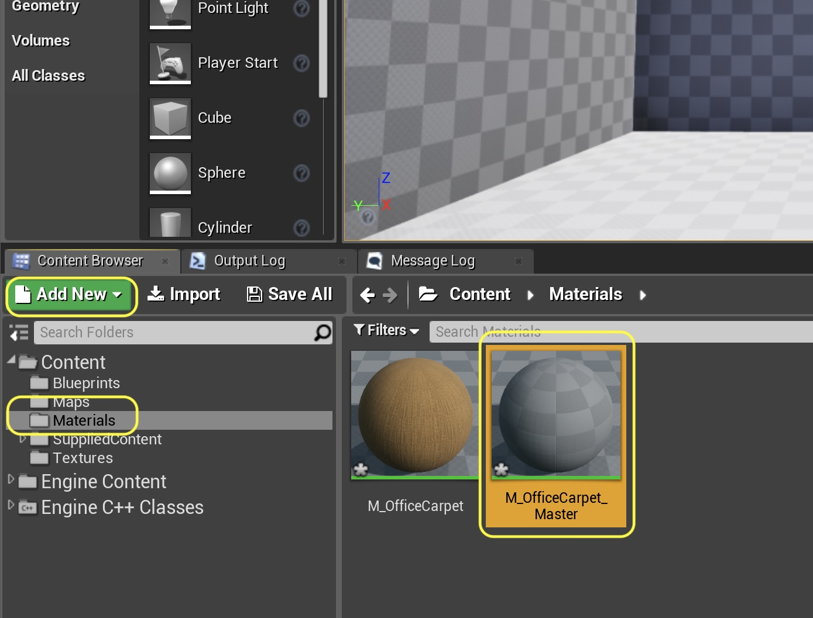
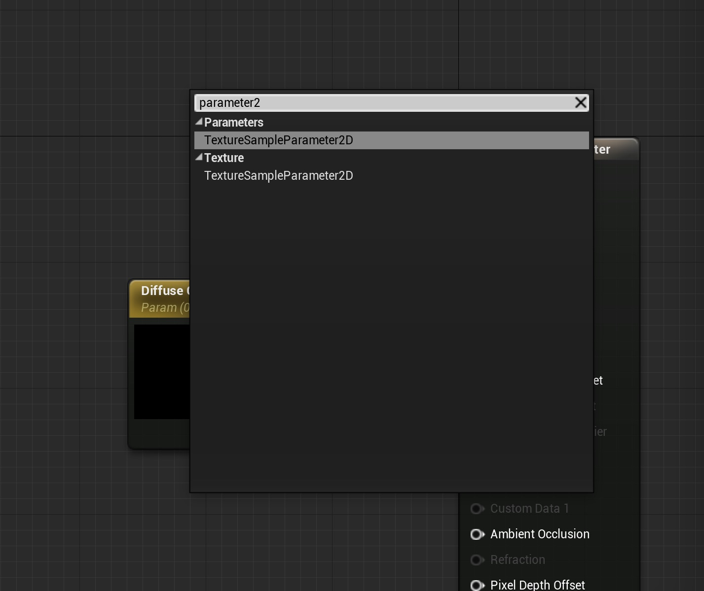

# UE4 Intro To Materials - Page 5
_____ 

## Index
_____ 

* Part 1 - Getting Setup
1. [Getting Set Up](Intro-To-Materials-1#getting-set-up)
2. [Creating a Diffuse Map](Intro-To-Materials-2.html#creating-a-diffuse-map.html#starting-unreal-engine-4)

* Part 2 - Our First Material
1. [Diffuse Only Material](Intro-To-Materials-3.html#diffuse-only-material)
2. [Texture Coordinate](Intro-To-Materials-4.html#texture-coordinate)
3. [Normal Mapping](Intro-To-Materials-4.html#normal-mapping)
4. [**Roughness and Metallic Constants**](Intro-To-Materials-5.html#roughness-and-metallic-constants)

* Part 3 - Material Instances
1. [**Material Instance Diffuse**](Intro-To-Materials-5.html#material-instance-diffuse)
2. [Metallic and Roughness Parameters](Intro-To-Materials-6.html#metallic-and-roughness-parameters)
3. [Normal Map Parameter](Intro-To-Materials-6.html#normal-map-parameter)
4. [UV Parameters](Intro-To-Materials-6.html#uv-parameters)

* Part 4 - Masked and Transluscent Materials
1.  [Metallic Mask](Intro-To-Materials-7.html#metallic-mask)
2.  [Opacity Mask](Intro-To-Materials-7.html#opacity-mask)
4.  [Translucent Blend Mode](Intro-To-Materials-8.html#translucent-blend-mode)

* Part 5 - Illumination
1.  [Importing a Model](Intro-To-Materials-8.html#importing-a-model)
2.  [Bracket Material](Intro-To-Materials-8.html#bracket-material)
3.  [Lamp Material](Intro-To-Materials-9.html#lamp-material)

* Part 6 - More Material Concepts
1.  [Two Sided Material](Intro-To-Materials-10.html#two-sided-material)
2.  [Decals](Intro-To-Materials-10.html#decals)
3.  [Refraction and Fresnel](Intro-To-Materials-11.html#refraction-and-fresnel)
4. [World Aligned Materials](Intro-To-Materials-12.html#world-aligned-materials)
5.  [Animation](Intro-To-Materials-13.html#animation)

* Part 7 - A Practical Master Material
1.  [A Practical Master Material](Intro-To-Materials-14.html#a-practical-master-material)
2.  [A Practical Master Material Part II](Intro-To-Materials-15.html#a-practical-master-material-part-ii)
3.  [A Practical Master Material Part III](Intro-To-Materials-16.html#a-practical-master-material-part-iii)

_____ 
### Roughness and Metallic Constants
_____ 



{:start="{{ num }}"}
{{ num }}.  Double click the Material to go back to the editor and right click in the menu and type **Constant** or press the **1** key on the keyboard and left click:

  

_____ 



{:start="{{ num }}"}
{{ num }}.  We will first adjust the roughness of the surface.  This affects the reflectivity of the surface.  `0` roughness is not rough and the surface is very reflective (mirror, metal) and `1` is completely rough and light gets scattered and diffused.  For more information go to UE4's [manual](https://docs.unrealengine.com/en-us/Engine/Rendering/Materials/PhysicallyBased)

  

_____ 



{:start="{{ num }}"}
{{ num }}.  Connect this single float value vector node to the **Roughness** pin in the main node:

  

_____ 



{:start="{{ num }}"}
{{ num }}. With that constant selected adjust the roughness to 1 which makes it completely non reflective and very diffuse:

  

_____ 



{:start="{{ num }}"}
{{ num }}. Repeat this and add another **Vector** node and connect it to **Metallic**.  We will leave the default value of 0 as we want it to have no reflectivity (1 would be maximum reflectivity).

  

_____ 



{:start="{{ num }}"}
{{ num }}. **Apply** this material and **Save** it. Go into the game and run it and we have completed our first material in UE4!

  

_____ 

#### Material Instance Diffuse

_____ 



{:start="{{ num }}"}
{{ num }}. Materials can be pretty expensive in Unreal.  We can't have too many of them per level.  There is a technique where we can get a lot of variety but not use completely different Materials. If you can use the same Material but different values we can use the same Structural Model.  What we do is we change the nodes to editable values and we allow instances to be made differently.  Lets rebuild the carpet Material to allow for instances as we want multiple different types of carpets and shapes in the game.  Go to the **Materials** folder and press **Add New**.  Add another Material and name it `M_OfficeCarpet_Master`.  The `_Master` indicates that this material is going to be used in instances which I will show you shortly.  

  

_____ 
 



{:start="{{ num }}"}
{{ num }}.   Lets add our diffuse color map.  But this time we want to expose it as a parameter. This can be done in two ways.  First, right click and select **Texture Sample**.  On this node right click and select **Convert to Parameter**:

  

_____ 



{:start="{{ num }}"}
{{ num }}. Or you can do it in one step by right clicking and selecting **Texture Sample Parameter 2D**:

  

_____ 



{:start="{{ num }}"}
{{ num }}. Name this node `Diffuse Texture Map` and in the **Details** panel add a new **Group** and call it `Diffuse`.  Select the **T_OfficeCarpet_BC** texture:

  

_____ 



{:start="{{ num }}"}
{{ num }}. Now do the same thing by adding a **Constant Vector 3**.  Right click and and select **Convert to Parameter** (or you could just add a **Vector Parameter**):

  

_____ 



{:start="{{ num }}"}
{{ num }}. Call this parameter `Diffuse Color` and add the `Diffuse` **Group** in the **Details** panel:

  

_____ 



{:start="{{ num }}"}
{{ num }}. Double click the **Diffuse Color** and pick the default color for your carpet (you can select white or 1,1,1 if you want to keep the original and not multiply).  Add a **Multiply** node and connect the pins so that the Texture is Multiplied by the Color Tint and hooked into the **Base Color** node. Press the **Apply** button on the top menu.

  

_____ 



{:start="{{ num }}"}
{{ num }}. Before we finish the rest of this material lets see why this is different.  Lets move into the **Materials** folder and right click on the **M_OfficeCarpet_Master** and select **Create Material Instance**:

  

_____ 



{:start="{{ num }}"}
{{ num }}. Name it `MI_OfficeCarpet_Blue`.  Now repeat this by right clicking on the **M_OfficeCarpet_Master** and select **Create Material Instance** and name this one `MI_OfficeCarpet_Red`:

  

_____ 



{:start="{{ num }}"}
{{ num }}. Double click **MI_OfficeCarpet_Blue** and take a look at the screen.  The Nodes are gone and you just see a giant material with a **Details** panel to the right. I just see the parameters that I have exposed organized into the groups we created:

  

_____ 



{:start="{{ num }}"}
{{ num }}. If we want to edit anything we need to click the radio box next to the parameter we want to change.  Lets change the diffuse color so select the box and double click the color bar to get the color picker.  Select a shade of blue:

  

_____ 



{:start="{{ num }}"}
{{ num }}. Repeat the same for **MI_OfficeCarpet_Red** but select a red color:

  



{:start="{{ num }}"}
{{ num }}. Now would be a good time to go back to the **Content Browser** in the **Materials** folder and select **Save All**.  This will save all of our work. Scroll the camera over to **Room 2** in the level.

  

_____ 



{:start="{{ num }}"}
{{ num }}. OK, now lets add three carpets to the room.  Drag and drop **Import \| SM_Carpet_2**,**Import \| SM_Carpet_3** and **Import \| SM_Carpet_4** in the **Static Meshes** folder and select the appropriate import settings: 

  

_____ 



{:start="{{ num }}"}
{{ num }}. Drag the three carpets in the room.  Position them into ground so they stick out the amount you would like.

  

_____ 



{:start="{{ num }}"}
{{ num }}. Lets assign the materials.  Drag and drop the three material instances on the three carpets in any order you like.

  

_____ 



{:start="{{ num }}"}
{{ num }}. Run the game and now you have three material instances running with the same Master material.  Now please be aware that any changes you make to the master will be reflected in the Instances.  These are children to the Master material.  If you like you can even make instances of instances but the parent child relationship with the master will still hold.

  

_____ 
  

[<- Previous](Intro-To-Materials-4.html)&nbsp;&nbsp;&nbsp;[Home](../index.html)&nbsp;&nbsp;&nbsp; [Continue ->](Intro-To-Materials-6.html)
   
   
   

