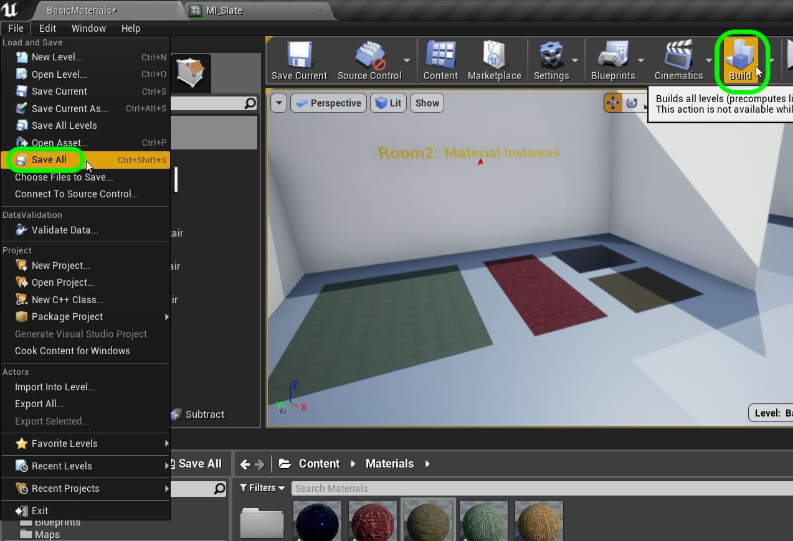

# UE4 Intro To Materials - Page 6
_____ 

## Index
_____ 

* Part 1 - Getting Setup
1. [Getting Set Up](Intro-To-Materials-1#getting-set-up)
2. [Creating a Diffuse Map](Intro-To-Materials-2.html#creating-a-diffuse-map.html#starting-unreal-engine-4)

* Part 2 - Our First Material
1. [Diffuse Only Material](Intro-To-Materials-3.html#diffuse-only-material)
2. [Texture Coordinate](Intro-To-Materials-4.html#texture-coordinate)
3. [Normal Mapping](Intro-To-Materials-4.html#normal-mapping)
4. [Roughness and Metallic Constants](Intro-To-Materials-5.html#roughness-and-metallic-constants)

* Part 3 - Material Instances
1. [Material Instance Diffuse](Intro-To-Materials-5.html#material-instance-diffuse)
2. [**Metallic and Roughness Parameters**](Intro-To-Materials-6.html#metallic-and-roughness-parameters)
3. [**Normal Map Parameter**](Intro-To-Materials-6.html#normal-map-parameter)
4. [**UV Parameters**](Intro-To-Materials-6.html#uv-parameters)

* Part 4 - Masked and Transluscent Materials
1.  [Metallic Mask](Intro-To-Materials-7.html#metallic-mask)
2.  [Opacity Mask](Intro-To-Materials-7.html#opacity-mask)
4.  [Translucent Blend Mode](Intro-To-Materials-8.html#translucent-blend-mode)

* Part 5 - Illumination
1.  [Importing a Model](Intro-To-Materials-8.html#importing-a-model)
2.  [Bracket Material](Intro-To-Materials-8.html#bracket-material)
3.  [Lamp Material](Intro-To-Materials-9.html#lamp-material)

* Part 6 - More Material Concepts
1.  [Two Sided Material](Intro-To-Materials-10.html#two-sided-material)
2.  [Decals](Intro-To-Materials-10.html#decals)
3.  [Refraction and Fresnel](Intro-To-Materials-11.html#refraction-and-fresnel)
4. [World Aligned Materials](Intro-To-Materials-12.html#world-aligned-materials)
5.  [Animation](Intro-To-Materials-13.html#animation)

* Part 7 - A Practical Master Material
1.  [A Practical Master Material](Intro-To-Materials-14.html#a-practical-master-material)
2.  [A Practical Master Material Part II](Intro-To-Materials-15.html#a-practical-master-material-part-ii)
3.  [A Practical Master Material Part III](Intro-To-Materials-16.html#a-practical-master-material-part-iii)

_____ 

### Metallic and Roughness Parameters
_____ 



{:start="{{ num }}"}
{{ num }}.  Go back to your **M_Office_Carpet_Master** and we want to add two scalar paremeters one for Metallic and one for Roughness.  Now we previously added a **Vector** for a single float.  You can right click and select a **Scalar Parameter**:

  

_____ 



{:start="{{ num }}"}
{{ num }}.  Lets do the second one with the other method.  Press the **1** keyboard button and left click.  Right click on the node and select **Convert to Parameter**:

  

_____ 



{:start="{{ num }}"}
{{ num }}.  Change the name and group of the top one to `Metallic` and the name and group of the bottom node to `Roughness`:

  

_____ 



{:start="{{ num }}"}
{{ num }}. Now select both nodes and press the **C** key on the keyboard and give it an appropriate comment. Connect each node to the main node:

  

_____ 



{:start="{{ num }}"}
{{ num }}. Set the default roughness value in the **Details** panel of the Roughness node to 1.  Leave the metallic at 0.

  

_____ 



{:start="{{ num }}"}
{{ num }}. Press **Apply** and **Save** on the master material.  Now double click on **MI_OfficeCarpet_Blue**.  Now you will see these two extra parameters.  Invert the roughness and metallic values and make it a mirrored like surface:

  

_____ 
 



{:start="{{ num }}"}
{{ num }}.  Now run the game and look how even with the same material parent, we can change the properties in a way that is less expensive than having two separate materials:

  

_____ 

### Normal Map Parameter
_____ 



{:start="{{ num }}"}
{{ num }}. Open **M_OfficeCarpet_Master** and right click in the main area.  Select another **Texture Sample Parameter 2D** to hold the normal map:

  

_____ 



{:start="{{ num }}"}
{{ num }}. Assign the normal map texture to the **Details Panel**.  Name the node `Normal Map` as well as the group.  Link the node to the Normal Map slot in the main Material node.

  

_____ 



{:start="{{ num }}"}
{{ num }}. Now press **Apply** and **Save** and go to the game and see if it works.  The bump is most evident on the reflective surface where light reflects off the high portion of the carpet:  

  

_____

### UV Parameters
_____ 



{:start="{{ num }}"}
{{ num }}. Now lets go back to **M_OfficeCarpet_Master** and make the UV's adjustable in the instances.  Add a new **Texture Coordinate** node.  Now we can't promote this node to a variable so we will have to multiply it.  When you multiply 2 UV floats by 1 scalar you can adjust the U and V by the same amount.  So if the UV are both set to one and the scalar to 8 then we would be a UV of 1 * 8 and 1 * 8 for a U of 8 and V of 8.  So lets add a multiply node:

  

_____ 



{:start="{{ num }}"}
{{ num }}. Now add a **Scalar Parameter** and call it `UV Multiplier`.  Set it to **Group** `UV` and connect the nodes so that you multiply the scalar by the coordinates as so:

  

_____ 



{:start="{{ num }}"}
{{ num }}. Now connect the end of the multiply pin and attach it to the UV input of both the diffuse and normal textures:

  

_____ 



{:start="{{ num }}"}
{{ num }}. Add an appropriate comment and clean up the nodes. Press the **Apply** button when done.

  

_____ 



{:start="{{ num }}"}
{{ num }}. Open up **MI_Office_Carpet_Red** and turn the **UV Multiplier** on and change the value to `.01` making the repeat less frequent and scaling the texture WAY up.

  

_____ 



{:start="{{ num }}"}
{{ num }}. Now go back to the game and hit play.  Please note these settings are not created to look good but different.  This demonstrates how many looks we can create with a master material.  Also note that we could change the textures entirely and put them on another object that has a material that needs simple tiling with some controls.  It is not limited to this carpet mesh.

  

_____ 



{:start="{{ num }}"}
{{ num }}. Go to the materials folder and create a new **Material Instance** from **M_OfficeCarpet_Master** and call it `MI_Slate`:

  

_____ 



{:start="{{ num }}"}
{{ num }}. Now double click the newly made Material Instance and select a new Diffuse Texture.  There is an Unreal Texture included in the **Supplied Content** folder called **T_Rock_Slate_D**.

  

_____ 


{:start="{{ num }}"}
{{ num }}. Change the Normal Map and select **T_Rock_Slate_N**.

  

_____ 



{:start="{{ num }}"}
{{ num }}. Change **Metalic**, **Roughness**, **UV Multiplier** and **Diffuse Color** to your liking.  I look at the sphere and am happy with the results.

  

_____ 



{:start="{{ num }}"}
{{ num }}. Now go into the game and make a copy of the small carpet.  Move it in front.  Select the new **MI_Slate** in the **Content Browser** and assign it to this fourth carpet.

  

_____ 



{:start="{{ num }}"}
{{ num }}. Now go into the game and run it.  Now you can see that we can use a material instance on different textures can look completely different but use the same master.

  

_____ 



{:start="{{ num }}"}
{{ num }}. Now would be a good time to press **Build** and rebuild the lighting in the room.  Also press **File \| Save All** to save everything you have done.

  

_____ 



{:start="{{ num }}"}
{{ num }}. We probably should have updated GitHub when we finished the first room.  But lets load **GitHub Desktop** and make sure you load this project. Unselect all the files.  Pick each separate file and right a commit message that describes what you did.  Do either a group of files or one file at a time based on what works well together.  When you have commited all the files upload them to the server.  Press the **Push Origin** button on the top right hand corner.  This way if you lose your data it is stored on the servers at GitHub.

<iframe class="embed-responsive-item" src="https://www.youtube.com/embed/S61VlloDkMM?autoplay=1&rel=0&controls=0&amp&showinfo=0&version=3&loop=1&playlist=S61VlloDkMM" frameborder="0" allowfullscreen></iframe>

_____ 

  

[<- Previous](Intro-To-Materials-5.html)&nbsp;&nbsp;&nbsp;[Home](../index.html)&nbsp;&nbsp;&nbsp; [Continue ->](Intro-To-Materials-7.html)
   
   
   

