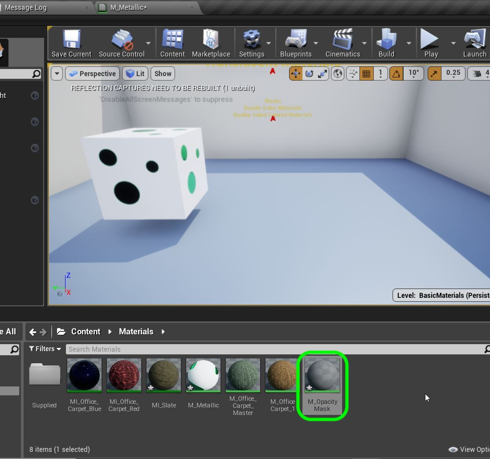

# UE4 Intro To Materials - Page 7
_____ 

## Index
_____ 

* Part 1 - Getting Setup
1. [Getting Set Up](Intro-To-Materials-1#getting-set-up)
2. [Creating a Diffuse Map](Intro-To-Materials-2.html#creating-a-diffuse-map.html#starting-unreal-engine-4)

* Part 2 - Our First Material
1. [Diffuse Only Material](Intro-To-Materials-3.html#diffuse-only-material)
2. [Texture Coordinate](Intro-To-Materials-4.html#texture-coordinate)
3. [Normal Mapping](Intro-To-Materials-4.html#normal-mapping)
4. [Roughness and Metallic Constants](Intro-To-Materials-5.html#roughness-and-metallic-constants)

* Part 3 - Material Instances
1. [Material Instance Diffuse](Intro-To-Materials-5.html#material-instance-diffuse)
2. [Metallic and Roughness Parameters](Intro-To-Materials-6.html#metallic-and-roughness-parameters)
3. [Normal Map Parameter](Intro-To-Materials-6.html#normal-map-parameter)
4. [UV Parameters](Intro-To-Materials-6.html#uv-parameters)

* Part 4 - Masked and Transluscent Materials
1.  [**Metallic Mask**](Intro-To-Materials-7.html#metallic-mask)
2.  [**Opacity Mask**](Intro-To-Materials-7.html#opacity-mask)
4.  [Translucent Blend Mode](Intro-To-Materials-8.html#translucent-blend-mode)

* Part 5 - Illumination
1.  [Importing a Model](Intro-To-Materials-8.html#importing-a-model)
2.  [Bracket Material](Intro-To-Materials-8.html#bracket-material)
3.  [Lamp Material](Intro-To-Materials-9.html#lamp-material)

* Part 6 - More Material Concepts
1.  [Two Sided Material](Intro-To-Materials-10.html#two-sided-material)
2.  [Decals](Intro-To-Materials-10.html#decals)
3.  [Refraction and Fresnel](Intro-To-Materials-11.html#refraction-and-fresnel)
4. [World Aligned Materials](Intro-To-Materials-12.html#world-aligned-materials)
5.  [Animation](Intro-To-Materials-13.html#animation)

* Part 7 - A Practical Master Material
1.  [A Practical Master Material](Intro-To-Materials-14.html#a-practical-master-material)
2.  [A Practical Master Material Part II](Intro-To-Materials-15.html#a-practical-master-material-part-ii)
3.  [A Practical Master Material Part III](Intro-To-Materials-16.html#a-practical-master-material-part-iii)

_____ 
### Metallic Mask
_____ 



{:start="{{ num }}"}
{{ num }}.  In our Metallic and Roughness, we don't have to use a single number.  We can use a gray scale mask so that each pixel can project number between 0 (black) and 1 (white).  Lets look at masks in materials on metallic. Open the **Content Browser** and select the **Textures** folder: 

  

_____ 



{:start="{{ num }}"}
{{ num }}.  Press the **Import** button and go to the folder **Files Neede For Walkthrough** and select **CircleMask_D.tga**.

  

_____ 



{:start="{{ num }}"}
{{ num }}.  Rename the file and add `T_` in front of the new file to end up with `T_CircleMask_D`.  Go to the **Materials Folder** and create a new Material called `M_Metallic`.

  

_____ 



{:start="{{ num }}"}
{{ num }}. Open the Material and add a **Texture Sample** node and selected the new texture we just created **T_CircleMask_D**.

  

_____ 



{:start="{{ num }}"}
{{ num }}. Add a **Constant 3** node and select a strong color. I picked a very bright green.

  

_____ 



{:start="{{ num }}"}
{{ num }}. Lets add these two nodes together.  Put an **Add** node and hook the texture up with the Constant 3.  The addition will keep the white white, but make the black the green that was created.  Connect the output of the addition mode to the **Base Color** node and look at the result on the sphere:

  

_____ 
 



{:start="{{ num }}"}
{{ num }}.  Add a constant node set to `0` and plug it into the **Roughness** pin.  Connect the Texture Sample to the Metalic node.  Now every where it is white it will be reflective and every where it is black it will not.  You can see the result on the sphere.

  

_____ 



{:start="{{ num }}"}
{{ num }}. Go into the game and move the camnera to **Room 3**. Change to **Place** mode and select the **Basic** menu items.  Drag a **Cube** into the game window.  Name the cube `Reflecting Cube` and move it to the **Room 3** folder.

  

_____ 


{:start="{{ num }}"}
{{ num }}.  Assign the material we just created.  Go to **World Outliner \| Lighting \| Sphere Reflection Capture** volume and make sure the **Influence Radius** is set to `2000` and center it on the level.  

  

_____ 


{:start="{{ num }}"}
{{ num }}.  You might find some black reflections. Go to **Skylight** and change **Mobility** to `Static`

  

_____ 


{:start="{{ num }}"}
{{ num }}.  Run the game and go around the cube to look at the reflections.

  

_____ 



{:start="{{ num }}"}
{{ num }}. Now what if we wanted the opposite? What if want the green dot to be reflective and the rest of the surface be matte?  We could go to photoshop and invert the image, but we can do this in the material.  Open the **M_Metallic** and add a **OneMinus** node:

  

_____ 



{:start="{{ num }}"}
{{ num }}. Connect the output of the Texture Sample to the 1-x node and put that output in Metallic.  Select the cube to preview and now you can see that it only reflects inside the green dots.  

  

_____ 



{:start="{{ num }}"}
{{ num }}. To see what the 1-X node does, right click and select **Start Previewing Node**.  See how it just inverts the image:

  

_____ 



{:start="{{ num }}"}
{{ num }}. Go into the game and play it and look at the cube.  The metallic effect is now reversed:

  

_____ 

## Opacity Mask
_____ 



{:start="{{ num }}"}
{{ num }}. We have only dealt with opaque materials.  We can also have holes cut in the materials with transulcency.  There are two types of approaches. The faster in terms of performance is an opacity mask. This means that a pixel can be completely transparent.  But there are no partial transparencies. The pixel is opaque or is clear.  Lets take a look.  Create a new Material in the Materials folder and call it `M_OpacityMask`.

  

_____ 



{:start="{{ num }}"}
{{ num }}. Double click the new Material and add a **Texture Sample** node. Add the **T_CircleMask_D** texture and you should see:

  



{:start="{{ num }}"}
{{ num }}. Connect the output of the **Texture Sample** node and connect it to the **Opacity Mask** mode.  This does nothing and it is grayed out. We will fix this shortly.

  

_____ 



{:start="{{ num }}"}
{{ num }}. Add a **Constant 3** vector and pick a nice bright color.  I picked orange:

  

_____ 



{:start="{{ num }}"}
{{ num }}. Now the Opacity mask is supposed to be clear where there is an alpha (black pixel) and opaque where white.  Right now we just have a solid Orange surface.  

  

_____ 



{:start="{{ num }}"}
{{ num }}. There are different blend modes available in the shaders.  To read more about it go to this section in their [manual](https://docs.unrealengine.com/en-us/Engine/Rendering/Materials/MaterialProperties/BlendModes).  Now select the **Blend Mode** drop down menu and pick **Masked**:

  

_____ 



{:start="{{ num }}"}
{{ num }}. Now switch to a cube and you will see that the black areas of the map cut into the cube.

  

_____ 



{:start="{{ num }}"}
{{ num }}. Now go to the game and press the **alt** button and drag another copy of the cube.  Assign the **M_OpacityMastk** material.

  

_____ 



{:start="{{ num }}"}
{{ num }}. You might have noticed that there is no inside of the box.  The entire inside is clear.  Why is that?  In 3-D modelling the light is only reflected where normals are placed.  Typically in closed surfaces like cubes there are only normals on one side.  Double click the cube static mesh (in the **World Outliner**) and click on **Normals**.  You should see green lines pointing outwards:

  

_____ 



{:start="{{ num }}"}
{{ num }}. In the **Details** panel of your Material there is a **Two Sided** radio button.  This allows you to let the material know that you want to project light on both sides of each face of the object.  Look how much better it looks!

  

_____ 


{:start="{{ num }}"}
{{ num }}. Check out the box in game.  Now it looks more like we expect it to. Next up lets make a mask with semi translucent surfaces.

  

_____ 

  

[<- Previous](Intro-To-Materials-6.html)&nbsp;&nbsp;&nbsp;[Home](../index.html)&nbsp;&nbsp;&nbsp; [Continue ->](Intro-To-Materials-8.html)
   
   
   

