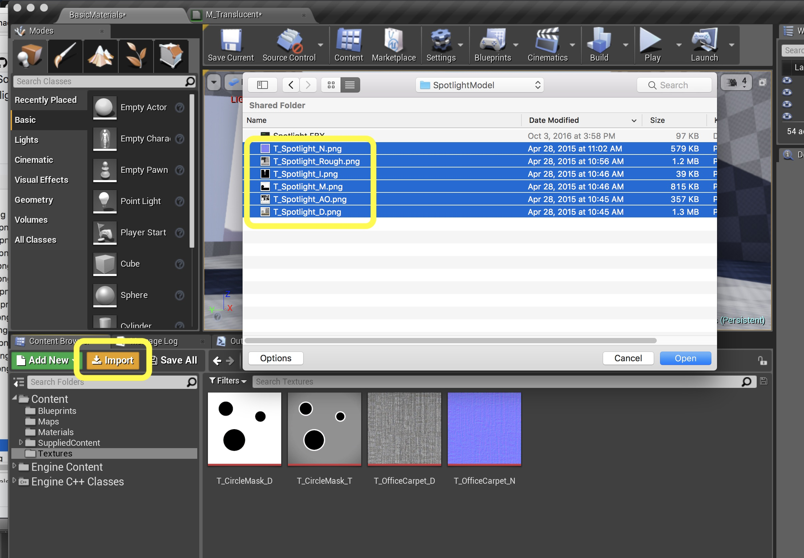

# UE4 Intro To Materials - Page 8
_____ 

## Index
_____ 

* Part 1 - Getting Setup
1. [Getting Set Up](Intro-To-Materials-1#getting-set-up)
2. [Creating a Diffuse Map](Intro-To-Materials-2.html#creating-a-diffuse-map.html#starting-unreal-engine-4)

* Part 2 - Our First Material
1. [Diffuse Only Material](Intro-To-Materials-3.html#diffuse-only-material)
2. [Texture Coordinate](Intro-To-Materials-4.html#texture-coordinate)
3. [Normal Mapping](Intro-To-Materials-4.html#normal-mapping)
4. [Roughness and Metallic Constants](Intro-To-Materials-5.html#roughness-and-metallic-constants)

* Part 3 - Material Instances
1. [Material Instance Diffuse](Intro-To-Materials-5.html#material-instance-diffuse)
2. [Metallic and Roughness Parameters](Intro-To-Materials-6.html#metallic-and-roughness-parameters)
3. [Normal Map Parameter](Intro-To-Materials-6.html#normal-map-parameter)
4. [UV Parameters](Intro-To-Materials-6.html#uv-parameters)

* Part 4 - Masked and Transluscent Materials
1.  [Metallic Mask](Intro-To-Materials-7.html#metallic-mask)
2.  [Opacity Mask](Intro-To-Materials-7.html#opacity-mask)
4.  [Translucent Blend Mode](Intro-To-Materials-8.html#translucent-blend-mode)

* Part 5 - Illumination
1.  [**Importing a Model**](Intro-To-Materials-8.html#importing-a-model)
2.  [**Bracket Material**](Intro-To-Materials-8.html#bracket-material)
3.  [Lamp Material](Intro-To-Materials-9.html#lamp-material)

* Part 6 - More Material Concepts
1.  [Two Sided Material](Intro-To-Materials-10.html#two-sided-material)
2.  [Decals](Intro-To-Materials-10.html#decals)
3.  [Refraction and Fresnel](Intro-To-Materials-11.html#refraction-and-fresnel)
4. [World Aligned Materials](Intro-To-Materials-12.html#world-aligned-materials)
5.  [Animation](Intro-To-Materials-13.html#animation)

* Part 7 - A Practical Master Material
1.  [A Practical Master Material](Intro-To-Materials-14.html#a-practical-master-material)
3.  [A Practical Master Material Part II](Intro-To-Materials-15.html#a-practical-master-material-part-ii)
3.  [A Practical Master Material Part III](Intro-To-Materials-16.html#a-practical-master-material-part-iii)

_____ 

### Translucent Blend Mode

_____ 



{:start="{{ num }}"}
{{ num }}.  Some objects like glass need to be translucent.  Now in games we want to try and limit how many we use.  This material is very expensive computationally and should be used with discretion. Create a new material called `M_Translucent` and place it in your **Materials** folder. 

  

_____ 


{:start="{{ num }}"}
{{ num }}.  Go to the **Textures** folder and add **CircleMask_T** to the game and rename it to `T_CircleMask_T`.

  

_____ 



{:start="{{ num }}"}
{{ num }}.  Open the **M_Translucent** material and add a **Texture Sample** node:

  

_____ 


{:start="{{ num }}"}
{{ num }}.  Assign the newly dowloaded **Texture** called **T_CircleMask_T**  Now for the mask we see the gray.  This will be partially opaque.  The white rings will be completly opaque and the black will be transparent like in the previous mask.  Now it is greyed out so we need to change the blend mode. We cannot hook the pin up to **Opacity** as the blend type is wrong.

  

_____ 



{:start="{{ num }}"}
{{ num }}. Change the Blend Mode in the **Details** panel to **Tranlucent** and hook the output of the texture to the **Opacity** pin in the shader.

  

_____ 
 



{:start="{{ num }}"}
{{ num }}.  Now go into the game and test it out.  Add another cube to the scene and bind the latest Material we just created. Lets add some color and make the inside of the cube visible: 

  

_____ 



{:start="{{ num }}"}
{{ num }}.  Play the game to look at it.  Lets add a color to it and also fix the same two sided problem we had on the previous mask. 

  

_____ 



{:start="{{ num }}"}
{{ num }}. Lets add some color and add **Two Sided** to the modes panel. Add a **Constant Vector 3** node, select a nice color and hook it up to the **Base Color** node.  Make sure **Two Sided** is checked under **Material** in the **Details** panel: 

  

_____ 


{:start="{{ num }}"}
{{ num }}. Go back to the game and it looks better.  But it doesn't cast a shadow.  

  

_____ 



{:start="{{ num }}"}
{{ num }}. There are two things we need to do to fix this.  Go back to the Material and change the **Lighting Mode** to `Surface Translucency Volume`.

  

_____ 



{:start="{{ num }}"}
{{ num }}. Then go into the game and select the cube you previously created. Go into the details panel. Go to the **Lighting** section and there is a downward arrow under **Shadows**.  Click this to expand the selection.

  

_____ 



{:start="{{ num }}"}
{{ num }}. Look for the Radio Button that has **Volumetric Translucent Shadow** and make sure it is selected. 

  

_____ 



{:start="{{ num }}"}
{{ num }}. Go into the game and play it and look at the cube.  We have a nice soft shadow next to the hard ones!

  

_____ 



{:start="{{ num }}"}
{{ num }}. Lets **Save All**, **Build** the lighting and open GitHub Desktop.  Commit the last set of changes and push them to the server.  We are now done with room 3! 

  

_____ 

## Illumination

Now for some objects in the game, they will also be a light source.  Think of the sun, a lamp, a TV set etc...  So our materials can handle light blooms and glow to create the illusion that it is illumiating in game.  To really sell this effect we also need to add a game light to actually light the scene. We will do this but we will work the entire pipeline from a final FBX to a model in the scene.

_____ 

## Importing a Model

_____ 



{:start="{{ num }}"}
{{ num }}. Look at your **Files Needed for Walkthrough \| SpotlightModel** model folder.  We have a **.fbx** file which is the 3-D model.  Then we see the **.png** files which are all of our texture maps.  The **_D** is diffuse, **.N** is normal, the **.I** is illumination (which we will be introducing here), **_Rough** is the roughness, and there is a new one **_AO**. This stands for ambient occlusion). This is a "technique used to calculate how exposed each point in a scene is to ambient lighting." - [Wikipedia](https://en.wikipedia.org/wiki/Ambient_occlusion)

  

_____ 



{:start="{{ num }}"}
{{ num }}. Now go the **Textures** folder and press the **Import Button**. Import only the **.png** files for now:

  



{:start="{{ num }}"}
{{ num }}. Your folder should now look like:

  

_____ 



{:start="{{ num }}"}
{{ num }}. Import the **Import \| SpotlightModel \| Spolight.fbx** into this folder.

  

_____ 



{:start="{{ num }}"}
{{ num }}. If it gives you a material you can delete it.  You should end up with a bracket and lamp mesh.  They are separate meshes so we can rotate the lamp at different angles:

  

_____ 



{:start="{{ num }}"}
{{ num }}. Now is a good time to hit the **Save All** button to lock in our work.  Notice that the new assets all have an **Asterix** next to their icon.  This means they are not saved.  Once we press **Save All** these go away.  The game does crash so it is important to save often so you don't lose any work.  Rename the files to `SM_Spotlight_Bracket` and `SM_Spotlight_Lamp`.

  

_____ 

## Bracket Material
_____ 



{:start="{{ num }}"}
{{ num }}. Lets go to the **Materials** folder and create a new Material called `M_BrushedSteel`.

  

_____ 


{:start="{{ num }}"}
{{ num }}. Open up **M_BrushedSteel** Add a **Constant Vector 3** node with `.913`, `.921` and `.915` as the RGB values:

  

_____ 


{:start="{{ num }}"}
{{ num }}. Add a **Constant** node with a setting of `1` and plug it into the **Metallic** node:

  

_____ 


{:start="{{ num }}"}
{{ num }}. Repeat this for Roughness but make the roughness `.4` and connecxt the node.

  

_____ 


{:start="{{ num }}"}
{{ num }}. Double click the Spotlight_bracket Static Mesh. Assign the material you just created:

  

_____ 


{:start="{{ num }}"}
{{ num }}. Go to Room 4 and drag both meshes (with both selected) into the game.  You can press **F** for focus to get the camera close to where they go in the scene.  Move them to be close to the wall.  Rotate the lamp part to point at the wall so we can have a light shine on it.

  

_____ 

  

[<- Previous](Intro-To-Materials-7.html)&nbsp;&nbsp;&nbsp;[Home](../index.html)&nbsp;&nbsp;&nbsp; [Continue ->](Intro-To-Materials-9.html)
   
   
   

