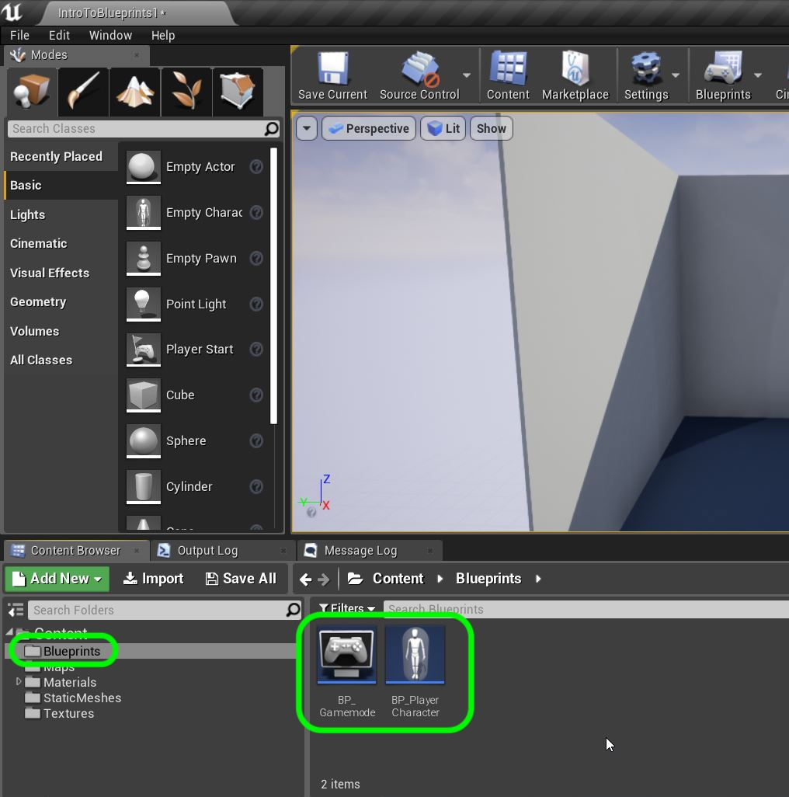
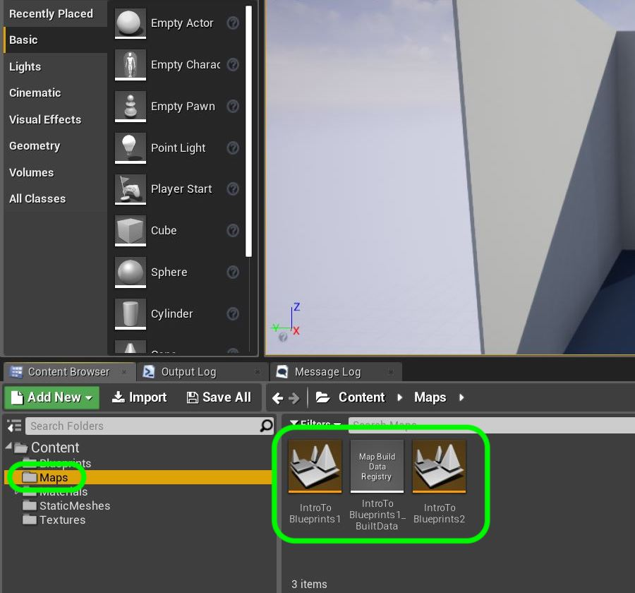
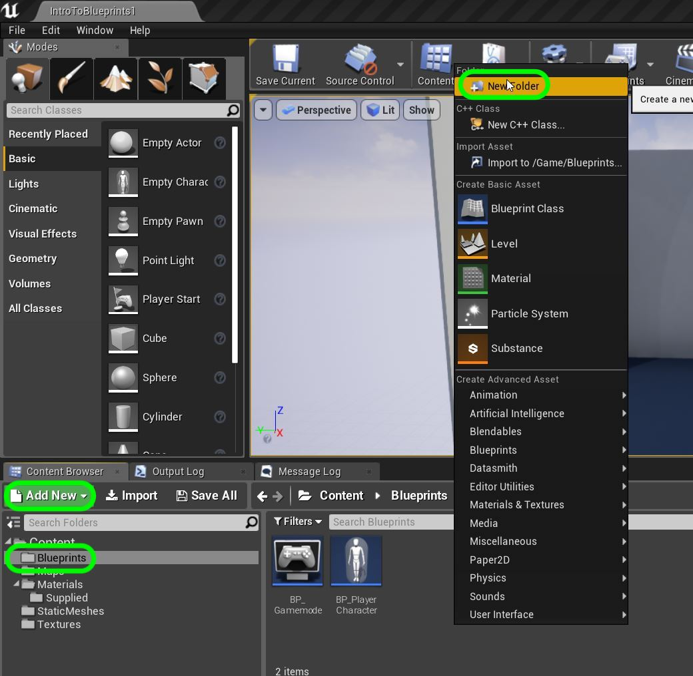
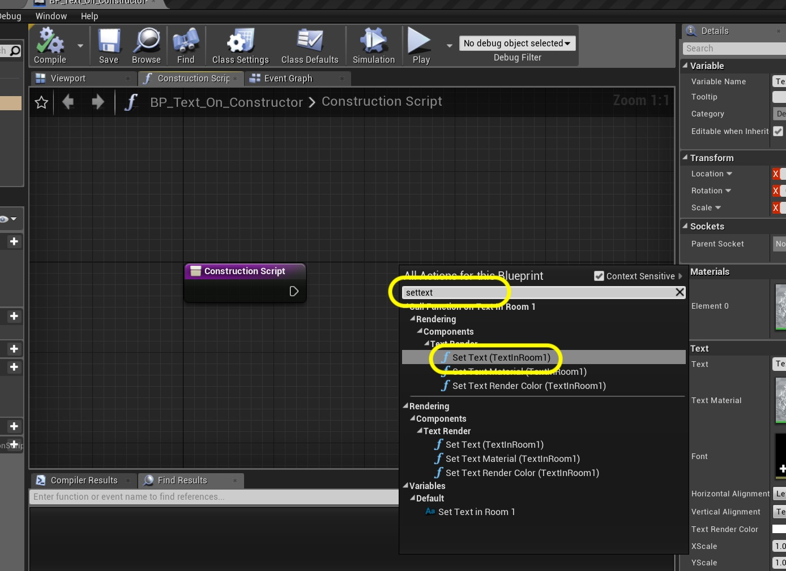
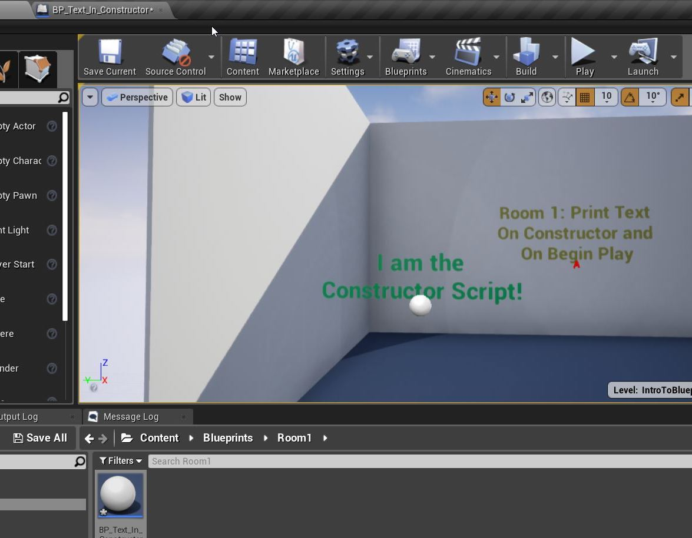

## Blueprint Basics

There are two ways of adding logic to a game with the Unreal Engine.  You can do it through code in C++ or you can add logic through [blueprints](https://docs.unrealengine.com/en-us/Engine/Blueprints).  Blueprints are a visual scripting language that uses a node based interface (similar to materials) for adding game logic. Both systems can work together to provide a workflow that is beneficial to the entire team.  In fact some UE4 games are a majority scripted using blueprints!  Lets get started looking into how to create some game logic.

_____ 

## Index
_____ 

* Part 1 - Blueprint Basics
1. [Constructor and Begin Play](Intro-To-Blueprints-1.html#constructor-and-begin-play)
2. [Collision Events](Intro-To-Blueprints-2.html#collision-events)
3. [Grouping Meshes](Intro-To-Blueprints-3.html#grouping-meshes)
4. [Dynamic Material and Light Color](Intro-To-Blueprints-4.html#dynamic-material-and-light-color)
5. [Private Variables](Intro-To-Blueprints-5.html#private-variables)

* Part 2 - Blueprint Dynamic
1. [Adding Components in Script](Intro-To-Blueprints-6.html#adding-components-in-script)
2. [Tick Event](Intro-To-Blueprints-7.html#tick-event)
3. [Rotation and Translation](Intro-To-Blueprints-8.html#rotation-and-translation)

* Part 3 - Blueprint Communication
1. [Dynamically Alter Multiple Classes](Intro-To-Blueprints-9.html#dynamically-alter-multiple-classes)
2. [Communicate Through Interface](Intro-To-Blueprints-10.html#communicate-through-interface)

* Part 4 - Miscellaneous Behaviors
1.  [Oribiting Actors](Intro-To-Blueprints-11.html#oribiting-actors)

* Part 5  - Input
1. [Basic User Input on Actor](Intro-To-Blueprints-12.html#intro-to-blueprints)

_____ 

## What you will need?

For this project you will need to be install [Unreal Engine 4.22.x](https://www.unrealengine.com/en-US/download) , have a [GitHub](https://github.com/) account (which is free of charge) as well as [GitHub Desktop](https://desktop.github.com). 

_____ 

### Constructor and Begin Play

In Unreal the **Construction Script** is the first thing that a blueprint runs when a class is instantiated.  What does this mean?  If we have something running inside the level that the game boots up to it will run the code that is in its **Construction Script** as the editor boots up.  Also any time an object is changed in the editor the **Construction Script** runs again.  The **Begin Play** runs when the game is run by pressing the **Play** buttons.  So there are two times we can set things up for a game object, before the level loads and when the game runs.

_____ 



{:start="{{ num }}"}
{{ num }}. If you are a student of mine in class you will have received an email of this same repository and will view the invitation and accept it. Now you can download the starter file I have created.  

  

_____ 



{:start="{{ num }}"}
{{ num }}. If you are not part of the class you can login into github with your personal account and navigate to [https://github.com/maubanel/ UE4IntroToBlueprints](https://github.com/maubanel/UE4IntroToBlueprints) and in the top left corner press the fork button:

  

_____ 



{:start="{{ num }}"}
{{ num }}. This will give you access to a folder called **UE4IntroToBlueprints** that will hold the UE4 project. Enter the folder double click the UE4 project **IntroToBlueprints.uproject** to load it.  Make sure you have Unreal 14.22.x installed.

  

_____ 



{:start="{{ num }}"}
{{ num }}. The project should load up in the Room/Level **IntroToBlueprints1** room. Scoot the camera over to **Room 1**.  You will also most likely see a dark room that has not been lit.  You need to hit the **Build** button and wait for the lighting to build for the level.  After this it should look normal again.

  

_____ 



{:start="{{ num }}"}
{{ num }}. Go to the content browser and look at the folders that are provided.  Go to the first **Blueprints** folder.  You should see two files, one is a GameMode blueprint and the other is a character controller blueprint.

  

_____ 



{:start="{{ num }}"}
{{ num }}.  Go to the **Maps** folder and you should see three levels:

  

_____ 



{:start="{{ num }}"}
{{ num }}. You will now go to the **Materials** folder and I have provided some Materials for these exercises. The **Supplied** folder has materials used for the room.  The remaining ones will be used in blueprints you will be creating.

  

_____ 



{:start="{{ num }}"}
{{ num }}. In the **StaticMeshes** folder we have some models we will be using:

  

_____ 



{:start="{{ num }}"}
{{ num }}. And finally we have a **Textures** folder with the textures for the spotlight we will be using:

  

_____ 



{:start="{{ num }}"}
{{ num }}. Go into **Project Settings** Description tab and fill in the requisite information:

  

_____ 



{:start="{{ num }}"}
{{ num }}. Go into the **Maps and Modes** tab. Notice the start up maps that we are booting to and meant to start with.

  

_____ 



{:start="{{ num }}"}
{{ num }}. Now select your default gamemode.  In our case it is **BP_Gamemode**.  This will select our character controller that we will be using:

  

_____ 



{:start="{{ num }}"}
{{ num }}. Go back to the **Blueprints** folder and press the **Add New** button and select **New Folder**.  Call it `Room1`.

  

_____ 



{:start="{{ num }}"}
{{ num }}. In this folder press the **Add New** button and add a new **Blueprint Class**:

  

_____ 



{:start="{{ num }}"}
{{ num }}. Pick an **Actor** as the base class.  This is the most basic class that you can use for an object that exists in a room. It provides a bunch of functionality that we will be exploring including the ability to add blueprint logic.

  

_____ 



{:start="{{ num }}"}
{{ num }}. Call it BP_Text_In_Constructor.

  

_____ 



{:start="{{ num }}"}
{{ num }}. I created it in the wrong folder so I drag and drop it into the **Room1** folder we just created.  It gives me an option and I select **Move**:

  

_____ 



{:start="{{ num }}"}
{{ num }}. Double click on the newly created Blueprint:

  

_____ 



{:start="{{ num }}"}
{{ num }}. Now you are going to press the **Add Component** button (make sure you are in the Viewport tab).  Look for **Text Render**.  This node will render some 2D texts for us in the game engine.

  

_____ 



{:start="{{ num }}"}
{{ num }}. Rename the component to `TextInRoom1`:

  

_____ 



{:start="{{ num }}"}
{{ num }}. Press the **Construction Script** tab to get access to the constructor.  This script runs in the editor **before** the game starts.  Every time you update an object, it will run. You should see a node with an Execution pin.  

  

_____ 



{:start="{{ num }}"}
{{ num }}. Right click on an empty part of the graph and type `SetText` as we want the set text node.  Notice that the function also includes the name of the Text component we just named:

  

_____ 



{:start="{{ num }}"}
{{ num }}. Now this adds a **Set Text** node with an attached reference to **TextInRoom1**.  Ths is the component we just added and renamed.  This reference output pin is input in the target pin in the **Set Text**.  This points to the specific instance that you want to change.  Then you attach the execution pin from the **Construction Script** node to the **SetText** node.  This determines the order that scripts are run in. The first function that runs is **SetText**. Notice that the Compile button has a question mark.  This construction script will run as soon as you press **Compile** if the object is in the room (which it isn't yet).

  

_____ 



{:start="{{ num }}"}
{{ num }}. Now we need to feed this node some text to print.  Right click on the open graph and type **MakeTextLiteral** and select it.  This is an **FText** data type that is created by the UE4 team for this engine. In other languages we might see this as a **String** type.

  

_____ 



{:start="{{ num }}"}
{{ num }}. Now add a short text message in the **Make Literal Text** node box.  I added `I am the  Constructor Script** node`.  Now feed the return value of this node to the input pin in the **Value** node.  This will feed the ** am the  Constructor Script** node** text into the component we just added.

  

_____ 



{:start="{{ num }}"}
{{ num }}. Press the **Compile** button.  No changes to blueprints will be seen until it is compiled.  This changes it from the node graph to usable machine code that the game engine can run:

  

_____ 



{:start="{{ num }}"}
{{ num }}. Now go to the game window and drag and drop this new blueprint into the first room.  Notice you can see the **Marc** portion of the text shich shows us that the construction script has run.

  

_____ 



{:start="{{ num }}"}
{{ num }}. The text is a bit small, lets make the font bigger.  Go into the **blueprint** and seletd the **Text** component you called **TextInRoom1**.  Go to the **Details** panel on the right and look for **World Size**. Change this value to `74`.

  

_____ 



{:start="{{ num }}"}
{{ num }}. Press the **Compile** button then go back to the game. You wil notice that the font is now a lot larger:

  

_____ 



{:start="{{ num }}"}
{{ num }}. Change the font color to contrast with the background and center the text.

  

_____ 


{:start="{{ num }}"}
{{ num }}. Lets make a change and show when the constructor runs.  Go back to the **blueprint** and change the text, I added an o at the end of my name.  Notice that the compile button has a question mark on it.  Don't press compile.

  

_____ 


{:start="{{ num }}"}
{{ num }}. Go to the game screen and it is not updated, it still has the old spelling.

  

_____ 


{:start="{{ num }}"}
{{ num }}. Go back to the **blueprint** and press **Compile**. You will see that if it compiles without errors you see a green checkmark.

  

_____ 


{:start="{{ num }}"}
{{ num }}. Go to the game and you can see that when the compile completed it ran the constructor:

  

_____ 


{:start="{{ num }}"}
{{ num }}. Go to the **Blueprints \| Room1** folder and right click on **BP_Text_On_Constructor** and select **Duplicate**:

  

_____ 


{:start="{{ num }}"}
{{ num }}. Rename the file to `BP_Text_On_BeginPlay`:

  

_____ 


{:start="{{ num }}"}
{{ num }}. Drag the new **blueprint** into the room, next to the other text blueprint:

  

_____ 


{:start="{{ num }}"}
{{ num }}. Drag and drop the blueprint instances from the level into the **Room 1** folder in the **World Outliner**:

  

_____ 


{:start="{{ num }}"}
{{ num }}. Go into the **blueprint**, enter the **Construction Script** tab and _copy_ and _delete_ all the nodes to the right of the **Construction Script** node. 

  

_____ 



{:start="{{ num }}"}
{{ num }}. Go into the **Event Graph** tab and click on an open space next to the **Event Begin Play** that is greyed out and press paste.

  

_____ 


{:start="{{ num }}"}
{{ num }}. Adjust the position of the nodes to keep then neet.  Attach the pin from **Event Begin Play** to the **Set Text** node.  Now the **Begin Play** will only fire once when you run the game.  So anything you connect to this pin will only run when you press the play button.

  

_____ 


{:start="{{ num }}"}
{{ num }}. Press the **Compile** button until you get the green check mark:

  

_____ 


{:start="{{ num }}"}
{{ num }}. Go into the game and notice that it now says **Text**. This is the default value of that **Text** node that you could change in the blueprint if you wish.  

  

_____ 


{:start="{{ num }}"}
{{ num }}. Press the **Play** button and voila the text changes:

  

_____ 


{:start="{{ num }}"}
{{ num }}. That's it for Room 1. Press **Save All** and update Github by **committing** and **pushing** all the changes made.  Next up we will be triggering text based on entering and leaving a collision volume:

  

_____ 

  

[Home](../index.html)&nbsp;&nbsp;&nbsp; [Continue ->](Intro-To-Blueprints-2.html)
   
   
   

