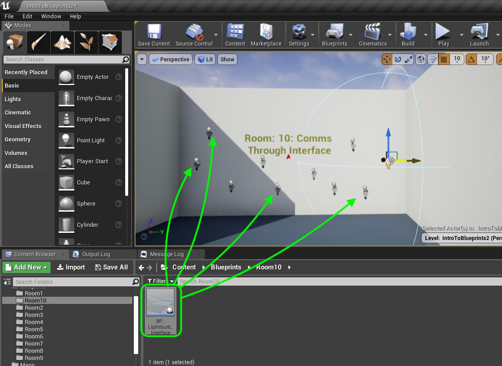
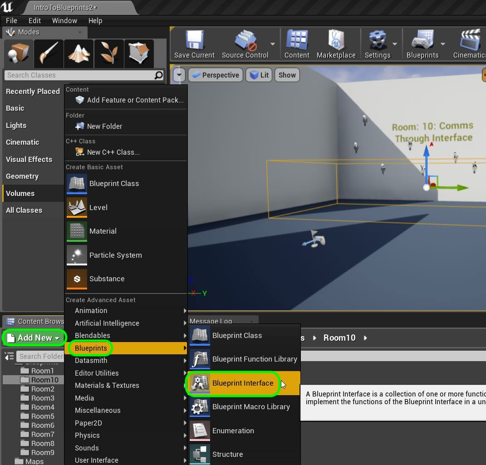
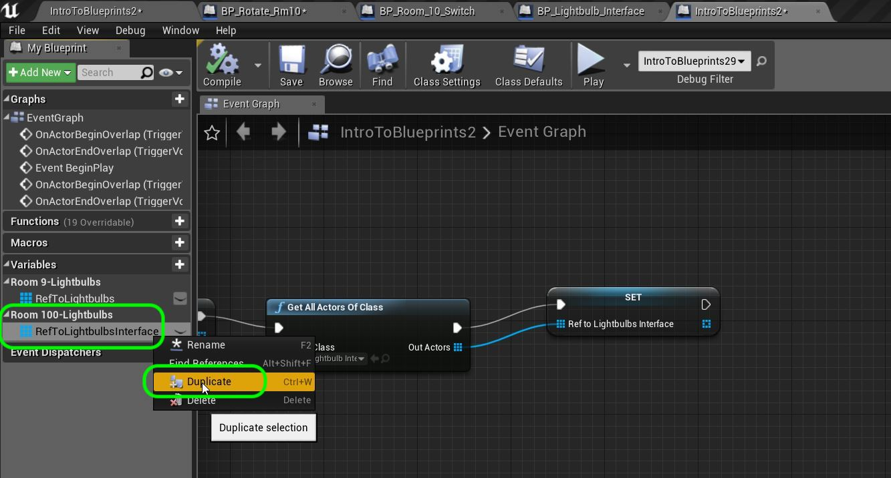

_____ 

## Index
_____ 

* Part 1 - Blueprint Basics
1. [Constructor and Begin Play](Intro-To-Blueprints-1.html#constructor-and-begin-play)
2. [Collision Events](Intro-To-Blueprints-2.html#collision-events)
3. [Grouping Meshes](Intro-To-Blueprints-3.html#grouping-meshes)
4. [Dynamic Material and Light Color](Intro-To-Blueprints-4.html#dynamic-material-and-light-color)
5. [Private Variables](Intro-To-Blueprints-5.html#private-variables)

* Part 2 - Blueprint Dynamic
1. [Adding Components in Script](Intro-To-Blueprints-6.html#adding-components-in-script)
2. [Tick Event](Intro-To-Blueprints-7.html#tick-event)
3. [Rotation and Translation](Intro-To-Blueprints-8.html#rotation-and-translation)

* Part 3 - Blueprint Communication
1. [Dynamically Alter Multiple Classes](Intro-To-Blueprints-9.html#dynamically-alter-multiple-classes)
2. [Communicate Through Interface](Intro-To-Blueprints-10.html#communicate-through-interface)

* Part 4 - Miscellaneous Behaviors
1.  [Oribiting Actors](Intro-To-Blueprints-11.html#oribiting-actors)

* Part 5  - Input
1. [Basic User Input on Actor](Intro-To-Blueprints-12.html#intro-to-blueprints)

_____ 

### Communicate Through Interface

Interfaces (or abstract classes in C++) are very useful in game development.  It enforces a structure on multiple objects so that we can call events and functions in all of them.  I will show you a very simple use of an interface in this example. This is another way we can interface between actors.  This allows us to communicate to multiple actor classes with one paradigm.

_____ 


{:start="{{ num }}"}
{{ num }}. Scooch the camera over to **Room 10**.  Add a `Room10` folder to the **Content Browser**:

  

_____



{:start="{{ num }}"}
{{ num }}. Right click on **Room 9 \| BP_Lightbulb_Multi** and duplicate it.

  

_____


{:start="{{ num }}"}
{{ num }}. Call the new blueprint `BP_Lightbulb_Multi`.  Drag and drop it to **Move** it to **Room10**.

  

_____


{:start="{{ num }}"}
{{ num }}. Drag and drop several **BP_Lightbulb_Interface** into the room.  

  

_____


{:start="{{ num }}"}
{{ num }}. Drag a **Trigger Volume** to the level.  Scale it to be in front where you can walk in and out of it in the room.  Clean up the **World Outliner** by dragging all blueprints and the trigger volume into **Room 10**.

  

_____



{:start="{{ num }}"}
{{ num }}. We are going to now create a special blueprint that will brindge multiple object.  Press **Add New** and select **Blueprints \| Bluepring Interface.

  

_____


{:start="{{ num }}"}
{{ num }}. Name it `BP_Room_Switch`.

  

_____


{:start="{{ num }}"}
{{ num }}. Open this new blueprint.  Notice it is read only.  It is a virtual interface so you will define it in the actors.  This is completely blank.  But we can add parameters.  Press the **+** button next to **Inputs** and call this variable `bIsOn` and make it type **Boolean**.

  

_____


{:start="{{ num }}"}
{{ num }}. Lets call the function something more meaningful.  Rename it to `Turn Room 10 Switches On and Off`.

  

_____


{:start="{{ num }}"}
{{ num }}. Open up **BP_Lightbulb_Interface** as we are going to subcribe to the **Interface**.  This is a commitment that we will implement the one interface function with a parameter that we have created.  Press the **Class Settings** button and in the **Details** panel press the **Add** dropdown menu and select the **BP_Room_10_Switch** we just created. Then most importantly, press the **Compile** button:

  

_____


{:start="{{ num }}"}
{{ num }}. Now lets add an event to this blueprint that will run when this event is triggered.  Go to the **Event Graph** tab and add a **Event Turns Room 10 Switches on Off** node:

  

_____


{:start="{{ num }}"}
{{ num }}. Each actor that subscribes to it can create its own definition.  This means that the behavior can be customized PER actor class. This is an event so there is an execution pin.

  

_____


{:start="{{ num }}"}
{{ num }}. Now add a **Switch Light** node and connect the execution pins and the boolena for **Is On** to **Turn On**.  This will run the function we previously wrote to turn the light on and off.

  

_____


{:start="{{ num }}"}
{{ num }}. Select **TriggerVolume2** that is in room 10.  Then press the **Blueprints** button then press **Open Level Blueprint**.

  

_____


{:start="{{ num }}"}
{{ num }}. Press the **+** button next to **Variables** and add a new variable called `RefToLighbubsInterface`.  Make it type **BP_Lightbulb_Interface \| Object Reference**.

  

_____



{:start="{{ num }}"}
{{ num }}. Press the sphere icon next to the **Variable Type** and select an **Array**.

  

_____


{:start="{{ num }}"}
{{ num }}. Add a **Tooltip** with `Keeps array of all room 10 lightbulbs`.  Set **Private** to `true` and add it to category `Room 10-Lightbulb`.

  

_____


{:start="{{ num }}"}
{{ num }}. In the **Event Graph** add to the nodes that are attached to **Begin Play**.  Add a **Get All Actors of Class** node and select a **BP_Lightbulb_Interface** class.

  

_____


{:start="{{ num }}"}
{{ num }}. Drag a copy of **RefToLightbulbsInterface** and add a **Set** node.  Connect the execution pins and the **Out Actors** array node to the **RefToLightbulbsInterface** node.

  

_____


{:start="{{ num }}"}
{{ num }}. Make sure you still have the Trigger Volume selected in game.  Right click on the event graph and select **Add Event for Trigger Volume 2 \| Collision \| Add On Actor Begin Overlap \| Add On Actor End Overlap**. 

  

_____


{:start="{{ num }}"}
{{ num }}. Right click on the graph and add a **Flip Flop** node.

  

_____


{:start="{{ num }}"}
{{ num }}. Connect the execution pins of both the **Enter** and **End** overlap events to the input of the **Flip Flop** node.  Drag a **Get RefToLightbulbsInterface** to the graph.  Right click and call the interface by calling **Turns Room 10 Switches on Off**.

  

_____


{:start="{{ num }}"}
{{ num }}. Connect the outside execution pins from the output of the **Flip Flop** node to the input pin in **Turns Room 10 Switches on Off**.  Connect the **Is A** pin form **Flip Flop** to **Is On** pin from **Turns Room 10 Switches on Off**. Connect the **RefToLibhbulbsInterface** to the **Target** pin.  This will call this event in all actors in this array.

  

_____


{:start="{{ num }}"}
{{ num }}. Now we have the bluprint calling the interface and passing all the lights in the room.  We also have the interface implemented in the lightbulb that turns on and off.  Run the game and walk in and out of the volume.

  

_____


{:start="{{ num }}"}
{{ num }}. The power of this interface is that other objects can react to the same event and do something different.  Lets add a cube that rotates when the player is in the collision volume.  Go to **Room 8** and right click on **BP_Rotate_Object** and select **Duplicate**.

  

_____


{:start="{{ num }}"}
{{ num }}. Call it `BP_Rotate_Rm10` and drag it into the **Room10** folder.

  

_____


{:start="{{ num }}"}
{{ num }}. Drag two **BP_Rotate_Rm10** in the room.

  

_____


{:start="{{ num }}"}
{{ num }}. Delete all the Pitch and Roll nodes to leave just the Yaw.

  

_____


{:start="{{ num }}"}
{{ num }}. Open up the **BP_Rotate_Rm10** blueprint. Delete all three booleans in this blueprint. We will be turning it on off in code and not in the game menu.  So these variables are not necessary.

  

_____


{:start="{{ num }}"}
{{ num }}. Right click on the graph and add a **Event Turns Room 10 Switches on Off** node.

  

_____


{:start="{{ num }}"}
{{ num }}. Now remove the **Event Tick** node and replace it with this new event node you just added.

  

_____


{:start="{{ num }}"}
{{ num }}. So your graph should look like this:

  

_____


{:start="{{ num }}"}
{{ num }}. Now we are missing the **Delta Seconds** that was fed by the **Event Tick** node.  No problem we can get this value by right clicking and adding a **Get World Delta Seconds** node. 

  

_____


{:start="{{ num }}"}
{{ num }}. Connect the output of the **Get World Delta Seconds** node to the empty **Multiplication** node.

  

_____


{:start="{{ num }}"}
{{ num }}. Connet the **Is On** output pin from the **Event** node and connect it to the **Condition** pin in the **Branch** node.

  

_____


{:start="{{ num }}"}
{{ num }}. Go to the **Level Blueprint** for **IntroToBlueprints2** and right click on **RefToLightbulbsInterface** and select **Duplicate**.

  

_____


{:start="{{ num }}"}
{{ num }}. Name it `RefToRotateInterface** and change the type to **BP Rotate Object \| Object Reference**.  Update the **Tooltip**.

  

_____


{:start="{{ num }}"}
{{ num }}. Now at the end of the **Begin Play** event pull of the last **Set** node execution pin and add a **Get All Actors Of Class** node and change the **Actor Class** to **BP_Rotate_Rm10**.

  

_____


{:start="{{ num }}"}
{{ num }}. Add a **Set RefToRotateInterface** node and connect the execution and array pins to the **Get All Actors Of Class** node.

  

_____


{:start="{{ num }}"}
{{ num }}. Now to rotate we need to keep calling the cube every frame the player is in the collision volume.  There is only an enter and and exit event so we will need to add a boolean.  First add an **Event Tick** node to call.  Add a new **Variable** called `bRotateCube` and make it **Variable Type** called **Boolean**.  Set it to **Private** and set it ot the **Room10-Lightbulb** Category.

  

_____


{:start="{{ num }}"}
{{ num }}. Drag and drop a **Get bRotateCube** variable onto the **Event Graph**.

  

_____


{:start="{{ num }}"}
{{ num }}. Drag and drop a **RefToRotateInterface** variable to the chart.  Add a **Turn Room 10 Switches on Off** node and connect the array output to the **Target** input.

  

_____


{:start="{{ num }}"}
{{ num }}. Connect the **Event Tick** execution pins and the **Rotate Cube** output boolean pin to the **Turn Room 10 Switches on Off** node.

  

_____


{:start="{{ num }}"}
{{ num }}. Now in the Overlap events we need to turn the **bRotateCube** boolean on and off.  Go to the end and add a **Set RotateCube** node.  Attach the execution pin from the **Turns Room 10 Switches on Off** and connect it to the **Set** node.  Connect the output **IsA** pin from the **Flip Flop** node to the **Rotate Cube** input in the **Set** node.

  

_____


{:start="{{ num }}"}
{{ num }}. Now go to the game and play it.  Notice that the single interface can trigger two completely different type of events!

  

_____



{:start="{{ num }}"}
{{ num }}. That's it for Room 10. Press **Save All** and update Github by **committing** and **pushing** all the changes made.  Next up we will be rotating around an actor.

  

_____  

  

[<- Previous](Intro-To-Blueprints-9.html)&nbsp;&nbsp;&nbsp;[Home](../index.html)&nbsp;&nbsp;&nbsp; [Continue ->](Intro-To-Blueprints-11.html)
   
   
   

