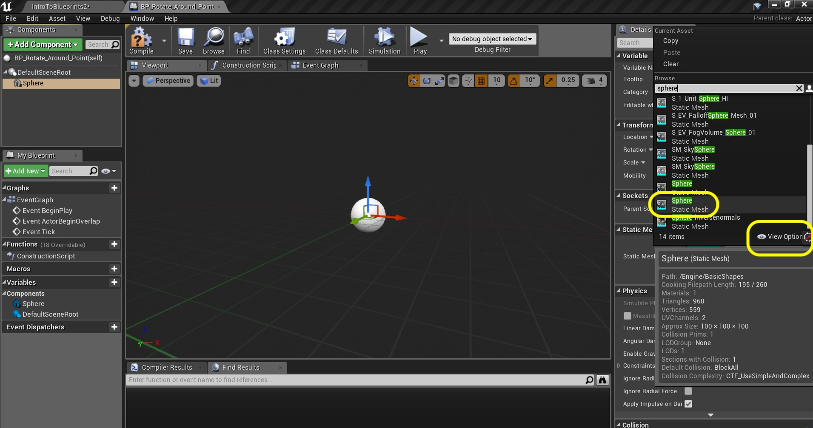

_____ 

## Index
_____ 

* Part 1 - Blueprint Basics
1. [Constructor and Begin Play](Intro-To-Blueprints-1.html#constructor-and-begin-play)
2. [Collision Events](Intro-To-Blueprints-2.html#collision-events)
3. [Grouping Meshes](Intro-To-Blueprints-3.html#grouping-meshes)
4. [Dynamic Material and Light Color](Intro-To-Blueprints-4.html#dynamic-material-and-light-color)
5. [Private Variables](Intro-To-Blueprints-5.html#private-variables)

* Part 2 - Blueprint Dynamic
1. [Adding Components in Script](Intro-To-Blueprints-6.html#adding-components-in-script)
2. [Tick Event](Intro-To-Blueprints-7.html#tick-event)
3. [Rotation and Translation](Intro-To-Blueprints-8.html#rotation-and-translation)

* Part 3 - Blueprint Communication
1. [Dynamically Alter Multiple Classes](Intro-To-Blueprints-9.html#dynamically-alter-multiple-classes)
2. [Communicate Through Interface](Intro-To-Blueprints-10.html#communicate-through-interface)

* Part 4 - Miscellaneous Behaviors
1.  [Oribiting Actors](Intro-To-Blueprints-11.html#oribiting-actors)

* Part 5  - Input
1. [Basic User Input on Actor](Intro-To-Blueprints-12.html#intro-to-blueprints)

_____ 

### Orbiting Actors

Now lets do something a bit more complicated.  We will be adding debug information to help us check out work along the way.  We will do a bit of vector manipulation and basic vector arithmetic. Lets orbit (move and rotate) multiple objects around annother object.

_____ 



{:start="{{ num }}"}
{{ num }}. Move the camera to room 11.  Add a new Folder called **Blueprints \| Room11**.  Create a new **Blueprint Class** of type  **Actor** and call it `BP_Rotate_Around_Point`:

  

_____


{:start="{{ num }}"}
{{ num }}. Drag a box into the middle of the room.  Give it space as we will have a blueprint orbit around it.  Call it in the **World Outliner** `Rotate Around Me`.

  

_____


{:start="{{ num }}"}
{{ num }}. Double click **BP_Rotate_Around_Room** and press the **Add Component** button and add a **Static Mesh** to the blueprint.

  

_____


{:start="{{ num }}"}
{{ num }}. Go to the **Details** panel and press **View Options** and select **Engine Content**.  Then search for **Sphere** and add this to the blueprint.

  

_____


{:start="{{ num }}"}
{{ num }}. Assign the **Material** `M_Metal_Burnished_Steel` to the **Sphere** mesh in the details panel:

  

_____


{:start="{{ num }}"}
{{ num }}. Now we need to figure out how fast we want to orbit around the actor.  We will measure it in degrees per second.  Add a variable to hold this speed by pressing the **+** button next to **Variables**.  Call is `Degrees Per Second`, make sure it is of type **Float**, that it is **Instance Editable**, **Private** and set the category to `Rotation`.  Add a tooltip, mine says `Speed of how fast an object rotates per second`.

  

_____


{:start="{{ num }}"}
{{ num }}. Now we need a variable to store the current angle that the actor is in relative to whom it is orbiting around.  This will store a fractional number between 0 and 360.  Call it `Current Angle In Degrees`, make sure it is of type **Float**, make it **Private** and put it in **Catergory** `Rotatipn`.

  

_____


{:start="{{ num }}"}
{{ num }}. Lets program our current angle.  Drag the `Degrees Per Second` variable to the **Event Graph** and select **Get**.  Drag off of the pin and we now want a **Float * FLoat** node:

  

_____


{:start="{{ num }}"}
{{ num }}. Now since we need to do this every frame we will do the from the **Tick Event** node.  Also this node gives us the time since last frame in milliseconds.  So we multiply our **Degrees Per Second** variable by **Delta Seconds** coming from the **Tick** node:

  

_____


{:start="{{ num }}"}
{{ num }}. That will give us the rotation amount in degrees this frame.  So we need to add it to our current angle.  Drag and drop a **Get** node for **Current Angle In Degrees** and a **Float + Float** node.  Add this current angle to the output of the **Multiplication** node:

  

_____


{:start="{{ num }}"}
{{ num }}. Drag and drop a **Set** node for **Current Angle In Degrees** and attack the output of the last **Addition** node to it.  Connect the execution pin with the **Tick** node:

  

_____


{:start="{{ num }}"}
{{ num }}. Add the comment `Set Current Rotation in Degrees` to the group of nodes coming after the **Tick** node.

  

_____


{:start="{{ num }}"}
{{ num }}. Now it is a good idea to test our work after each step.  There is a fair amount to do before we can see a rotation.  We want to make sure there are no bugs before we go to far.  So lets print this value and we should see an angle increase over time.  We do not always want to display it so lets put it on a switch that we can adjust. Lets add a **Boolean** called `SHow Debug Angle In Degrees` variable that is **Instance Editable**, **Private** and in **Category** `Debug`. Add a tooltip as well.   

  

_____


{:start="{{ num }}"}
{{ num }}. Drag a **Get** node for the **Show Debug Angle In Degrees** variable and drag off of the pin.  Select a **Print String** node.  Note that this is not for an official HUD in the game.  We would go through the previous process for this.  This is just for testing and will not show up in a release build.

  

_____


{:start="{{ num }}"}
{{ num }}. Connect the output **Set** execution pin to the **Print String** input pin.  Press the small arrow at the bottom to expand the options.  Now this will print every frame so we don't want the default 2.0 second variable. We will just get a large scrolling mess (try it!).  Set **Duration** to `0.0`:

  

_____


{:start="{{ num }}"}
{{ num }}. Go to the game and drag a copy of the blueprint into the scene next to the box.  Make sure **Show Debug Ange In Degrees** is set to true. Run the game and we get **Hello**.  This is not what we wanted, we wanted to see the current angle in degrees!

  

_____


{:start="{{ num }}"}
{{ num }}. Go back to the blueprint and see if you can figure it out.  Look at the **In String** box and you see **Hello**.  We want this to read the current angle.  Drag the outpin from **Set Current Angle In Degrees** node to the **In String** pin on **Print String**.  UE4 will pick a conversion node to go from **Float** to **String**:

  

_____


{:start="{{ num }}"}
{{ num }}. Clean up the nodes so that they are neat:

  

_____


{:start="{{ num }}"}
{{ num }}. Go back to the game and select the **BP_Rotate_Around_Point** object in the **World Outliner**.  Make sure **Show Debug Ange In Degrees** is set to true.

  

_____


{:start="{{ num }}"}
{{ num }}. Now the debug menu we are printing shows a number going up. There is only one problem.  This will probably be OK for a while but really I want to clamp the number between **0** and **360**.

  

_____


{:start="{{ num }}"}
{{ num }}. An easy way of doing this is using modulo.  This gives us the remainder after a division.  So if I divide by 360, we will have a remainder between 0 and 359.  This is exactly what I want.  Right click and start typing **Modulo** and select the float version:

  

_____


{:start="{{ num }}"}
{{ num }}. Place the node so that it is between the **Addition** node and **Set** node. Connect the pins.  Change the value you are taking the remainder of and set it to `360`.

  

_____


{:start="{{ num }}"}
{{ num }}. You can also add a smaller comment on top of any node.  If you click on the three dots that show up on the top left corner when you hover on the node you can adda comment.  I added to the **Modulo** node `Keep angle between 0 and 359`.

  

_____


{:start="{{ num }}"}
{{ num }}. Run in game and you will notice that the number always goes back to 0 when it passes 360.  Perfect!

  

_____


{:start="{{ num }}"}
{{ num }}. Now we need to rotate around the cube actor.  We need a variable to access its class.  Add a new **Variable**, call it `Target To Rotate Around` and select type **Actor \| Object Referencde**.

  

_____


{:start="{{ num }}"}
{{ num }}. Make sure the **Instance Editable** is set to `true`, that the variable is **Private** and that the **Category** is set to `Targets`.  Give the variable a tooltip:

  

_____


{:start="{{ num }}"}
{{ num }}. To keep our graph neat we will put the rotation nodes under the current group.  Lets add a **Sequence Node**.  Highjack the output of the **Tick** node to the input of the **Sequence** node.  The attach the **Then 0** output to the **Set** node.

  

_____


{:start="{{ num }}"}
{{ num }}. Drag and drop the **Target To Rotate Around** variable under the other nodes and select **Get**.  Put a large comment box around it saying `Rotate Around Target`:

  

_____


{:start="{{ num }}"}
{{ num }}. Now this is a pointer to a game object that you need to assign in the world editor.  Whenever we point to an object we should test for a NULL pointer (pointing to an object in a memory address that does not exist yet).  Pull off of the **Target to Rotate Around** node and select a **Utilities \| ? Is Valid** (be careful there are many different is valid nodes) node:

  

_____


{:start="{{ num }}"}
{{ num }}. Connect the **Then 1** output of the **Sequence** node execution pin to the execution input in the **Is Valid** pin. Make sure the variable output is connected to the **Input Object** pin on the **Is Valid** node:

  

_____


{:start="{{ num }}"}
{{ num }}. Now lets test our work to date.  We have enough information to run a test in game.  Aed two **Print String** nodes.  Connect one to the **Is Valid** output of the **Is Valid** node and the other to the **Is Not Valid** pin.  The **Is Valid** print statement should have message `Rotate Around Object` in the default blue color for a duration of `0.0`.  The other should have a message `No Object To Rotate Around`, change the color to a shade of **Red** and set the duration to `0.0`.

  

_____


{:start="{{ num }}"}
{{ num }}. Now go into the game and don't assign a target, just run it as is.  You should see the red message **No Object To Rotate Around** appears when you run the game:

  

_____


{:start="{{ num }}"}
{{ num }}. Now highlight the **Blueprint** actor in the scene and assign the **Rotate Around Me** actor to the **Target To Rotate Around** input that we set up:

  

_____


{:start="{{ num }}"}
{{ num }}. When we run the game we now have a valid game object.  The message says in blue **Rotate Around Object** which is what we wanted!

  

_____


{:start="{{ num }}"}
{{ num }}. OK, lets move on with the rotation.  Right click and add a **Rotate Vector Around Axis** node.  

  

_____


{:start="{{ num }}"}
{{ num }}. Now lets look at our input nodes.  So we will be calculating from teh object we are rotating around (the cube); from its origin point.  The **In Vector** is a relative vector to the cube and will make the radius of the rotation.  The angle is the value we have already calculated in degrees.  The axis will be the **Z** axis of the cube.  This means that it will rotate around its Z axis (remember it is Z up in UE4).

  

_____


{:start="{{ num }}"}
{{ num }}. Make a new variable of type **Float** called `Radius`.  Make sure it is **Instance Editable** and **Private**.  Add the **Category** `Rotation` and add a tooltip.  Press compile and set the default value of the **Radius** to `300`!

  

_____


{:start="{{ num }}"}
{{ num }}. Now drag and drop a **Get Radius** to the graph and we need to figure out how to attach this to the **In Vector** input.  Now this is a **float** and the in vector wants a vector (hover over the pins).  Now we will just be affecting the Z vector of the object.  Now if we split the pins and plug this into the **X** vector this will work in world space.  Regardless of the rotation of the cube, this will be always rotating around world Z. What if we want it to rotate with the cube.  We need it relative to the cube's rotation.  Unreal gives us a normalized vector along the plane called **Get Actor Right Vector**.  This is a vector that is 1 unit long point to the relative right side direction of the actor.  Add this node:

  

_____


{:start="{{ num }}"}
{{ num }}. Now drag a **Get** reference to the **Target To Rotate Around** variable and attack it to the **Target** input of **Get Actor Right Vector**.  We are rotating around the referenced object, not ourselves.  Now we want to scale this normalized vector by adding a **Vector * Float** node and attaching the pins accordingly:

  

_____


{:start="{{ num }}"}
{{ num }}. Send the output of this **Multiply** into the **In Vect** pin of the **Rotate Vector Around Axis** node:

  

_____


{:start="{{ num }}"}
{{ num }}. We can also add variables without dragging and dropping.  We can click on an open part of the graph and type **Current Angle In Degrees** and select **Get**:

  

_____


{:start="{{ num }}"}
{{ num }}. Connect the output of the **Current Angle In Degrees Get** pin to the **Angle Deg** input in the **Rotate Vector Around Axis** node.  Add appropriate comments:

  

_____


{:start="{{ num }}"}
{{ num }}. Now we want to rotate around the relative Z axis of the box.  So we will right click and select the **Get Actor Up Vector** node.  This is the same idea as the right vector except this is the relative Z axis of the box.

  

_____


{:start="{{ num }}"}
{{ num }}. Now again this is relative to the box.  So take the output of the **Target To Rotate Around** node and connect it to the **Target** of the **Get Actor Up Vetor**.  Then connect its **Return Value** to the **Axis** input pin on the **Rotate Vector Around Axis** node.  Add comments...

  

_____


{:start="{{ num }}"}
{{ num }}. Now we can get to the meat of this room.  We have calulated where in world coordinates our blueprint needs to be relative to the object we are rotating around.  Right click and select **Set Actor Location**.  Connect the **Return Value** output pin of the **Rotate Vector Around Axis** node to the **New Location** pin in the **Set Actor Location** node.  Highjack the **Is Valid** pin from the **Is Valid** node and connect it ot the input execution pin in the **Set Actor Location** node.  Delete this **Print String*** node as we no longer need it.

  

_____


{:start="{{ num }}"}
{{ num }}. Add some commnents to explain what we are doing:

  

_____


{:start="{{ num }}"}
{{ num }}. Before we try it in game, I just realized I made an error.  The vector is in local space to the cube.  What I need to do is to get this into world coordinates.  I do this by adding my current location to this vector.  Add a **Get Actor Location** node and an **Vector + Vector** node adding the output of the **Return Vector Around Axis** node BEFORE getting sent to **New Location** in the **Set Actor Location** node:

  

_____


{:start="{{ num }}"}
{{ num }}. Adsd a **Get Target to Rotate Around** node and attach it to the **Target** pin of the **Get Actor Location** node.  We want to rotate around the target actor.

  

_____


{:start="{{ num }}"}
{{ num }}. Run the game and look in the room, the sphere should be rotating around the cube.  Now try rotating the cube and see if the oribting follows its angle?  OK, on the next page we will print a debug radius to visualize a vector between the cube and the sphere.

  

_____

  

[<- Previous](Intro-To-Blueprints-14.html)&nbsp;&nbsp;&nbsp;[Home](../index.html)&nbsp;&nbsp;&nbsp; [Continue ->](Intro-To-Blueprints-11B.html)
   
   
   

