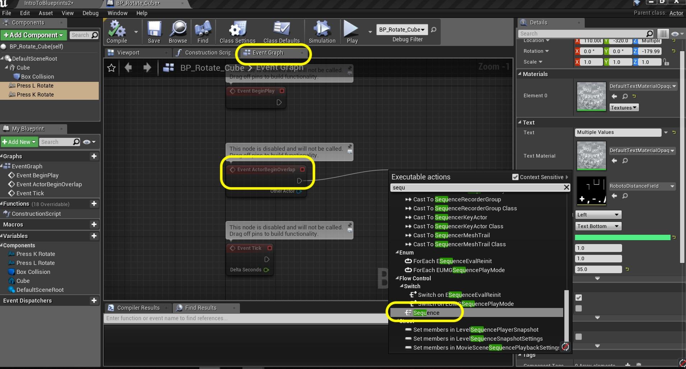
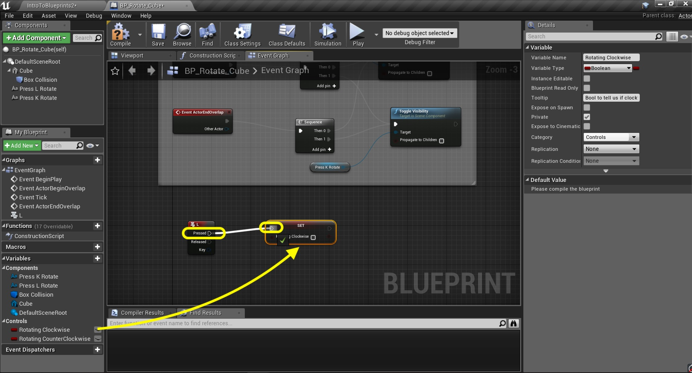
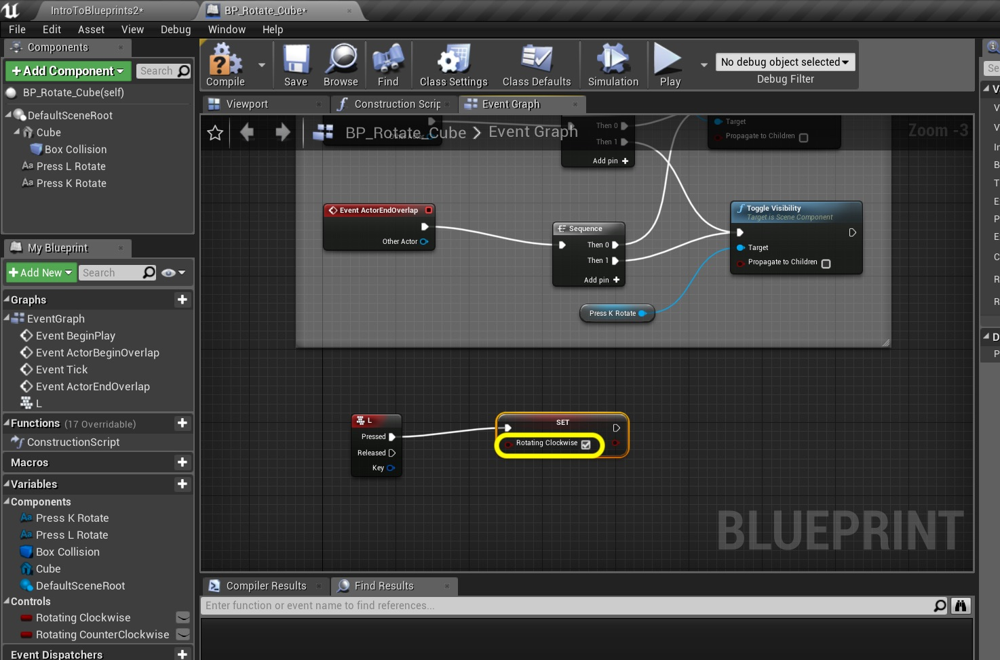
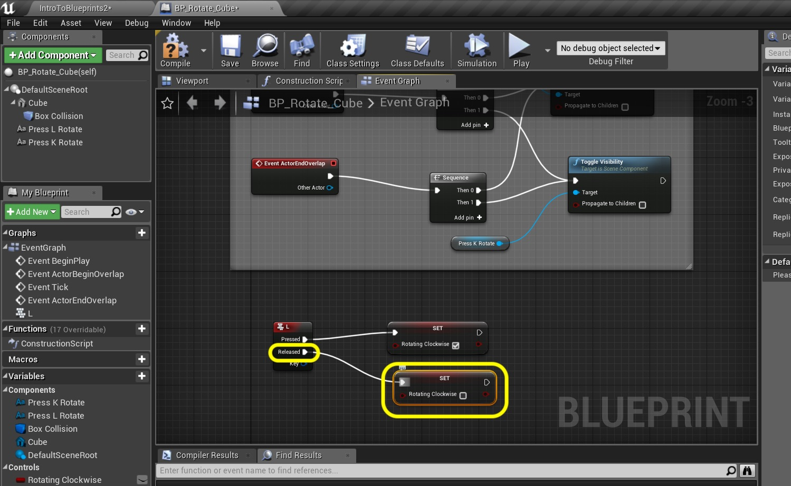
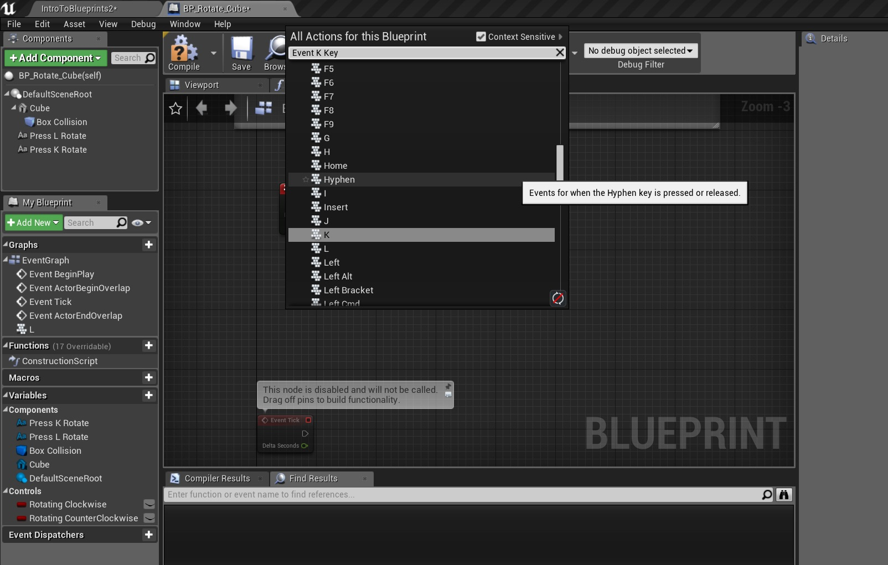
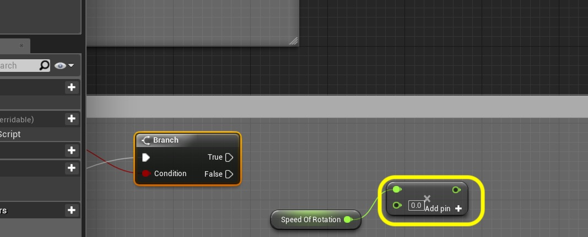
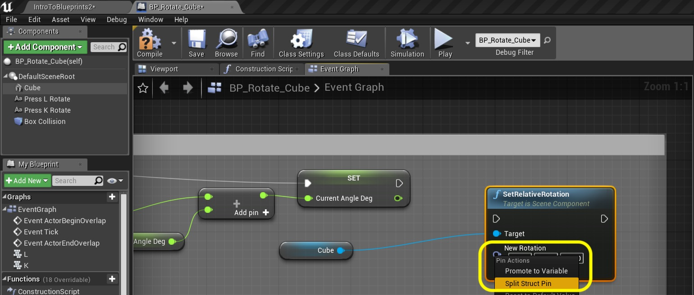

_____ 

## Index
_____ 

* Part 1 - Blueprint Basics
1. [Constructor and Begin Play](Intro-To-Blueprints-1.html#constructor-and-begin-play)
2. [Collision Events](Intro-To-Blueprints-2.html#collision-events)
3. [Grouping Meshes](Intro-To-Blueprints-3.html#grouping-meshes)
4. [Dynamic Material and Light Color](Intro-To-Blueprints-4.html#dynamic-material-and-light-color)
5. [Private Variables](Intro-To-Blueprints-5.html#private-variables)

* Part 2 - Blueprint Dynamic
1. [Adding Components in Script](Intro-To-Blueprints-6.html#adding-components-in-script)
2. [Tick Event](Intro-To-Blueprints-7.html#tick-event)
3. [Rotation and Translation](Intro-To-Blueprints-8.html#rotation-and-translation)

* Part 3 - Blueprint Communication
1. [Dynamically Alter Multiple Classes](Intro-To-Blueprints-9.html#dynamically-alter-multiple-classes)
2. [Communicate Through Interface](Intro-To-Blueprints-10.html#communicate-through-interface)

* Part 4 - Miscellaneous Behaviors
1.  [Oribiting Actors](Intro-To-Blueprints-11.html#oribiting-actors)

* Part 5  - Input
1. [Basic User Input on Actor](Intro-To-Blueprints-12.html#intro-to-blueprints)

_____ 

## Part 5 - Input

We will be looking at how Unreal handles user input like keyboard, joystick and touch screens.

_____ 

### Basic User Input on Actor

Lets add user input to a basic **Actor** class. We will be using the **L** and **K** button to rotate a cube.

_____ 



{:start="{{ num }}"}
{{ num }}. Add a new **Blueprints \| Room12** folder.  Create a new **Blueprint Class** of class **Actor**.  Call it  `BP_Rotate_Cube`:

  

_____


{:start="{{ num }}"}
{{ num }}. Add a **Static Mesh** component to the blueprint.  Call it `Cube`.  Assign the **Static Mesh** `Cube` (you need to turn on **Engine Assets**) and **Material** `M_Metal_Burnished_Steel`.

  

_____


{:start="{{ num }}"}
{{ num }}. Add a **Box Collision** component and make the **Box Extent** `200.0`, `600.0`, `100.0`.  Move the collider in front of the box:

  

_____


{:start="{{ num }}"}
{{ num }}. Add **BP_Rotate_Cube** to the **Room 12** and center it.  Make sure the collision box is in front of cube like so:

  

_____


{:start="{{ num }}"}
{{ num }}. For housekeeping move this game object into the **Room 12** folder:

  

_____


{:start="{{ num }}"}
{{ num }}. Add a **Text Renderer** component to the blueprint.

  

_____


{:start="{{ num }}"}
{{ num }}. Change the **Text** to `Press L Key to Rotate Clockwise`.  I had to rotate the component by 180 on the **Z** axis to face forward.  Change **Horizontal Alignment** to **Center** and Adjust the **Text Render Color** to contrast with the background.  Select a larger font size as weol!

  

_____


{:start="{{ num }}"}
{{ num }}. Right click on **Press L Rotate** Component and press Duplicate.  Call the new component `Press K Rotate`.

  

_____


{:start="{{ num }}"}
{{ num }}. Change the **Text** to `Press K Key to Rotate Counter Clockwise`.  Adjust the location to be below the L key text component:

  

_____


{:start="{{ num }}"}
{{ num }}. Go to the game and hit run.  Look and see if you are happy with the position.  Make any size adjustments you need to.

  

_____



{:start="{{ num }}"}
{{ num }}. Go to the **Event Graph** and pull off of the **Event Actor Begin Overlap** and drag off of the execution pin.  Select a **Sequence** node:

  

_____


{:start="{{ num }}"}
{{ num }}. Drag off of the execution pin from the **Sequence Then 0** pin and select **Toggle Visibility (Press L Rotate)**.

  

_____


{:start="{{ num }}"}
{{ num }}. Drag off of the execution pin from the **Sequence Then 1** pin and select **Toggle Visibility (Press K Rotate)**.

  

_____


{:start="{{ num }}"}
{{ num }}. Right click on the empty graph and select the **Event Actor End Overlap** node:

  

_____


{:start="{{ num }}"}
{{ num }}. Pull off the execution pin and select another **Sequence** node. Connect the outputs of the **Sequence** nodes to the two **Toggle Visibility** nodes:

  

_____


{:start="{{ num }}"}
{{ num }}. Add a comment to this group of nodes called `Toggle Text On and Off`:

  

_____



{:start="{{ num }}"}
{{ num }}. Run the game and walk into the collision volume.  You will see that the algorithm is backwards.  When you are inside the volume the text is off and on when you are outside the volume.  

  

_____


{:start="{{ num }}"}
{{ num }}. Just ensure that visibility is off when we start open the blueprint and make sure that **Visibility** is `False` on both text components:

  

_____


{:start="{{ num }}"}
{{ num }}. Now there is an event trigger for when a button is pressed and released.  There is not a trigger for a button being held.  So we will create a boolean that sets when a key is held.  We need to add two booleans.  Add  a new **Boolean** variable called `Rotating Clockwise`, make it **Private** and set the **Category** to `Controls`.  Add a **Tooltip** that says `Bool to tell us if clockwise button is pressed`:

  

_____


{:start="{{ num }}"}
{{ num }}. Go to the **My Blueprints** panel and select the **Rotating Clockwise** with the right mouse button and select **Duplicate**:

  

_____


{:start="{{ num }}"}
{{ num }}. Rename the Variable to `Rotating CounterClockwise` and update the **Tooltip**:

  

_____


{:start="{{ num }}"}
{{ num }}. Now lets get an event that is called when the **L** key is pressed.  Right click on the open graph and look for **Event \| Keyboard Event \| L**:

  

_____


{:start="{{ num }}"}
{{ num }}. See that the event node has two execution pins.  One for **Pressed** and one for **Released**.  Drag off the **Pressed** key and add a **Set Rotating Clockwise** node:

  

_____


{:start="{{ num }}"}
{{ num }}. Set the **Rotating Clockwise** boolean to `true`.

  

_____


{:start="{{ num }}"}
{{ num }}. Repeat the same thing for the **Release** pin but set the **Rotating Clockwise** boolean to `false`.

  

_____


{:start="{{ num }}"}
{{ num }}. Right click on the open graph and look for **Event \| Keyboard Event \| K**:

  

_____


{:start="{{ num }}"}
{{ num }}. Add two **Set Rotating CounterClockwise**.  For the **Pressed** execution pin, set to `true` and the **Released** pin to `false`.

  

_____


{:start="{{ num }}"}
{{ num }}. Add the comment `Button Pressed Booleans` to the neds around te **L** and **K** events:

  

_____


{:start="{{ num }}"}
{{ num }}. Drag the **Rotating Clockwise** nodes and drop it on the graph at the bottom.  Choose **Get**:

  

_____


{:start="{{ num }}"}
{{ num }}. Drag off of the output pin and select a **Branch** node.

  

_____


{:start="{{ num }}"}
{{ num }}. Add a **Sequence** node and attach it to the **Event** tick output pin.  Attach the output of the **Sequence Then 0** pin to the **Branch** input.  

  

_____


{:start="{{ num }}"}
{{ num }}. We need a variable to adjust the speed of the rotation. Add a new variable called `Speed of Rotation` of **Type Float** and make it **Instance Editable** and **Private**.  Set the **Category** to `Controls`.  Set the **Tooltip** to `Set speed in degrees per second`. 

  

_____


{:start="{{ num }}"}
{{ num }}. We also need a variable to store the current angle of rotation.  Add a new variable called `Current Angle Deg` of **Type Float** and make it **Private**.  Set the **Category** to `Controls`.  Set the **Tooltip** to `Holds current angle in degrees`. 

  

_____


{:start="{{ num }}"}
{{ num }}. Drag the **Speed Of Rotation** node and drag a **Get** node.

  

_____


{:start="{{ num }}"}
{{ num }}. Add a **Float * Float** multiplication node attached to the **Speed of Rotation** node:

  

_____


{:start="{{ num }}"}
{{ num }}. Connect the output **Delta Seconds** from the **Event Tick** to the other end of the **Multiplication** node.  This gives us the speed for this one frame:

  

_____



{:start="{{ num }}"}
{{ num }}. Then we need to add this to the existing angle.  Place a **Get Current Angle Deg** node:

  

_____


{:start="{{ num }}"}
{{ num }}. Then put a **Float + Float** node and add the output of the **Multiplication** node and the **Current Angle Deg** node:

  

_____


{:start="{{ num }}"}
{{ num }}. Right click and select a **Set Current Angle Deg** node:

  

_____


{:start="{{ num }}"}
{{ num }}. Pull of of the **Float + Float** output pin and add a **Set Current Angle Deg** node.  Connect the execution pin of **Branch True** to the input execution pin:

  

_____


{:start="{{ num }}"}
{{ num }}. Now we don't want to use **Set Actor Rotation** or the entire actor which includes the text and the collision box will rotate.  We just want the **Cube** component mesh to rotate.  Drag and drop a **Get Cube** node onto the graph.  Pull off of the pin and select **Set Relative Rotation** node:

  

_____


{:start="{{ num }}"}
{{ num }}. Now do not have an entire rotation on all axis.  We have a float to rotate around the **Z** axis.  So right clock on the **Set Relative Rotation** node's **New Rotation** pin and select **Split Struct**:

  

_____


{:start="{{ num }}"}
{{ num }}. Connect the output of the **Set Current Angle Deg** node to the input of the **Set Relative Rotation** node's **New Rotation Z (Yaw)** pin:

  

_____


{:start="{{ num }}"}
{{ num }}. Connect the execution pins.

  

_____


{:start="{{ num }}"}
{{ num }}. Press **Compile** and adjust the default **Speed of Rotation** variable to `45.0`.

  

_____


{:start="{{ num }}"}
{{ num }}. Run it in game to test if clockwise works.  Run into the box and press L (or K for that matter).  Hmmm nothing happens.  

  

_____


{:start="{{ num }}"}
{{ num }}. Now for an actor to read player controls (something normally reserved for a **Pawn** or **Character** blueprint we need to tell the game engine to add that ability to the actor).  We also want it to not work when we are not in the collision volume. To the right of the two **Toggle Visibility** nodes add a **Get Player Controller** node.  

  

_____


{:start="{{ num }}"}
{{ num }}. This is a class that we have not customized but default is used in the game (you will see it in the **World Outliner** when running the game).  Since this simulation of for a single player controller we will leave **Player Index** at `0`.  If this was a multiplayer game we woudl have to indicate which player this action was associated with.  Drag off of the **Return Value** pin and select an **Enable Input** node:

  

_____


{:start="{{ num }}"}
{{ num }}. Now we don't want to pull off of the **Toggle Visibility** execution pins as this gets called every time and handles toggling on and off.  This is an enable node and doesn't toggle.  So go back to the **Sequence** node and press **Add pin** then take the **Then 2** execution pin and attach it to the input execution of the in of the **Enable Input** node.  Add a comment to this new portion `Toggle Input On and Off`:

  

_____


{:start="{{ num }}"}
{{ num }}. Repeat this process for an added **Disable Input** node for when the player leaves the collision volume:

  

_____


{:start="{{ num }}"}
{{ num }}.  Now go to the game and aselect the **BP_Rotate_Cube** instance in the level and change the **Auto Receive Input** to **Player 0**. 

  

_____


{:start="{{ num }}"}
{{ num }}.  Now run it in game and the cube should rotate clockwise when you press the **L** key.  

  

_____


{:start="{{ num }}"}
{{ num }}.  Lets add counter clockwise movement. Now we need to add two nodes a **Get Rotating Counter Clockwise** and **Branch Node**.  This checks to see if the counter clockwise K button is pressed.

  

_____


{:start="{{ num }}"}
{{ num }}. Now the only difference for counter clockwise movement is that the rotation is negative. So highjack the output of the **Speed of Rotation** and **Delta Seconds** node's **Multiplication** output and add a **Float \* Float** node beneath:

  

_____


{:start="{{ num }}"}
{{ num }}. Multiply this number by `-1.0`:

  

_____


{:start="{{ num }}"}
{{ num }}. Copy and paste the **Get Current Angle Deg**, **Addition** and **Set Current Angle Deg** pins and paste below.  Connect the output of the **Multiplication** by -1 node to the input of the **+** node.  Connect the **Execution** pin of the **Set Rotating Clockwise Node** to the execution pin of the **Branch True** node:

  

_____


{:start="{{ num }}"}
{{ num }}. Copy and paste the **Set Relative Rotation** node and connect the output of the second **Set** node to the **New Rotation Z (Yaw)** pin of this node:

  

_____


{:start="{{ num }}"}
{{ num }}. Since we are targetting just the **Cube** mesh component make sure that the **Cube** is connected to the **Target**:

  

_____


{:start="{{ num }}"}
{{ num }}. Run the game and test it.  Now it works OK as the L and K button both work.  But there is a design flaw.  What I press the L button while pressing the K button without releasing it. Now two booleans are true and they cancel each other out.  I want to cancel the other rotation as soon as a new one is detected. 

  

_____


{:start="{{ num }}"}
{{ num }}. So in the Button Events add a **Set Rotating Counter Clockwise** to `false` after the L button is pressed and a **Set Rotating Clockwise** to `false` when the K button is pressed:

  

_____


{:start="{{ num }}"}
{{ num }}. Now run the game and walk into the collision volume.  This should finish up this room.

  

_____



{:start="{{ num }}"}
{{ num }}. That's it for Room 12 and this entire level and walk through. Press **Save All** and update Github by **committing** and **pushing** all the changes made.  

  

_____  

  

[<- Previous](Intro-To-Blueprints-11B.html)&nbsp;&nbsp;&nbsp;[Home](../index.html)
   
   
   

