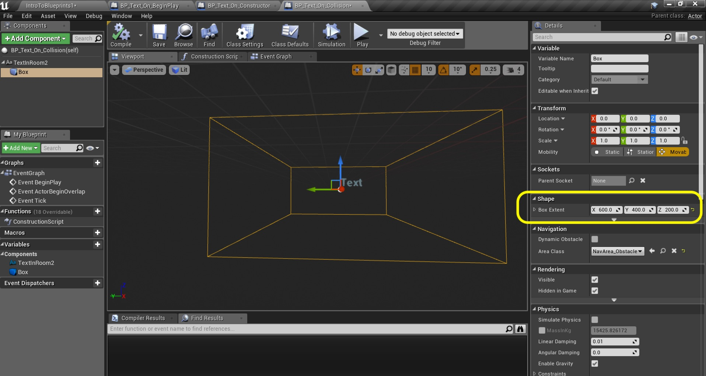

_____ 

## Index
_____ 

* Part 1 - Blueprint Basics
1. [Constructor and Begin Play](Intro-To-Blueprints-1.html#constructor-and-begin-play)
2. [Collision Events](Intro-To-Blueprints-2.html#collision-events)
3. [Grouping Meshes](Intro-To-Blueprints-3.html#grouping-meshes)
4. [Dynamic Material and Light Color](Intro-To-Blueprints-4.html#dynamic-material-and-light-color)
5. [Private Variables](Intro-To-Blueprints-5.html#private-variables)

* Part 2 - Blueprint Dynamic
1. [Adding Components in Script](Intro-To-Blueprints-6.html#adding-components-in-script)
2. [Tick Event](Intro-To-Blueprints-7.html#tick-event)
3. [Rotation and Translation](Intro-To-Blueprints-8.html#rotation-and-translation)

* Part 3 - Blueprint Communication
1. [Dynamically Alter Multiple Classes](Intro-To-Blueprints-9.html#dynamically-alter-multiple-classes)
2. [Communicate Through Interface](Intro-To-Blueprints-10.html#communicate-through-interface)

* Part 4 - Miscellaneous Behaviors
1.  [Oribiting Actors](Intro-To-Blueprints-11.html#oribiting-actors)

* Part 5  - Input
1. [Basic User Input on Actor](Intro-To-Blueprints-12.html#intro-to-blueprints)

_____ 

### Collision Events

Now we can have a few types of collision.  We can have a blocking collision that will stop two volumes from penetrating each other. We can also have a trigger collision where you can enter the collision volume and it will trigger a script.  This is the first type we will look at:

_____ 



{:start="{{ num }}"}
{{ num }}. Move over to **Room 2** and press the **Add New** button and select **Blueprint Class**. 

  

_____ 



{:start="{{ num }}"}
{{ num }}. We want to select **Actor** blueprint.

  

_____ 


{:start="{{ num }}"}
{{ num }}. Call it `BP_Text_On_Collision`.  Drag it into the room.  In the **World Outliner** drag this newly created game object into the **Room 2** folder: 

  

_____ 


{:start="{{ num }}"}
{{ num }}. Double click the **blueprint**.  Press the **Add Component** button and select a **Text Render**:

  

_____ 


{:start="{{ num }}"}
{{ num }}. Now press **Add Component** again and this time we want a collision box.  We can add multiple components to the same blueprints.  If you type **collision** inot the menu you will see three shapes: Box, Sphere and Cylindar.  We will pick the **Box Collision**:

  

_____ 


{:start="{{ num }}"}
{{ num }}. Rename the text component to `TextInRoom2`.  Drag and drop this on top of the **DefaultSceneRoot** component. This will make the text box the root (parent) component. Make the **Text Render Color** more visible on a white background and change the **World Size** to `74`. 

  

_____ 


{:start="{{ num }}"}
{{ num }}. With the **Box** component selected go to the **Details** panel and change the **Box Extent** to `600` on the X, `400` on the Y and `200` on the Z. Also make sure the text element is at the rear of the collision box.

  

_____ 


{:start="{{ num }}"}
{{ num }}. Now go into the game and reposition so the collision box is above the floor and centered in the room:

  

_____ 


{:start="{{ num }}"}
{{ num }}. Go back to the **blueprint**.  Make sure you are in the **Event Graph** tab.  Drag and drop the **TextInRoom2** component into the scene graph.  Left click the blue pin from this node and let go.  This will now make sure that the context sensitive search will be items that are compatible with this reference.  Start typing in **Set Text** to get the **Set Text** node:

  

_____ 


{:start="{{ num }}"}
{{ num }}. Since we added a **Collision** component the event graph shows a **Begin Overlap** event.  This will trigger only one time when two objects overlap.  In our case it will be the player's collision volume with this blueprint.  It will only trigger a second time if the object leaves the collision volume then re-enters. Connect the execution pin from the **EventActorBeginOverlap** greyed out node to the **Set Text** node you just created:

  

_____ 


{:start="{{ num }}"}
{{ num }}. Left click and drag off the **Value** node from **Set Text**.  Let go and start typing **Make Literal Text**:

  

_____ 


{:start="{{ num }}"}
{{ num }}. Select the **Make Literal Text** node and add the text: `You are inside the box!` to this node. Make sure the Return Value pin is connected to the Value pin on the **Set Text** node:

  

_____ 


{:start="{{ num }}"}
{{ num }}. Run the game and move towards where the box is (we can't see it).  You should see the text appear.  It doesn't dissapear when you leave the box.  Lets make some changes and improve this.

  

_____ 


{:start="{{ num }}"}
{{ num }}. Go back to the blueprint and  move the box component so the text is at the bottom left rear of the collision volume (behind if you like).  Make sure the **Hidden In Game** box is deselected.  Normally in a game we would hide our collision volumes, but for debug purposes lets set it so that we can see it.

  

_____ 


{:start="{{ num }}"}
{{ num }}. Run the game and step into the box.  The text is more obvious and better positioned.  Make any necessary adjustments here.  Now lets change the message when the player leaves the box.

  

_____ 


{:start="{{ num }}"}
{{ num }}. Copy and paste the three nodes in the **blueprint** like so:

  

_____ 


{:start="{{ num }}"}
{{ num }}. Right click on a blank section of the scene graph.  Type in and select **EventActorEndOverlap** node.  This will only run once when a collision volume exits this blueprint collision volume. In this case it will be the players collision.

  

_____ 


{:start="{{ num }}"}
{{ num }}. Connect the execution pins from the End Overlap to the Set Text.  Also change the Value to say `You are outside the box!`.

  

_____ 


{:start="{{ num }}"}
{{ num }}. Run the game and move inside and outside the collision volume and look at your blueprints being triggered.

  

_____ 



{:start="{{ num }}"}
{{ num }}. Lets look at the player blueprint quickly.  Go to the **Blueprints** folder and double click **BP_PlayerCharacter**.  Look at the components.  It root component is a Capsule Collision component.  This acts the same as the box component but is the shape of a capsule (a pill on its end).  This is roughly the shape of a bipedal upright human.  It also has a FirstPersonCamera where the head would be.  Notice the collision volume goes above the player's virtual head.  This is a first person controller so the Mesh is empty.  It is just a collision volume with a camera that moves around.  When this capsule overlaps the box collider in the blueprint it triggers the overlap events.

  

_____ 


{:start="{{ num }}"}
{{ num }}. Run the game again but this time keep the blueprint tab open and out of the way. Zoom so you can see the entire node graph.  When you play the game you can see the execution pin connectors light up when it is triggered.  This shows you what is hapenning and is incredibly useful for debugging.

<iframe class="embed-responsive-item" src="https://www.youtube.com/embed/kkIfeIYzkmU?autoplay=1&rel=0&controls=0&amp&showinfo=0&version=3&loop=1&playlist=kkIfeIYzkmU" frameborder="0" allowfullscreen></iframe>

_____ 


{:start="{{ num }}"}
{{ num }}. That's it for Room 2. Press **Save All** and update Github by **committing** and **pushing** all the changes made.  Next up we will be using blueprints to store multiple different components with no programming logic.

  

_____ 

  

[<- Previous](Intro-To-Blueprints-1.html)&nbsp;&nbsp;&nbsp;[Home](../index.html)&nbsp;&nbsp;&nbsp; [Continue ->](Intro-To-Blueprints-3.html)
   
   
   

