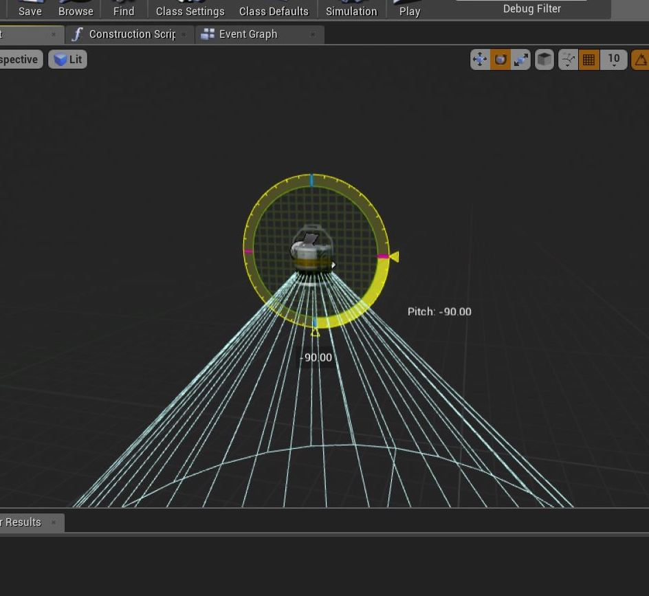

_____ 

## Index
_____ 

* Part 1 - Blueprint Basics
1. [Constructor and Begin Play](Intro-To-Blueprints-1.html#constructor-and-begin-play)
2. [Collision Events](Intro-To-Blueprints-2.html#collision-events)
3. [Grouping Meshes](Intro-To-Blueprints-3.html#grouping-meshes)
4. [Dynamic Material and Light Color](Intro-To-Blueprints-4.html#dynamic-material-and-light-color)
5. [Private Variables](Intro-To-Blueprints-5.html#private-variables)

* Part 2 - Blueprint Dynamic
1. [Adding Components in Script](Intro-To-Blueprints-6.html#adding-components-in-script)
2. [Tick Event](Intro-To-Blueprints-7.html#tick-event)
3. [Rotation and Translation](Intro-To-Blueprints-8.html#rotation-and-translation)

* Part 3 - Blueprint Communication
1. [Dynamically Alter Multiple Classes](Intro-To-Blueprints-9.html#dynamically-alter-multiple-classes)
2. [Communicate Through Interface](Intro-To-Blueprints-10.html#communicate-through-interface)

* Part 4 - Miscellaneous Behaviors
1.  [Oribiting Actors](Intro-To-Blueprints-11.html#oribiting-actors)

* Part 5  - Input
1. [Basic User Input on Actor](Intro-To-Blueprints-12.html#intro-to-blueprints)

_____ 

### Grouping Meshes

Now **blueprints** are not just for logic.  We can use them to create a more complex object with multiple meshes and components and save them as one blueprint.  Then you can make multiple instances of them and they will be replicated.  You can also build it in the game world first, then create a bluprint after.  Lets create a spotlight and see how this works.

_____ 



{:start="{{ num }}"}
{{ num }}. Go to **Room 3** and go to the **StaticMeshes** folder.  Drag the spotlight_bracket into the room.  Rotate it so it faces the front of the room:

  

_____


{:start="{{ num }}"}
{{ num }}. Move the object in the **World Outliner** into the **Room 3** folder. Then press the **Add Component** button:

  

_____ 


{:start="{{ num }}"}
{{ num }}. Select another **Static Mesh** component:

  

_____ 


{:start="{{ num }}"}
{{ num }}. Assign the **spotlight_lamp** mesh to this component:

  

_____ 


{:start="{{ num }}"}
{{ num }}. Add a third static mesh component by pressing the **Add Component** button:

  

_____ 


{:start="{{ num }}"}
{{ num }}. Assign the **Lightbulb** static mesh:

  

_____ 


{:start="{{ num }}"}
{{ num }}. Rename the Actor to `Spotlight`:

  

_____ 


{:start="{{ num }}"}
{{ num }}. Add another component but this time an actual Spotlight so it can project an in game spotlight. Pressing **Add Component** button then select **Spotlight**:

  

_____ 


{:start="{{ num }}"}
{{ num }}. Now make sure that your **Spotlight** is selected in the **World Outliner**.  Then press the **Blueprint** button to turn this from a actor to a reusable blueprint.  Add it to the **Blueprints** folder and call it `BP_Spotlight`:

  

_____ 


{:start="{{ num }}"}
{{ num }}. Open the **BP_Spotlight** blueprint and select the **Spotlight**.  You will see that its rotation may not match the light.  

  

_____ 


{:start="{{ num }}"}
{{ num }}. Make sure it is rotated in the same direction as the lamp.

  

_____ 



{:start="{{ num }}"}
{{ num }}. Select the **Lamp** component and rotate the lamp so that it doesn't point straight down.  Tune it to your liking:

  

_____ 


{:start="{{ num }}"}
{{ num }}. Select the **Spotlight** then set the light color to your preference.  I picked green:

  

_____ 


{:start="{{ num }}"}
{{ num }}. Check the lamp out in game.  I am noticing a problem with a model casting a shadow I don't like in the light:

  

_____ 


{:start="{{ num }}"}
{{ num }}. Now by having it as a blueprint I can just drop it in the room multiple times and rotate it in different direcions.  I have a game object that I can instance as much as I want with the functionality I need!

  

_____ 


{:start="{{ num }}"}
{{ num }}. Now this is what it could look like in game:

  

_____  


{:start="{{ num }}"}
{{ num }}. That's it for Room 3. Press **Save All** and update Github by **committing** and **pushing** all the changes made.  Next up we will be alter the light color and create a dynamic material in a blueprint:

  

_____  

  

[<- Previous](Intro-To-Blueprints-2.html)&nbsp;&nbsp;&nbsp;[Home](../index.html)&nbsp;&nbsp;&nbsp; [Continue ->](Intro-To-Blueprints-4.html)
   
   
   

