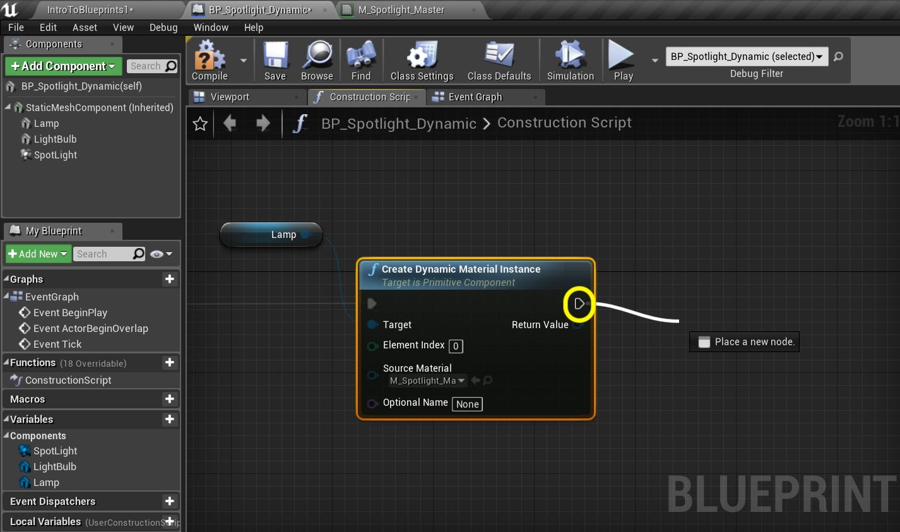

_____ 

## Index
_____ 

* Part 1 - Blueprint Basics
1. [Constructor and Begin Play](Intro-To-Blueprints-1.html#constructor-and-begin-play)
2. [Collision Events](Intro-To-Blueprints-2.html#collision-events)
3. [Grouping Meshes](Intro-To-Blueprints-3.html#grouping-meshes)
4. [Dynamic Material and Light Color](Intro-To-Blueprints-4.html#dynamic-material-and-light-color)
5. [Private Variables](Intro-To-Blueprints-5.html#private-variables)

* Part 2 - Blueprint Dynamic
1. [Adding Components in Script](Intro-To-Blueprints-6.html#adding-components-in-script)
2. [Tick Event](Intro-To-Blueprints-7.html#tick-event)
3. [Rotation and Translation](Intro-To-Blueprints-8.html#rotation-and-translation)

* Part 3 - Blueprint Communication
1. [Dynamically Alter Multiple Classes](Intro-To-Blueprints-9.html#dynamically-alter-multiple-classes)
2. [Communicate Through Interface](Intro-To-Blueprints-10.html#communicate-through-interface)

* Part 4 - Miscellaneous Behaviors
1.  [Oribiting Actors](Intro-To-Blueprints-11.html#oribiting-actors)

* Part 5  - Input
1. [Basic User Input on Actor](Intro-To-Blueprints-12.html#intro-to-blueprints)

_____ 

### Dynamic Material and Light Color

What if we want to change a property in the material dynamincally through the blueprint? What if we want to change the property of a component like the spotlight color?  We will be looking at both of these in the upcoming exercise.

_____ 



{:start="{{ num }}"}
{{ num }}. Go to the **Blueprints** folder and _duplicate_ **BP_Spotlight**.  Call it `BP_Spotlight_Dynamic`.  Create a new folder called `Room 4`. Drag **BP_Spotlight_Dynamic** into this folder. Put three of these blueprints in **Room 4** and rotate them to your liking:

  

_____


{:start="{{ num }}"}
{{ num }}. Now we want to affect the color of the lightbulb in the Material.  Click on the **Lamp** component and look for the material.  Double click the icon to load it up:

  

_____
 

{:start="{{ num }}"}
{{ num }}. Look for the parameter that adjusts the light color. Just before the **Emissive** color we have a **Vector Parameter** called **Light Color**. This is the color we want to change in code in the blueprint.

  

_____


{:start="{{ num }}"}
{{ num }}. Go to the **blueprint** and into the **Construction Script** tab. Drag a **reference** to the **Lamp** component which contains that material we just looked at:

  

_____


{:start="{{ num }}"}
{{ num }}. Now we need to reference just the material attached to the lamp component.  To do this pull off of the **Lamp** pin then type **Create Dynamic Material Instance**. Make sure the subtitle says _Target is Primitive Component_ and you have all the pins shown in the screenshot.   We need to make the material dynamic in the constructor.  This will allow us to access parameters within the material. Leave **Element Index** at `0`.  If there were more than one material attached to the static mesh then you would select the one you want to access (it always starts counting from material 0). For **Source Material**, select **M_Spotlight_Master** which is the material we want to alter (we just looked at it).

  

_____


{:start="{{ num }}"}
{{ num }}. Connect the execution pins:

  

_____


{:start="{{ num }}"}
{{ num }}. Drag off the **Create Dynamic Material Instance** execution pin to help the node suggestions:

  

_____


{:start="{{ num }}"}
{{ num }}. Let go of the left mouse button and start to type **Set Vector Parameter Value**.  You can see that this is in the **Material** section which gives us a good hint that this is what we want.

  

_____


{:start="{{ num }}"}
{{ num }}. Connect the **Return Value** from the **Create Dynamic Material Instance** node to the **Target** of the **Set Vector Parameter Value** node. The target is not the root blueprint item but the newly created Dynamic Material.  There is no reference to the existing static material.

  

_____


{:start="{{ num }}"}
{{ num }}. Go to the material and find out how the Parameter name is spelled with spaces and caps.  You have to enter this exactly in the **Parameter Name** box `Light Color`. Make sure it is the same as it is in the material with a space between the two words.

  

_____


{:start="{{ num }}"}
{{ num }}. Hover over the **Value** pin in the **Set Vector Parameter Value** input node.  Notice that it wants a **Linear Color Structure**.  This gives us a hint.

  

_____


{:start="{{ num }}"}
{{ num }}. Drag off the left pin, let go and enter **Linear Color**.  Select the **Make Linear Color** node:

  

_____


{:start="{{ num }}"}
{{ num }}. Make this node pure blue with a solid alpha:

  

_____


{:start="{{ num }}"}
{{ num }}. Go into the game and checkout the color of the light.  The actual light is still green but the light bulp glow is now blue:

  

_____


{:start="{{ num }}"}
{{ num }}. Now go back to the **blueprint** and drag a reference form the light called **Spotlight** to the main graph area:

  

_____


{:start="{{ num }}"}
{{ num }}. Now drag off the Spotlight pin and type **lightcolor**.  Out of the options **Set Light Color** is what we want:

  

_____


{:start="{{ num }}"}
{{ num }}. We will make the color of the light the same as the color of the bulb glow.  Grab the output pin from the **Make Linear Color** node and connect it to the **New Light Color** input pin on the **Set Light Color** node.

  

_____


{:start="{{ num }}"}
{{ num }}. Nothing will happen with this light until the execution pin is connected.  Then press the **Compile** button so that the changes can run in engine:

  

_____


{:start="{{ num }}"}
{{ num }}. Make sure the compile is succesful by checking to see that there is a green checkmark by the compile button:

  

_____


{:start="{{ num }}"}
{{ num }}. Now go back to the game and hit run.  You will see that both the bulb and the color of the light are set dynamically in the blueprint!

  

_____



{:start="{{ num }}"}
{{ num }}. That's it for Room 4. Press **Save All** and update Github by **committing** and **pushing** all the changes made.  Next up we will be looking at using variables in blueprints.

  

_____  

  

[<- Previous](Intro-To-Blueprints-3.html)&nbsp;&nbsp;&nbsp;[Home](../index.html)&nbsp;&nbsp;&nbsp; [Continue ->](Intro-To-Blueprints-5.html)
   
   
   

