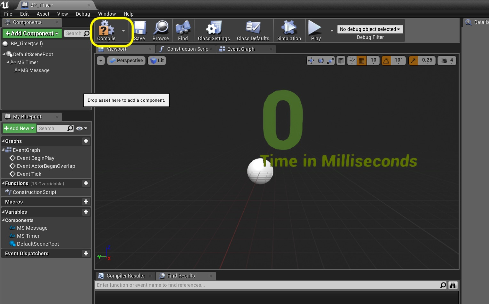

_____ 

## Index
_____ 

* Part 1 - Blueprint Basics
1. [Constructor and Begin Play](Intro-To-Blueprints-1.html#constructor-and-begin-play)
2. [Collision Events](Intro-To-Blueprints-2.html#collision-events)
3. [Grouping Meshes](Intro-To-Blueprints-3.html#grouping-meshes)
4. [Dynamic Material and Light Color](Intro-To-Blueprints-4.html#dynamic-material-and-light-color)
5. [Private Variables](Intro-To-Blueprints-5.html#private-variables)

* Part 2 - Blueprint Dynamic
1. [Adding Components in Script](Intro-To-Blueprints-6.html#adding-components-in-script)
2. [Tick Event](Intro-To-Blueprints-7.html#tick-event)
3. [Rotation and Translation](Intro-To-Blueprints-8.html#rotation-and-translation)

* Part 3 - Blueprint Communication
1. [Dynamically Alter Multiple Classes](Intro-To-Blueprints-9.html#dynamically-alter-multiple-classes)
2. [Communicate Through Interface](Intro-To-Blueprints-10.html#communicate-through-interface)

* Part 4 - Miscellaneous Behaviors
1.  [Oribiting Actors](Intro-To-Blueprints-11.html#oribiting-actors)

* Part 5  - Input
1. [Basic User Input on Actor](Intro-To-Blueprints-12.html#intro-to-blueprints)

_____ 

### Tick Event

Now the most common game event type is the **Tick Event**.  This is what we run every frame. Any game logic that needs to be run every frame (like polling controls to move a player) will be done within the tick event and will happen as fast as the framerate runs.

_____ 


{:start="{{ num }}"}
{{ num }}. Go back to **Maps** and load **IntroToBLueprint2**.  The level will not have any lighting built.  Press the **Build Button** to build lighting for the level.

  

_____


{:start="{{ num }}"}
{{ num }}. Scoot over to **Room 7**.  Add a new **Map** and call it `Room7`.  Press the **Add New** button and then select **Blueprint Class**.  Select class **Actor**. Call it `BP_Timer`.

  

_____


{:start="{{ num }}"}
{{ num }}. Add a **Text Render** Component by pressing the **Add Component** button:

  

_____


{:start="{{ num }}"}
{{ num }}. Rename the Component to `MS Timer`.  Press the color and select a shade of green:

  

_____


{:start="{{ num }}"}
{{ num }}. Change the World Size to `120` and rename the Text message to the number `0`.

  

_____


{:start="{{ num }}"}
{{ num }}. Add another **Text Render** component and call it `MS Message`.  Change the color to yellow and alter the Text message to `Time in Milliseconds`:

  

_____


{:start="{{ num }}"}
{{ num }}. Press the **Compile** button. If no errors go to the **Event Graph** tab.

  

_____


{:start="{{ num }}"}
{{ num }}. In the **MyBlueprints** tab press **+** next to Variable and add a **Float** called `Time in Milliseconds`. Add a tooltip with the message `Stores total time in level in milliseconds`.  Make sure **Private** is set to `true`: 

  

_____


{:start="{{ num }}"}
{{ num }}. What we want to do is every frame add the number of milliseconds that have passed to this variable.  So we need to read it, then add the delta time since last frame.  Drag the Variable into the graph and select **Get Time In Milliseconds**.

  

_____


{:start="{{ num }}"}
{{ num }}. Now add a **Float + Float** node which adds two floats together.  Take the output Pin from the **Event Tick** called **Delta Seconds** and put it in into the input of the Addition node.  Take the output of the variable **Time in Milliseconds** and put it into the input of the addition mode:

  

_____


{:start="{{ num }}"}
{{ num }}. Drag the **Time In Milliseconds** variable into the graph and this time select **Set Time In Milliseconds** as we will write this addition to the variable:

  

_____


{:start="{{ num }}"}
{{ num }}. Connect the Execution pins between the **Event Tick** node and the **Set** node.  Also, connect the output of the **Addition** node to the input of the **Set Node**:

  

_____


{:start="{{ num }}"}
{{ num }}. Now, what we want to do is take the output of this variable and have it print to screen.  The **MS Timer** text component set to **0** is what we want to target.  Drag the **MS Timer** component into the scene graph so we have a reference to this component:

  

_____


{:start="{{ num }}"}
{{ num }}. Drag from the output pin and start typing **Set Text**.  This is the Node you want to add:

  

_____


{:start="{{ num }}"}
{{ num }}. Connect the Execution pins from the **Set** node to **Set Text** node. Drag the output of **Time in Milliseconds** node to the **Value** input of the **Set Text** node.  It will automatically create a conversion from Float to Text node for you.  Also, ensure that the **MS Timer** node is connected the the **Target** node input of the **Set Text** node.

  

_____


{:start="{{ num }}"}
{{ num }}. Add comments to explain the graph.  I split it into the two components that make sense to me.  Press the **Compile** button:

  

_____


{:start="{{ num }}"}
{{ num }}. Now go to the game and drag the **BP_Timer** blueprint into **Room 7**.  Notice that it is backwards.

  

_____



{:start="{{ num }}"}
{{ num }}. Now run the game and the millisecond counter should count very quickly (hard to see the fractional numbers as they change so fast).

  

_____


{:start="{{ num }}"}
{{ num }}. Lets add the ability to count in whole seconds.  Go back to the **BP_Timer** blueprint and select the **MS Timer** and **MS Message** components. Right click and select **Duplicate**:

  

_____


{:start="{{ num }}"}
{{ num }}. Now move the new copies to the right so they are next to each other.  Change the names of the components to `Sec Timer` and `Sec Message`.

  

_____


{:start="{{ num }}"}
{{ num }}. Change the message in the **Sec Message** component to `Time in Seconds`.

  

_____


{:start="{{ num }}"}
{{ num }}. Now go back to the **Event Graph** and add a new **Variable** by pressing the **+** button.  This time we will make it an integer.  A float stores a fractional number, an integer stores a whole number.  Since we are counting seconds whole numbers will do.  Call it `Time in Seconds`, add a **Tooltip** and make sure that **Private** is set to `true`:

  

_____


{:start="{{ num }}"}
{{ num }}. Now to avoid having a very long Blueprint we can organize the graph by using a **Sequence** node. Right click and type **Sequence** then connect the exectution pins between the **Tick Event** and the **Set** node through the **Then 0** pin:

  

_____


{:start="{{ num }}"}
{{ num }}. Right click on an empty part of the graph and select **Delay** node.  This will run the input every frame but only run the output pin after the delay has passed over and over again.  Connect the output pin from the second **Sequence** node output to the input pin of **Delay**.  Set the delay to 1.0 (it is set in seconds).

  

_____


{:start="{{ num }}"}
{{ num }}. Drag the **Time In Seconds** node and drop it on the node chart.  Select **Get**:

  

_____


{:start="{{ num }}"}
{{ num }}. Drag off of the **Time In Seconds** pin and select **Int + Int** node.  Now leave `1` as the default as we will be adding 1 every second.  Drag the **Time In Seconds** variable onto the graph and select **Set**:

  

_____


{:start="{{ num }}"}
{{ num }}. Connect the execution pin from the **Delay** node to the **Set** node.  Connect the output pin from the **Add** node to the Input fo the **Set** node:

  

_____


{:start="{{ num }}"}
{{ num }}. Drag the **Sec Timer** component into the graph and get a reference to it:

  

_____


{:start="{{ num }}"}
{{ num }}. Drag off the **Sec Timer** pin and select the **Set Text** node:

  

_____


{:start="{{ num }}"}
{{ num }}. Connect the Execution pins from **Set** to **Set Text**.  Drag the output of **Time In Seconds** from the **Set** node into the **Value** input of the **Set Text** node.  A converter will automatically be added.

  

_____



{:start="{{ num }}"}
{{ num }}. Add comments to your latest work:

  

_____



{:start="{{ num }}"}
{{ num }}. Open up the Bluprint and place it next to the millisecond timer in the level so you can watch both at once. Observe that the millisecond node runs all the time.  Note that the Timer blocks the second blueprint from running except for once a second.

  

_____



{:start="{{ num }}"}
{{ num }}. That's it for Room 7. Press **Save All** and update Github by **committing** and **pushing** all the changes made.  Next up we will be rotating and translating an object in 3D space.

  

_____  

  

[<- Previous](Intro-To-Blueprints-6.html)&nbsp;&nbsp;&nbsp;[Home](../index.html)&nbsp;&nbsp;&nbsp; [Continue ->](Intro-To-Blueprints-8.html)
   
   
   

