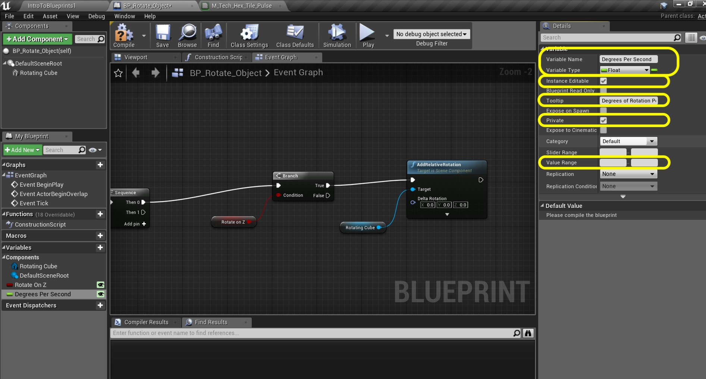

_____ 

## Index
_____ 

* Part 1 - Blueprint Basics
1. [Constructor and Begin Play](Intro-To-Blueprints-1.html#constructor-and-begin-play)
2. [Collision Events](Intro-To-Blueprints-2.html#collision-events)
3. [Grouping Meshes](Intro-To-Blueprints-3.html#grouping-meshes)
4. [Dynamic Material and Light Color](Intro-To-Blueprints-4.html#dynamic-material-and-light-color)
5. [Private Variables](Intro-To-Blueprints-5.html#private-variables)

* Part 2 - Blueprint Dynamic
1. [Adding Components in Script](Intro-To-Blueprints-6.html#adding-components-in-script)
2. [Tick Event](Intro-To-Blueprints-7.html#tick-event)
3. [Rotation and Translation](Intro-To-Blueprints-8.html#rotation-and-translation)

* Part 3 - Blueprint Communication
1. [Dynamically Alter Multiple Classes](Intro-To-Blueprints-9.html#dynamically-alter-multiple-classes)
2. [Communicate Through Interface](Intro-To-Blueprints-10.html#communicate-through-interface)

* Part 4 - Miscellaneous Behaviors
1.  [Oribiting Actors](Intro-To-Blueprints-11.html#oribiting-actors)

* Part 5  - Input
1. [Basic User Input on Actor](Intro-To-Blueprints-12.html#intro-to-blueprints)

_____ 

### Rotation and Translation

We will be rotating and translating objects in 3-D space through blueprints.

_____ 



{:start="{{ num }}"}
{{ num }}. Create a new folder called `Room8`.  Add a new **Blueprint Class** of type **Actor** and call it `BP_Rotate_Object`.  Open up the **blueprint**:

  

_____


{:start="{{ num }}"}
{{ num }}. Add a **Static Mesh** component to the blueprint.  Change the **View Options** to see **Engine Content**.  Select the **Cube** static mesh:

  

_____


{:start="{{ num }}"}
{{ num }}. Assign the **M_Metal_Burnished_Steel** Material:

  

_____


{:start="{{ num }}"}
{{ num }}. Rename the static mesh to `Rotating Cube`:

  

_____


{:start="{{ num }}"}
{{ num }}. Now go to the **Event Graph** tab.  We will be rotating on the Z, X and Y axis.  So lets put in a **Sequence** node to keep our graph neet.  Since this needs to animate every frame we will use the **Tick Event** and connect its execution pin to the **Sequence** node:

  

_____


{:start="{{ num }}"}
{{ num }}. Now we want a switch in the editor to turn each axis on or off.  We will use a boolean that is exposed to the editor to accomplish this.  Add a new **Variable** by pressing the **+** button and call it `Rotate on Z`. Make sure it is type **Boolean** and make sure that **Instance Editable** is set to `true`.  Also since no other object will access this, set the **Private** access to `true`.  Add a tooltip `Rotate on Z Axis, Yaw, Shaking Head No`.

  

_____


{:start="{{ num }}"}
{{ num }}. Drag the **Rotate On Z** boolean to the graph and select **Get**:

  

_____


{:start="{{ num }}"}
{{ num }}. Grab the pin coming of the **Rotate On Z** node and select **Branch**. Again this is the same as an if statement.:

  

_____


{:start="{{ num }}"}
{{ num }}. Attach the Execution pins from **Sequence 0** to **Branch**:

  

_____


{:start="{{ num }}"}
{{ num }}. Drag and drop the **Rotating Cube** component into the scene graph to create a reference:

  

_____


{:start="{{ num }}"}
{{ num }}. Drag off of the **Rotating Cube** pin and find the **Add Relative Rotation** node and add it to the scene graph:

  

_____


{:start="{{ num }}"}
{{ num }}. Drag the execution pin from the **True** output of the **Branch** and connect it to the **Add Relative Rotation**.  This will only run the rotation if this boolean is set to **True**.

  

_____


{:start="{{ num }}"}
{{ num }}. We need another variable to track how many degrees per second the object will rotate in.  We need to accept both positive and negative values.  Flipping the sign will change the direction of rotation.  Create a new **Variable** called `Degrees Per Second` of type **Float** and set **Instance Editable** to `true` and **Private** to `true`.  If you would like you could restrict the **Value Range** from -360 to 360.

  

_____


{:start="{{ num }}"}
{{ num }}. Now we can set the speed of how many degrees per second that we would like to turn but how do we then know what each frame takes.  Not all frames will be the same length so we can't just divide the **Degrees Per Second** by the frame rate.  The easiest way is to multiply it by the delta time.  Lets say this is 1/60th of a second or .01666.  If we multiply our value of 45 (degrees per second) times .01666 we will get our time since last frame = .747 degrees.    We need a variable to keep this number in.  Create a new **Float** **variable** called `Degrees Since Last Frame` and set **Private** to `true`.  Add a **Tooltip** such as `Degrees to turn this frame`.

  

_____


{:start="{{ num }}"}
{{ num }}. Drag and drop the **Degrees Since Last Frame** variable onto the graph.  Select **Set**:

  

_____


{:start="{{ num }}"}
{{ num }}. Drag and drop the **Degrees Per Second Variable** to the graph and select **Get**.  Right click on the open graph and find a **Float * Float** node:

  

_____


{:start="{{ num }}"}
{{ num }}. Connect the **Delta Seconds** from the **Event Node** to the **Multiply** node, and the output of **Degrees Per Second** to the **Multiply** node.  Send the result of this multiplication to the setter input for the **Set** node:

  

_____


{:start="{{ num }}"}
{{ num }}. Now break the pins between the **Tick** event and **Sequence**.  Route this execution through the **Set** node:

  

_____


{:start="{{ num }}"}
{{ num }}. Now go back to the **Add Relative Rotation** node and right click on Delta Rotation.  We just want to affect the Z axis so we will select **Split Struct Pins**:

  

_____


{:start="{{ num }}"}
{{ num }}. Now drag the **Degrees Since Last Frame** variable into the scene graph and select **Get**:

  

_____


{:start="{{ num }}"}
{{ num }}. Connect the output of **Degrees Since Last Frame** with the input on the **Rotation** node into the **Delta Rotation Z (Yaw) pin: 

  

_____


{:start="{{ num }}"}
{{ num }}. Add a comment to the latest work:

  

_____


{:start="{{ num }}"}
{{ num }}. Go into the game into the **Blueprints** folder. Drag and drop the **BP_Rotate_Object** into **Room 8**.  Position it to the left hand side of the room and make sure that **Rotate on Z** is set to `true` and **Degrees Per Second** has a non 0 value between -360 and 360 in the **Details** panel.  

  

_____



{:start="{{ num }}"}
{{ num }}. Run the game and the cube should rotate around the **Z** axis:

  

_____


{:start="{{ num }}"}
{{ num }}. Select everything after the **Sequence** node for Yaw and copy and paste it beneath:

  

_____


{:start="{{ num }}"}
{{ num }}. Change the link from **Degrees Since Last Frame** to the **Delta Rotation Y (Pitch)** input in the **AddRelativeRotation** node.  Adjust the comment appropriately:

  

_____


{:start="{{ num }}"}
{{ num }}. You can right click on the **Rotate On Z** variable and duplicate it.  Rename it to `Rotate On Y` and adjust the **Tooltip**.  Drag a **Get** reference to it on the chart and delete the old Z reference and drag it into the **Condition** on the **Branch**:

  

_____


{:start="{{ num }}"}
{{ num }}. Now connet the output of **Sequence Then 1** node to the **Branch** node:

  

_____


{:start="{{ num }}"}
{{ num }}. Go to the game and deselect the **Rotate On Z** and select the **Rotate on Y**.  The actor should now rotate on the Y axis when the game runs.  There is a problem.  The actor gets stuck and stops rotating.  This is **[gimble lock](https://en.wikipedia.org/wiki/Gimbal_lock)** which is a problem when we use euler angles to rotate.  We can find a work around. 

  

_____


{:start="{{ num }}"}
{{ num }}. Go back to the Blueprint and remove the **Add Relative Rotation** node on **Pitch**:

  

_____


{:start="{{ num }}"}
{{ num }}. You can delete the **Rotating Cube** reference as we will not be using it. Right click on open space in the graph and select: **Add Actor Local Rotation** node.  Connecdt the execution pin from the output **True** of the **Branch** node.

  

_____


{:start="{{ num }}"}
{{ num }}. Right click on **Delta Rotation** and select **Split Struct Pin**:

  

_____


{:start="{{ num }}"}
{{ num }}. Send the output of **Degrees Since Last Frame** to **Delta Rotation Y (Pitch)**:

  

_____


{:start="{{ num }}"}
{{ num }}. Now go back to the game and try it out.  No more gimble lock, the object rotates without stopping:

  

_____


{:start="{{ num }}"}
{{ num }}. Lets do the final axis of rotation along the **X** axis for Roll.  Copy the Yaw (rotating around Z) and paste it at the bottom.  Change the comment to `Adjust Roll`:

  

_____


{:start="{{ num }}"}
{{ num }}. Delete the **Rotate On Z** boolean reference and duplicate it to create another boolean called `Rotate On X`.

  

_____


{:start="{{ num }}"}
{{ num }}. I just noticed that I forgot to categorize the variables. Go back to each variable and add the category:  `Rotation`.

  

_____


{:start="{{ num }}"}
{{ num }}. Drag a copy of the **Rotate On X** variable as a **Get** onto the graph and send it to the **Condition** input on the **Branch** node.  Also, connect the **Degrees Since Last Frame** output to the **Delta Rotation X (Roll) on the **Add Relative Rotation** node.

  

_____


{:start="{{ num }}"}
{{ num }}. Your node graph should look like:

  

_____


{:start="{{ num }}"}
{{ num }}. Go into the game and try different values and combinations both positive and negative.  Also, look at your blueprint node chart as it runs to see how the booleans gate the operation flow.  Now we will continue in this room but instead of rotation will be translating the cube instead.

  

_____

  

[<- Previous](Intro-To-Blueprints-7.html)&nbsp;&nbsp;&nbsp;[Home](../index.html)&nbsp;&nbsp;&nbsp; [Continue ->](Intro-To-Blueprints-8B.html)
   
   
   

