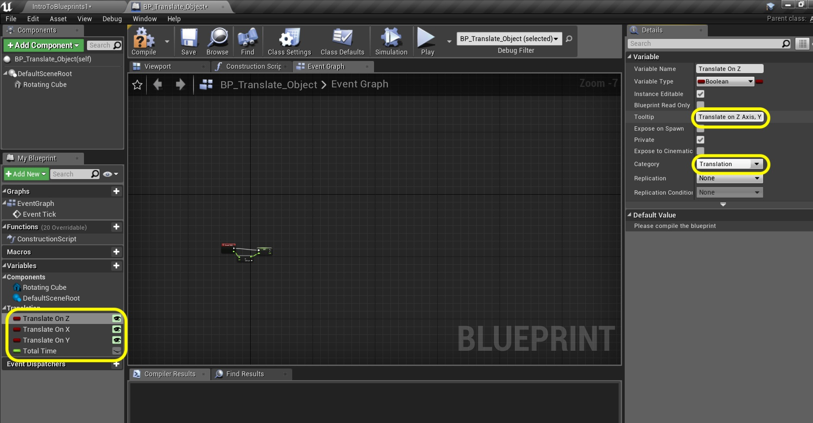

_____ 

## Index
_____ 

* Part 1 - Blueprint Basics
1. [Constructor and Begin Play](Intro-To-Blueprints-1.html#constructor-and-begin-play)
2. [Collision Events](Intro-To-Blueprints-2.html#collision-events)
3. [Grouping Meshes](Intro-To-Blueprints-3.html#grouping-meshes)
4. [Dynamic Material and Light Color](Intro-To-Blueprints-4.html#dynamic-material-and-light-color)
5. [Private Variables](Intro-To-Blueprints-5.html#private-variables)

* Part 2 - Blueprint Dynamic
1. [Adding Components in Script](Intro-To-Blueprints-6.html#adding-components-in-script)
2. [Tick Event](Intro-To-Blueprints-7.html#tick-event)
3. [Rotation and Translation](Intro-To-Blueprints-8.html#rotation-and-translation)

* Part 3 - Blueprint Communication
1. [Dynamically Alter Multiple Classes](Intro-To-Blueprints-9.html#dynamically-alter-multiple-classes)
2. [Communicate Through Interface](Intro-To-Blueprints-10.html#communicate-through-interface)

* Part 4 - Miscellaneous Behaviors
1.  [Oribiting Actors](Intro-To-Blueprints-11.html#oribiting-actors)

* Part 5  - Input
1. [Basic User Input on Actor](Intro-To-Blueprints-12.html#intro-to-blueprints)

_____ 

### Translation

We will be translating an object in 3-D space through blueprints.

_____ 



{:start="{{ num }}"}
{{ num }}. Go to the **Blueprints** folder and duplicate the **BP_Rotate_Object** blueprint.

  

_____


{:start="{{ num }}"}
{{ num }}. Rename it to `BP_Translate_Object`:

  

_____


{:start="{{ num }}"}
{{ num }}. Drag anbd drop an instance of **BP_Translate_Object** into the game window on the right hand side of the room:

  

_____


{:start="{{ num }}"}
{{ num }}. Double click the blueprint to enter the editor.  We will not need the speed variable as we will not be adjusting the speed.  Delete the **Degrees Per Seoncd** variable:

  

_____


{:start="{{ num }}"}
{{ num }}. Rename the three booleans to `Translate On Z`, `Translate On X` and `Translate On Y`.  Recategorize them to `Translation` and adjust the **Tooltip** accordingly.  Change the **Degrees Since Last Frame** variable to `Total Time` and change the Category and Tooltip here as well.

  

_____


{:start="{{ num }}"}
{{ num }}. Delete all nodes on the chart and we will start over in the **Event Graph** tab.  Drag the **Total Time** node onto the graph and selet **Set**:

  

_____


{:start="{{ num }}"}
{{ num }}. Drag a copy of the **Total Time** variable onto the graph and select **Get**. Drag off of the pin and find a **Float + Float** node to add:

  

_____


{:start="{{ num }}"}
{{ num }}. Total Time will just keep track of the room time in milliseconds.  Take the **Delta Time** output of the **Event Tick** and add it to the ouput of **Total Time**.  Send this addition to the **Set** node to cumulatively add the time together.

  

_____


{:start="{{ num }}"}
{{ num }}. Drag off of this **Set** output pin and look for the **Sin (Radians)** node.  We will use a sine wave to translate the object and you need to use radians to do math to it as opposed to angles (remember your trig?).

  

_____


{:start="{{ num }}"}
{{ num }}. Now we will want to feed three translations.  To keep the graph neat we will add a **Sequence** node and connect its execution pin to the **Set** node:

  

_____


{:start="{{ num }}"}
{{ num }}. Drag a **Get** node from the **Translate On Z** boolean onto the graph:

  

_____


{:start="{{ num }}"}
{{ num }}. Drag the pin off of the **Translate On Z** variable in the graph and select a **Branch** node (remember this is like an if() statement).  Connect the execution pins from the **Sequence The 0** to **Branch** pin.

  

_____


{:start="{{ num }}"}
{{ num }}. Drag and drop a reference to the **Rotating Cube** mesh onto the graph:

  

_____


{:start="{{ num }}"}
{{ num }}. Now add a node called **Add Relative Location** to the scene graph by right cliking on a blank area and type the name of the node.

  

_____


{:start="{{ num }}"}
{{ num }}. Now would be a good time to rename our static mesh.  It is no longer part of a rotating cube.  Go to the **Components** window and rename it to `Translating Cube`:

  

_____


{:start="{{ num }}"}
{{ num }}. Notice that it changes all references to it as well.  So we have our renamed mesh hooked up to a **Add Relative Location** node:

  

_____


{:start="{{ num }}"}
{{ num }}. Hook up the execution pins from the **Branch** node to the **Add Relative Location** node:

  

_____


{:start="{{ num }}"}
{{ num }}. Right click on **Delta Location** input pin on the **Add Relative Location** node and select **Split Struct Pin**:

  

_____


{:start="{{ num }}"}
{{ num }}. Take the output pin of the **SIN** node and plug it into the **Delta Location Z** input pin on the **Add Relative Location** node.

  

_____


{:start="{{ num }}"}
{{ num }}. Add a comment on all the nodes after the **Sequence** and type `Translate on Z`.  This is the up and down axis in the room:

  

_____


{:start="{{ num }}"}
{{ num }}. Run the game and make sure the **Translate On Z** boolean is set to `true` in the **Details Panel**.  The cube should move up and down.

  

_____


{:start="{{ num }}"}
{{ num }}. Copy and paste the entire section.  Change the comment to `Translate On X`:

  

_____


{:start="{{ num }}"}
{{ num }}. Drag the execution pin from **Sequence Then 1** to **Branch** input pin.  Also delete the **Translate On Z** getter and drag and drop a **Get** for **Translate On X** and connect the output pin to the input pin on the **Branch** node:

  

_____


{:start="{{ num }}"}
{{ num }}. Take the output of the **SIN** node and plug it into the input pin **Delta Location X** on the **Delta Relative Location** node 

  

_____


{:start="{{ num }}"}
{{ num }}. Copy and paste all the nodes from the **Translate On Z** section again.  

  

_____


{:start="{{ num }}"}
{{ num }}. Look at the **Sequence** node.  If there is no **Then 2** pin press the **Add pin +** button to add it.  Then pull of the **Then 2** execution pin and place it into the **Branch** node you just copied.  Also delete the **Translate On Z** getter in the graph and drag and drop **Translate On Y**:

  

_____


{:start="{{ num }}"}
{{ num }}. Connect the output of the **SIN** node to the **Delta Location Y** on the **Delta Relative Location** node:

  

_____


{:start="{{ num }}"}
{{ num }}. Now this is what your final node graph should look like.  Press the **Compile** button:

  

_____


{:start="{{ num }}"}
{{ num }}. Go into the game and turhning each axis on and off.  Also, look at your blueprint node chart as it runs to see how the booleans gate the operation flow.  

  

_____



{:start="{{ num }}"}
{{ num }}. That's it for Room 8 and this entire map/level. Press **Save All** and update Github by **committing** and **pushing** all the changes made.  Next up we will be rotating and translating an object in 3D space.

  

_____  

  

[<- Previous](Intro-To-Blueprints-8.html)&nbsp;&nbsp;&nbsp;[Home](../index.html)&nbsp;&nbsp;&nbsp; [Continue ->](Intro-To-Blueprints-9.html)
   
   
   

