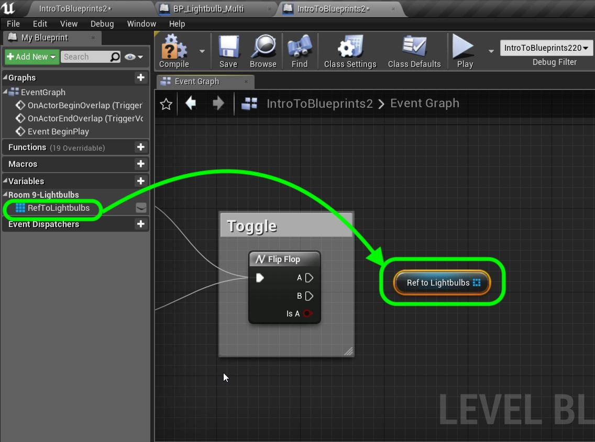

_____ 

## Index
_____ 

* Part 1 - Blueprint Basics
1. [Constructor and Begin Play](Intro-To-Blueprints-1.html#constructor-and-begin-play)
2. [Collision Events](Intro-To-Blueprints-2.html#collision-events)
3. [Grouping Meshes](Intro-To-Blueprints-3.html#grouping-meshes)
4. [Dynamic Material and Light Color](Intro-To-Blueprints-4.html#dynamic-material-and-light-color)
5. [Private Variables](Intro-To-Blueprints-5.html#private-variables)

* Part 2 - Blueprint Dynamic
1. [Adding Components in Script](Intro-To-Blueprints-6.html#adding-components-in-script)
2. [Tick Event](Intro-To-Blueprints-7.html#tick-event)
3. [Rotation and Translation](Intro-To-Blueprints-8.html#rotation-and-translation)

* Part 3 - Blueprint Communication
1. [Dynamically Alter Multiple Classes](Intro-To-Blueprints-9.html#dynamically-alter-multiple-classes)
2. [Communicate Through Interface](Intro-To-Blueprints-10.html#communicate-through-interface)

* Part 4 - Miscellaneous Behaviors
1.  [Oribiting Actors](Intro-To-Blueprints-11.html#oribiting-actors)

* Part 5  - Input
1. [Basic User Input on Actor](Intro-To-Blueprints-12.html#intro-to-blueprints)

_____ 
### Dynamically Alter Multiple Classes

Now you don't always have to assign the reference to the variable.  You can access multiple instances of an object of the same class dynamically at run time as opposed to storing it in a variable at compile time.  We can do this with a special node called **Get All Actors From Class**.

_____ 



{:start="{{ num }}"}
{{ num }}. Add a `Room9` folder to your project. Press the **Add New** button and select **Blueprint Class**.  Select type **Actor** class and call it `BP_Lightbulb_Multi`.

  

_____ 



{:start="{{ num }}"}
{{ num }}. Open the new blueprint and add a new **Static Mesh** by pressing the **Add Component** button.

  

_____ 



{:start="{{ num }}"}
{{ num }}. Rename static mesh to `LightBult` and drag it on its parent making it the root object.  Change the scale to `30.0` on the X,Y & Z axis.

  

_____


{:start="{{ num }}"}
{{ num }}. Scoot over to **Room 9** and add a whole bunch of lightbulbs in the room.

  

_____


{:start="{{ num }}"}
{{ num }}. Open up **BP_Lightbulb**. Add a new component **Point Light** so that the bulbs actually light up the room.  Make sure it is a child to the static mesh by dragging it over it.  This way when you move the lightbult the light moves with it.  Check that in the level it is casting light.

  

_____



{:start="{{ num }}"}
{{ num }}. To switch the light on and off we will need to turn the point light on and off as well as the material glow.  Drag a reference of the **LibhtBulb** static mesh onto the graph.  Pull off the blue pin and select a **Create Dynamic Material** node.

  

_____



{:start="{{ num }}"}
{{ num }}. Add a new **Variable** and call it `DynamicMaterial`.  Choose variable type **Material Instance**.  Adda  **Tooltip** that says `Holds material`.  Put it in category `Lightbulb` and make it `Private`. Drag a copy to the graph and plug the **Return Value** from the **Create Dynamic Maerial Node** to the input pin of the **Set DynamicMaterial** Variable.

  

_____


{:start="{{ num }}"}
{{ num }}. Press the **+** button next to **Functions** to add a new function.  This allows us to put nodes in this blueprint that can be called from other objects.  So intead of an internal event (BeginPlay or Tick) you can create your own function name and call it from another object.  Call this new function `SwitchLight`.  We need to add an **Input** and call it `IsTurnOn`.  Without this there is no way for the function to know if we are turning the light **on** or **off**. Notice that this adds a pin to the **Switch Light** execution pin.

  

_____


{:start="{{ num }}"}
{{ num }}. Add a **Branch Node** to the node graph.  Attach the execution pins and the **Turn On** output pin from **Switch Light** to the input pin in the **Branch Node**.  We will handle the turn on light logic from the **True** output pin and the turn off logic from the **False** pin.

  

_____


{:start="{{ num }}"}
{{ num }}. Click on the **Point Light** in the **Components** menu.  Lets look at the **Details** panel.  A Variable called **Intensity** can be used to turn the acutal light on and off.  We can set it to `0` when off and `5000` when on.  Drag the **Point** light to the graph and pull off its pin and select **Set Intensity** to change this value.  Since this is for turning on set th **New Intensity**  to `5000`.

  

_____



{:start="{{ num }}"}
{{ num }}. Open up the **M_Glass** material.  Look at what is going into the **Emissive Color** channel.  We can use the **GlowMultiplier** Scalar Parameter to turn the glow on and off.

  

_____


{:start="{{ num }}"}
{{ num }}. Add a reference to the **Dynamic Material** we just captured.  Pull off the output pin and select **Set Scalar Parameter Value** and change the **Parameter Name to `GlowMultiplier`.  Make sure it is EXACTLY the same as the material.  Set the **Value** to `6.0`.

  

_____


{:start="{{ num }}"}
{{ num }}. Add a `Turn Light On` comment by highlighting the nodes and pressing the **C** key.

  

_____


{:start="{{ num }}"}
{{ num }}. Copy and paste all these nodes and change the comment to `Turn Light Off`. Set **New Insity** and **Value** pins to `0.0`.  Connect the **Set Intensity** execution pin to the **False** branch in the **Switch** node.  

  

_____



{:start="{{ num }}"}
{{ num }}. Lets test this function before moving forward.  Go back to the **Event Graph** and add a function call by right clicking and adding a **Switch Light** node and connect it to begin play.  Play the game with the **Turn On** boolean set to false.  Play it in game and the lights should be off.  Now do the same thing with the **Turn On** boolean set to **True**.  Run the game the light should be on.  Once you get this working **DELETE** the **Switch Light** node as we will be turning it on and off in another blueprint entirely. 

  

_____



{:start="{{ num }}"}
{{ num }}. In previous rooms we have put the trigger volume in the blueprint.  In most cases we would have a trigger volum set in the level as it is always in a different place in the level and can sometimes control more than one blueprint.  Go to **Volumes** and drag a **Trigger Volume** into the level.  Scale it to add a box in front of the ligths so the player can walk into and out of it to trigger a lights on / lights off event.

  

_____


{:start="{{ num }}"}
{{ num }}. Now since a blueprint can be used in any level and that this trigger is unique to this level, there is a special kind of blueprint.  Everytime you have created a new Map or Level the game has automatically created a level blueprint.  This blueprint gives you access to all the insances included in that level in the editor.  Press the **Blueprints** button and select **Open Level Blueprint**.  Please note that these DO not show up in your **Content** folder as they can't be deleted.  Their location is essentially hidden.

  

_____


{:start="{{ num }}"}
{{ num }}. Add a new **Variable** and make it **Variable Type** of **BP Lightbulb Multi \| Object Reference**.  What is the difference between **Object Reference** and **Class Reference**?  The latter refers to the class as a whole and the **Object Reference** refers to each instance that is running.  In this case we want to access each individual instance. 

  

_____


{:start="{{ num }}"}
{{ num }}. Now we need to get all the instances of the lightbulbs in the room.  Right click and add a **Get All Actors of Class**.  When you see a node that has **Get All** you know that it will most likely output an array of values.

  

_____


{:start="{{ num }}"}
{{ num }}. Connect the execution pins from **Begin Play** to **Get All Actors of Class**.  Select the actor you want to get from the level `BP_LightbulbMulti`.  Now drag a copy of **Set Ref to Lightbulbs** and connect the output array pin to the input array pin of these nodes as shown.

  

_____


{:start="{{ num }}"}
{{ num }}. Now do we get access to any object that is in the room?  This is easy go to the game and select the **Trigger Volume** you just selected.  

  

_____


{:start="{{ num }}"}
{{ num }}. Only in a level blueprint can we do this.  Right click on the graph and see that we can now access events to this game object.  Select **Collision \| Add on Actor Begin Overlap** AND a **Collision \| Add on Actor End Overlap** node.

  

_____


{:start="{{ num }}"}
{{ num }}. Add a **Flip Flop** node to the chart.  This node when triggered toggles between true and false.  Connect it to both the **Overlap** nodes.  This way the first time you enter the volue it will switch on, then when you leave swtich off.  This will continue this behavior during the game.  What will happen is that the **IsA** boolean on the **Flip Flop** pin will change from **True** to **False** and back.

 
  

_____


{:start="{{ num }}"}
{{ num }}. Add a comment by pressing **C** and call it `Toggle`.

  

_____


{:start="{{ num }}"}
{{ num }}. Drag a copy of the **RefToLightbulbs** variable onto the graph.

  

_____


{:start="{{ num }}"}
{{ num }}. How do we get access to each instance of each lightbulb in the array and not the entire array?  We use a **For Each** loop.  Right click and add a **For Each Loop** to the graph.

  

_____


{:start="{{ num }}"}
{{ num }}. Connect the **A** and **B** execution pins from the **Flip Flop** node to the **Exec** pin in the **For Each Loop** node.  Connect the output of the **RefToLightbulbs** node to the **Array** input pin in the **For Each Loop**.

  

_____


{:start="{{ num }}"}
{{ num }}. Conect the output of the **Flip Flop** node to the **Switch Light** node's **Turn On** pin.  

  

_____


{:start="{{ num }}"}
{{ num }}. Now run the game and enter and leave the room.  The lights should toggle on and off.

  

_____



{:start="{{ num }}"}
{{ num }}. That's it for Room 9. Press **Save All** and update Github by **committing** and **pushing** all the changes made. Next up we will be using a broadcast event to access the on off switch on classes of different types.

  

_____  

  

[<- Previous](Intro-To-Blueprints-8B.html)&nbsp;&nbsp;&nbsp;[Home](../index.html)&nbsp;&nbsp;&nbsp; [Continue ->](Intro-To-Blueprints-10.html)
   
   
   

