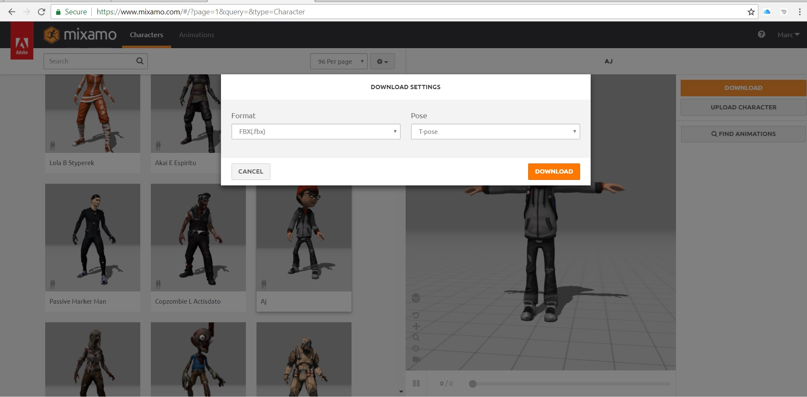

## Introduction to Animation

We will be creating character skeletal animations and rigid body animations in UE4.

_____ 

## Index
_____ 

* Part 1 - Setting up with Git/Github
1. [Starting New Git Repository](#starting-new-git-repository)
2. [Starting Blank Unreal Project](#starting-blank-unreal-project)

* Part 2 - Getting the Character Set Up
1. [Download Character](#download-character)
2. [Download Animations](#download-animations)
3. [Fixing Mixamo Materials](Intro-To-Animation-2.html#fixing-mixamo-materials)
4. [Add Animations](Intro-To-Animation-2.html#add-animations)

* Part 3 - Blueprints
1. [Setting Up Character Blueprint](Intro-To-Animation-2.html#setting-up-character-blueprint)
2. [Adding Controls](Intro-To-Animation-2.html#adding-controls)
3. [Adding Forward and Right Movement](Intro-To-Animation-2.html#adding-forward-and-right-movement)
4. [Our First Animation Blend Space](Intro-To-Animation-3.html#our-first-animation-blend-space)
5. [Our First Animation Blueprint](Intro-To-Animation-3.html#our-first-animation-blueprint)

* Part 4 - Animation States
1. [Time Out for Second Idle](Intro-To-Animation-4.html#time-out-for-second-idle)
2. [Falling Animation](Intro-To-Animation-5.html#falling-animation)
3. [Jumping Animation](Intro-To-Animation-6.html#jumping-animation)
4. [Slow Walk and Sprint](Intro-To-Animation-7.html#slow-walk-and-sprint)
5. [Double Jump](Intro-To-Animation-7.html#double-jump)
6. [Player Attack](Intro-To-Animation-8.html#player-attack)

_____ 

## What you will need?

For this project you will need to be install [Unreal Engine 4.22.x](https://www.unrealengine.com/en-US/download) , have a [GitHub](https://github.com/) account (which is free of charge) as well as [GitHub Desktop](https://desktop.github.com). 

_____ 

### Starting New Git Repository
_____ 



{:start="{{ num }}"}
{{ num }}. If you are a student of mine in class you will have received an email of this same repository and will view the invitation and press the **Accept this Assignment** button.  Once this process is complete open **Github Desktop** and press **File \| Clone Repository** and clone the `UE4-intro-to-animation` repository.

  

_____ 



{:start="{{ num }}"}
{{ num }}. If you are not part of the class you can login into github with your personal account and navigate to  [https://github.com/maubanel/ue4-intro-to-animation](https://github.com/maubanel/ue4-intro-to-animation) and in the top right corner press the fork button:

  

_____ 



{:start="{{ num }}"}
{{ num }}. Navigate to the directory where you installed it.  You will have a **Source Files** folder with all the files you need.  There is a hidden .git folder that contains the database for all your files. There is a **LICENSE** file that declares the copyright and licensing terms.  You can look at this if you like.  The **README.md** file has temporary text that you need to keep updated.  You also have a **.gitignore** file that keeps binaries and files that are not required out of the git repository.  You should fill it in with relevant content as you progress through this walk through. You will only see the `.git` folder if you have hidden folders turned on.

  

_____ 

### Download Character
There are many options available to us, but lets use a non UE4 solution to see just how easy it is to import an FBX file with animations.  We will start by selecting a character.

_____ 



{:start="{{ num }}"}
{{ num }}. Navigate in a web browser to [mixamo.com](https://www.mixamo.com/#/) and you can sign in with your **Adobe** credentials (they are run by Adobe) or create a new account.

  

_____ 


{:start="{{ num }}"}
{{ num }}. Press the **Characters** tab and scroll through their selection of character models.  I will select **AJ** but you can pick the one of your choice.  Once you have chosen press the **Download** button.

  

_____ 


{:start="{{ num }}"}
{{ num }}. You will now get a **Download Settings** menu.  We will leave the **Format** as `FBX` and the **Pose** as `T-pose`.  Press the **Download** button to download the model.

  

_____ 

### Download Animations

_____ 


{:start="{{ num }}"}
{{ num }}. Press on the **Animations** tab.  Lets find some animations.  Lets start with the regular run speed.  Type `Run` in the **Search** menu and click through various runs. Pick a moderate speed run that you like.  Now adjust the various settings to make it as you would like.  Make sure the arms don't swing into the body poloygons.

  

_____ 


{:start="{{ num }}"}
{{ num }}. Now the unreal engine will be propelling the player forward and backward.  So we do not want the animation to translate through space.  When you find an animation you like make sure you press the **In Place** toggle so that the player runs on the spot.  Make all adjustments then press the **Download** button.

<iframe class="embed-responsive-item" src="https://www.youtube.com/embed/1zzoMOaxqNo?autoplay=1&rel=0&controls=0&amp&showinfo=0&version=3&loop=1&playlist=1zzoMOaxqNo" frameborder="0" allowfullscreen></iframe>

_____ 


{:start="{{ num }}"}
{{ num }}. In the **Download Settings** you will need to make a change.  We do not need the model every time, and now only need animation data that is solved to this model.  Select the **Skin** drop down menu and change it to `Without Skin`.  Press the **Download** button.

  

_____ 


{:start="{{ num }}"}
{{ num }}. Repeat this process for a fast run.  Make sure you select **In Place** and download this new animation as you did previously.

  

_____ 


{:start="{{ num }}"}
{{ num }}. Repeat for a slow walk animation. I found one that looks like he is sneaking up on someone.

  

_____ 


{:start="{{ num }}"}
{{ num }}. Download a normal speed walk:

  

_____ 


{:start="{{ num }}"}
{{ num }}. Pick two idle animations.  One that is just breathing and another one that we can cut to after a timer to give the animation some personality.  My second one has the character striking his foot like he wants to move again.

  

_____ 


{:start="{{ num }}"}
{{ num }}. Double click the UE4 Project **IntroToAnimation.uproject** to open the UE4 editor.  Create two new folders called `Characters | AJ`.  You can call the name of the second folder by the character you picked for the game.

  

_____ 


{:start="{{ num }}"}
{{ num }}. Go to your **Downloads** folder and drag the file that has the characters name on it into the **AJ** character folder.  As a hint, it will be the largest file (model is bigger than the animations):

  

_____ 


{:start="{{ num }}"}
{{ num }}. Now in a production game we want to share the same base skeleton where we can.  To learn more about this go to this **[Skeletal Assets Unreal Training Video](https://api.unrealengine.com/INT/Videos/PLZlv_N0_O1gbwdyIm78w42fZ1t8dDClsI/FDbpHamn2eY/index.html)** to find out more.  For us we will use the skeleton that is provided with this geometry.  So make sure you leave **Skeleton** blank and you can leave all the other settings as default.

  

_____ 


{:start="{{ num }}"}
{{ num }}. Now you this imports a lot of files into the project.  You should see a **Skeletal Mesh**, a **Physics Asset**, a **Skeleton**, a group of **Materials** and finally a group of **Textures**.  If you picked a different character then your folder will have different files.

  

_____ 


{:start="{{ num }}"}
{{ num }}. Create a new folder under **AJ** called `Materials`.  Drag and drop and **Move** the materials into this folder.

  

_____ 


{:start="{{ num }}"}
{{ num }}. Create a new folder under **AJ** called `Textures`.  Drag and drop and **Move** the textures into this folder.

  

_____ 


{:start="{{ num }}"}
{{ num }}. Double click the Physics asset and look at it.  You can see that this has the collision volumes that move with the mesh.  The default settings should be fine.

  

_____ 


{:start="{{ num }}"}
{{ num }}. Open the skeletal mesh.  Look at the right hand side and you will see a list of bones that are on the skeleton.  

  

_____ 


{:start="{{ num }}"}
{{ num }}. Double click the **Skeletal Mesh** and lets look at the model.  Now when going from Mixamo to UE4 there are some errors in how the Materials are put together.  In some cases it is quite prominent.  With AJ, something is wrong with the face. We will fix this on the next page.

  

_____ 

  

[Home](../index.html)&nbsp;&nbsp;&nbsp; [Continue ->](Intro-To-Animation-2.html)
   
   
   

