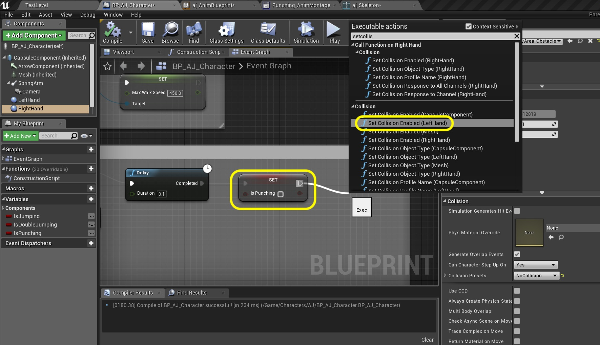

  

_____ 

### Player Attack Continued
Add blending for the punch animations.

_____ 



{:start="{{ num }}"}
{{ num }}. What we will do is only use the upper body part of this animation and blend it over the legs.  This way the player can run all of its locomotion animation and blend a punch in the upper body.  Let go to the **Anim Graph** in the **aj_AnimBlueprint** and disconnect the **Slot Upper Body** node and move it below.  Grab the output of the **Core Locomotion** node and select **New Save Cache Pose** node to the tree.  This is similar to the Sequence nodes in blueprints.  It allows us to cache this animation pose and use it in multiple places.

  

_____ 


{:start="{{ num }}"}
{{ num }}. Name this new cache node `LocomotionCache`.  Right click beneath and select a **Use cached pose `LocomotionCache** node.

  

_____ 


{:start="{{ num }}"}
{{ num }}. Copy and paste the **Locomotion Cache** node:

  

_____ 


{:start="{{ num }}"}
{{ num }}. Right click on an open area and add a **Layered blend per bone** node. This node allows us to isolate the animation to an area of hiearchy on the skeleton.

  

_____ 


{:start="{{ num }}"}
{{ num }}. Connect the animation output of the top **Locomotion Cache** node to the **Base Pose** node of the **Layered blend per bone** node.  Connect the bottom **Locomotion Cache** node and connect it to the **Slot Upper Body** node (which contains the montage punching).

  

_____ 


{:start="{{ num }}"}
{{ num }}. Select the animation output of the **Slot Upper Body** node to the input **Blend Poses 0** node on the **Layered blend per bone** node.

  

_____ 


{:start="{{ num }}"}
{{ num }}. Press the **Skeleton** button at the top to open the skeleton.  We want to base of the spine to blend the upper body.  In my model the `Spine` bone is best.  Make note of the EXACT spelling of the bone as we will use it next.

  

_____ 


{:start="{{ num }}"}
{{ num }}. Go back to the animation graph and highlight the **Layered blend per bone** node.  In the **Details** panel press the **_** button next to **Branch Filters**.

  

_____ 


{:start="{{ num }}"}
{{ num }}. Enter the **Bone Name** that we saw earlier `Spine`.  This will blend on this node tree.

  

_____ 


{:start="{{ num }}"}
{{ num }}. Take the output animatoin from the **Layered blend per bone** node and connect it to the **Final Animation Pose** node.

  

_____ 


{:start="{{ num }}"}
{{ num }}. Now you can run around and punch with our character and it blends properly.

<iframe class="embed-responsive-item" src="https://www.youtube.com/embed/SmG1K829EQM?autoplay=1&rel=0&controls=0&amp&showinfo=0&version=3&loop=1&playlist=SmG1K829EQM" frameborder="0" allowfullscreen></iframe>

_____ 


{:start="{{ num }}"}
{{ num }}. Now I want to make sure that we only have active fist collision volumes when the character is punching.  I don't want them to trigger anything while doing other animations.  Do do this we will be turning the collision on and off on these collision volumes.  Go to the **BP_AJ_Character** blueprint and select the **LeftHand** component.  Look in the **Details** panel and go to the **Collision** section and look at the **Collision Presets**. 

  

_____ 


{:start="{{ num }}"}
{{ num }}. Select the **Collision Presets** drop down menu and select `No Collision`.

  

_____ 


{:start="{{ num }}"}
{{ num }}. Repeat this for right hand and select the **Collision Presets** drop down menu and select `No Collision`

  

_____ 


{:start="{{ num }}"}
{{ num }}. Take the output of the **IsPunching** node after the Delay node and select a **Set Collision Enabled (LeftHand)** node:

  

_____ 


{:start="{{ num }}"}
{{ num }}. Drag and drop a **Right Hand** component node to the event graph.

  

_____ 


{:start="{{ num }}"}
{{ num }}. Connect the **Right Hand** node to the **Target** pin in the **Set Collision Enabled** node.  Set the **New Type** to **Collision Enabled (Query and Physics)**.

  

_____ 


{:start="{{ num }}"}
{{ num }}. We will turn off this collision when an animation gets to the end punch state.  This will have to be triggered in the animation blueprint.  So lets set up a function for it to call.  Press the **+** button enxt to **Functions** and call it `Turn Off Collision`. Double click this new function to open its tab.

  

_____ 


{:start="{{ num }}"}
{{ num }}. Right click and add a **Set Collision Enabled (LeftHand)** node.

  

_____ 


{:start="{{ num }}"}
{{ num }}. Add a **Right Hand** node and connect it to the **Target** node in the **Set Collision Enabled** node.  Make sure this is set to `No Collision`.

  

_____ 


{:start="{{ num }}"}
{{ num }}. OK, lets go to the **aj_AnimBlueprint** and call this function.  Pull off of the **Cast To BP_AJ_Character** node and select the **Call Function \| Turn Off Collision** node.

  

_____ 


{:start="{{ num }}"}
{{ num }}. Now connect the **Sequence** node's **Then 3** pin after the **EndOfPunch** node to the input pin in the new **Turn Off Collision** node.  This will disable the collision when either punch animation ends.

  

_____ 


{:start="{{ num }}"}
{{ num }}. Add a **Sphere** to the level.  CHange it to **Movable**.  Set the scale to `2.0` on the **X**, **Y** and **Z** of the sphere.  Change **Simulate Physics** to `True`. Change the **Physics \| Linear Damping** to `0.1`. Change the **Physics \| Angular Damping** to `50.0`. Change the **Physics \| Mass Scale** to `100.0`.

  

_____ 


{:start="{{ num }}"}
{{ num }}. Play the game and go and punch the sphere.  Make any collision adjustments you need to on any of the collision volumes to get it to work properly.  If you need to turn on the rendering on the collision volumes so you can see what is happening in game. Press **Save All** and update Github by **committing** and **pushing** all the changes made.

<iframe class="embed-responsive-item" src="https://www.youtube.com/embed/K02FjZ-qVhI?autoplay=1&rel=0&controls=0&amp&showinfo=0&version=3&loop=1&playlist=K02FjZ-qVhI" frameborder="0" allowfullscreen></iframe>

_____ 

  

[<- Previous](Intro-To-Animation-9.html)&nbsp;&nbsp;&nbsp;[Home](../index.html)&nbsp;&nbsp;&nbsp; [Continue ->](Intro-To-Animation-11.html)
   
   
   