  

_____ 

### Speed up and Down Ramps
Add some speed changes when player moves up and down ramps

_____ 



{:start="{{ num }}"}
{{ num }}. Now lets add a ramp to run up and down and see how it feels.  We will make adjustments to the physics to get what we would like.  Start by dragging another **Box** onto the level.

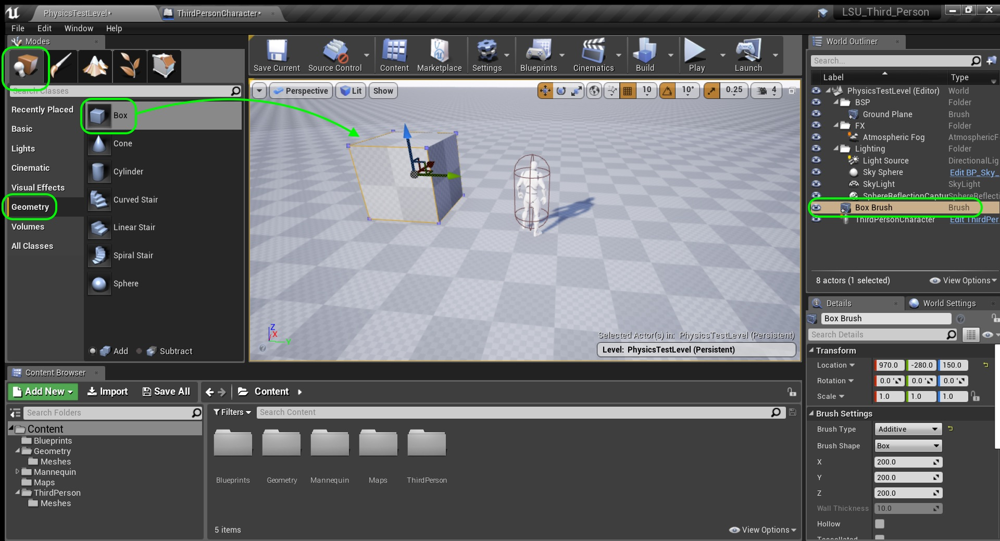  

_____ 



{:start="{{ num }}"}
{{ num }}. Adjust the size to `1000` by `400` by `200` in the brush size. And make sure the future ramp is touching (or penetrating) the ground.

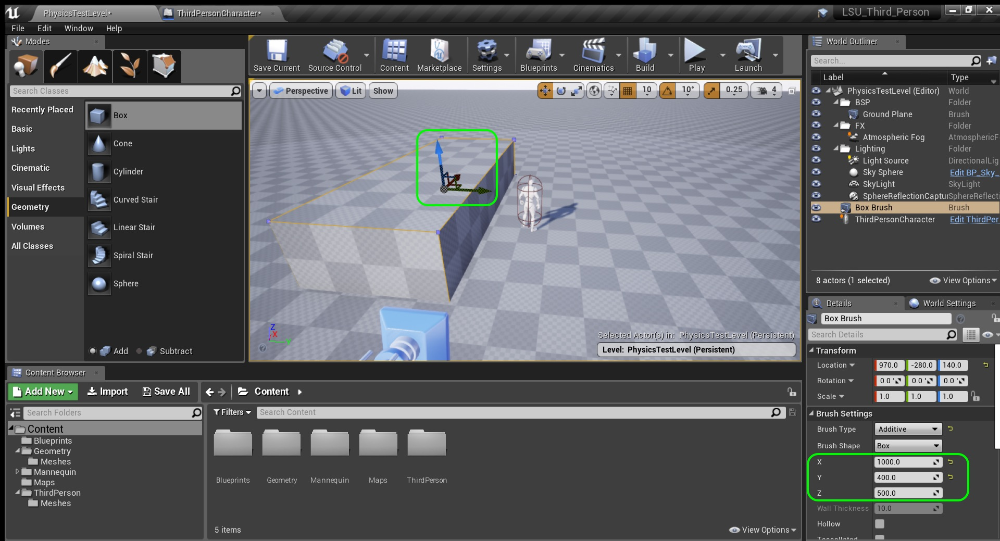  

_____ 


{:start="{{ num }}"}
{{ num }}. Now select the edit tool in the box.  Press the Control key and left click the back top points on the rectangle.  Pull them upwards to make a nice slope.  Do the same thing for the front two but pull them down to the ground:

<iframe class="embed-responsive-item" src="https://www.youtube.com/embed/6PnGhQkVhpw?autoplay=1&rel=0&controls=0&amp&showinfo=0&version=3&loop=1&playlist=6PnGhQkVhpw" frameborder="0" allowfullscreen></iframe>

_____ 



{:start="{{ num }}"}
{{ num }}. Now run up and down the ramps.  Hmmm, doesn't feel right to me. I don't feel an acceleration down the ramp or deceleration running up the ramp.  Lets add some debug to confirm.

<iframe class="embed-responsive-item" src="https://www.youtube.com/embed/oj2emqYhMlk?autoplay=1&rel=0&controls=0&amp&showinfo=0&version=3&loop=1&playlist=oj2emqYhMlk" frameborder="0" allowfullscreen></iframe>

_____ 


{:start="{{ num }}"}
{{ num }}. Open your player blueprint.  Add a variable called `bShow\Velocity` that is type **Boolean**.  Set **Instance Edit** and **Private** to `true`.  Set the **Category** to `Physics` and the **Tooltip** to `Prints on screen the velociy of player`.

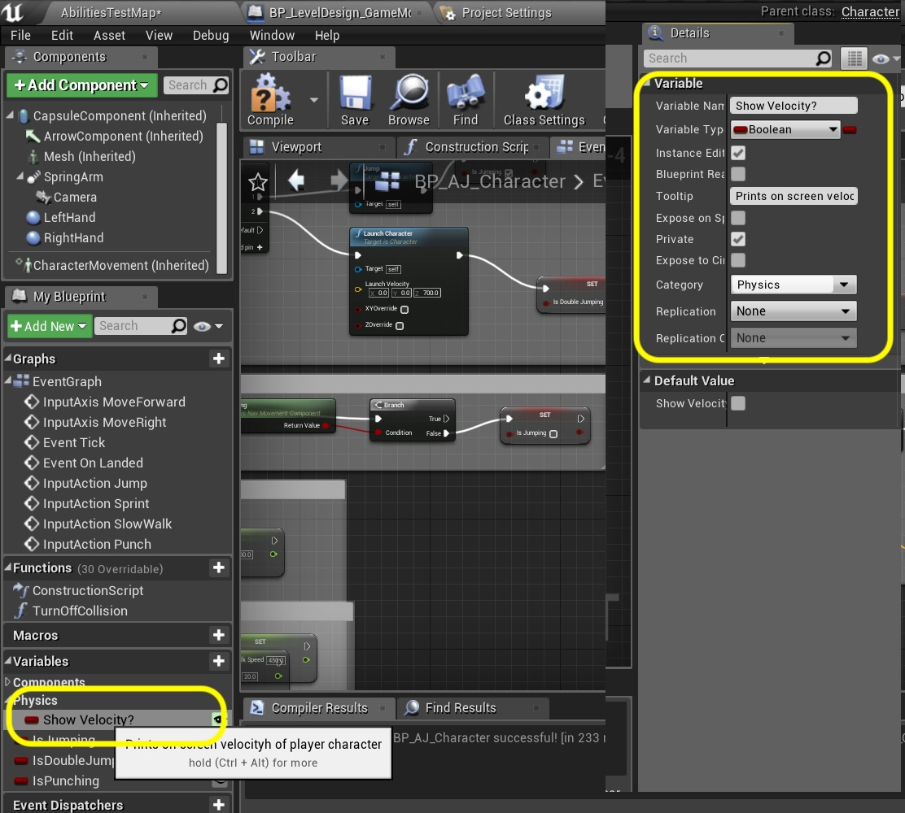  

_____ 



{:start="{{ num }}"}
{{ num }}. Drag and drop a **Get Show Velocity?** node and pull off of the pin to get a **Branch**  node.

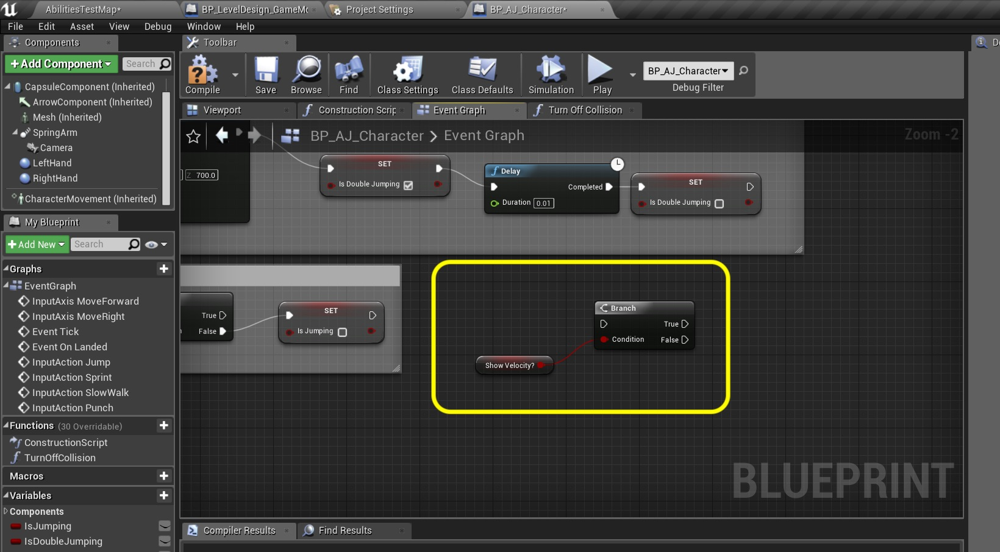  

_____ 


{:start="{{ num }}"}
{{ num }}. Pull off of the **True** branch and select a **Print** node.  We will be printing the magnitude (length) of the **Velocity** vector of our character.

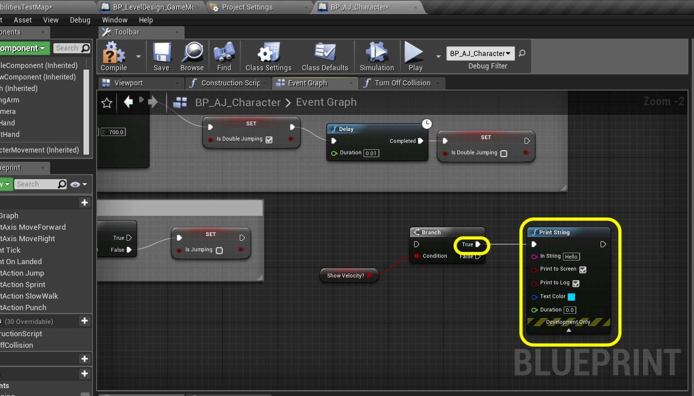  

_____ 



{:start="{{ num }}"}
{{ num }}. Drag and drop a reference to the **Character Movement** Component in the player blueprint:

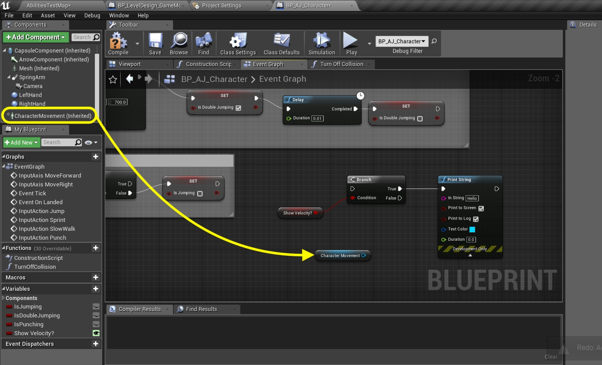  

_____ 


{:start="{{ num }}"}
{{ num }}. Pull off the **Character Movement** node and select the **Velocity** node.

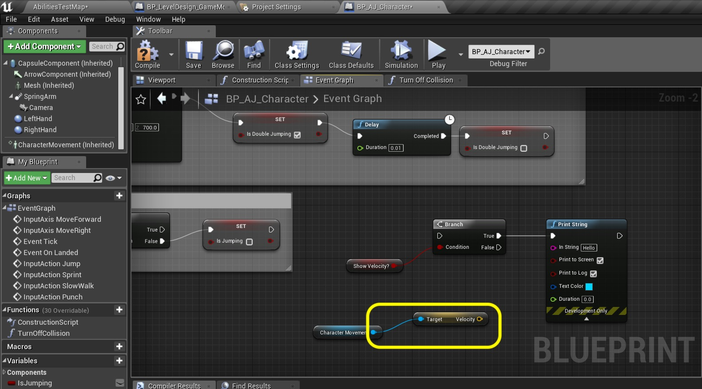  

_____ 



{:start="{{ num }}"}
{{ num }}. Now lets get the magnitude (length) of the **Vector** which will return how fast they are moving.  Pull off of the **Velocity** exit pin and select the **Vector Length** node:

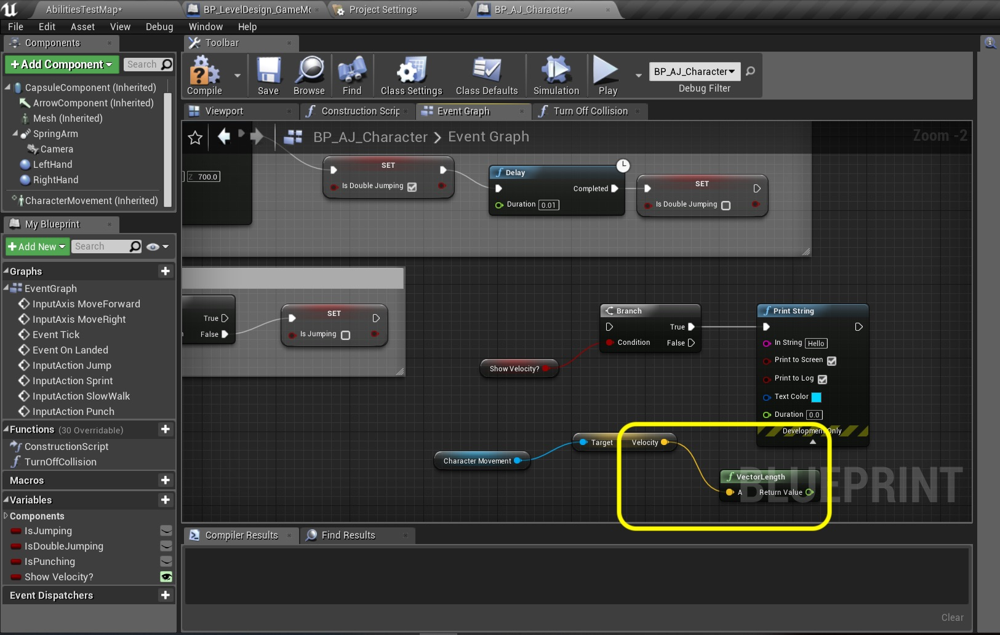  

_____ 


{:start="{{ num }}"}
{{ num }}. Take the ouput of the **Vector Length** node and plug it into the **In String** in the **Print String** node.  Press the triangle at the bottom to get more opions.  Set the **Duration** to `0.0`.

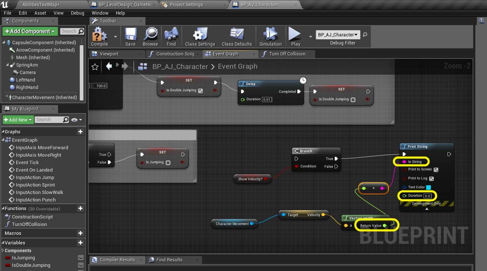  

_____ 



{:start="{{ num }}"}
{{ num }}. Drag the pin from **Set Is Jumping** execution pin where it is false on the **Event Tick** being on ground to the input pin on the new **Branch** node.  We only care now about the ground speed so this will suffice. Add a comment around these nodes called `Debug Velocity`.

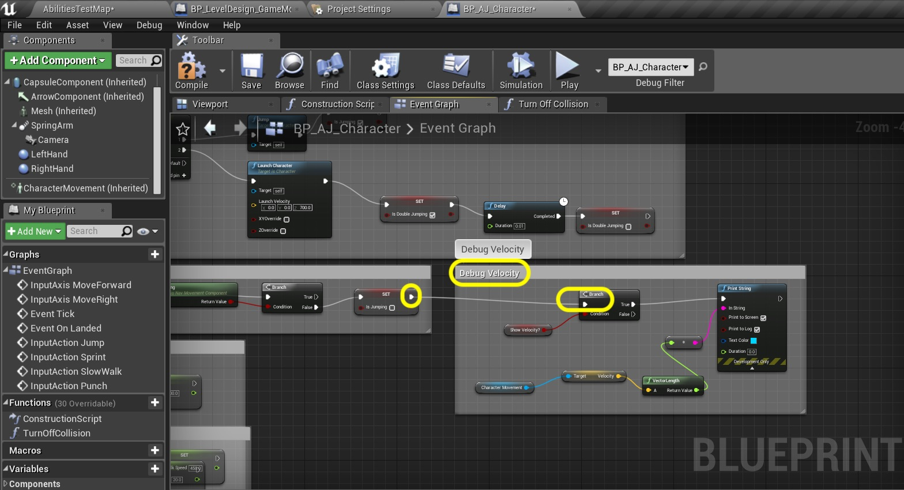  

_____ 


{:start="{{ num }}"}
{{ num }}. Set **bShowVelocity** to `True` in the blueprint. Press the **Compile** button on the blueprint.  Go to back to the game.

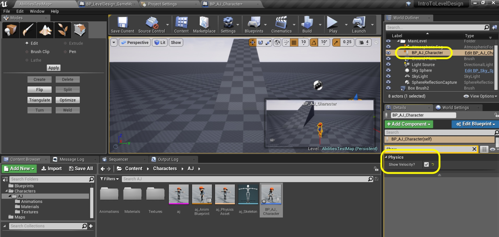  

_____ 



{:start="{{ num }}"}
{{ num }}. Run the game and sprint, run and walk up and down the ramp.  Now the player does not lean into the ramps not does the speed change when running on slopes.

<iframe class="embed-responsive-item" src="https://www.youtube.com/embed/eIy4iQMUt_w?autoplay=1&rel=0&controls=0&amp&showinfo=0&version=3&loop=1&playlist=eIy4iQMUt_w" frameborder="0" allowfullscreen></iframe>

_____ 


{:start="{{ num }}"}
{{ num }}. So first we need to find out the slope of the ground under us.  How are we going to do this?  We need to cast a line from the player straight downwards to the ground.  When it collides we will use that to determine the slope (pitch of the surface normal).  Right click under the debug print we just made on the character blueprint then add a **Line Trace By Channel** node:

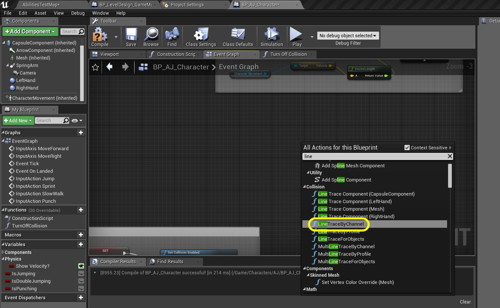  

_____ 



{:start="{{ num }}"}
{{ num }}. Make some room to the left of the **Debug Velocity** ndoes and add a **Sequence** node to keep our graph clean.

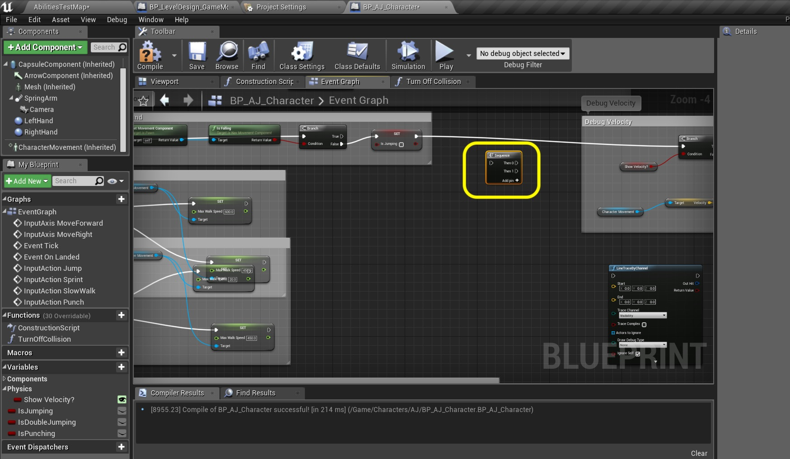  

_____ 


{:start="{{ num }}"}
{{ num }}. Higjack the execution pin between **Set Is Jumping** and **Branch**.  Send it to the **Sequence** node with the **Then 0** going to the **Branch** node:

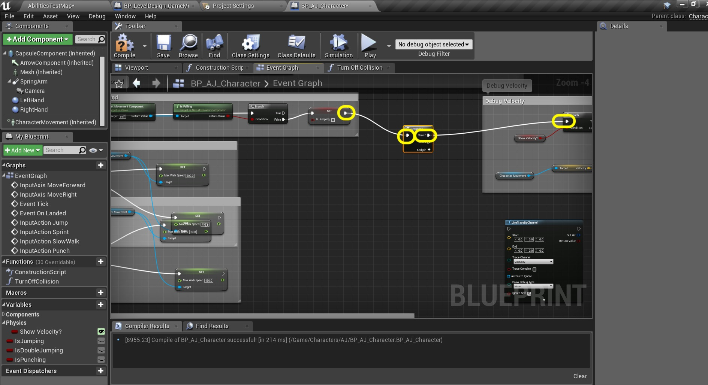  

_____ 



{:start="{{ num }}"}
{{ num }}. Now we want to only perform this operation if the player is moving.  So grab the output of the previous **Vector Length** node and add a **float > float** node.

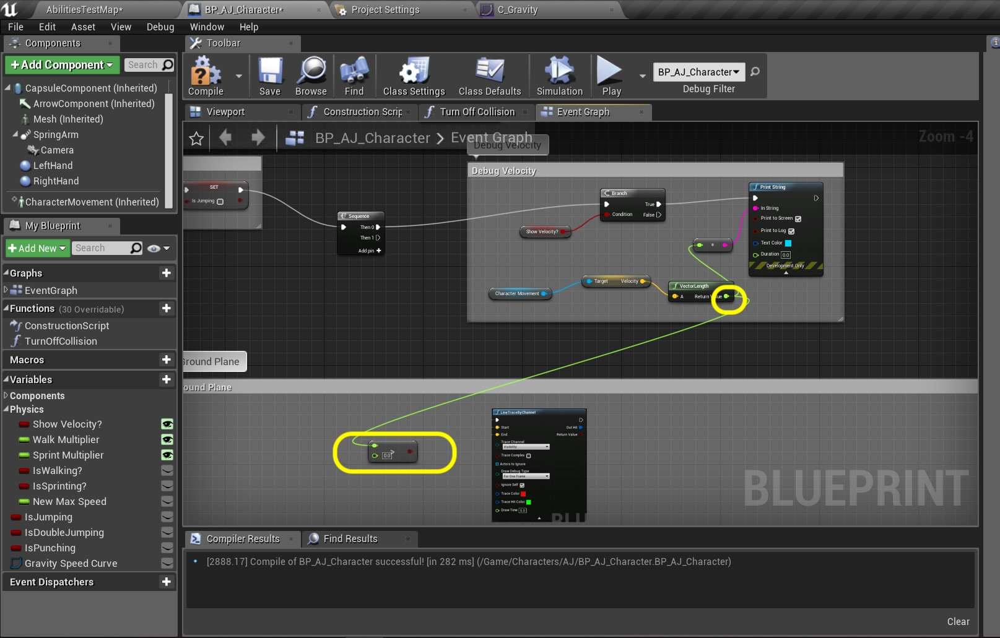  

_____ 


{:start="{{ num }}"}
{{ num }}. Add a **Branch** node after checking in seeing if the Velocity is greater than 0.  Attach the output of the **Then 1** execution pin to the input of the **Branch** node.

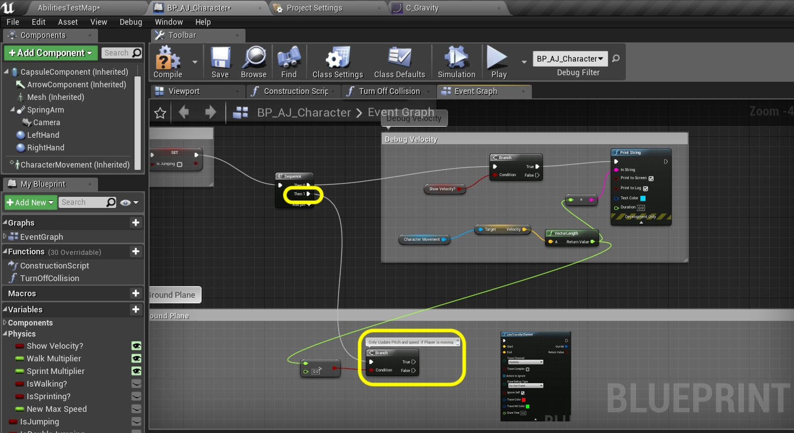  

_____ 



{:start="{{ num }}"}
{{ num }}. Now we will start the line trace in the center of the character.  Right click and select a **Get Actor Location** node.  Send the output of this to the **Start** ndoe in the **Line Trace By Channel** node. Connect the **True** execution pin from the **Branch** node to the **Line Trace By Channel** node.

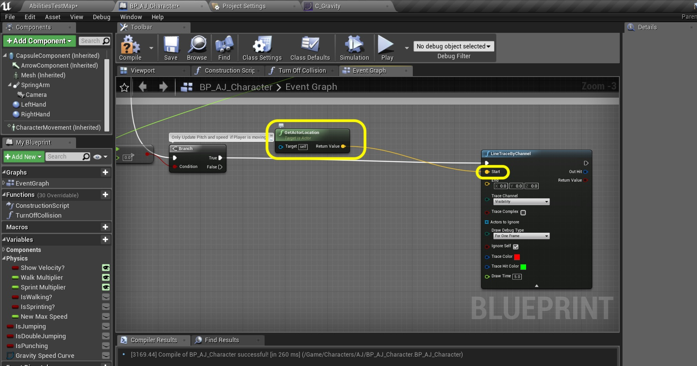  

_____ 


{:start="{{ num }}"}
{{ num }}. Now we need to cast a line down the player based on his world angle.  So we will drag and drop the **Capsule Component** from the Component menu and then pull the pin and get a **Get Up Vector** node. This gets a vector pointing upwards from his head. 

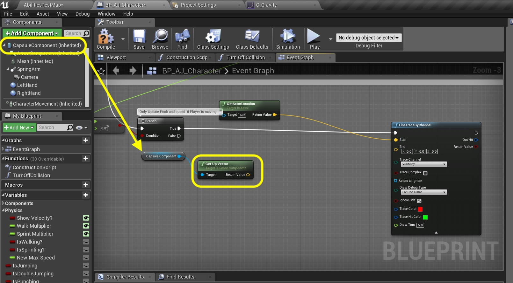  

_____ 



{:start="{{ num }}"}
{{ num }}. Now add a **vector * float** node.  We need to scale this normalized vector 300 units in the opposite direction. Set the vector amount to `-300.0` (multiplying a vector by a negatibve 1 reverses the direction of the vector).

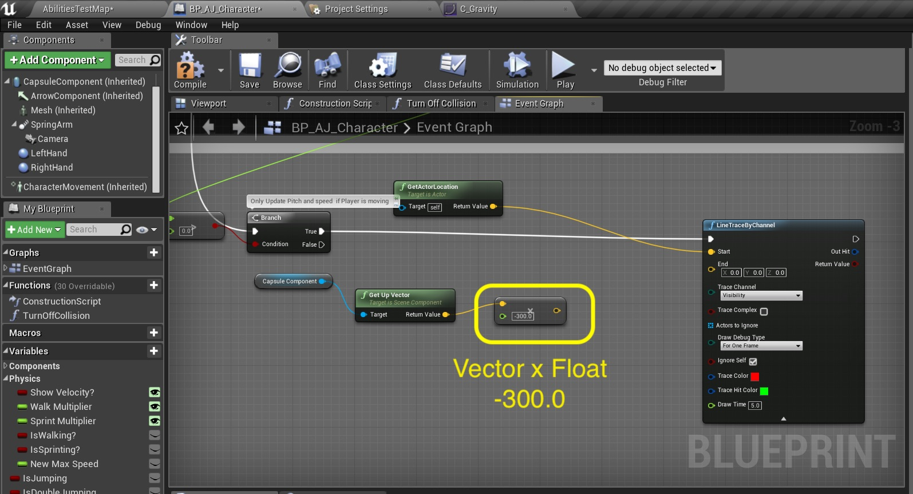  

_____ 


{:start="{{ num }}"}
{{ num }}. To see this line trace we will turn the **Draw Debug Type** to `For One Frame`. This will allow us to see the line being cast and wether it collides with a surface.

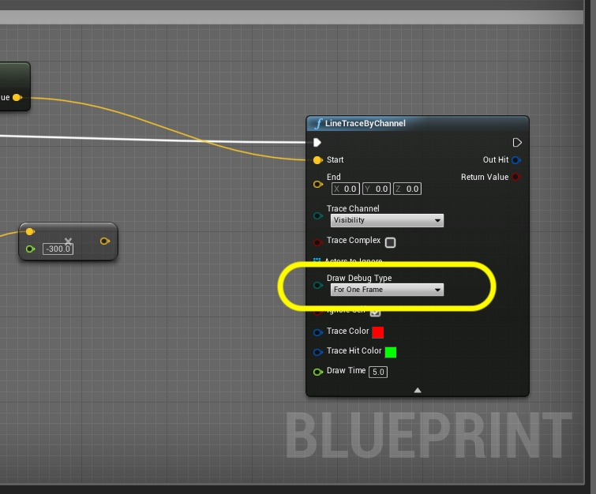  

_____ 



{:start="{{ num }}"}
{{ num }}. Now this value is in local space and we need to translate it to world space.  We do this by adding the actual world location.  Pull off the **Multiplication** pin and select a **vector + vector** node.  Add the **Return Value** to the **Get Actor Location**.  Send the output to teh **End** pin of the **Line Grace By Channel** node.

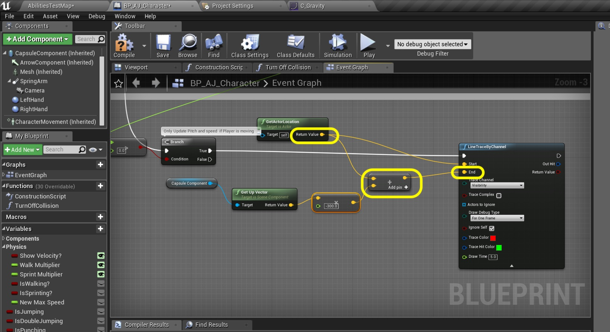  

_____ 


{:start="{{ num }}"}
{{ num }}. I add a comment explaining my actions.

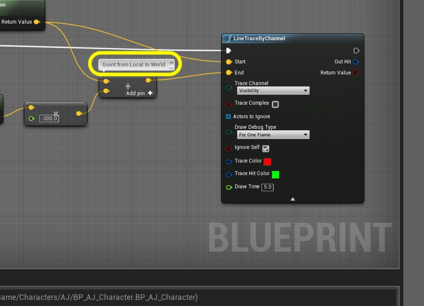  

_____ 



{:start="{{ num }}"}
{{ num }}. Run the game. You should see a red line casting downwards with a hit target on the ground beneath the player.  

<iframe class="embed-responsive-item" src="https://www.youtube.com/embed/M_7E92X4MXc?autoplay=1&rel=0&controls=0&amp&showinfo=0&version=3&loop=1&playlist=M_7E92X4MXc" frameborder="0" allowfullscreen></iframe>

_____ 


{:start="{{ num }}"}
{{ num }}. Now I need to cast a second line then be the angle of the slope.  This will tell me if I am going up or down the slope as well.  What I don't want to do is base it on the facing angle.  The player could be strafing or walking backwards.  I am going to cast a line 10 units ahead based on the direction of their Velocity. Add a second **Line Trace By Channel** node to the graph beneath the previous one.  To the left add a **Get Actor Location** node.  

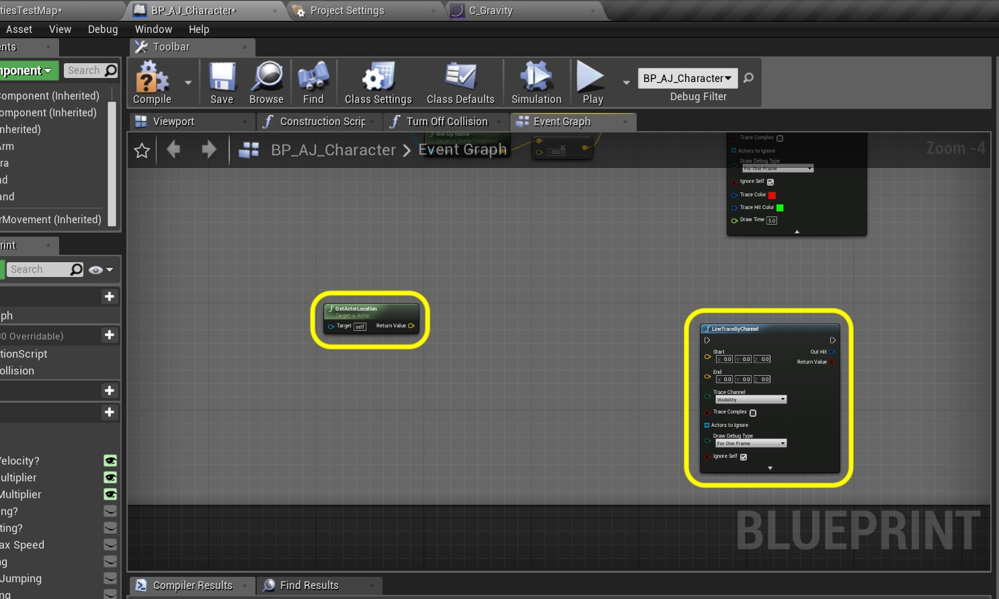  

_____ 



{:start="{{ num }}"}
{{ num }}. We need to get forward by 10 velocity units from the current location.  Add a **vector + vector** node and connect the input to the **Return Value** of the **Get Actor Location** pin.  Send the output to the **Start** pin of the **Line Tracer By Channel** node.

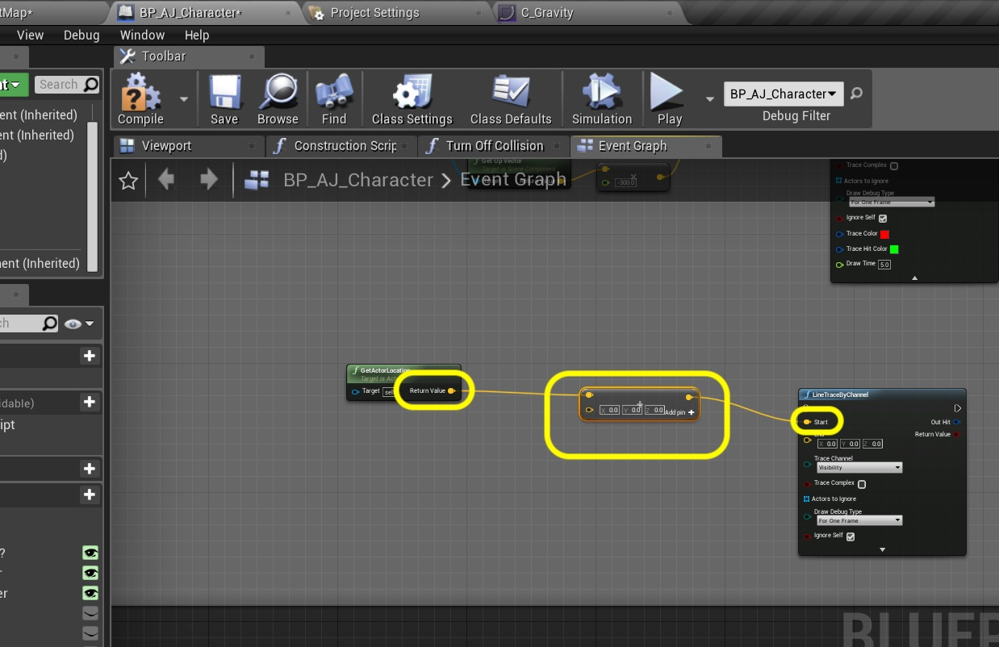  

_____ 


{:start="{{ num }}"}
{{ num }}. Drag a **Character Movement** node from the Component menu. Drag off of its pin and select a **Get Velocity** node.

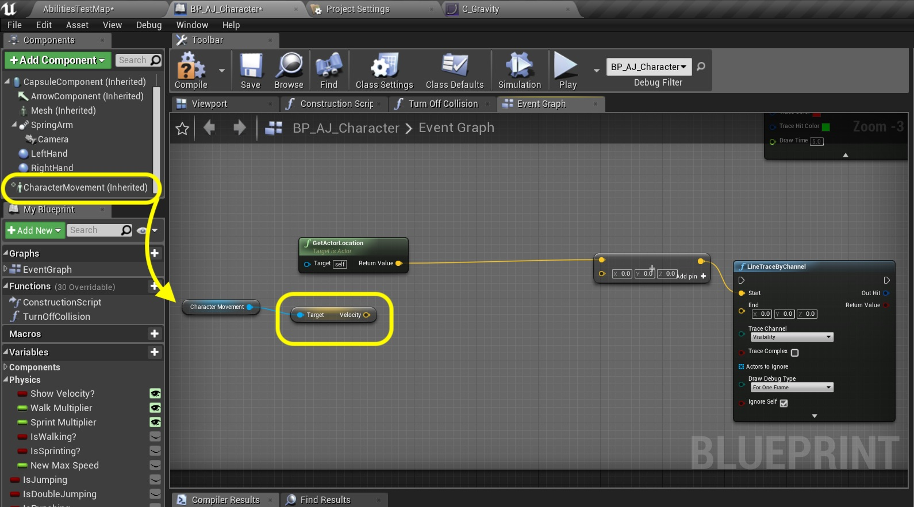  

_____ 


{:start="{{ num }}"}
{{ num }}. Grab the output of the **Velocity** pin and select a **Normalize** node.  Now add a **vector * float** node to multiply the vector by `10.0` to scale it up.  Remember a normalized vector is 1 unit in length.  Multiplying it by 10 sends it forward by 10 units.  Send this output to the second side of the vector **Addition** node.

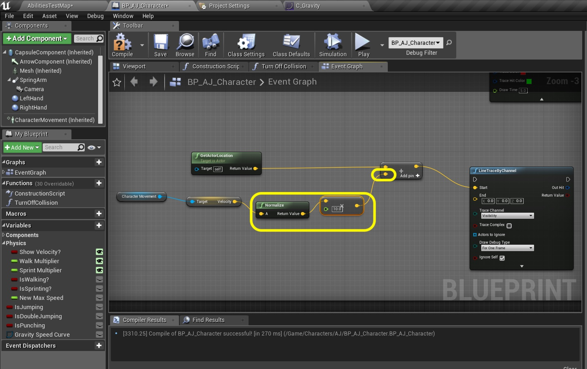  

_____ 


{:start="{{ num }}"}
{{ num }}. The end unit will be 300 units underneath the player.  Add a **vector + vector** node. 

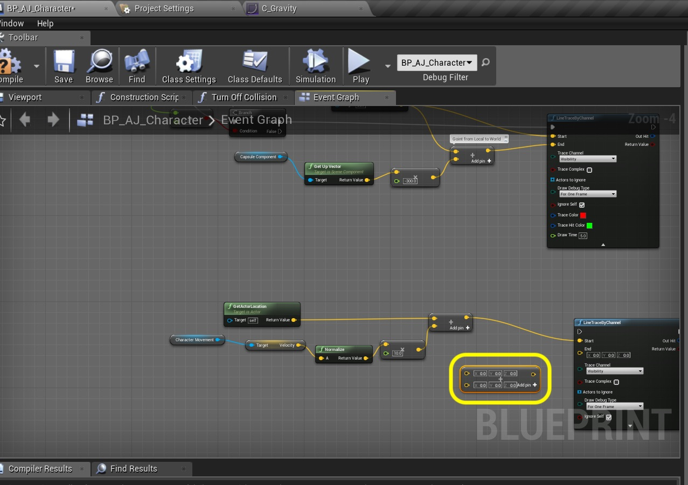  

_____ 


{:start="{{ num }}"}
{{ num }}. Connect the output of the **Multiplication** pin where you go down 300 units from the center downwardsto the topside of the addition node.  Take the output of the **Addition** pin to the input of the other end of the addition node. Send the output of to the **End** pin in the **Line Trace by Channel** node. Set the **Draw Debug Type** to `For One Frame` to test out.  

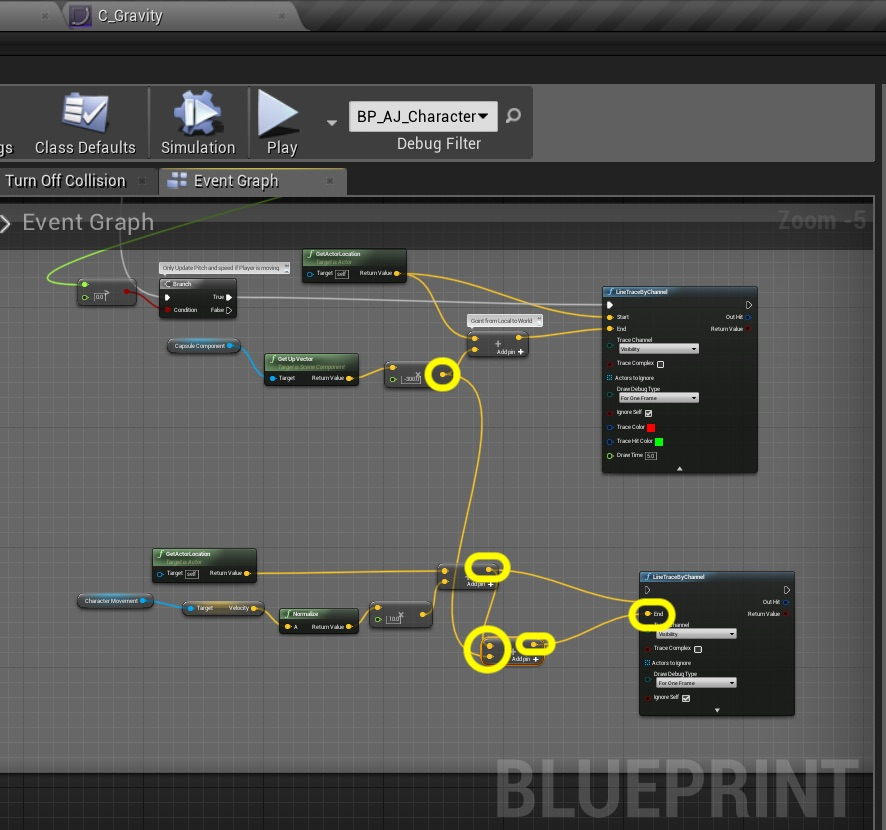  

_____ 


{:start="{{ num }}"}
{{ num }}. 

  

_____ 


{:start="{{ num }}"}
{{ num }}. Play the game and see if you can see the second vector.  It still looks like one single vector.  What we need to do is termporarilly make them further apart.  Change the distance of the **Multiplication** pin from `10.0` to `50`:

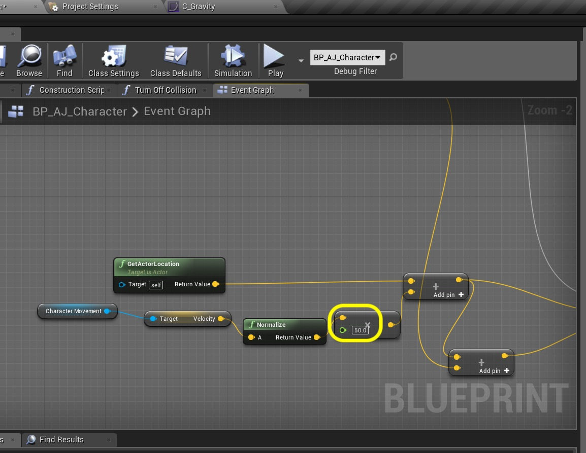  

_____ 


{:start="{{ num }}"}
{{ num }}. Play the game and you should now see the second vector. Set the **Multiplication** pin back to `10.0`. Now on the next page we will figure out the slope of the surface by measuring the angle between these two vectors. Press **Save All** and update Github by **committing** and **pushing** all the changes made. On the next page we will look at an easy single jump vertical height.

<iframe class="embed-responsive-item" src="https://www.youtube.com/embed/oFSOLqUoxNc?autoplay=1&rel=0&controls=0&amp&showinfo=0&version=3&loop=1&playlist=oFSOLqUoxNc" frameborder="0" allowfullscreen></iframe>

_____ 
  

[<- Previous](Intro-To-Animation-10.html)&nbsp;&nbsp;&nbsp;[Home](../index.html)&nbsp;&nbsp;&nbsp; [Continue ->](Intro-To-Animation-12.html)
   
   
   