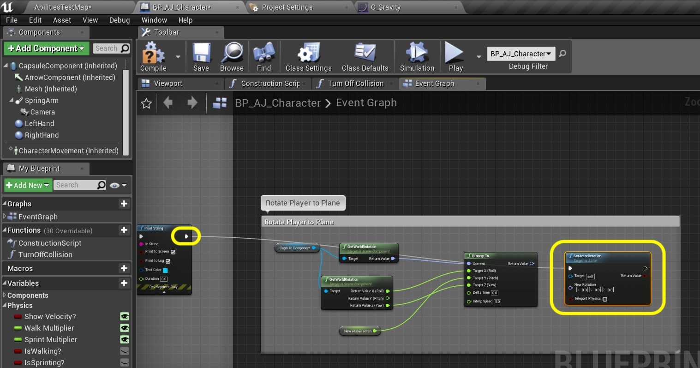
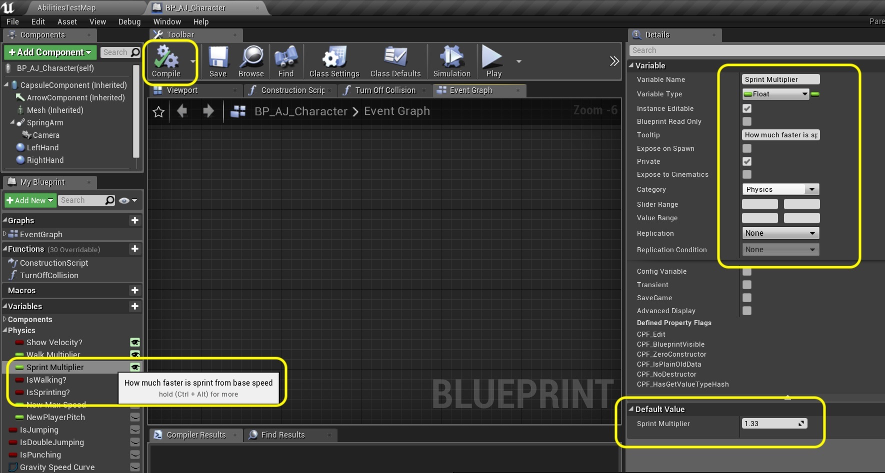

  

_____ 

### Speed up and Down Ramps Continued
Add some speed changes when player moves up and down ramps

_____ 



{:start="{{ num }}"}
{{ num }}. To get the angle we need to results of the two line traces of where they hit on the ground.  Pull from the **Out Hit** output pin of BOTH **Line Trace By Channel** nodes and select **Break Hit Result** to separate the pins for the output.

  

_____ 



{:start="{{ num }}"}
{{ num }}. Add a **Find Look at Rotation** node and break the output pins to their individual outputs.  

  

_____ 



{:start="{{ num }}"}
{{ num }}. Connect the **Location** from the top **Line Trace By Channel** then **Break Hit Results** node to the **Start** pin of the **Find Look at Rotation node.  Send the second **Location** pin to teh **Target** pin on the **Find Look at Rotation node.  So we are looking from the collision point just beneath us to the one 10 units ahead.

  

_____ 


{:start="{{ num }}"}
{{ num }}. Lets print this on the screen to make sure we have this right.  Add an **Append String** node and in the **A** box put in `Pitch: `.  

  

_____ 



{:start="{{ num }}"}
{{ num }}. Connect the **Return Value Y (Pitch)** to the **B** pin of the **Append** node:

  

_____ 


{:start="{{ num }}"}
{{ num }}. Pull off of the output of the **Append** node and select the **Print String** node.  Change the **Duration** to `0.0`.

  

_____ 



{:start="{{ num }}"}
{{ num }}. Connect the **Execution** pins from the first **Line Trace by Channel** to the second **Line Trace by Channel** to the **Print String** nodes.

  

_____ 


{:start="{{ num }}"}
{{ num }}. Play the game and run around and up and down the ramp.  It should be 0 degrees on flat land, a positive number when going up hill and a negative number in degrees when going downhill.

<iframe class="embed-responsive-item" src="https://www.youtube.com/embed/oKRSV-h69p0?autoplay=1&rel=0&controls=0&amp&showinfo=0&version=3&loop=1&playlist=oKRSV-h69p0" frameborder="0" allowfullscreen></iframe>

_____ 



{:start="{{ num }}"}
{{ num }}. Now we want the player's pitch to rotate to match the slope of the round.  The player will lean back when running uphill and forward when moving downhill.  We will use this slop value we calculated for this. Right click on the **Return Value Y (Pitch) pin from the **Find Look at Rotation** node and select **Promote to Variable**.  Call it `NewPlayerPitch` and make it Type **Float** and **Private**. Set teh **Tooltip** to `Pitch of player negative downhill, positive uphill in degrees`. Connect the execution pins between the second **Line Trace** and the **Print String** statement.

  

_____ 


{:start="{{ num }}"}
{{ num }}. Lets get a reference to the **Capsule Component** and pull off its pin and get it current rotation by selecting a **Get World Rotation** node.

  

_____ 



{:start="{{ num }}"}
{{ num }}. We don't want the player to just jump immediately to the new angle, we want them to animate to it.  So we need a LERP node.  Pull off of the **Return Value** from the **Get World Rotation** node and select a **RInterp To** node.  Right click on the **Target** pin and select **Split Pins**.

  

_____ 


{:start="{{ num }}"}
{{ num }}. Our starting point in our current angle and our destination point is the angle with the new pitch from the floor.  Add another **Get World Rotation** node from the Capsule Component.

  

_____ 



{:start="{{ num }}"}
{{ num }}. Split the pins on this new node by right clicking on the **Return Value** pin and splitting the pins.

  

_____ 


{:start="{{ num }}"}
{{ num }}. Connect the **Return Value X (Roll) to the **Target X (Roll)** pins on the **RInterp To** node.  Also connect the **Return Value Z (Yaw) to the **Target Z (Yaw) on the **RInterp To** node.  These will not change.

  

_____ 



{:start="{{ num }}"}
{{ num }}. Now we will take teh angle of the ground plane and add this to our pitch target to lerp to this point.  Add a **Get New Player Pitch** node and send it to the **Target Y (Pitch)** in the **RInterp to** node.

  

_____ 


{:start="{{ num }}"}
{{ num }}. Add a **Set Actor Rotation** node and connect the output of the **Print String** execution pin to this new node.

  

_____ 



{:start="{{ num }}"}
{{ num }}. Connect from the **Return Value** pin of the **RInterp To** node to the **New Rotation** of the **SAet Actor Rotation** node.

  

_____ 


{:start="{{ num }}"}
{{ num }}. The RInterp To node needs the delta time since last frame.  Right click and add a **Get World Delta Seconds** pin and connect it to the **Delta Time** pin in the **RInterp To** node. Set the **Interp Speed** to `5.0`.

  

_____ 



{:start="{{ num }}"}
{{ num }}. Play the game and run up and down the slope and on flat ground.  You should see the player rotate to match the slope of the ground.  Works great now we will move on to adjusting speed.  We want the player to move faster going downhill and slower moving uphill. 

<iframe class="embed-responsive-item" src="https://www.youtube.com/embed/ULKEEg3IDUw?autoplay=1&rel=0&controls=0&amp&showinfo=0&version=3&loop=1&playlist=ULKEEg3IDUw" frameborder="0" allowfullscreen></iframe>

_____ 


{:start="{{ num }}"}
{{ num }}. This will make us rethink the movement for the player.  They will be dynamically changing based on the slope.  Right now we have hard coded our speed values.  Lets change this and turn them into states we can check. Delete all the nodes inside the **Sprint** and **Walk** sections:

  

_____ 


{:start="{{ num }}"}
{{ num }}. We are going to add another Variable.  Call it `Is Walking?` and make it type **Boolean**.  Set it to **Private** and to **Category** `Physics`.  Add a **Tooltip** that states `Whetehr player is walking or not`.

  

_____ 



{:start="{{ num }}"}
{{ num }}. Right click the **Is Walking?** variable and **Duplicate** it.  Call it `IsSprinting?` and adjust the tooltip accordingly.

  

_____ 


{:start="{{ num }}"}
{{ num }}. In the Sprint section add two **Set Is Sprinting?** nodes.  Connect the **Pressed** execution pin to the top node and set it to `true`.  The the **Released** pin to the bottom one and leave it as `false`.

  

_____ 



{:start="{{ num }}"}
{{ num }}. Now we don't want sprinting and walking at the same time so add a **Set Is Walking?** node and set it to flase right after you set **Is Sprinting** to true.

  

_____ 


{:start="{{ num }}"}
{{ num }}. Repeat this procedure with the **Event Slow Wal**.  Add two **Is Walking?** nodes with the `ture` node connected to **Pressed** and the `false` node connected to **Released**.

  

_____ 



{:start="{{ num }}"}
{{ num }}. Then add after you set **Is Walking?** to `true` another **Set Is Spriting?** node and set it to `false`.  This way we can't have sprinting and walking at the same time.

  

_____ 


{:start="{{ num }}"}
{{ num }}. We will calculate the spriting and walking as an offset of our master speed.  Create a new float called  `Sprint Multiplier` of type **Float**.  Set **Instace Editable** and **Private** to `true` then set the **Category** to `Physics`.  Set the **Tooltip** to `How much faster is sprint from base speed`.  Press the **Compile** button and set the default to `1.33`.

  

_____ 



{:start="{{ num }}"}
{{ num }}. Create another variable called `Walking Multiplier` and set it to Type **Float**.  Set **Private** and **Instance Editable** to `true`.  Set the **Category** to `Physics` and the **Tooltip** to `How much slower is walk speed from base speed`.  Press the **Compile** button and set the **Default** to `.044`.

  

_____ 


{:start="{{ num }}"}
{{ num }}. We need to save our ever changing max speed in a variable.  Create another Type **Float** and call it `New Max Speed`.  Set it to **Private** and to **Category** `Physics`.  Add a **Tooltip** that says `New max speed whether running walking or sprinting`.

  

_____ 



{:start="{{ num }}"}
{{ num }}. Go to the **Content Browser** directory that holds your characer blueprint.  Press the **Add New** button and select **Miscellaneous \| Curve**.  We are going to map the various speeds on a curve.  

  

_____ 


{:start="{{ num }}"}
{{ num }}. Select a **Curve Float**.  

  

_____ 



{:start="{{ num }}"}
{{ num }}. Call this curve `C_Gravity` and save it to where you character blueprint is located:

  

_____ 


{:start="{{ num }}"}
{{ num }}. Double click the curve and shift left click three times to add three points.  Press the **Auo** button so that it is a rounded curve instead of straight lines.

  

_____ 



{:start="{{ num }}"}
{{ num }}. Add a final fourth point on the curve by Shift Left Clicking in the graph.  Now highlight the first point and set it to **Time** of `-45.0` with a **Value** of `900.0`, set the second to a **Time** of `-10.0` and a **Value** of `450.0`.  The third point is set to a **Time** of `10.0` and a **Value** of `450`.  The last point is set to a **Time** ot `45.0` and a value of `100`.  Now we will be using the slope of the ground in degrees as the Time component.  This means that if it is within 10 degrees of flat it will be at the same regular speed as previously of 450.  If we are going downhill 45 degrees we will increase to 900.  If we are going uphill on the same slope it will be a speed of 100.  

  

_____ 


{:start="{{ num }}"}
{{ num }}. We want to access points on this curve based on the slope of the ground.  Lets add a Variable called `Gravity Speed Curve`and set it to Type **Object Type \| Curve Float \| Object Reference**.  This will give us access to this curve.

  

_____ 



{:start="{{ num }}"}
{{ num }}. Set the **Category** to `Physics` and press the **Compile** button.  Set the **Default Value** to the curve you just created `C_Gravity1`.

  

_____ 


{:start="{{ num }}"}
{{ num }}. Lets get the value for when you are not spriting or walking.  Drag and drop a copy of the **Gravity Speed Curve** and pull off its pin to select a **Get Float Value**.  Send this to a **Set New Max Speed** node.

  

_____ 



{:start="{{ num }}"}
{{ num }}. Now to select the correct point in the curve we will be using the slope of the line.  Add a **Get New Player Pitch** node and connect it to the **In Time** pin on the **Get Float Value** node:

  

_____ 


{:start="{{ num }}"}
{{ num }}. Lets set the speed when walking.  Add a **Get Is Walking?** node and pull the output pin and select a **Branch** node.

  

_____ 



{:start="{{ num }}"}
{{ num }}. Pull the **Return Value** from the **Get Float Value** node and add a **float * float** node.  Put a **Get Walk Multiplier** node into the second value of this multiply.

  

  

[<- Previous](Intro-To-Animation-11.html)&nbsp;&nbsp;&nbsp;[Home](../index.html)&nbsp;&nbsp;&nbsp;[Continue ->](Intro-To-Animation-13.html)
   
   
   