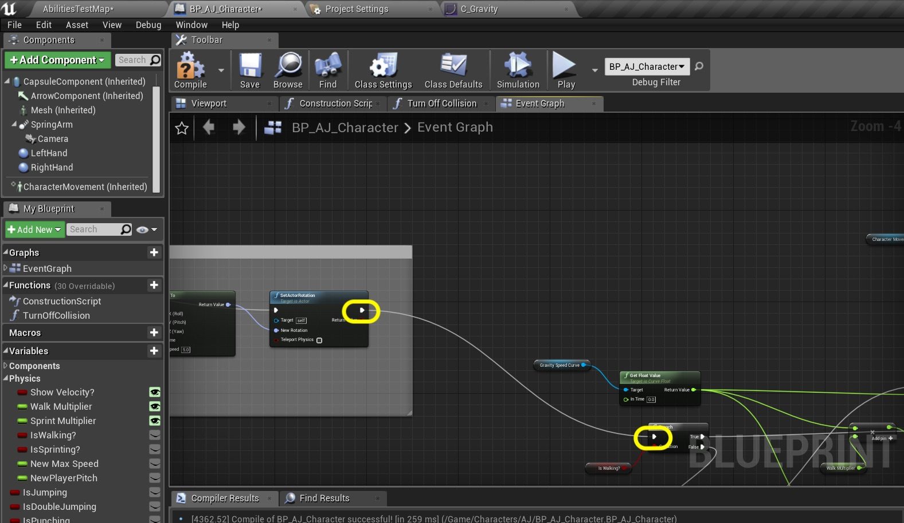

  

_____ 

### Speed up and Down Ramps Continued
Add some speed changes when player moves up and down ramps

_____ 




{{ num }}. Pull off of the output of the **Multiply** node and add a **Set New Max Speed** node.  Connect its execution input to the output of the **True** pin on the **Branch** node.  So if walking is true, multiply the graph speed by the scalar.

  

_____ 



{:start="{{ num }}"}
{{ num }}. Beneath do the same thing for sprinting.  Add a **Is Sprinting?** node and then take the output and send it to a new **Branch** mode.  Send the **False** execution pin from the previous **Branch** node to the input of this new one.

  

_____ 



{:start="{{ num }}"}
{{ num }}. Drag off of this new **Branch** node's **True** pin and select a **Set New Max Speed** node.  Add a **float * float** node and put on the top in the output from the **Get Float Value** node and add a **Get Sprint Multiplier** node and send the output to the other side of the float **Multiply** node.  Send the output to the **New Max Speed** pin.

  

_____ 


{:start="{{ num }}"}
{{ num }}. Add a **Get Character Movement** Component reference to the **Event Graph**.  Pull off its pin and select a **Get Max Walk Speed** node.

  

_____ 



{:start="{{ num }}"}
{{ num }}. We will add a **FInerp To** node to the **Event Graph**.  This will allow us to transition to and from new speed while on thh ground.

  

_____ 


{:start="{{ num }}"}
{{ num }}. Connect the ouput of **Get Max Speed** node to the **Current** pin in the **FInterp To** node.  Add a new **Get New Max** speed node and send the output to the **Target** pin of the **FInterp To** node.

  

_____ 



{:start="{{ num }}"}
{{ num }}. Add a **Get WOrld Delta Seconds** node and send it to the **Delta Time** pin on the **FInterp To** node:

  

_____ 


{:start="{{ num }}"}
{{ num }}. Set the **Interp Speed** to `2.0` on the **FInterp To** node.  Drag from the **Character Movement** pin and select a **Set Max Walk Speed** node. Connect the output of the FInterp To node to this new Setter.

  

_____ 



{:start="{{ num }}"}
{{ num }}. Send the output of the **Set Actor Rotation** execution pin to the input of the first **Branch** node.

  

_____ 


{:start="{{ num }}"}
{{ num }}. Set the output of the three **Set New Max Speed** nodes to the input execution pin of the **Set Max Walk Speed** variable.

  

_____ 



{:start="{{ num }}"}
{{ num }}. Compile this blueprint and address any errors.

  

_____ 


{:start="{{ num }}"}
{{ num }}. Add a comment called `Set Run Speed on Slope` for these nodes added:

  

_____ 



{:start="{{ num }}"}
{{ num }}. Play the game and you will notice that all three speeds should work and change speeds on slopes. Press **Save All** and update Github by **committing** and **pushing** all the changes made. That's it for this walk through, you have created a character with animation in Unreal!

<iframe class="embed-responsive-item" src="https://www.youtube.com/embed/zjc3TC-Hp5s?autoplay=1&rel=0&controls=0&amp&showinfo=0&version=3&loop=1&playlist=zjc3TC-Hp5s" frameborder="0" allowfullscreen></iframe>

_____ 

  

[<- Previous](Intro-To-Animation-12.html)&nbsp;&nbsp;&nbsp;[Home](../index.html)&nbsp;&nbsp;&nbsp;
   
   
   