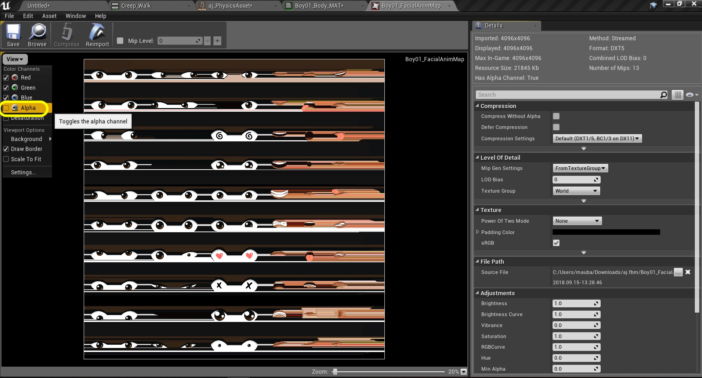
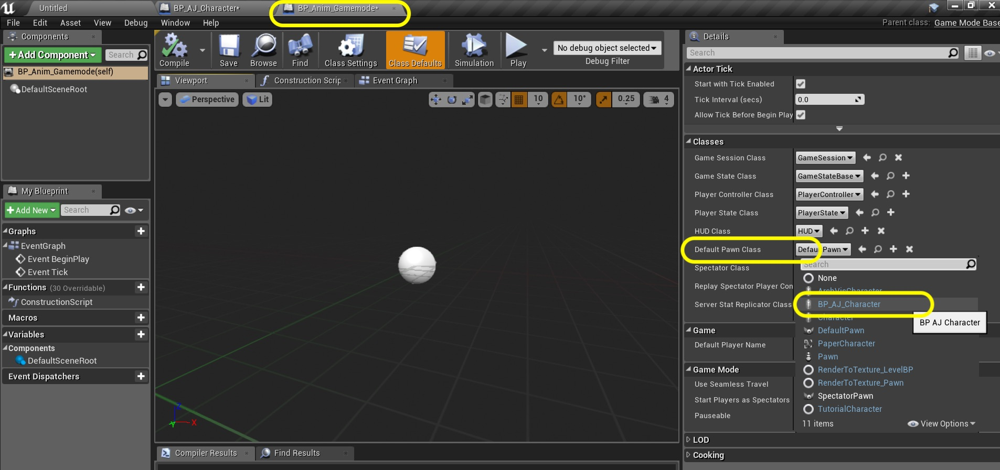
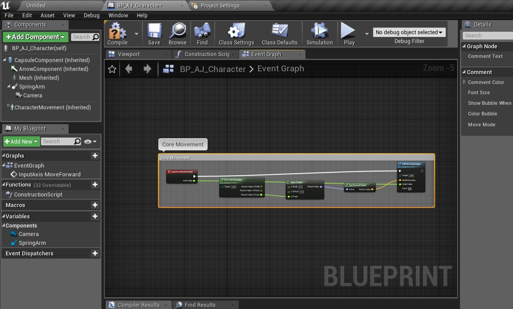

  

_____ 

#### Fixing Mixamo Animations

_____ 



{:start="{{ num }}"}
{{ num }}. There are some common issues with the materials. Sometimes the material uses a **Transulucent** instead of an **Opaque** **Blend Mode**. I see problems in the face in my model.  I see 3 materials that control the mouth, brow and eyes.  I look at one of the materials and see some streaking in the texture:

  

_____ 



{:start="{{ num }}"}
{{ num }}. If I open the **Texture** that is used on the face I can see that if I turn the **Alpha** off I see the same steaking.

  

_____ 


{:start="{{ num }}"}
{{ num }}. If I turn it on it goes away.

  

_____ 



{:start="{{ num }}"}
{{ num }}. Go back to the material and look at the texture plugged into the opacity mask.  It is the full 4 channels.  This is wrong.

  

_____ 


{:start="{{ num }}"}
{{ num }}. Now change the pin going to **Opacity** from the top pin to the bottom **Alpha** pin. Press the **Apply** button.

  

_____ 



{:start="{{ num }}"}
{{ num }}. I repeated this for the other two face materials on this character.  I put in the correct alpha pin and pressed **Apply**.  You can see that th texture has the correct Alpha cut out in the preview window. If you picked a different character you will have to figure out how to correct any material issues your model might have.

  

_____ 


{:start="{{ num }}"}
{{ num }}. Go back to the skeletal mesh and move the camera around the character.  Make sure you have fixed all the material issues that arose:

  

_____ 

### Add Animations

_____ 



{:start="{{ num }}"}
{{ num }}. Add to the route folder in the **Content Browser**'s **Character \| AJ** a new folder called `Animations`:

  

_____ 


{:start="{{ num }}"}
{{ num }}. Press the **Import** button and select the six animations we downloaded from Mixamo:

  

_____ 



{:start="{{ num }}"}
{{ num }}. Now the FBX Import Options appear. Select the **Skeleton** tab and select the skeleton asset we just downloaded.  There should only be one option:

  

_____ 


{:start="{{ num }}"}
{{ num }}. Once you select the skeleton press **Import All**.

  

_____ 



{:start="{{ num }}"}
{{ num }}. Now this will take a while as it is solving the animation to this skeleton.  

  

_____ 


{:start="{{ num }}"}
{{ num }}. Double click each animation then watch them.  Rename the animation appropriately.  

  

_____ 



{:start="{{ num }}"}
{{ num }}. I have named mine `Creep_Walk`, `Fast_Run`, `Idle`, `Idle_Fidget`, `Run` and `Walk`. This gives me two run, idle and walk animations to use in our animation graph.

  

_____ 
## Blueprints
We will need to add some blueprints to our game to get our animations up and running.

_____ 

### Setting Up Character Blueprint
Lets start with adding a character blueprint.

_____ 



{:start="{{ num }}"}
{{ num }}. Go to the **AJ** folder and press the **Add New** button and select `Blueprint Class`.

  

_____ 



{:start="{{ num }}"}
{{ num }}. Select a **Character** class to inherit from.  Call it `BP_AJ_Character`:

  

_____ 


{:start="{{ num }}"}
{{ num }}. Open the blueprint and select the **Mesh** component.  Select the **AJ Skeletal Mesh** from the menu on the right:

  

_____ 



{:start="{{ num }}"}
{{ num }}. Make sure the character's feet are at the bottom of the collision volume. Now we need to attach a camera to the player that will follow them around the level.  It needs to be attached to a spring arm.  This allows the camera to deal with colliding with walls, ceilings or other surfaces.  Press **Add Component** and look for a `Spring Arm`.  Add it to the character:

  

_____ 


{:start="{{ num }}"}
{{ num }}. Add a another component and this time it will be a `Camera`:

  

_____ 



{:start="{{ num }}"}
{{ num }}. Make sure the **Camera** is a child of the **Spring Arm** component. Make sure that **Spring** arm is not a child of any other component except for the root **Capsule Component**:

  

_____ 


{:start="{{ num }}"}
{{ num }}. Select the **Spring Arm** component.  Notice that it is to the left of the player. Rotate it on **Z** until it is behind the player. Rotate it on **Y** so it is pointing down at an angle and ajust to to point to the player's head.

  

_____ 



{:start="{{ num }}"}
{{ num }}. Now the camera should be placed and angled correctly by inheriting from the location and rotation of the player like so:

  

_____ 


{:start="{{ num }}"}
{{ num }}. Now lets add a new gamemode blueprint to select this character when the level starts.  Go to the **Content Browser** and add a new folder called `Blueprints`:

  

_____ 



{:start="{{ num }}"}
{{ num }}. Press the **Add New** button and select a **Blueprint Class** of **Game Mode Base**:

  

_____ 


{:start="{{ num }}"}
{{ num }}. Call it `BP_AnimGamemode`:

  

_____ 



{:start="{{ num }}"}
{{ num }}. Double click the blueprint and set the **Default Pawn Class** to the newly created `BP_AJ_Character`.

  

_____ 


{:start="{{ num }}"}
{{ num }}. Go back to the game window.  Now select the **Player Start** component that is in the level.  Go to **Game Mode** in the **World Settings** and eingselect the newly created gamemode.  Make sure that the correct pawn is selected.  Press play and we should have a character being rendered with no physics.

<iframe class="embed-responsive-item" src="https://www.youtube.com/embed/mA1oiV5SHqc?autoplay=1&rel=0&controls=0&amp&showinfo=0&version=3&loop=1&playlist=mA1oiV5SHqc" frameborder="0" allowfullscreen></iframe>

_____ 

### Adding Controls

_____ 



{:start="{{ num }}"}
{{ num }}. Lets go to the project settings to add some controller input into our game.  Go to **Edit \| Project Settings**:

  

_____ 


{:start="{{ num }}"}
{{ num }}. Fill in the appropriate **Description** information:

  

_____ 



{:start="{{ num }}"}
{{ num }}. Go to **Engine \| Input** and press the **+** button next to **Axis Mappings**:

  

_____ 


{:start="{{ num }}"}
{{ num }}. Call it `MoveForward` and press the **+** button next to it four times.  Assign the following buttons: `W`, `Up`, `S`, `Down`.  Set the **Scale** for **W** and **Up** at `1.0` and the **Scale** for **S** and **Down** to `-1.0`.

  

_____ 



{:start="{{ num }}"}
{{ num }}. Press the **+** button next to **Axis Mappings** and call the second mapping `MoveRight`. Press the **+** button next to it four times.  Assign the following buttons: `D`, `Right`, `A`, `Left`.  Set the **Scale** for **D** and **Right** at `1.0` and the **Scale** for **A** and **Left** to `-1.0`.

  

_____ 

### Adding Forward and Right Movement

_____ 



{:start="{{ num }}"}
{{ num }}. Open **BP_AJ_Character** blueprint and go to the **Event Graph**. Delete the existin nodes. Add a **Axis Events | MoveForward** node so we can add physics when the up, down, W or S button are pressed on the keyboard.

  

_____ 



{:start="{{ num }}"}
{{ num }}. Lets add a **Get Control Rotation** node to get the controller rotation for the player controlled pawn.

  

_____ 


{:start="{{ num }}"}
{{ num }}. Right click on the **Return Value** pin and select **Split Struct Pin**.  We are going to be controlling the player rotating around the **Z** axis or **Yaw**.  Pull from the **Return Value Z(Yaw)** pin and select a **Make Rotator** node:

  

_____ 



{:start="{{ num }}"}
{{ num }}. Now we want to move the player forward based on his facing angle.  Pull off of the **Return Value** pin and select a **Get Forward Vector** node:

  

_____ 


{:start="{{ num }}"}
{{ num }}. Pull off of the **Return Value** pin and select the **Add Movement Input** node.

  

_____ 



{:start="{{ num }}"}
{{ num }}. Connect the output execution pin from the **InputAxis MoveForward** node to the input execution pin of the **Add Movement Input** node:

  

_____ 


{:start="{{ num }}"}
{{ num }}. Take the output of the **InputAxis MovementForward** pin **Axis Value** and connect it to the **Scale Value** pin of the **Add Movement Input** node:

  

_____ 



{:start="{{ num }}"}
{{ num }}. Add a comment to all these nodes called `Core Movement` and press the **Compile** button:

  

_____ 


{:start="{{ num }}"}
{{ num }}. Now go into the game and press the up and down or W and S key.  We are moving left to right instead of forward and backwards. Go back to the **BP_AJ_Character** blueprint and click on the **Arrow** component.  This is the forward facing vector for the player and it is at the wrong angle.

<iframe class="embed-responsive-item" src="https://www.youtube.com/embed/DjslMXGTBh4?autoplay=1&rel=0&controls=0&amp&showinfo=0&version=3&loop=1&playlist=DjslMXGTBh4" frameborder="0" allowfullscreen></iframe>

_____ 



{:start="{{ num }}"}
{{ num }}. Click on the **Mesh** component and change the **Rotation** on **Z** to `-90.0`:

  

_____ 


{:start="{{ num }}"}
{{ num }}. Now the camera is in the wrong position.  Go to the **Spring Arm** component and change the **Rotation** on the **Z** axis back to `0.0`:

  

_____ 


{:start="{{ num }}"}
{{ num }}. Now play the game and the player should move backwards and forwards.  Lets add left and right turning motion on the next page.

<iframe class="embed-responsive-item" src="https://www.youtube.com/embed/fP03baQiRRA?autoplay=1&rel=0&controls=0&amp&showinfo=0&version=3&loop=1&playlist=fP03baQiRRA" frameborder="0" allowfullscreen></iframe>

_____ 
  

[<- Previous](Intro-To-Animation-1.html)&nbsp;&nbsp;&nbsp;[Home](../index.html)&nbsp;&nbsp;&nbsp; [Continue ->](Intro-To-Animation-3.html)
   
   
   

