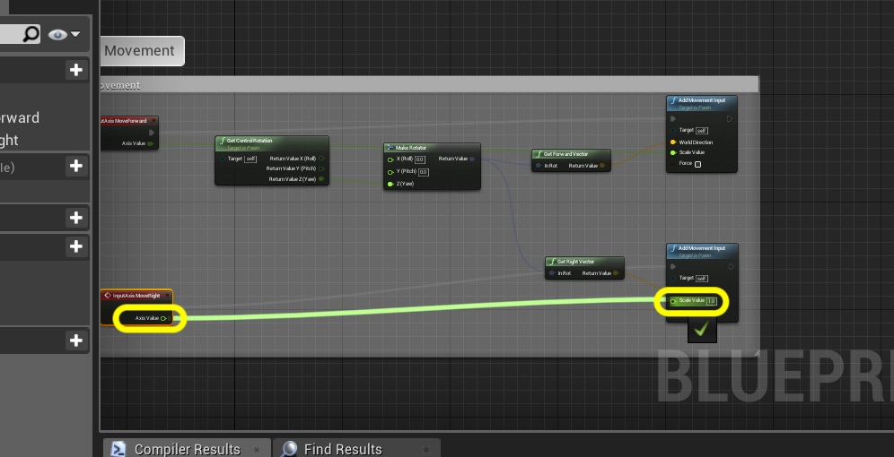
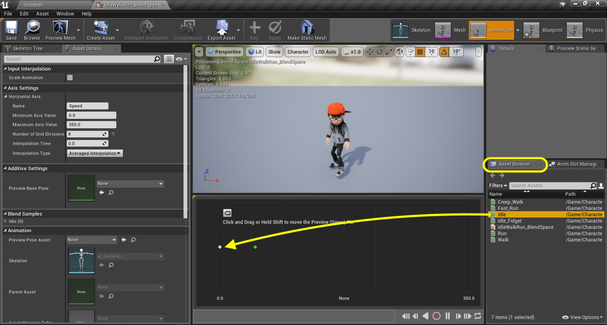
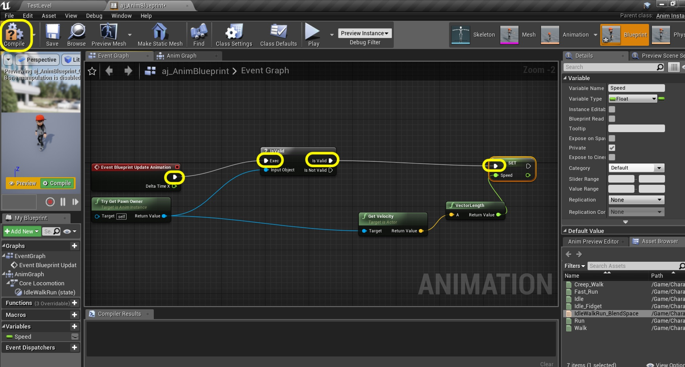

  

_____ 

### Adding Forward and Right Movement Continued

_____ 



{:start="{{ num }}"}
{{ num }}. Now lets add the movement for going left and right in the game.  Go back to the **BP_AJ_Character** blueprint and go to the **Event Graph**.  Pull off the **Make Rotator** `Return Value` pin and now select **Get Right Vector** node. We will use this vector to turn left and right.

  

_____ 



{:start="{{ num }}"}
{{ num }}. Pull off the **Return Value** pin and select another **Add Movement Input** node:

  

_____ 


{:start="{{ num }}"}
{{ num }}. Add a **Axis Events \|  MoveRight** node under the **MoveForward** node:

  

_____ 


{:start="{{ num }}"}
{{ num }}. Connect the output execution pin to the newly created **Add Movement Input** node.

  

_____ 


{:start="{{ num }}"}
{{ num }}. Connect the **Axis Value** output pin from the **InputAxis MoveRight** node to the **Scale Value** input pin on the new **Add Movement Input** node:

  

_____ 


{:start="{{ num }}"}
{{ num }}. Now compile and play the game.  The character should now move in four directions.  Now all we are doing in the game is moving this **Capsule** component around the screen.  The player animation is just an animation blueprint that runs based on the vector of the motion of the player.

<iframe class="embed-responsive-item" src="https://www.youtube.com/embed/4-xyCWDxtXs?autoplay=1&rel=0&controls=0&amp&showinfo=0&version=3&loop=1&playlist=4-xyCWDxtXs" frameborder="0" allowfullscreen></iframe>

_____ 


{:start="{{ num }}"}
{{ num }}. Now go back and forth between the player blueprint and the game and adjust the spring arm so you can see the entire player and that the camera is above the player looking down.  I adjusted the **Target Arm Length** to `550.0` and the **Y Rotation** to `335`.  M

  

_____ 



{:start="{{ num }}"}
{{ num }}. Now your game should look like this.  Next up we will create a blend space to have the character move from idle to running.

<iframe class="embed-responsive-item" src="https://www.youtube.com/embed/NRg2mcCqZMI?autoplay=1&rel=0&controls=0&amp&showinfo=0&version=3&loop=1&playlist=NRg2mcCqZMIs" frameborder="0" allowfullscreen></iframe>

_____ 

### Our First Animation Blend Space

_____ 


{:start="{{ num }}"}
{{ num }}. The first thing we will implement is our player movement.  The player will go from idle to slow walk to walk to run to speed run.  We will be blending between these 5 animations. Go to the **Animations** folder and press the **Add New** button.  Select **Animation \| Blend Space 1D**.  This will be a 1 dimensional blend.

  

_____ 


{:start="{{ num }}"}
{{ num }}. This brings up a **Pick Skeleton** overlay.  Pick the skeleton you imported.

  

_____ 


{:start="{{ num }}"}
{{ num }}. Call it `IdleWalkRun_BlendSpace`.

  

_____ 


{:start="{{ num }}"}
{{ num }}. Double click the blend space you just created.  Open up the **Axis Settings** tab on the **Asset Details** and change the **Maximum Axis Value** to `350.0` and the **Number of Grid Divisions** to `8`. Change the name of this **Horizontal Axis \| Name** to `Speed`:

  

_____ 


{:start="{{ num }}"}
{{ num }}. Make sure on the right hand side you are on the **Asset Browser** tab and drag and drop the **Idle** animation (the breathing idle that loops and not the fancier one) to the far left side of the blend space.

  

_____ 


{:start="{{ num }}"}
{{ num }}. Drag and drop the slow walk animation and put it close to `40.0` on the 1D blend space.

  

_____ 


{:start="{{ num }}"}
{{ num }}. Drag and drop the walk animation to around `80` on the blend space.

  

_____ 


{:start="{{ num }}"}
{{ num }}. Drag and drop run around `250.0`.

  

_____ 


{:start="{{ num }}"}
{{ num }}. Finally place the fast run at the end of the timeline.

  

_____ 


{:start="{{ num }}"}
{{ num }}. Scrub along the timeline and watch animation states blend.  In this case I am happy with the results and can leave the blend defaults as they stand.  The animation will be selected based on the speed of the character.

<iframe class="embed-responsive-item" src="https://www.youtube.com/embed/w4oseROPKwk?autoplay=1&rel=0&controls=0&amp&showinfo=0&version=3&loop=1&playlist=w4oseROPKwk" frameborder="0" allowfullscreen></iframe>

_____ 

### Our First Animation Blueprint

_____ 


{:start="{{ num }}"}
{{ num }}. We are now going to start to set up a state machine for our character.  Go to the **AJ** folder and press the **Add New** button and select **Animaton \| Animation Blueprint**.

  

_____ 


{:start="{{ num }}"}
{{ num }}. Select **AnimInstance** and then the skeleton that you imported. Press the **OK** button.

  

_____ 


{:start="{{ num }}"}
{{ num }}. Name it `AJ_AnimBlueprint`:

  

_____ 


{:start="{{ num }}"}
{{ num }}. Open the animation blueprint and go to the **AnimGraph** tab.  If it is not there you can double click it in the **My Blueprint** tab on the left hand side.

  

_____ 


{:start="{{ num }}"}
{{ num }}. Right click on the anim graph and select a `Add New State Machine` node.

  

_____ 


{:start="{{ num }}"}
{{ num }}. Name this node `Basic Locomotion`:

  

_____ 


{:start="{{ num }}"}
{{ num }}. Connect the animation pins from the **Basic Locomotion** node to the **Final Animation Pose** node.  Double click on the **Basic Locomotion** node to enter its state machine:

  

_____ 


{:start="{{ num }}"}
{{ num }}. This gets us to the entrance of the Basic Locomotion animation tree.  It has an **Entry** node that is what it plys when it enters this state (the only state we are calling for the moment).  R

  

_____ 


{:start="{{ num }}"}
{{ num }}. Right click on the anim graph and select **Add State**:

  

_____ 


{:start="{{ num }}"}
{{ num }}. Name this state `IdleWalkRun` and attach the node from **Entry** to this new **State**.  Double click on **IdleWalkRun** to enter this state:

  

_____ 


{:start="{{ num }}"}
{{ num }}. Now we need to play the blend space we created.  Drag and drop the **IdleWalkRun_BlendSpace** onto the graph:

  

_____ 


{:start="{{ num }}"}
{{ num }}. Connect the animation pins so that this blendspace runs and gets sent to the state machine.

  

_____ 


{:start="{{ num }}"}
{{ num }}. Now this blend space requires an input float to represent the speed of the player.  Right click on **None** and select **Promote to Variable**:

  

_____ 


{:start="{{ num }}"}
{{ num }}. Name this variable **Speed** and set **Private** to `true`. Press the **Compile** button.

  

_____ 


{:start="{{ num }}"}
{{ num }}. We need to get access to the Speed of the player.  We do this in the **Event Graph** of the animation blueprint.  Click on the **Event Graph** tab (or double click it from the **Graphs** menu on the left) and you should see two greyed out nodes.  If you don't see the **Try Get Pawn Owner** then add it.  Drag off of the **Return Value** pin from the **Try Get Pawn Owner** node and selecdt a **? Is Valid** node.  We want to make sure that this pawn is active in game.

  

_____ 


{:start="{{ num }}"}
{{ num }}. Drag off of the **Return Value** from the **Try Get Pawn Owner** node again and selectd **Get Velocity** to get the Velocity vector of the player pawn.

  

_____ 


{:start="{{ num }}"}
{{ num }}. Now a Velocity has a direction and a magnitude.  All we care about here is the magnitude. Drag off of the **Return Value** pin from the **Get Velocity** node and select **Vector Length** (I typed in Magnitude in the search window and it still points to this node!). This returns a float with the length of the vector (magnitude).

  

_____ 


{:start="{{ num }}"}
{{ num }}. Drag and drop the **Speed** Variable and select **Set Speed**:

  

_____ 


{:start="{{ num }}"}
{{ num }}. Connect the execution pins between the three nodes and press the **Compile** button.

  

_____ 


{:start="{{ num }}"}
{{ num }}. Add a comment called `Get Speed From Player` to these nodes:

  

_____ 


{:start="{{ num }}"}
{{ num }}. Add a **Maps** folder and save this level as `Test Level`.  Make sure you are in this level.

  

_____ 


{:start="{{ num }}"}
{{ num }}. Now we need to assign this animation blueprint to our skeletal mesh.  Open the **BP_AJ_Character** blueprint.  Go to the **Viewport** tab.  We notice our character is in a T-Pose.  Select the **Animation Class** on the **Details** panel and pick the animation blueprint we just made **AJ_AnimBlueprint**. You will notice that the player should enter the idle state.  Press the **Compile** button.

  

_____ 


{:start="{{ num }}"}
{{ num }}. Go to the top level component on the blueprint and under **Pawn** set the **Use Controller Rotation Yaw** to `false`.  

  

_____ 


{:start="{{ num }}"}
{{ num }}. Now select the **Spring Arm** component and in **Camera Settings** set **Use Pawn Control Rotation** to `true`:

  

_____ 


{:start="{{ num }}"}
{{ num }}. Now compile this blueprint and go into the game.  You will notice that the player does animate but doesn't change directions.

<iframe class="embed-responsive-item" src="https://www.youtube.com/embed/nG0XN5XF8wM?autoplay=1&rel=0&controls=0&amp&showinfo=0&version=3&loop=1&playlist=nG0XN5XF8wM" frameborder="0" allowfullscreen></iframe>

_____ 


{:start="{{ num }}"}
{{ num }}. Now go back to the **BP_AJ_Character** blueprint and select the **CharacterMovement** component.  Scroll in the **Details** panel down to **Character Movement** (Rotation Settings) tab.  Open it up and look for **Orient Rotation to Movement**.  Set this to `true`.

  

_____ 



{:start="{{ num }}"}
{{ num }}. Now compile this blueprint and go back into the game.  Now the player should animate and turn correctly. Press **Save All** and update Github by **committing** and **pushing** all the changes made.  Next up we will be adding a timer to switch to the second animation:

<iframe class="embed-responsive-item" src="https://www.youtube.com/embed/g2ssTNehIDs?autoplay=1&rel=0&controls=0&amp&showinfo=0&version=3&loop=1&playlist=g2ssTNehIDs" frameborder="0" allowfullscreen></iframe>

_____ 
  

[<- Previous](Intro-To-Animation-2.html)&nbsp;&nbsp;&nbsp;[Home](../index.html)&nbsp;&nbsp;&nbsp; [Continue ->](Intro-To-Animation-4.html)
   
   
   

