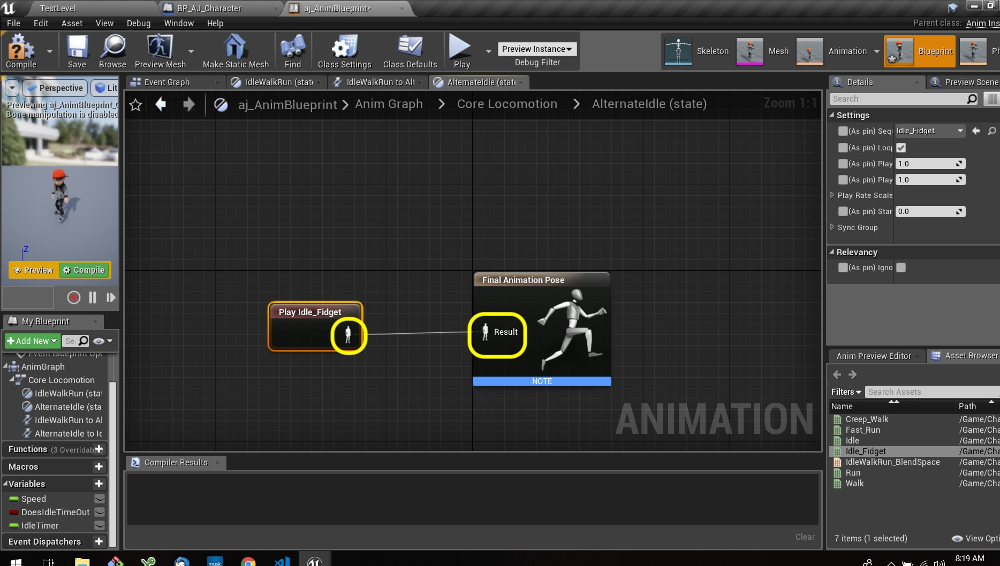
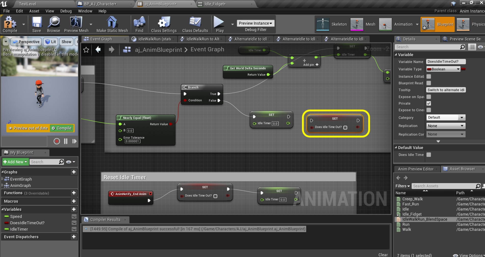

  

_____ 

### Time Out for Second Idle
Now we are going to add a state change when the idle animation times out.  How will we do this?  We will keep track of when the Velocity Length is 0 and add a timer.  After 5 seconds we will switch to the alternate idle animation.  Lets begin.

_____ 



{:start="{{ num }}"}
{{ num }}. Open the **aj_AnimBlueprint** and go to the **Event Graph**.  Add a new Variable called `bDoesIdleTimeOut` and make it **Variable Type** `Boolean`.  Set **Private** to `true` and add a **Tooltip** of `Switch to alternate idle when main idle times out`.

  

_____ 



{:start="{{ num }}"}
{{ num }}. Add a new Variable called `IdleTimer` and make it **Variable Type** `Float`.  Set **Private** to `true` and add a **Tooltip** of `Calculates time in seconds when velocity length is 0`.

  

_____ 


{:start="{{ num }}"}
{{ num }}. Now we need to check if the Vector Length is 0.  Add a **Branch** node to the right of the other nodes.

  

_____ 


{:start="{{ num }}"}
{{ num }}. Now we are going to see if this vector is close enough to zero.  Pull from the **Return Value** pin on the **Vector Length** node and look for **Nearly Equal (float)** node.

  

_____ 


{:start="{{ num }}"}
{{ num }}. We will leave the default values alone.  We want it to be close to `0.0` and the error tolerance seems fine. Connect the execution pin form the **Set Speed** node to the **Branch** node.  Connect the **Return Value** pin from the **Nearly Equal** node to the **Branch** node:

  

_____ 


{:start="{{ num }}"}
{{ num }}. Drag a **Get Idle Timer** variable to the graph and add a **Get World Delta Seconds** node:

  

_____ 


{:start="{{ num }}"}
{{ num }}. Add two **Set Idle Timer** nodes.  Connect each to the **True** and **False** execution pins of the **Branch** node:

  

_____ 


{:start="{{ num }}"}
{{ num }}. Add a **float + float** node and put it between the Idle Timer and Set Idle Timer nodes.

  

_____ 


{:start="{{ num }}"}
{{ num }}. Connect the outut of **Idle Timer** and **Get World Delta Seconds** nodes to the input pins of the **Addition** node.  Send the output to the **Set Idle Timer** pin.

  

_____ 


{:start="{{ num }}"}
{{ num }}. Now we want to check to see if we have been idling for more than 5 seconds.  Add a **Branch** node and a **float >= float** node and set the bottom pin value to `5.0`:

  

_____ 


{:start="{{ num }}"}
{{ num }}. Connect the execution pin from **Set Idle Timer** node to the new **Branch** node.  Connect the output pin of the **Set Idle Timer** to the **>=** node.  Send the outpuf of the **>=** node to the **Condition** pin of the **Branch** node:

  

_____ 


{:start="{{ num }}"}
{{ num }}. Pull off of the execution pin of the **Branch** node and selectd a **Set Does Idle Time Out?** node.  Set this boolean to `true`:

  

_____ 


{:start="{{ num }}"}
{{ num }}. Pull off of the **Set Does Idle Timer Time Out?** node and select a **Set Idle Timer** node and set it to `0.0` seconds.  Add a comment around these new nodes and call it `Idle Timer`:

  

_____ 


{:start="{{ num }}"}
{{ num }}. Go back to the **Anim Graph** tab and double click on the **Core Locomotion** node:

  

_____ 


{:start="{{ num }}"}
{{ num }}. Now you should see our only IdleWalkRun state.  Right click above this on the open graph and select **Add State**:

  

_____ 


{:start="{{ num }}"}
{{ num }}. Call this new state `AlternateIdle`.  Connect the state to and from **IdleWalkRun** to **AlternateIdle** states.  Look at the two icons next to the arrows. This handles the logic of when we switch to and from these animations.

  

_____ 


{:start="{{ num }}"}
{{ num }}. Double click on the left hand button next to the arrow going from **IdleWalkRun** to **AlternateIdle** to adjust the logic for this transition.

  

_____ 


{:start="{{ num }}"}
{{ num }}. The logic is simple.  It will transition when the idle time out boolean switches to true.  So add a **Get Does Idle Time Out?** node and attach it to the **Result** ndoe so it can enter the transition.

  

_____ 


{:start="{{ num }}"}
{{ num }}. Go back to the **Core Locomotion** state screen.  Now double click on the right hand transition from **Alternate Idle** back to **IdleWalkRun**.

  

_____ 


{:start="{{ num }}"}
{{ num }}. Drag a **Get Does Idle Time Out?** variable onto the graph.

  

_____ 


{:start="{{ num }}"}
{{ num }}. Now we are looking for the opposite so we want the **Does Idle Time Out?** to be false.  So we pull off the pin and select a **NOT** node which looks to see if it is the opposite of **True** (false).  

  

_____ 


{:start="{{ num }}"}
{{ num }}. Connect the output of the **NOT** node to the **Can Enter Transition** pin in the **Result** node.

  

_____ 


{:start="{{ num }}"}
{{ num }}. Go back to the **Core Locomotion** state tab.  Now we have dealt with the transitions but not the actual animation in this new state.  Double click the **Alternate Idle** node:

  

_____ 


{:start="{{ num }}"}
{{ num }}. Drag a reference to **Idle_Fidget** to the open graph:

  

_____ 


{:start="{{ num }}"}
{{ num }}. Connect the animation pins and then press the **Compile** button.  That should do it for the animation blueprint.

  

_____ 


{:start="{{ num }}"}
{{ num }}. Now go into the game.  After 5 seconds the player should go to the alternate idle.  But he/she never leaves this state.  We now want to reset the Does Idle Time Out? variable back to false.  We need to do this at the end of the alternate animation.  We can this using **Notifies**.  Open **Idle_Fidget** animation.

  

_____ 


{:start="{{ num }}"}
{{ num }}. Right click on the **Notifies** timeline near the end and select **Add Notify \| New Notify**.

  

_____ 


{:start="{{ num }}"}
{{ num }}. A box will pop up asking you to enter the **Notify Name**.  Enter `End Anim` and press the _Enter_ key.

  

_____ 


{:start="{{ num }}"}
{{ num }}. Adjust the position after the core movement ends but with room to blend it back to the core idle.

  

_____ 


{:start="{{ num }}"}
{{ num }}. Go back to the **Event Graph** and lets add some logic for when this notify event triggers.  Right click on the open graph and select a **Event AnimNotify_EndANim** node.  It should be red with an execution pin:

  

_____ 


{:start="{{ num }}"}
{{ num }}. Pull off of the **EndAnim** pin and select a **Set Idle Time Out?** node and set it to false.  Pull off this execution pin and select **Set Idle Timer** and set it to `0.0`.

  

_____ 


{:start="{{ num }}"}
{{ num }}. Now add a comment around these nodes that says `Reset Idle Timer`.  Press the **Compile** button. 

  

_____ 


{:start="{{ num }}"}
{{ num }}. We have done enough to test our work.  Play the game and move the character then let go of the controls.  Let the character idle and see if the idle animation plays.  Then make sure it goes back to the normal idle.  After playing around there is a clear issue with trying to move while in the alternate idle.  It is not switching back to our normal blend IdleWalkRun animation when branching from this state:

<iframe class="embed-responsive-item" src="https://www.youtube.com/embed/6w68ylBZnaM?autoplay=1&rel=0&controls=0&amp&showinfo=0&version=3&loop=1&playlist=6w68ylBZnaM" frameborder="0" allowfullscreen></iframe>

_____ 


{:start="{{ num }}"}
{{ num }}. Now go back to the **aj_AnimBlueprint** to its **Event Graph** tab.  Look to see the **Branch** node where we check to see if the Vector Length is close to `0.0`.  We do not set the **Does Idle Time Out** node back to false.  Add a **Set Does Idle Time Out?** node to the right of the **Set Idle Timer** node:

  

_____ 


{:start="{{ num }}"}
{{ num }}. Connect the execution pin from **Set Idle Timer** to **Set Does Idle Time Out?** node:

  

_____ 


{:start="{{ num }}"}
{{ num }}. Play the game and transition from the alternate idle.  It now snaps back to the regular IdleWalkRun blend sequence.  This works great.  I don't like the snap back to the idle though and it is rough and jerky.  We need to add a bit of a blend here.

<iframe class="embed-responsive-item" src="https://www.youtube.com/embed/l-r3wWsBBIw?autoplay=1&rel=0&controls=0&amp&showinfo=0&version=3&loop=1&playlist=l-r3wWsBBIw" frameborder="0" allowfullscreen></iframe>

_____ 


{:start="{{ num }}"}
{{ num }}. Open the **IdleWalkRun_BlendSpace** file and go to the **Asset Details** panel to the **Sample Interpolation \| Target Weight Interopolation** setting and adjust it to `6.0` (you can play with values between 5 and 10 to see what you like).  Now it should be much smoother. Press **Save All** and update Github by **committing** and **pushing** all the changes made.  Next up we will be adding a falling animation:

<iframe class="embed-responsive-item" src="https://www.youtube.com/embed/071HKSrQ3Zo?autoplay=1&rel=0&controls=0&amp&showinfo=0&version=3&loop=1&playlist=071HKSrQ3Zo" frameborder="0" allowfullscreen></iframe>

_____ 
  

[<- Previous](Intro-To-Animation-3.html)&nbsp;&nbsp;&nbsp;[Home](../index.html)&nbsp;&nbsp;&nbsp; [Continue ->](Intro-To-Animation-5.html)
   
   
   

